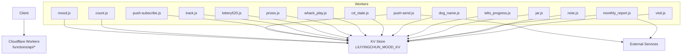
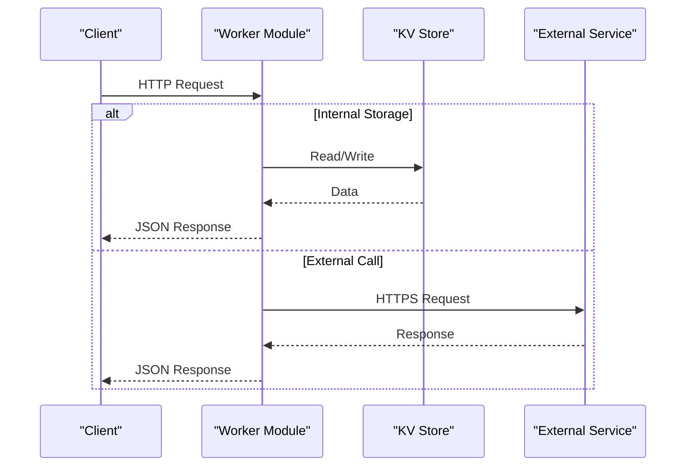
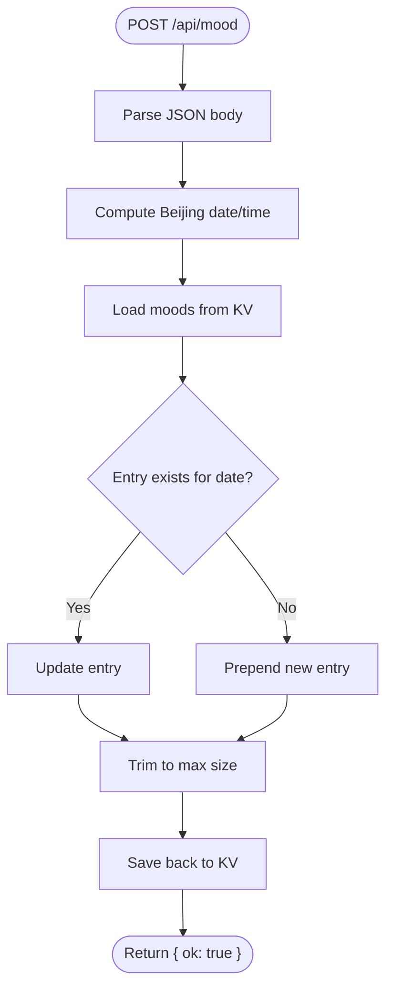
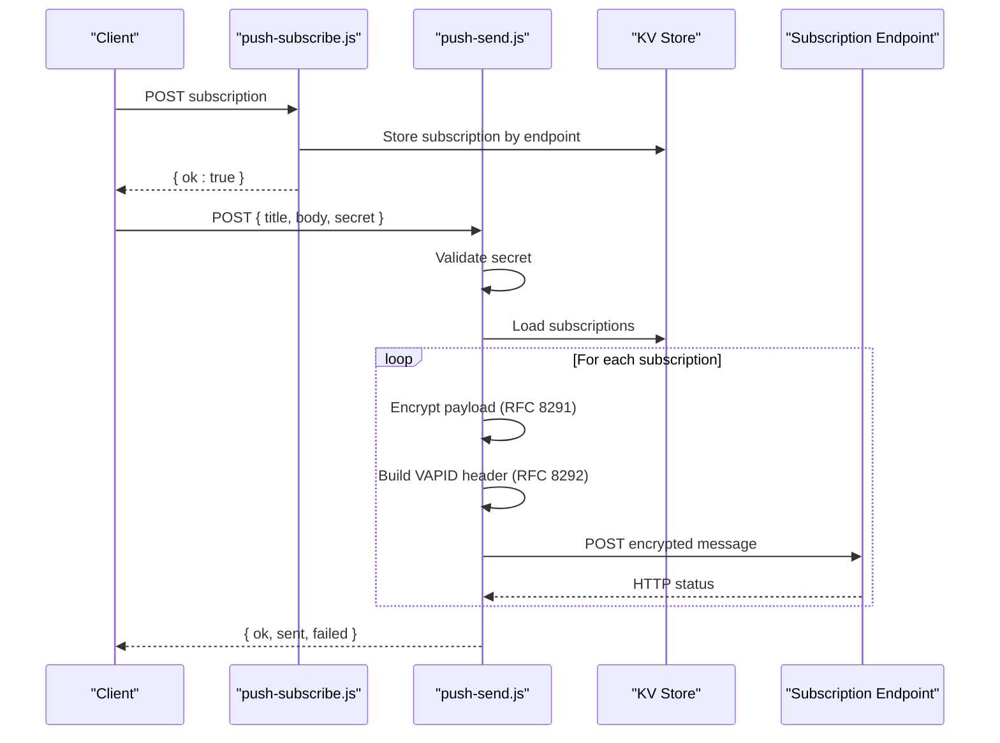
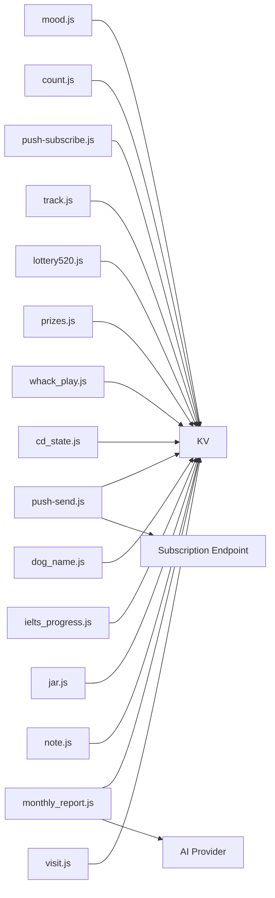

# API Reference

<cite>
**Referenced Files in This Document**
- [mood.js](file://functions/api/mood.js)
- [count.js](file://functions/api/count.js)
- [push-send.js](file://functions/api/push-send.js)
- [push-subscribe.js](file://functions/api/push-subscribe.js)
- [track.js](file://functions/api/track.js)
- [lottery520.js](file://functions/api/lottery520.js)
- [prizes.js](file://functions/api/prizes.js)
- [whack_play.js](file://functions/api/whack_play.js)
- [cd_state.js](file://functions/api/cd_state.js)
- [dog_name.js](file://functions/api/dog_name.js)
- [ielts_progress.js](file://functions/api/ielts_progress.js)
- [jar.js](file://functions/api/jar.js)
- [monthly_report.js](file://functions/api/monthly_report.js)
- [note.js](file://functions/api/note.js)
- [visit.js](file://functions/api/visit.js)
</cite>

## Table of Contents
1. Introduction
2. Project Structure
3. Core Components
4. Architecture Overview
5. Detailed Component Analysis
6. Dependency Analysis
7. Performance Considerations
8. Troubleshooting Guide
9. Conclusion

## Introduction
This document provides a comprehensive API reference for all Cloudflare Workers endpoints in the project. It covers HTTP methods, URL patterns, request/response schemas, authentication where applicable, error handling patterns, CORS configuration, rate limiting considerations, and client implementation examples for each endpoint. The APIs are organized into mood management, counters, push notifications, analytics tracking, game-related features, and utility services.

## Project Structure
The application exposes multiple Cloudflare Worker modules under functions/api/. Each module implements one or more HTTP handlers (GET/POST/OPTIONS) and persists data to a KV store bound as LIUYINGCHUN_MOOD_KV. Some endpoints also integrate with external services (e.g., Web Push via fetch to subscription endpoints, AI generation via an LLM provider).

**Diagram sources**
- [mood.js:1-44](file://functions/api/mood.js#L1-L44)
- [count.js:1-33](file://functions/api/count.js#L1-L33)
- [push-send.js:1-155](file://functions/api/push-send.js#L1-L155)
- [push-subscribe.js:1-23](file://functions/api/push-subscribe.js#L1-L23)
- [track.js:1-44](file://functions/api/track.js#L1-L44)
- [lottery520.js:1-43](file://functions/api/lottery520.js#L1-L43)
- [prizes.js:1-60](file://functions/api/prizes.js#L1-L60)
- [whack_play.js:1-44](file://functions/api/whack_play.js#L1-L44)
- [cd_state.js:1-28](file://functions/api/cd_state.js#L1-L28)
- [dog_name.js:1-25](file://functions/api/dog_name.js#L1-L25)
- [ielts_progress.js:1-231](file://functions/api/ielts_progress.js#L1-L231)
- [jar.js:1-31](file://functions/api/jar.js#L1-L31)
- [monthly_report.js:1-171](file://functions/api/monthly_report.js#L1-L171)
- [note.js:1-30](file://functions/api/note.js#L1-L30)
- [visit.js:1-49](file://functions/api/visit.js#L1-L49)

**Section sources**
- [mood.js:1-44](file://functions/api/mood.js#L1-L44)
- [count.js:1-33](file://functions/api/count.js#L1-L33)
- [push-send.js:1-155](file://functions/api/push-send.js#L1-L155)
- [push-subscribe.js:1-23](file://functions/api/push-subscribe.js#L1-L23)
- [track.js:1-44](file://functions/api/track.js#L1-L44)
- [lottery520.js:1-43](file://functions/api/lottery520.js#L1-L43)
- [prizes.js:1-60](file://functions/api/prizes.js#L1-L60)
- [whack_play.js:1-44](file://functions/api/whack_play.js#L1-L44)
- [cd_state.js:1-28](file://functions/api/cd_state.js#L1-L28)
- [dog_name.js:1-25](file://functions/api/dog_name.js#L1-L25)
- [ielts_progress.js:1-231](file://functions/api/ielts_progress.js#L1-L231)
- [jar.js:1-31](file://functions/api/jar.js#L1-L31)
- [monthly_report.js:1-171](file://functions/api/monthly_report.js#L1-L171)
- [note.js:1-30](file://functions/api/note.js#L1-L30)
- [visit.js:1-49](file://functions/api/visit.js#L1-L49)

## Core Components
- CORS: All endpoints define permissive CORS headers allowing cross-origin GET/POST/OPTIONS requests.
- Persistence: Most endpoints use the KV store bound as LIUYINGCHUN_MOOD_KV for state storage.
- Timezone: Many endpoints compute Beijing time by adding 8 hours offset before formatting dates/times.
- Authentication: Only the push notification sender requires a secret; other endpoints are open.

Key behaviors:
- Mood management stores daily entries and enforces retention limits.
- Counters increment per-day counts using date-prefixed keys.
- Push system encrypts payloads and signs VAPID headers before sending to subscribers.
- Analytics and visit tracking append records with device/location metadata.
- Game endpoints manage single-play lottery results and persistent play logs.
- Utility endpoints manage stateful resources like dog names, jar entries, notes, IELTS progress, monthly reports, and CD state.

**Section sources**
- [mood.js:1-44](file://functions/api/mood.js#L1-L44)
- [count.js:1-33](file://functions/api/count.js#L1-L33)
- [push-send.js:1-155](file://functions/api/push-send.js#L1-L155)
- [push-subscribe.js:1-23](file://functions/api/push-subscribe.js#L1-L23)
- [track.js:1-44](file://functions/api/track.js#L1-L44)
- [lottery520.js:1-43](file://functions/api/lottery520.js#L1-L43)
- [prizes.js:1-60](file://functions/api/prizes.js#L1-L60)
- [whack_play.js:1-44](file://functions/api/whack_play.js#L1-L44)
- [cd_state.js:1-28](file://functions/api/cd_state.js#L1-L28)
- [dog_name.js:1-25](file://functions/api/dog_name.js#L1-L25)
- [ielts_progress.js:1-231](file://functions/api/ielts_progress.js#L1-L231)
- [jar.js:1-31](file://functions/api/jar.js#L1-L31)
- [monthly_report.js:1-171](file://functions/api/monthly_report.js#L1-L171)
- [note.js:1-30](file://functions/api/note.js#L1-L30)
- [visit.js:1-49](file://functions/api/visit.js#L1-L49)

## Architecture Overview
The architecture is a set of independent Cloudflare Worker modules that expose REST-like endpoints. Data is persisted in KV, and some endpoints call external services for advanced functionality.

**Diagram sources**
- [push-send.js:112-154](file://functions/api/push-send.js#L112-L154)
- [monthly_report.js:30-69](file://functions/api/monthly_report.js#L30-L69)
- [monthly_report.js:136-158](file://functions/api/monthly_report.js#L136-L158)

## Detailed Component Analysis

### Mood Management API
- Base path: /api/mood
- Methods:
  - GET /api/mood
    - Purpose: Retrieve mood history.
    - Response: Array of mood entries with date, time, mood, emoji.
    - Notes: Entries are retained up to a fixed limit.
  - POST /api/mood
    - Purpose: Save or update today’s mood entry.
    - Request body: { mood: string, emoji: string }
    - Response: { ok: boolean }
    - Behavior: Upserts by date; retains recent entries only.
- CORS: Permissive (GET, POST, OPTIONS).
- Authentication: None.
- Error handling: Standard JSON responses; no explicit validation errors shown.

**Diagram sources**
- [mood.js:26-43](file://functions/api/mood.js#L26-L43)

**Section sources**
- [mood.js:1-44](file://functions/api/mood.js#L1-L44)

### Counter System
- Base path: /api/count
- Methods:
  - GET /api/count
    - Purpose: Get today’s count.
    - Response: { date: string, count: number }
  - POST /api/count
    - Purpose: Increment today’s count.
    - Request body: none required.
    - Response: { date: string, count: number }
- CORS: Permissive (GET, POST, OPTIONS).
- Authentication: None.
- Notes: Uses date-prefixed keys for isolation.

**Section sources**
- [count.js:1-33](file://functions/api/count.js#L1-L33)

### Push Notification System
- Base path: /api/push-subscribe, /api/push-send
- Methods:
  - POST /api/push-subscribe
    - Purpose: Register a Web Push subscription.
    - Request body: { endpoint: string, keys: { p256dh: string, auth: string }, ... }
    - Response: { ok: boolean }
    - Validation: Requires endpoint; returns 400 if invalid.
  - POST /api/push-send
    - Purpose: Send encrypted push notifications to all stored subscriptions.
    - Request body: { title?: string, body?: string, secret: string }
    - Response: { ok: boolean, sent: number, failed: number }
    - Authentication: Requires secret matching environment variable; returns 401 if unauthorized.
    - Behavior: Encrypts payload per RFC 8291, signs VAPID header per RFC 8292, posts to each subscription endpoint.
- CORS: Permissive (POST, OPTIONS).
- Error handling: Unauthorized (401), no subscription (404), invalid subscription (400).

**Diagram sources**
- [push-subscribe.js:11-22](file://functions/api/push-subscribe.js#L11-L22)
- [push-send.js:112-154](file://functions/api/push-send.js#L112-L154)

**Section sources**
- [push-subscribe.js:1-23](file://functions/api/push-subscribe.js#L1-L23)
- [push-send.js:1-155](file://functions/api/push-send.js#L1-L155)

### Analytics Tracking
- Base path: /api/track
- Methods:
  - POST /api/track
    - Purpose: Record an analytics event.
    - Request body: { event: string, page?: string }
    - Response: { ok: boolean }
    - Enrichment: Captures device type (mobile/desktop), city, region, country from request context, and timestamp in local timezone.
    - Retention: Keeps up to a fixed number of events.
- CORS: Permissive (POST, OPTIONS).
- Authentication: None.
- Error handling: Returns { ok: false } on exceptions.

**Section sources**
- [track.js:1-44](file://functions/api/track.js#L1-L44)

### Game-Related Endpoints
- Lottery 520
  - Base path: /api/lottery520
  - Methods:
    - GET /api/lottery520
      - Purpose: Check if a result already exists.
      - Response: null or { prize: string, time: string }
    - POST /api/lottery520
      - Purpose: Save a lottery result (only once).
      - Request body: { prize: string }
      - Response: { ok: boolean, reason? }
      - Behavior: Rejects if already played; otherwise saves record with timestamp.
  - CORS: Permissive (GET, POST, OPTIONS).
  - Authentication: None.

- Prizes
  - Base path: /api/prizes
  - Methods:
    - GET /api/prizes
      - Purpose: Retrieve all prizes; migrates legacy lottery result if present.
      - Response: Array of prize objects with activity, prize, date, slogan.
    - POST /api/prizes
      - Purpose: Add a new prize record.
      - Request body: { activity: string, prize: string, date?: string, slogan?: string }
      - Response: { ok: boolean }
      - Validation: Requires activity and prize; returns 400 if missing.
  - CORS: Permissive (GET, POST, OPTIONS).
  - Authentication: None.

- Whack Game
  - Base path: /api/whack_play
  - Methods:
    - GET /api/whack_play
      - Purpose: Retrieve play history.
      - Response: Array of { date, time, city, score }.
    - POST /api/whack_play
      - Purpose: Submit a play score.
      - Request body: { score: number }
      - Response: { ok: boolean }
      - Enrichment: Adds date, time, and city derived from request context.
  - CORS: Permissive (GET, POST, OPTIONS).
  - Authentication: None.

**Section sources**
- [lottery520.js:1-43](file://functions/api/lottery520.js#L1-L43)
- [prizes.js:1-60](file://functions/api/prizes.js#L1-L60)
- [whack_play.js:1-44](file://functions/api/whack_play.js#L1-L44)

### Utility APIs
- CD State
  - Base path: /api/cd_state
  - Methods:
    - GET /api/cd_state
      - Purpose: Retrieve current CD state with defaults if absent.
      - Response: Object with fields such as dogs, tokens_earned, tokens_used, daily_date, flip_tokens.
    - POST /api/cd_state
      - Purpose: Persist updated CD state.
      - Request body: Full state object.
      - Response: { ok: boolean }
  - CORS: Permissive (GET, POST, OPTIONS).
  - Authentication: None.

- Dog Name
  - Base path: /api/dog_name
  - Methods:
    - GET /api/dog_name
      - Purpose: Retrieve stored dog name; default if none.
      - Response: { name: string }
    - POST /api/dog_name
      - Purpose: Set dog name.
      - Request body: { name: string }
      - Response: { ok: boolean }
  - CORS: Permissive (GET, POST, OPTIONS).
  - Authentication: None.

- IELTS Progress
  - Base path: /api/ielts_progress
  - Methods:
    - GET /api/ielts_progress
      - Purpose: Retrieve normalized progress, summary, and current item.
      - Response: { updatedAt, todayStudy, summary, levels }
    - POST /api/ielts_progress
      - Purpose: Update list status (todo/doing/done).
      - Request body: { levelId: string, listId: string, status: "todo"|"doing"|"done" }
      - Response: Updated progress object; may include praise flag when marking done.
      - Validation: Returns 400 for invalid payload; 404 if level/list not found.
  - CORS: Permissive (GET, POST, OPTIONS).
  - Authentication: None.

- Jar Operations
  - Base path: /api/jar
  - Methods:
    - POST /api/jar
      - Purpose: Add a jar entry (text note with date/time).
      - Request body: { text: string }
      - Response: { ok: boolean }
  - CORS: Permissive (POST, OPTIONS).
  - Authentication: None.

- Monthly Report
  - Base path: /api/monthly_report
  - Methods:
    - GET /api/monthly_report
      - Query params:
        - month: Required, format YYYY-MM.
        - preview: Optional, "1" to return mood data without AI generation.
        - regen: Optional, "1" to force regeneration bypassing cache.
      - Purpose: Generate or retrieve a monthly letter based on mood, jar entries, and notes; optionally uses an external AI service.
      - Response: { month, generatedAt, moodData, jarEntries, notes, moodCounts, dominantMood, letter }
      - Validation: Returns 400 for invalid month parameter.
  - CORS: Permissive (GET, OPTIONS).
  - Authentication: None.

- Notes
  - Base path: /api/note
  - Methods:
    - POST /api/note
      - Purpose: Save a daily note with optional mood tag.
      - Request body: { text: string, mood?: string }
      - Response: { ok: boolean }
  - CORS: Permissive (POST, OPTIONS).
  - Authentication: None.

- Visit Tracking
  - Base path: /api/visit
  - Methods:
    - POST /api/visit
      - Purpose: Record a visit with time, city, and user agent-derived device info.
      - Request body: none required.
      - Response: { ok: boolean }
  - CORS: Permissive (POST, OPTIONS).
  - Authentication: None.

**Section sources**
- [cd_state.js:1-28](file://functions/api/cd_state.js#L1-L28)
- [dog_name.js:1-25](file://functions/api/dog_name.js#L1-L25)
- [ielts_progress.js:1-231](file://functions/api/ielts_progress.js#L1-L231)
- [jar.js:1-31](file://functions/api/jar.js#L1-L31)
- [monthly_report.js:1-171](file://functions/api/monthly_report.js#L1-L171)
- [note.js:1-30](file://functions/api/note.js#L1-L30)
- [visit.js:1-49](file://functions/api/visit.js#L1-L49)

## Dependency Analysis
- KV Store: All modules depend on LIUYINGCHUN_MOOD_KV for persistence. Keys vary by feature (e.g., moods, count_{date}, push_subscriptions, track_events, lottery520_result, prizes_list, whack_plays, cd_state, dog_name, ielts_progress_v1, jar_entries, note_{date}).
- External Integrations:
  - Push sender calls subscription endpoints over HTTPS with encrypted payloads and VAPID authorization.
  - Monthly report optionally calls an external AI chat completion endpoint.

**Diagram sources**
- [push-send.js:112-154](file://functions/api/push-send.js#L112-L154)
- [monthly_report.js:136-158](file://functions/api/monthly_report.js#L136-L158)

**Section sources**
- [push-send.js:1-155](file://functions/api/push-send.js#L1-L155)
- [monthly_report.js:1-171](file://functions/api/monthly_report.js#L1-L171)

## Performance Considerations
- KV operations are atomic per key; avoid large payloads. Several endpoints trim arrays to retain recent entries (e.g., moods, track events, IELTS checkins).
- Batch operations: Push sender processes multiple subscriptions concurrently; consider rate limits at subscription endpoints.
- Timezone computation: Repeated date computations are lightweight but can be cached within a request if needed.
- External calls: Monthly report and push sender perform outbound HTTPS calls; failures are handled gracefully with fallbacks or aggregated results.

[No sources needed since this section provides general guidance]

## Troubleshooting Guide
Common issues and resolutions:
- CORS errors: Ensure your client sends appropriate preflight OPTIONS requests; all endpoints support OPTIONS and standard headers.
- Unauthorized push send: Verify the secret matches the server-side environment variable; expect 401 on mismatch.
- Invalid subscription: Ensure the subscription payload includes a valid endpoint; expect 400 if missing.
- No subscription available: If no subscriptions exist, push send returns 404; register subscriptions first.
- Invalid month for monthly report: Use YYYY-MM format; expect 400 otherwise.
- Missing fields in prizes: Provide both activity and prize; expect 400 if missing.
- Analytics tracking failures: Errors return { ok: false }; inspect client network logs.

**Section sources**
- [push-send.js:112-154](file://functions/api/push-send.js#L112-L154)
- [push-subscribe.js:11-22](file://functions/api/push-subscribe.js#L11-L22)
- [monthly_report.js:30-69](file://functions/api/monthly_report.js#L30-L69)
- [prizes.js:42-59](file://functions/api/prizes.js#L42-L59)
- [track.js:11-43](file://functions/api/track.js#L11-L43)

## Conclusion
This API suite offers a cohesive set of endpoints for mood tracking, counters, push notifications, analytics, games, and utilities. All endpoints use permissive CORS and persist state in KV. Authentication is minimal, limited to the push notification sender. Clients should handle standard HTTP status codes and JSON responses, respect rate limits implied by external integrations, and follow the documented request/response schemas.

[No sources needed since this section summarizes without analyzing specific files]