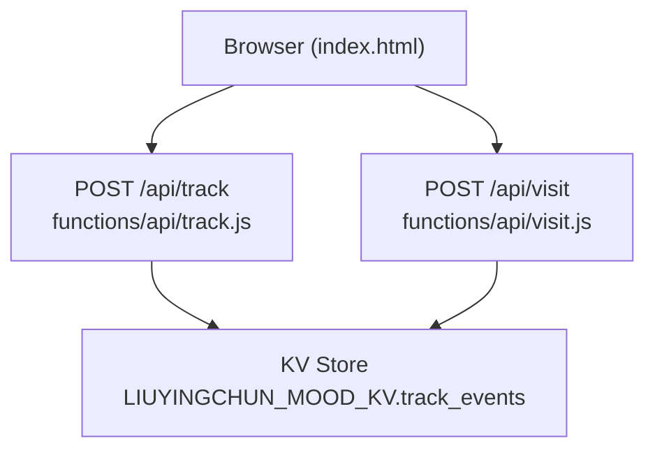
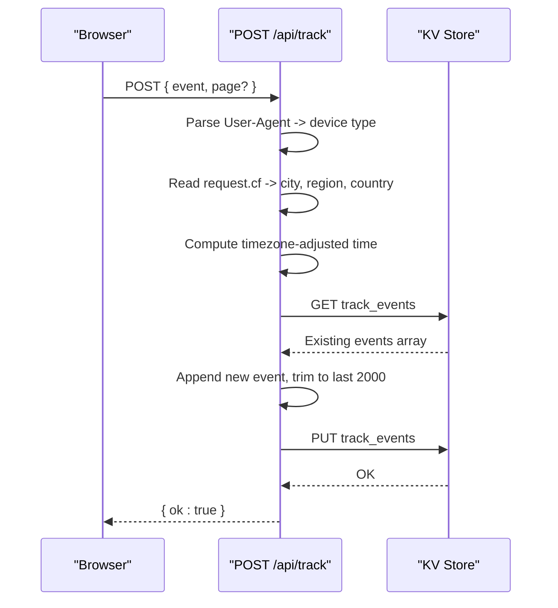
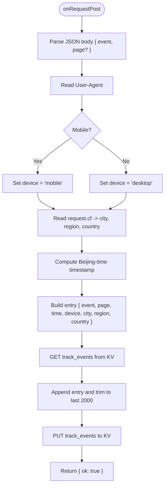
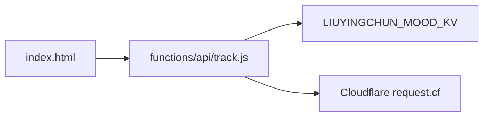

# Analytics Tracking API

<cite>
**Referenced Files in This Document**
- [track.js](file://functions/api/track.js)
- [visit.js](file://functions/api/visit.js)
- [index.html](file://index.html)
</cite>

## Table of Contents
1. [Introduction](#introduction)
2. [Project Structure](#project-structure)
3. [Core Components](#core-components)
4. [Architecture Overview](#architecture-overview)
5. [Detailed Component Analysis](#detailed-component-analysis)
6. [Dependency Analysis](#dependency-analysis)
7. [Performance Considerations](#performance-considerations)
8. [Troubleshooting Guide](#troubleshooting-guide)
9. [Conclusion](#conclusion)

## Introduction
This document describes the user analytics tracking system exposed by the POST /api/track endpoint. It covers the event schema, device detection logic, geographic location capture via Cloudflare request metadata, data storage and retention behavior, privacy considerations, example payloads, response formats, and integration patterns for capturing user interactions from the frontend.

## Project Structure
The analytics tracking feature is implemented as a serverless function under functions/api/track.js and is invoked from the frontend index.html. A related visit tracking endpoint exists in functions/api/visit.js for daily visit summaries.

**Diagram sources**
- [index.html:4405-4413](file://index.html#L4405-L4413)
- [track.js:11-37](file://functions/api/track.js#L11-L37)
- [visit.js:33-47](file://functions/api/visit.js#L33-L47)

**Section sources**
- [index.html:4405-4413](file://index.html#L4405-L4413)
- [track.js:1-44](file://functions/api/track.js#L1-L44)
- [visit.js:1-49](file://functions/api/visit.js#L1-L49)

## Core Components
- POST /api/track: Captures user behavior events with enriched context (device type, city, region, country, timestamp).
- Storage: Events are stored as a JSON array in a KV key named track_events, capped at the most recent 2000 entries.
- CORS: The endpoint supports cross-origin requests with appropriate headers.
- Timezone handling: Timestamps are adjusted to Beijing time before persistence.

Key behaviors:
- Device detection: Classifies device as mobile or desktop based on User-Agent.
- Geographic enrichment: Uses Cloudflare request.cf fields for city, region, and country.
- Default page: If not provided, defaults to "index".
- Error handling: Returns a simple success/failure JSON payload.

**Section sources**
- [track.js:11-37](file://functions/api/track.js#L11-L37)

## Architecture Overview
The tracking flow is lightweight and asynchronous from the client perspective. The browser sends a POST request with an event name and optional page identifier. The server enriches the event with device and location metadata, persists it to KV, and returns a minimal acknowledgment.

**Diagram sources**
- [index.html:4405-4413](file://index.html#L4405-L4413)
- [track.js:11-37](file://functions/api/track.js#L11-L37)

## Detailed Component Analysis

### Endpoint: POST /api/track
- Purpose: Record a user interaction event with contextual metadata.
- Request body:
  - event: string (required) — identifies the action or screen.
  - page: string (optional) — defaults to "index" if omitted.
- Response:
  - Success: { ok: true }
  - Failure: { ok: false }
- Headers:
  - Content-Type: application/json
  - CORS headers allow cross-origin POST and OPTIONS preflight.

Behavior details:
- Device detection:
  - Reads User-Agent header.
  - Matches common mobile identifiers; otherwise classifies as desktop.
- Geographic location:
  - Extracts city, region, country from Cloudflare request.cf when available.
  - Falls back to safe defaults when fields are missing.
- Timezone:
  - Adjusts current time to Beijing time before storing.
- Persistence:
  - Retrieves existing events array from KV.
  - Appends the new event entry.
  - Trims the array to keep only the most recent 2000 entries.
  - Writes the updated array back to KV.

Event schema stored in KV:
- Fields:
  - event: string — the tracked event name.
  - page: string — page identifier (defaults to "index").
  - time: string — ISO-like timestamp adjusted to Beijing time.
  - device: string — "mobile" or "desktop".
  - city: string — Cloudflare city or fallback.
  - region: string — Cloudflare region or fallback.
  - country: string — Cloudflare country or empty string.

Integration pattern:
- Frontend calls the endpoint using fetch with JSON body.
- Errors are ignored to avoid impacting UX (fire-and-forget).

**Diagram sources**
- [track.js:11-37](file://functions/api/track.js#L11-L37)

**Section sources**
- [track.js:11-37](file://functions/api/track.js#L11-L37)

### Related Endpoint: POST /api/visit
- Purpose: Record daily visit summaries with time and device info.
- Behavior:
  - Computes date/time in Beijing timezone.
  - Derives device type from User-Agent using a more detailed parser.
  - Stores per-day entries in KV under keys like visit_YYYY-MM-DD.

Note: This endpoint complements /api/track by aggregating visits per day rather than individual events.

**Section sources**
- [visit.js:7-27](file://functions/api/visit.js#L7-L27)
- [visit.js:33-47](file://functions/api/visit.js#L33-L47)

### Frontend Integration
- The browser exposes a track(event) helper that posts to /api/track with { event, page: 'index' }.
- Calls are fire-and-forget; errors are silently caught to prevent blocking UI.

Example usage pattern:
- Call track('button_click') when a user interacts with a button.
- Call track('page_view', { page: 'settings' }) to record navigation events.

**Section sources**
- [index.html:4405-4413](file://index.html#L4405-L4413)

## Dependency Analysis
- External dependencies:
  - Cloudflare Workers runtime provides env.LIUYINGCHUN_MOOD_KV and request.cf metadata.
- Internal coupling:
  - track.js depends on KV for persistence and Cloudflare request context for enrichment.
  - index.html depends on the /api/track route for analytics.

**Diagram sources**
- [index.html:4405-4413](file://index.html#L4405-L4413)
- [track.js:11-37](file://functions/api/track.js#L11-L37)

**Section sources**
- [track.js:11-37](file://functions/api/track.js#L11-L37)
- [index.html:4405-4413](file://index.html#L4405-L4413)

## Performance Considerations
- Event cap: The store keeps only the most recent 2000 events to limit memory and I/O overhead.
- Fire-and-forget: The frontend ignores errors to avoid blocking user interactions.
- Minimal payload: Only essential fields are sent and stored to reduce bandwidth and storage costs.
- Timezone adjustment: Performed server-side to ensure consistent timestamps across clients.

[No sources needed since this section provides general guidance]

## Troubleshooting Guide
Common issues and resolutions:
- CORS errors:
  - Ensure your origin is allowed; the endpoint sets broad CORS headers.
  - Use OPTIONS preflight if required by your environment.
- Missing fields:
  - If request.cf fields are absent, city/region/country will fall back to defaults. Verify Cloudflare configuration.
- Time discrepancies:
  - Timestamps are adjusted to Beijing time on the server side. If you need client-local times, compute them on the client before sending.
- Data loss:
  - Only the latest 2000 events are retained. For long-term analysis, implement periodic export or aggregation.

**Section sources**
- [track.js:1-44](file://functions/api/track.js#L1-L44)

## Conclusion
The POST /api/track endpoint provides a simple, efficient mechanism to capture user behavior events with enriched device and location context. It leverages Cloudflare’s request metadata and a KV-backed store with a bounded history to maintain performance. Integrate by calling the endpoint from your frontend whenever meaningful user interactions occur, and use the stored events for analytics dashboards or reports.

[No sources needed since this section summarizes without analyzing specific files]