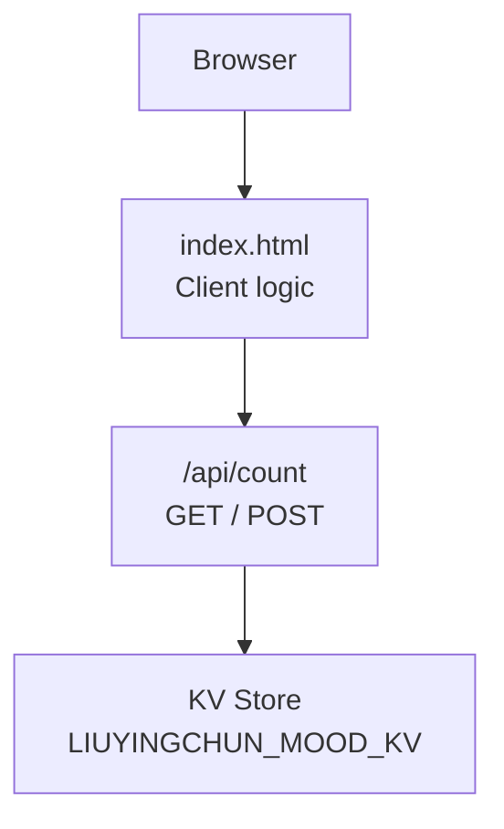
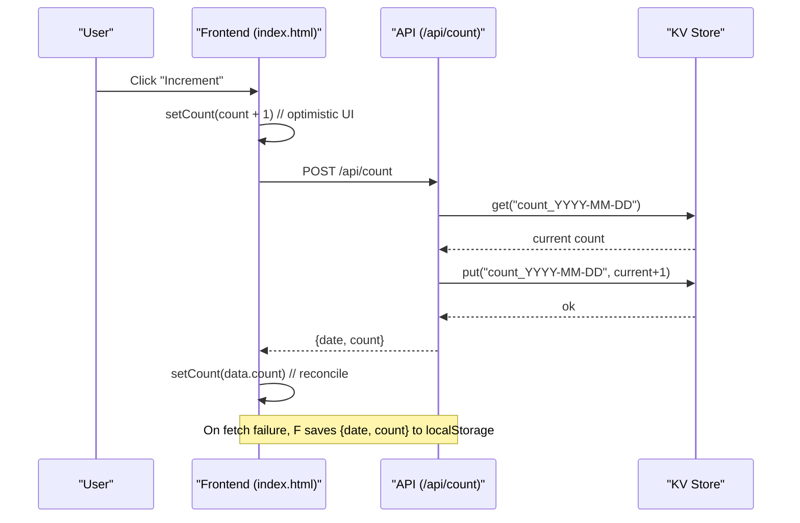
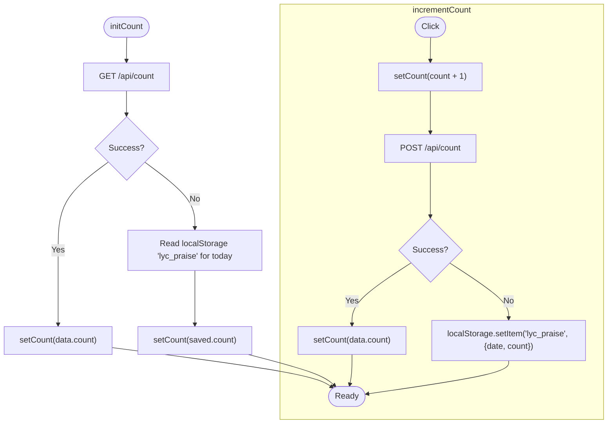
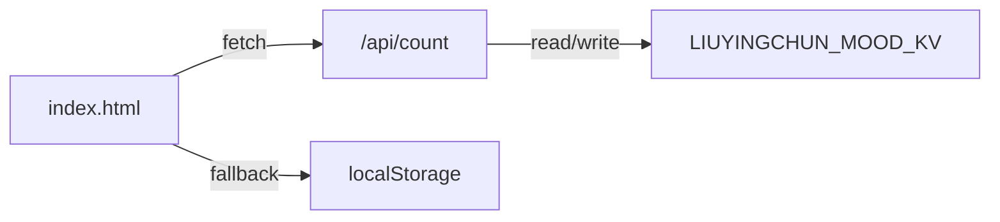

# Counter System API

<cite>
**Referenced Files in This Document**
- [count.js](file://functions/api/count.js)
- [index.html](file://index.html)
</cite>

## Table of Contents
1. [Introduction](#introduction)
2. [Project Structure](#project-structure)
3. [Core Components](#core-components)
4. [Architecture Overview](#architecture-overview)
5. [Detailed Component Analysis](#detailed-component-analysis)
6. [Dependency Analysis](#dependency-analysis)
7. [Performance Considerations](#performance-considerations)
8. [Troubleshooting Guide](#troubleshooting-guide)
9. [Conclusion](#conclusion)

## Introduction
This document describes the daily interaction counter system exposed via a simple REST-like API and integrated into the frontend. It covers:
- GET /api/count to retrieve today’s count (Beijing timezone)
- POST /api/count to increment today’s count
- Date-based key generation using Beijing time
- Optimistic UI updates on the client
- Offline fallback using local storage
- Request/response formats, error handling, and integration examples

## Project Structure
The counter feature is implemented as a serverless function under functions/api/count.js and consumed by the main page index.html. The function stores counters per day using a key-value store bound through an environment variable.

**Diagram sources**
- [count.js:1-32](file://functions/api/count.js#L1-L32)
- [index.html:2630-2663](file://index.html#L2630-L2663)

**Section sources**
- [count.js:1-32](file://functions/api/count.js#L1-L32)
- [index.html:2630-2663](file://index.html#L2630-L2663)

## Core Components
- Serverless API handler for GET and POST at /api/count
- Date computation in Beijing timezone
- Key-value storage with per-day keys
- Frontend integration with optimistic UI and offline fallback

Key responsibilities:
- Compute today’s date in Beijing timezone consistently across requests
- Read or write the daily counter from/to the KV store
- Return JSON responses with date and count
- Support CORS for cross-origin browser calls

**Section sources**
- [count.js:7-10](file://functions/api/count.js#L7-L10)
- [count.js:16-22](file://functions/api/count.js#L16-L22)
- [count.js:24-32](file://functions/api/count.js#L24-L32)
- [index.html:2630-2663](file://index.html#L2630-L2663)

## Architecture Overview
The flow uses a consistent Beijing-time date to derive a per-day key, ensuring all clients see the same “today.” The frontend performs an optimistic update before confirming with the server; if the network fails, it persists the incremented value locally for that day.

**Diagram sources**
- [count.js:16-32](file://functions/api/count.js#L16-L32)
- [index.html:2650-2663](file://index.html#L2630-L2663)

## Detailed Component Analysis

### API: GET /api/count
Purpose: Retrieve today’s count based on Beijing timezone.

Behavior:
- Computes today’s date string in Beijing timezone
- Reads the KV entry for key count_<YYYY-MM-DD>, defaulting to 0
- Returns JSON with fields:
  - date: YYYY-MM-DD (Beijing)
  - count: integer

Request:
- Method: GET
- Path: /api/count
- Headers: None required (CORS enabled)

Response:
- Status: 200 OK
- Content-Type: application/json
- Body:
  - date: string (YYYY-MM-DD)
  - count: number

Example response:
{
  "date": "2026-01-01",
  "count": 12
}

Error handling:
- Network errors are handled by the client
- If the KV read fails, the server returns a valid response with count 0

**Section sources**
- [count.js:7-10](file://functions/api/count.js#L7-L10)
- [count.js:16-22](file://functions/api/count.js#L16-L22)

### API: POST /api/count
Purpose: Increment today’s count by one and return the updated value.

Behavior:
- Computes today’s date string in Beijing timezone
- Reads current count for key count_<YYYY-MM-DD>, defaulting to 0
- Increments by 1 and writes back to KV
- Returns JSON with updated date and count

Request:
- Method: POST
- Path: /api/count
- Headers: None required (CORS enabled)
- Body: Not used by the server

Response:
- Status: 200 OK
- Content-Type: application/json
- Body:
  - date: string (YYYY-MM-DD)
  - count: number

Example response:
{
  "date": "2026-01-01",
  "count": 13
}

Error handling:
- Network errors are handled by the client
- If the KV write fails, the server still responds with the computed count; the client reconciles via optimistic UI and may fall back to local storage

**Section sources**
- [count.js:7-10](file://functions/api/count.js#L7-L10)
- [count.js:24-32](file://functions/api/count.js#L24-L32)

### Date-Based Key Generation (Beijing Timezone)
All date computations add 8 hours to UTC time to align with Beijing timezone, then format as YYYY-MM-DD. This ensures consistent daily boundaries regardless of client timezone.

Implementation notes:
- Uses a fixed offset of 8 hours
- Formats ISO date string and slices to first 10 characters
- Keys are formed as count_<YYYY-MM-DD>

**Section sources**
- [count.js:7-10](file://functions/api/count.js#L7-L10)

### Frontend Integration: Optimistic UI and Offline Fallback
Initialization:
- On load, fetches GET /api/count
- Sets UI count from server response
- On network failure, falls back to localStorage for today’s saved count

Increment flow:
- Immediately increments UI count (optimistic)
- Sends POST /api/count
- Reconciles UI with server response
- On network failure, persists {date, count} to localStorage for today

**Diagram sources**
- [index.html:2630-2663](file://index.html#L2630-L2663)

**Section sources**
- [index.html:2630-2663](file://index.html#L2630-L2663)

### CORS and Preflight
The API includes CORS headers allowing GET, POST, and OPTIONS, enabling cross-origin browser access. An OPTIONS handler is provided to satisfy preflight requests.

**Section sources**
- [count.js:1-5](file://functions/api/count.js#L1-L5)
- [count.js:12-14](file://functions/api/count.js#L12-L14)

## Dependency Analysis
- The API depends on a KV store bound via env.LIUYINGCHUN_MOOD_KV
- The frontend depends on the API endpoints and local storage for resilience
- Both sides compute Beijing date consistently to ensure key alignment

**Diagram sources**
- [count.js:16-32](file://functions/api/count.js#L16-L32)
- [index.html:2630-2663](file://index.html#L2630-L2663)

**Section sources**
- [count.js:16-32](file://functions/api/count.js#L16-L32)
- [index.html:2630-2663](file://index.html#L2630-L2663)

## Performance Considerations
- Single KV read per GET and single read+write per POST
- Minimal payload size (two fields)
- Optimistic UI reduces perceived latency
- LocalStorage fallback avoids blocking user interactions during outages

[No sources needed since this section provides general guidance]

## Troubleshooting Guide
Common issues and resolutions:
- Count not incrementing:
  - Verify POST /api/count returns expected count
  - Check KV store key format count_<YYYY-MM-DD> matches Beijing date
- Discrepancy between client and server:
  - Ensure client reconciles with server response after POST
  - Confirm localStorage only holds today’s data
- CORS errors:
  - Confirm browser sends preflight OPTIONS when needed
  - Verify server returns allowed methods and headers
- Offline behavior:
  - Confirm localStorage key name and structure match client expectations
  - Validate that initCount falls back correctly when GET fails

**Section sources**
- [count.js:1-5](file://functions/api/count.js#L1-L5)
- [count.js:16-32](file://functions/api/count.js#L16-L32)
- [index.html:2630-2663](file://index.html#L2630-L2663)

## Conclusion
The daily interaction counter provides a simple, robust API backed by a KV store and a resilient frontend. By computing dates in Beijing timezone, using per-day keys, applying optimistic UI updates, and falling back to local storage, the system delivers a smooth user experience even under network failures.

[No sources needed since this section summarizes without analyzing specific files]