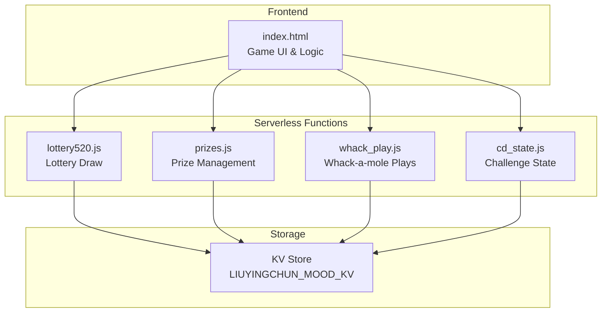
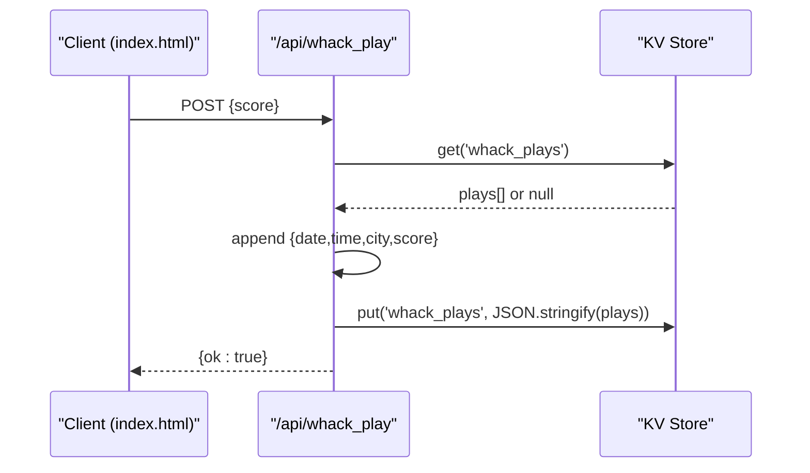
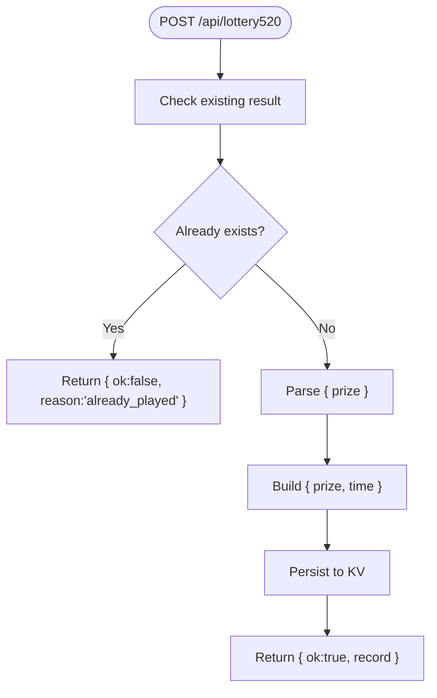
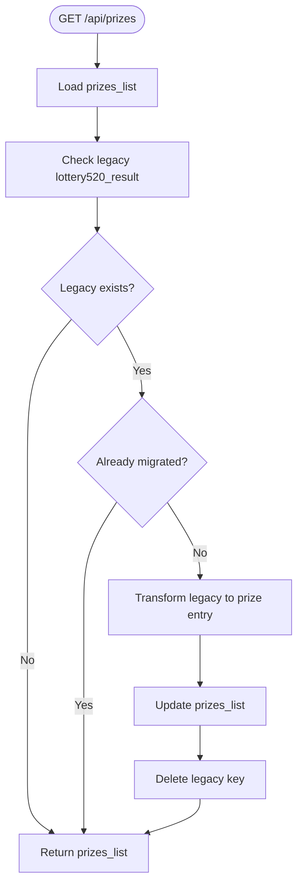
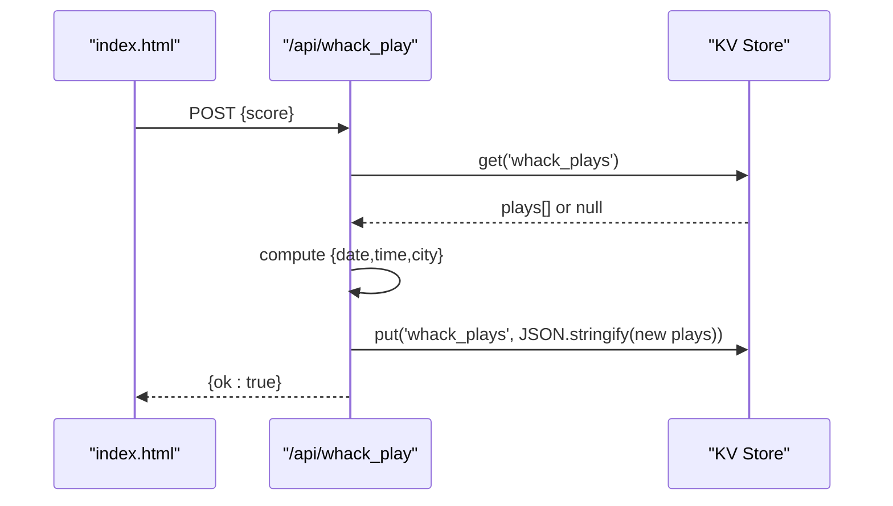
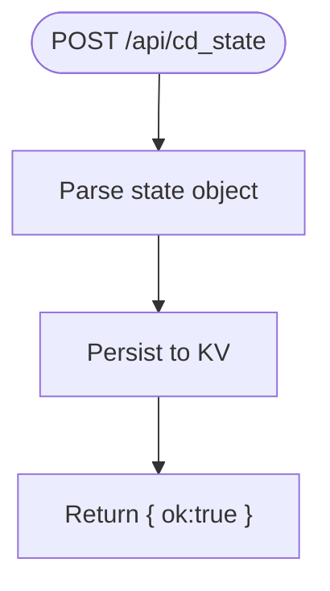
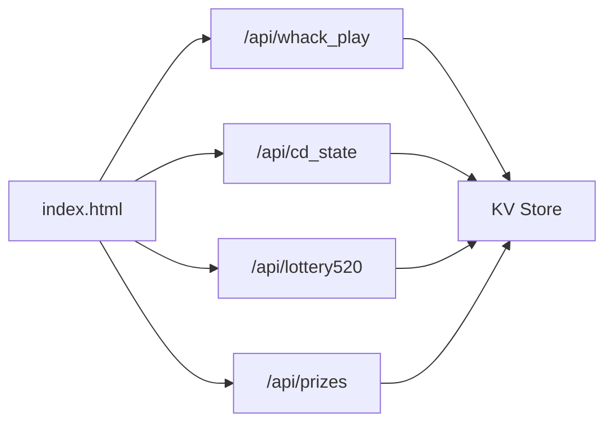

# Game APIs

<cite>
**Referenced Files in This Document**
- [lottery520.js](file://functions/api/lottery520.js)
- [prizes.js](file://functions/api/prizes.js)
- [whack_play.js](file://functions/api/whack_play.js)
- [cd_state.js](file://functions/api/cd_state.js)
- [index.html](file://index.html)
</cite>

## Table of Contents
1. [Introduction](#introduction)
2. [Project Structure](#project-structure)
3. [Core Components](#core-components)
4. [Architecture Overview](#architecture-overview)
5. [Detailed Component Analysis](#detailed-component-analysis)
6. [Dependency Analysis](#dependency-analysis)
7. [Performance Considerations](#performance-considerations)
8. [Troubleshooting Guide](#troubleshooting-guide)
9. [Conclusion](#conclusion)

## Introduction
This document provides detailed API documentation for the game-related endpoints exposed by the project:
- Lottery system: /api/lottery520
- Prize management: /api/prizes
- Whack-a-mole game state and scoring: /api/whack_play
- Related state synchronization: /api/cd_state (used by the whack-a-mole reward flow)

The APIs are serverless functions that use a key-value store to persist game results, prize records, and player state. The frontend integrates with these endpoints to implement game logic, score submission, and reward distribution.

## Project Structure
The relevant code is organized as follows:
- Server-side API handlers under functions/api/:
  - lottery520.js: Lottery draw endpoint
  - prizes.js: Prize list management and migration
  - whack_play.js: Whack-a-mole play recording
  - cd_state.js: Children’s Day challenge state persistence
- Frontend integration in index.html:
  - Whack-a-mole game UI and scoring logic
  - Submission of final scores to /api/whack_play
  - Conditional reward handling based on score thresholds

**Diagram sources**
- [lottery520.js:1-43](file://functions/api/lottery520.js#L1-L43)
- [prizes.js:1-60](file://functions/api/prizes.js#L1-L60)
- [whack_play.js:1-44](file://functions/api/whack_play.js#L1-L44)
- [cd_state.js:1-28](file://functions/api/cd_state.js#L1-L28)
- [index.html:2929-2993](file://index.html#L2929-L2993)

**Section sources**
- [lottery520.js:1-43](file://functions/api/lottery520.js#L1-L43)
- [prizes.js:1-60](file://functions/api/prizes.js#L1-L60)
- [whack_play.js:1-44](file://functions/api/whack_play.js#L1-L44)
- [cd_state.js:1-28](file://functions/api/cd_state.js#L1-L28)
- [index.html:2929-2993](file://index.html#L2929-L2993)

## Core Components
- Lottery System (/api/lottery520):
  - GET: Returns the current lottery result if already drawn; otherwise null.
  - POST: Saves a new lottery result only if none exists; returns an error when already played.
  - Persistence: Uses a single key for the latest result with timestamp.

- Prize Management (/api/prizes):
  - GET: Returns all prize records; performs one-time migration from legacy lottery result into the unified prize list.
  - POST: Adds a new prize record with activity, prize, optional date and slogan.
  - Persistence: Stores an array of prize objects.

- Whack-a-mole Game State (/api/whack_play):
  - GET: Retrieves the full history of plays (date, time, city, score).
  - POST: Appends a new play record with server-derived metadata (Beijing time and client location).
  - Persistence: Stores an array of play entries.

- Challenge State (/api/cd_state):
  - GET: Returns current state including tokens and flip tokens.
  - POST: Updates the entire state object.
  - Used by the whack-a-mole reward flow to grant flip tokens upon reaching score thresholds.

**Section sources**
- [lottery520.js:18-42](file://functions/api/lottery520.js#L18-L42)
- [prizes.js:14-59](file://functions/api/prizes.js#L14-L59)
- [whack_play.js:21-43](file://functions/api/whack_play.js#L21-L43)
- [cd_state.js:13-27](file://functions/api/cd_state.js#L13-L27)

## Architecture Overview
The game APIs follow a simple request/response pattern backed by a key-value store. The frontend orchestrates gameplay locally and synchronizes critical outcomes to the server.

**Diagram sources**
- [whack_play.js:29-43](file://functions/api/whack_play.js#L29-L43)
- [index.html:2957-2961](file://index.html#L2957-L2961)

## Detailed Component Analysis

### Lottery System: /api/lottery520
Purpose:
- Allow a user to draw once and persist the result with a Beijing timestamp.
- Prevent multiple draws by rejecting subsequent POST requests.

Endpoints:
- OPTIONS: CORS preflight support.
- GET: Retrieve existing result or null.
- POST: Save a new result with prize and time; reject if already played.

Data model:
- Key: lottery520_result
- Value: { prize: string, time: string }

Behavior:
- Timezone: Beijing time is computed server-side.
- Idempotency: Only the first successful POST persists; later POSTs return an error indicating already played.

Example interactions:
- GET /api/lottery520
  - Response: null (first visit) or { prize, time } (after draw)
- POST /api/lottery520
  - Request body: { prize }
  - Success response: { ok: true, record: { prize, time } }
  - Error response: { ok: false, reason: 'already_played' }

**Diagram sources**
- [lottery520.js:27-42](file://functions/api/lottery520.js#L27-L42)

**Section sources**
- [lottery520.js:1-43](file://functions/api/lottery520.js#L1-L43)

### Prize Management: /api/prizes
Purpose:
- Maintain a unified list of prizes across activities.
- Migrate legacy lottery results into the new structure automatically on first read.

Endpoints:
- OPTIONS: CORS preflight support.
- GET: Return all prizes; perform one-time migration from legacy key.
- POST: Add a new prize entry with validation.

Data model:
- Key: prizes_list
- Legacy key: lottery520_result
- Prize object: { activity, prize, date?, slogan? }

Migration behavior:
- On GET, if legacy result exists and not already present, it is converted into a prize entry with activity set to the May event and a normalized date, then persisted and the legacy key deleted.

Validation:
- POST requires activity and prize; otherwise returns a 400 with missing_fields.

Example interactions:
- GET /api/prizes
  - Response: Array of prize objects
- POST /api/prizes
  - Request body: { activity, prize, date?, slogan? }
  - Success response: { ok: true }
  - Validation error: { ok: false, reason: 'missing_fields' }

**Diagram sources**
- [prizes.js:15-39](file://functions/api/prizes.js#L15-L39)

**Section sources**
- [prizes.js:1-60](file://functions/api/prizes.js#L1-L60)

### Whack-a-mole Game State: /api/whack_play
Purpose:
- Record each completed whack-a-mole session with score and contextual metadata.
- Provide a read interface to retrieve historical plays.

Endpoints:
- OPTIONS: CORS preflight support.
- GET: Retrieve all plays.
- POST: Append a new play with server-computed date/time and client location.

Data model:
- Key: whack_plays
- Play object: { date, time, city, score }

Scoring mechanism:
- Each hit awards 10 points.
- Game duration is 30 seconds.
- Difficulty increases over time via dynamic spawn and visibility intervals.

Reward distribution:
- If the player reaches a threshold during a special activity, they earn a flip token used in the challenge card lottery.
- Flip tokens are managed via /api/cd_state.

Example interactions:
- GET /api/whack_play
  - Response: Array of play objects
- POST /api/whack_play
  - Request body: { score }
  - Success response: { ok: true }

**Diagram sources**
- [whack_play.js:29-43](file://functions/api/whack_play.js#L29-L43)
- [index.html:2957-2961](file://index.html#L2957-L2961)

**Section sources**
- [whack_play.js:1-44](file://functions/api/whack_play.js#L1-L44)
- [index.html:2896-2993](file://index.html#L2896-L2993)

### Challenge State Synchronization: /api/cd_state
Purpose:
- Persist and synchronize the challenge state including tokens earned/used and flip tokens.
- Used by the whack-a-mole reward flow to update flip tokens after achieving a target score.

Endpoints:
- OPTIONS: CORS preflight support.
- GET: Return current state; default values applied if none exist.
- POST: Replace the entire state object.

Data model:
- Key: cd_state
- Default state: { dogs: number, tokens_earned: number, tokens_used: number, daily_date: string, flip_tokens: number }

Integration with whack-a-mole:
- When the player achieves a high enough score during a special session, the frontend increments flip_tokens and persists via /api/cd_state.

Example interactions:
- GET /api/cd_state
  - Response: Current state object
- POST /api/cd_state
  - Request body: Full state object
  - Success response: { ok: true }

**Diagram sources**
- [cd_state.js:21-27](file://functions/api/cd_state.js#L21-L27)

**Section sources**
- [cd_state.js:1-28](file://functions/api/cd_state.js#L1-L28)
- [index.html:2962-2975](file://index.html#L2962-L2975)

## Dependency Analysis
- All APIs share a common CORS configuration and rely on the same KV namespace for persistence.
- The whack-a-mole game logic resides in the frontend and calls /api/whack_play at the end of each session.
- The prize management API depends on the legacy lottery result key for migration, ensuring data continuity.
- The challenge state API is consumed by the frontend to manage flip tokens tied to whack-a-mole performance.

**Diagram sources**
- [index.html:2929-2993](file://index.html#L2929-L2993)
- [whack_play.js:21-43](file://functions/api/whack_play.js#L21-L43)
- [cd_state.js:13-27](file://functions/api/cd_state.js#L13-L27)
- [lottery520.js:18-42](file://functions/api/lottery520.js#L18-L42)
- [prizes.js:14-59](file://functions/api/prizes.js#L14-L59)

**Section sources**
- [index.html:2929-2993](file://index.html#L2929-L2993)
- [whack_play.js:1-44](file://functions/api/whack_play.js#L1-L44)
- [cd_state.js:1-28](file://functions/api/cd_state.js#L1-L28)
- [lottery520.js:1-43](file://functions/api/lottery520.js#L1-L43)
- [prizes.js:1-60](file://functions/api/prizes.js#L1-L60)

## Performance Considerations
- KV operations are lightweight but should be minimized in hot paths. Batch updates where possible.
- The whack-a-mole game runs entirely in the browser; only final scores are sent to the server, reducing network overhead.
- Prize migration occurs once per GET call; ensure clients cache responses to avoid repeated migrations.
- Avoid frequent polling of /api/whack_play; instead, fetch on demand when displaying histories.

[No sources needed since this section provides general guidance]

## Troubleshooting Guide
Common issues and resolutions:
- Repeated lottery draws:
  - Symptom: POST /api/lottery520 returns { ok: false, reason: 'already_played' }.
  - Resolution: Ensure the client checks GET before attempting POST or handles the error gracefully.

- Missing fields in prize creation:
  - Symptom: POST /api/prizes returns { ok: false, reason: 'missing_fields' }.
  - Resolution: Validate activity and prize fields on the client side before sending.

- Whack-a-mole score not recorded:
  - Symptom: No new entries appear in /api/whack_play.
  - Resolution: Confirm the POST payload includes a numeric score and that the network request succeeds.

- Challenge state not updating:
  - Symptom: Flip tokens do not increment after achieving target score.
  - Resolution: Verify that the frontend calls POST /api/cd_state with the updated state and that the KV write succeeds.

**Section sources**
- [lottery520.js:27-42](file://functions/api/lottery520.js#L27-L42)
- [prizes.js:43-59](file://functions/api/prizes.js#L43-L59)
- [whack_play.js:29-43](file://functions/api/whack_play.js#L29-L43)
- [cd_state.js:21-27](file://functions/api/cd_state.js#L21-L27)

## Conclusion
The game APIs provide a cohesive foundation for lottery draws, prize management, and whack-a-mole gameplay with robust state synchronization. By leveraging server-side timestamps, location metadata, and KV-backed persistence, the system ensures consistent state across client sessions while keeping the frontend responsive and interactive. Proper validation, idempotency checks, and migration logic help maintain data integrity and usability.

[No sources needed since this section summarizes without analyzing specific files]