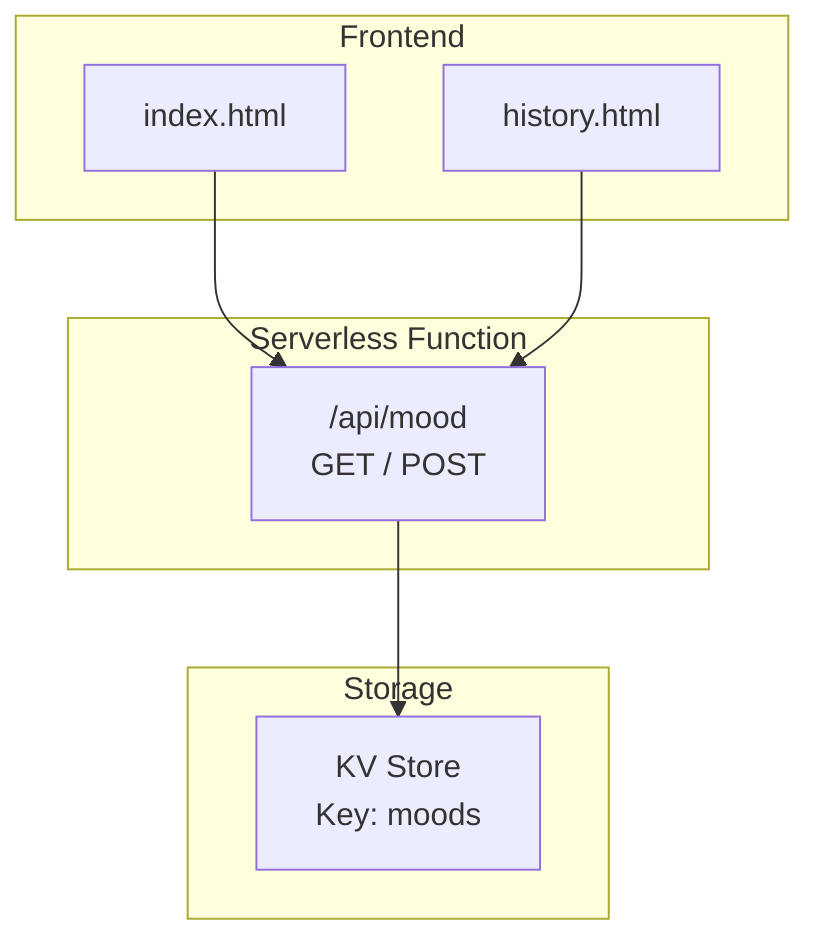
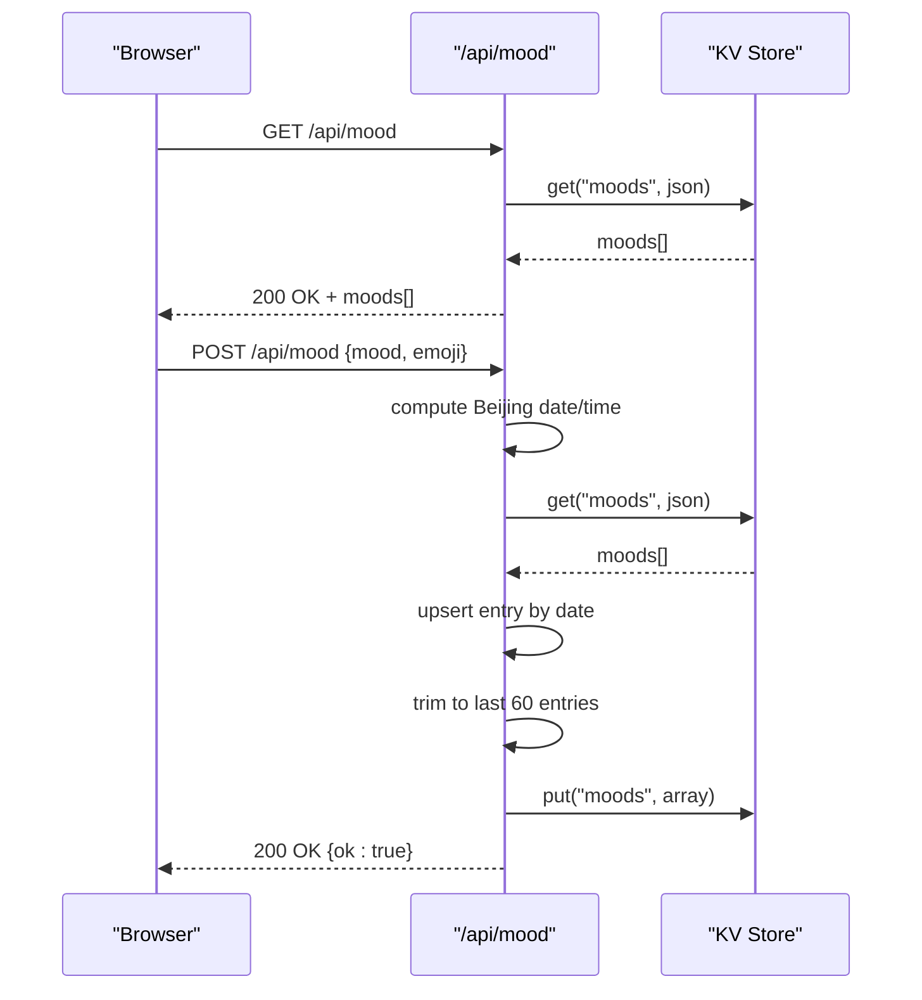
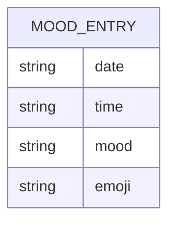
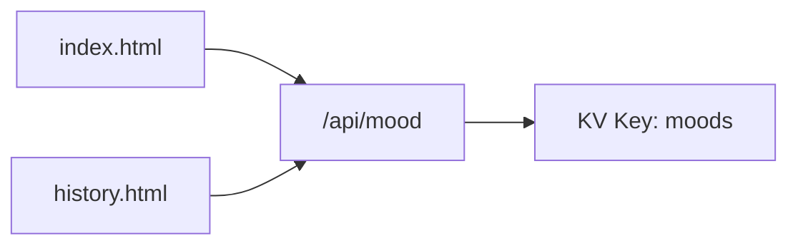

# Mood Management API

<cite>
**Referenced Files in This Document**
- [mood.js](file://functions/api/mood.js)
- [index.html](file://index.html)
- [history.html](file://history.html)
</cite>

## Table of Contents
1. [Introduction](#introduction)
2. [Project Structure](#project-structure)
3. [Core Components](#core-components)
4. [Architecture Overview](#architecture-overview)
5. [Detailed Component Analysis](#detailed-component-analysis)
6. [Dependency Analysis](#dependency-analysis)
7. [Performance Considerations](#performance-considerations)
8. [Troubleshooting Guide](#troubleshooting-guide)
9. [Conclusion](#conclusion)

## Introduction
This document provides detailed API documentation for the mood management endpoints:
- GET /api/mood: Retrieve mood history
- POST /api/mood: Record a new mood entry

It covers request/response schemas, Beijing timezone handling logic, data validation rules, storage constraints (60-day retention), emoji classifications used by the frontend, error handling patterns, and CORS configuration.

## Project Structure
The mood functionality is implemented as a serverless function under functions/api/mood.js and consumed by the frontend pages index.html and history.html.

**Diagram sources**
- [mood.js:19-43](file://functions/api/mood.js#L19-L43)
- [index.html:3828-3870](file://index.html#L3828-L3870)
- [history.html:132-176](file://history.html#L132-L176)

**Section sources**
- [mood.js:1-43](file://functions/api/mood.js#L1-L43)
- [index.html:3828-3870](file://index.html#L3828-L3870)
- [history.html:132-176](file://history.html#L132-L176)

## Core Components
- Serverless function: functions/api/mood.js
  - Handles OPTIONS preflight, GET retrieval, and POST recording of mood entries.
  - Uses a KV store with key LIUYINGCHUN_MOOD_KV and stores an array under key moods.
  - Applies Beijing timezone offset (+8 hours) when generating date/time fields.
  - Enforces a 60-entry retention policy on the stored array.

- Frontend consumers:
  - index.html: Loads today’s mood and renders history; uses mood values to update UI state.
  - history.html: Displays mood history with emoji and time labels.

**Section sources**
- [mood.js:1-43](file://functions/api/mood.js#L1-L43)
- [index.html:3828-3870](file://index.html#L3828-L3870)
- [history.html:132-176](file://history.html#L132-L176)

## Architecture Overview
The mood API follows a simple client-server-storage pattern:
- The browser calls GET or POST /api/mood.
- The serverless function reads/writes the moods array from/to KV.
- Responses are JSON with CORS headers allowing cross-origin access.

**Diagram sources**
- [mood.js:19-43](file://functions/api/mood.js#L19-L43)

## Detailed Component Analysis

### Endpoint: GET /api/mood
- Purpose: Retrieve the full mood history array.
- Method: GET
- Path: /api/mood
- Authentication: None
- Request body: None
- Response:
  - Status: 200 OK
  - Content-Type: application/json
  - Body: Array of mood entries
    - Each entry contains:
      - date: string (YYYY-MM-DD, Beijing date)
      - time: string (HH:mm, Beijing time)
      - mood: string
      - emoji: string (optional; defaults to a neutral emoji in the frontend if missing)
- CORS: Allows all origins, methods GET/POST/OPTIONS, header Content-Type.

Example response shape:
[
  {
    "date": "YYYY-MM-DD",
    "time": "HH:mm",
    "mood": "string",
    "emoji": "string"
  }
]

Notes:
- If no data exists, the endpoint returns an empty array.
- The frontend may display a default emoji when the field is absent.

**Section sources**
- [mood.js:19-24](file://functions/api/mood.js#L19-L24)
- [index.html:3828-3870](file://index.html#L3828-L3870)
- [history.html:132-176](file://history.html#L132-L176)

### Endpoint: POST /api/mood
- Purpose: Record or update a mood entry for the current day (Beijing timezone).
- Method: POST
- Path: /api/mood
- Authentication: None
- Request body: JSON object
  - Required fields:
    - mood: string
    - emoji: string
- Response:
  - Status: 200 OK
  - Content-Type: application/json
  - Body: { ok: true }
- Behavior:
  - Computes current date and time using Beijing timezone (+8 hours).
  - Retrieves existing moods array from KV.
  - Upserts the entry for the current date:
    - If an entry for the same date exists, it is replaced.
    - Otherwise, a new entry is inserted at the beginning.
  - Trims the array to keep only the most recent 60 entries.
  - Persists the updated array back to KV.

Validation rules:
- The function expects a JSON body with mood and emoji properties.
- No explicit type or length validation is performed server-side; invalid payloads will cause parsing errors.

CORS:
- Same as GET; allows cross-origin requests.

Beijing timezone handling:
- Date and time are computed by adding 8 hours to UTC before formatting.

Storage constraint:
- Only the latest 60 entries are retained; older entries are removed via array trimming.

Error handling:
- There is no explicit try/catch around request.json() or KV operations in this function.
- Malformed JSON or unexpected runtime errors will result in unhandled exceptions.

**Section sources**
- [mood.js:26-43](file://functions/api/mood.js#L26-L43)

### Emoji Classifications and Frontend Usage
- The frontend maps certain mood strings to visual states and colors:
  - Colors:
    - "很好": pinkish
    - "还行": bluish
    - "有点累": yellowish
    - "不太好": purplish
  - Dog widget states:
    - "很好" -> happy
    - "还行" -> okay
    - "有点累" -> tired
    - "不太好" -> sad
- When displaying history, if an entry lacks an emoji, the frontend shows a default neutral emoji.

These mappings inform expected mood values and recommended emoji choices for consistent UI behavior.

**Section sources**
- [history.html:132-176](file://history.html#L132-L176)
- [index.html:3828-3870](file://index.html#L3828-L3870)
- [index.html:3964-4047](file://index.html#L3964-L4047)

### Data Model
Mood entry schema:
- date: string (YYYY-MM-DD)
- time: string (HH:mm)
- mood: string
- emoji: string (optional)

Constraints:
- Retention: Up to 60 entries are kept; older ones are pruned automatically.
- Timezone: All timestamps reflect Beijing time (+08:00).

**Diagram sources**
- [mood.js:26-43](file://functions/api/mood.js#L26-L43)

## Dependency Analysis
- The mood API depends on:
  - Cloudflare KV environment binding named LIUYINGCHUN_MOOD_KV.
  - The moods array stored under the key moods.
- Frontend dependencies:
  - index.html and history.html call /api/mood to load and render mood history.

**Diagram sources**
- [index.html:3828-3870](file://index.html#L3828-L3870)
- [history.html:132-176](file://history.html#L132-L176)
- [mood.js:19-43](file://functions/api/mood.js#L19-L43)

**Section sources**
- [mood.js:19-43](file://functions/api/mood.js#L19-L43)
- [index.html:3828-3870](file://index.html#L3828-L3870)
- [history.html:132-176](file://history.html#L132-L176)

## Performance Considerations
- Read path (GET): Single KV read and JSON serialization.
- Write path (POST):
  - One KV read, array manipulation (find/upsert/slice), one KV write.
  - Trimming to 60 entries ensures bounded memory usage.
- Timezone computation is lightweight and executed per request.
- No pagination or filtering is provided; clients receive the entire array.

[No sources needed since this section provides general guidance]

## Troubleshooting Guide
Common issues and resolutions:
- CORS errors:
  - Ensure your client sends requests to /api/mood and accepts JSON responses.
  - The function sets Access-Control-Allow-Origin to * and supports GET, POST, OPTIONS.
- Malformed request body:
  - POST must include a valid JSON object with mood and emoji fields.
  - Invalid JSON will cause a runtime error without a specific error response.
- Missing or incorrect timezone:
  - Dates and times are generated in Beijing timezone; ensure your client interprets them accordingly.
- Empty history:
  - GET returns an empty array when no moods exist; handle this gracefully in the UI.

Operational notes:
- The function does not return explicit error codes for malformed payloads; consider adding validation and returning appropriate HTTP status codes.
- KV failures are not caught; monitor environment bindings and KV availability.

**Section sources**
- [mood.js:1-43](file://functions/api/mood.js#L1-L43)

## Conclusion
The mood management API provides a straightforward interface for recording and retrieving daily mood entries with Beijing timezone-aware timestamps and a 60-entry retention policy. The frontend consumes these endpoints to display mood history and adapt UI elements based on mood values and emojis. For improved robustness, consider adding input validation and explicit error handling in the POST handler.

[No sources needed since this section summarizes without analyzing specific files]