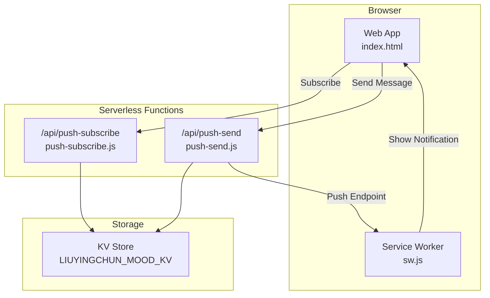
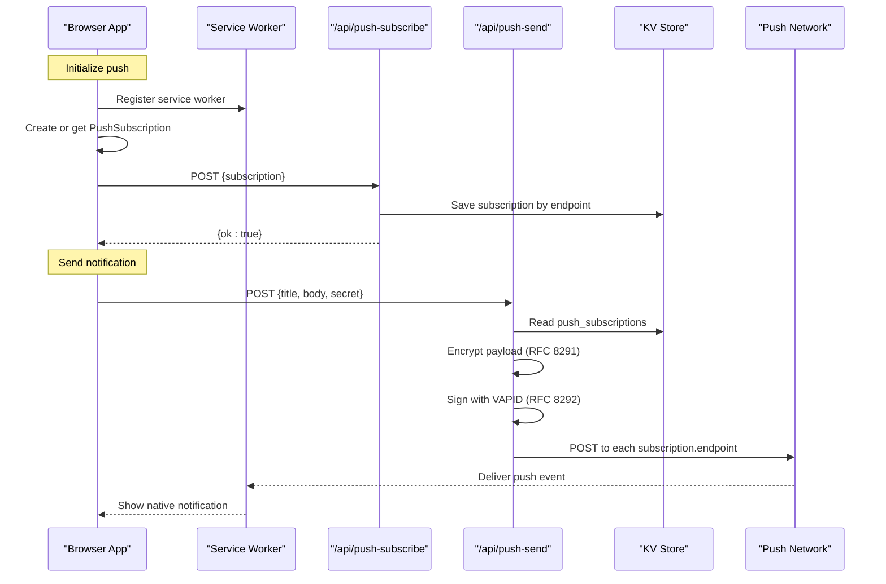
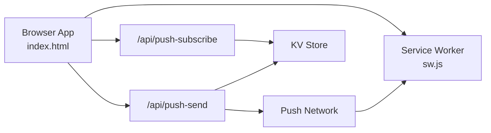

# Push Notification API

<cite>
**Referenced Files in This Document**
- [push-send.js](file://functions/api/push-send.js)
- [push-subscribe.js](file://functions/api/push-subscribe.js)
- [index.html](file://index.html)
- [sw.js](file://sw.js)
- [push.html](file://push.html)
</cite>

## Table of Contents
1. [Introduction](#introduction)
2. [Project Structure](#project-structure)
3. [Core Components](#core-components)
4. [Architecture Overview](#architecture-overview)
5. [Detailed Component Analysis](#detailed-component-analysis)
6. [Dependency Analysis](#dependency-analysis)
7. [Performance Considerations](#performance-considerations)
8. [Troubleshooting Guide](#troubleshooting-guide)
9. [Conclusion](#conclusion)
10. [Appendices](#appendices)

## Introduction
This document provides detailed API documentation for the Web Push notification system, focusing on:
- POST /api/push-send: sending encrypted push notifications to all subscribed clients
- POST /api/push-subscribe: registering and updating user subscriptions
- VAPID authentication setup and usage
- Subscription lifecycle management
- Payload encryption using RFC 8291
- Error handling strategies
- Browser compatibility considerations
- Examples of push message formats and subscription flows

The implementation uses server-side encryption and VAPID (RFC 8292) to securely deliver push messages to browsers via the Web Push protocol.

## Project Structure
The push notification feature spans a few key files:
- Client-side service worker handles incoming push events and displays notifications
- Frontend initializes push subscriptions and sends them to the backend
- Backend endpoints handle subscription storage and push delivery with encryption and VAPID

**Diagram sources**
- [index.html:4540-4559](file://index.html#L4540-L4559)
- [push-subscribe.js:11-22](file://functions/api/push-subscribe.js#L11-L22)
- [push-send.js:112-154](file://functions/api/push-send.js#L112-L154)
- [sw.js:1-16](file://sw.js#L1-L16)

**Section sources**
- [index.html:4540-4559](file://index.html#L4540-L4559)
- [push-subscribe.js:1-22](file://functions/api/push-subscribe.js#L1-L22)
- [push-send.js:1-154](file://functions/api/push-send.js#L1-L154)
- [sw.js:1-16](file://sw.js#L1-L16)

## Core Components
- POST /api/push-subscribe: Accepts a PushSubscription object and stores it keyed by endpoint to avoid duplicates
- POST /api/push-send: Validates an authorization secret, retrieves stored subscriptions, encrypts payload per RFC 8291, signs request with VAPID (RFC 8292), and delivers to each subscription endpoint
- Service Worker: Listens for push events, parses JSON payload, and shows a native notification; handles click to open the app

Key environment variables used:
- PUSH_SECRET: Secret required to authorize sending messages
- VAPID_PUBLIC_KEY, VAPID_PRIVATE_KEY: EC P-256 keys for VAPID signing
- LIUYINGCHUN_MOOD_KV: Key-value store used to persist push_subscriptions

**Section sources**
- [push-subscribe.js:11-22](file://functions/api/push-subscribe.js#L11-L22)
- [push-send.js:112-154](file://functions/api/push-send.js#L112-L154)
- [sw.js:1-16](file://sw.js#L1-L16)

## Architecture Overview
The push flow consists of two main sequences: subscription registration and message delivery.

**Diagram sources**
- [index.html:4540-4559](file://index.html#L4540-L4559)
- [push-subscribe.js:11-22](file://functions/api/push-subscribe.js#L11-L22)
- [push-send.js:55-104](file://functions/api/push-send.js#L55-L104)
- [push-send.js:112-154](file://functions/api/push-send.js#L112-L154)
- [sw.js:1-16](file://sw.js#L1-L16)

## Detailed Component Analysis

### POST /api/push-subscribe
Purpose:
- Register or update a user’s push subscription
- Prevent duplicate entries by using the subscription endpoint as the unique key

Request:
- Method: POST
- Content-Type: application/json
- Body: PushSubscription object from the browser (must include at least endpoint)

Response:
- Success: { ok: true }
- Validation error: { error: "invalid subscription" }, status 400

Behavior:
- Reads existing subscriptions from KV store
- Stores new or updated subscription under its endpoint
- Returns success regardless of whether it was a new or updated entry

CORS:
- Allows cross-origin requests with standard headers

**Section sources**
- [push-subscribe.js:1-22](file://functions/api/push-subscribe.js#L1-L22)

### POST /api/push-send
Purpose:
- Send a push notification to all registered subscriptions after validating a secret
- Encrypt payload per RFC 8291 and sign request per RFC 8292

Request:
- Method: POST
- Content-Type: application/json
- Body:
  - title: string (optional; defaults to a predefined value if omitted)
  - body: string (optional)
  - secret: string (required; must match PUSH_SECRET)

Response:
- Success: { ok: true, sent: number, failed: number }
- Unauthorized: { error: "unauthorized" }, status 401
- No subscriptions: { error: "no subscription" }, status 404

Processing steps:
1. Validate secret against PUSH_SECRET
2. Retrieve push_subscriptions from KV store
3. For each subscription:
   - Encrypt payload using RFC 8291 (ECDH + AES-GCM)
   - Generate VAPID Authorization header using RFC 8292 (ECDSA ES256)
   - POST to subscription.endpoint with appropriate headers
4. Aggregate results and return counts of sent and failed deliveries

Headers set on outgoing push requests:
- Authorization: vapid ...
- Content-Type: application/octet-stream
- Content-Encoding: aes128gcm
- TTL: 86400

Error handling:
- Per-subscription errors are captured and counted
- Overall response includes total sent and failed counts

CORS:
- Supports preflight OPTIONS and sets CORS headers

**Section sources**
- [push-send.js:1-154](file://functions/api/push-send.js#L1-L154)

### Service Worker (sw.js)
Responsibilities:
- Listen for push events and display native notifications
- Handle notification clicks to navigate to the app root

Payload format:
- JSON with fields:
  - title: string
  - body: string

Click behavior:
- Closes the notification and opens the app window

**Section sources**
- [sw.js:1-16](file://sw.js#L1-L16)

### Client-side Subscription Initialization
Location: index.html
Behavior:
- Checks for service worker and PushManager support
- Gets existing subscription or creates one with userVisibleOnly and applicationServerKey
- Sends subscription to /api/push-subscribe

Environment:
- VAPID_PUBLIC_KEY is defined in the client and used when subscribing

**Section sources**
- [index.html:4532-4559](file://index.html#L4532-L4559)

### Sender UI (push.html)
Purpose:
- Provides a simple interface to send push notifications
- Requires a secret to authenticate the request

Flow:
- User enters title, body, and secret
- Sends POST to /api/push-send with JSON payload
- Displays status based on response

**Section sources**
- [push.html:166-201](file://push.html#L166-L201)

## Dependency Analysis
- Client depends on:
  - Service Worker for receiving push events
  - /api/push-subscribe to register/update subscriptions
  - /api/push-send to send messages (via sender UI)
- Server functions depend on:
  - Environment variables: PUSH_SECRET, VAPID_PUBLIC_KEY, VAPID_PRIVATE_KEY
  - KV store: LIUYINGCHUN_MOOD_KV for storing subscriptions
- Encryption dependencies:
  - ECDH P-256 for key exchange
  - AES-GCM for payload encryption
  - HMAC-SHA256 and HKDF for deriving keys
  - ECDSA ES256 for VAPID signing

**Diagram sources**
- [index.html:4540-4559](file://index.html#L4540-L4559)
- [push-subscribe.js:11-22](file://functions/api/push-subscribe.js#L11-L22)
- [push-send.js:112-154](file://functions/api/push-send.js#L112-L154)
- [sw.js:1-16](file://sw.js#L1-L16)

**Section sources**
- [push-send.js:34-104](file://functions/api/push-send.js#L34-L104)
- [push-send.js:112-154](file://functions/api/push-send.js#L112-L154)
- [index.html:4540-4559](file://index.html#L4540-L4559)

## Performance Considerations
- Parallel delivery: The sender function delivers to all subscriptions concurrently using Promise.all, minimizing latency
- TTL: Set to 86400 seconds to allow delayed delivery if needed
- Payload size: Encrypted payloads are binary; keep titles and bodies concise to reduce bandwidth
- KV access: Reading and writing a single JSON blob for all subscriptions avoids per-key overhead but may grow large over time; consider pagination or sharding if the number of subscriptions increases significantly
- Encryption cost: ECDH and AES-GCM operations are CPU-intensive; ensure adequate compute resources for high-volume sending

[No sources needed since this section provides general guidance]

## Troubleshooting Guide
Common issues and resolutions:
- Unauthorized error (401):
  - Ensure PUSH_SECRET matches the secret provided in the request body
  - Verify environment variable configuration
- No subscription (404):
  - Confirm that at least one client has successfully subscribed and the subscription was stored
  - Check KV store for presence of push_subscriptions
- Invalid subscription (400):
  - Ensure the client sends a valid PushSubscription object including endpoint
- Delivery failures:
  - Inspect per-subscription error details in the response
  - Check network connectivity to push endpoints
  - Validate VAPID keys and expiration (the implementation sets exp to 12 hours from now)
- Service worker not receiving push:
  - Ensure the service worker is registered and active
  - Verify push event handler is present and parsing JSON correctly
  - Confirm browser supports PushManager and service workers

**Section sources**
- [push-send.js:112-154](file://functions/api/push-send.js#L112-L154)
- [push-subscribe.js:11-22](file://functions/api/push-subscribe.js#L11-L22)
- [sw.js:1-16](file://sw.js#L1-L16)

## Conclusion
The push notification system implements secure, standards-compliant delivery using RFC 8291 encryption and RFC 8292 VAPID authentication. It provides straightforward APIs for subscription management and message sending, with robust error handling and parallel delivery. Proper configuration of environment variables and correct client initialization are essential for reliable operation.

[No sources needed since this section summarizes without analyzing specific files]

## Appendices

### API Reference

#### POST /api/push-subscribe
- Purpose: Register or update a push subscription
- Request:
  - Content-Type: application/json
  - Body: PushSubscription object (must include endpoint)
- Response:
  - 200 OK: { ok: true }
  - 400 Bad Request: { error: "invalid subscription" }
- Notes:
  - Subscriptions are stored by endpoint to prevent duplicates
  - CORS enabled for cross-origin requests

**Section sources**
- [push-subscribe.js:11-22](file://functions/api/push-subscribe.js#L11-L22)

#### POST /api/push-send
- Purpose: Send encrypted push notifications to all subscribers
- Request:
  - Content-Type: application/json
  - Body:
    - title: string (optional)
    - body: string (optional)
    - secret: string (required; must match PUSH_SECRET)
- Response:
  - 200 OK: { ok: true, sent: number, failed: number }
  - 401 Unauthorized: { error: "unauthorized" }
  - 404 Not Found: { error: "no subscription" }
- Notes:
  - Uses RFC 8291 encryption and RFC 8292 VAPID signing
  - Sets TTL to 86400 seconds
  - CORS enabled for cross-origin requests

**Section sources**
- [push-send.js:112-154](file://functions/api/push-send.js#L112-L154)

### VAPID Authentication Setup
- Required environment variables:
  - VAPID_PUBLIC_KEY: Public key shared with clients for subscription creation
  - VAPID_PRIVATE_KEY: Private key used to sign VAPID Authorization headers
- Client usage:
  - applicationServerKey in subscribe options must match VAPID_PUBLIC_KEY
- Server usage:
  - Authorization header generated with audience derived from endpoint host
  - Expiration set to 12 hours from current time
  - Signature computed using ECDSA ES256

**Section sources**
- [index.html:4532-4559](file://index.html#L4532-L4559)
- [push-send.js:87-104](file://functions/api/push-send.js#L87-L104)

### Push Message Format
- Payload structure (JSON):
  - title: string
  - body: string
- Example usage:
  - Sender UI constructs JSON with title, body, and secret
  - Service worker parses JSON and displays notification

**Section sources**
- [push.html:166-201](file://push.html#L166-L201)
- [sw.js:1-16](file://sw.js#L1-L16)

### Subscription Lifecycle Management
- Client initializes push:
  - Checks for service worker and PushManager support
  - Gets existing subscription or creates one with userVisibleOnly and applicationServerKey
  - Sends subscription to /api/push-subscribe
- Server stores subscription:
  - Uses endpoint as unique key to avoid duplicates
  - Persists to KV store
- Sending:
  - Retrieves all subscriptions from KV store
  - Delivers encrypted messages to each endpoint

**Section sources**
- [index.html:4540-4559](file://index.html#L4540-L4559)
- [push-subscribe.js:11-22](file://functions/api/push-subscribe.js#L11-L22)
- [push-send.js:119-126](file://functions/api/push-send.js#L119-L126)

### Browser Compatibility Considerations
- Requires:
  - Service Worker support
  - PushManager support
  - HTTPS context for service worker registration and push
- Fallbacks:
  - If service worker or PushManager is unavailable, push initialization is skipped
  - Errors during subscription are handled silently to avoid breaking app functionality

**Section sources**
- [index.html:4540-4559](file://index.html#L4540-L4559)