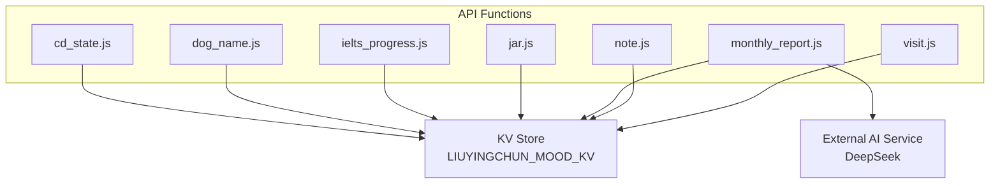
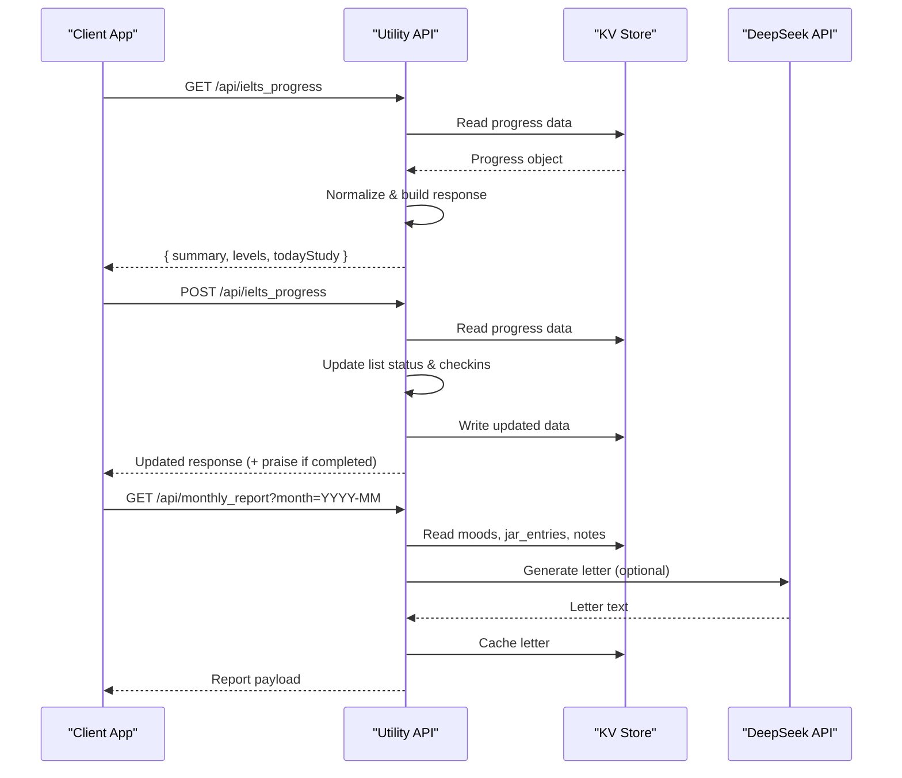
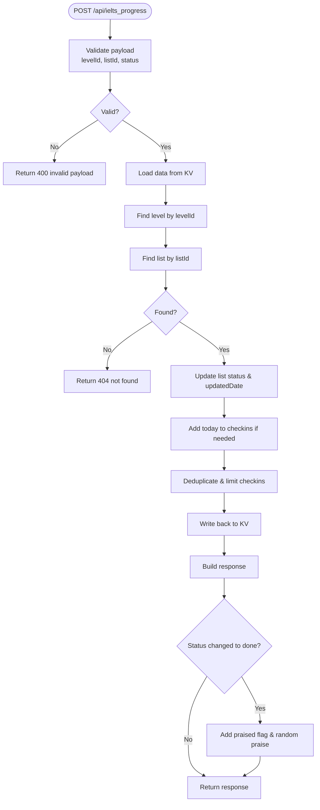
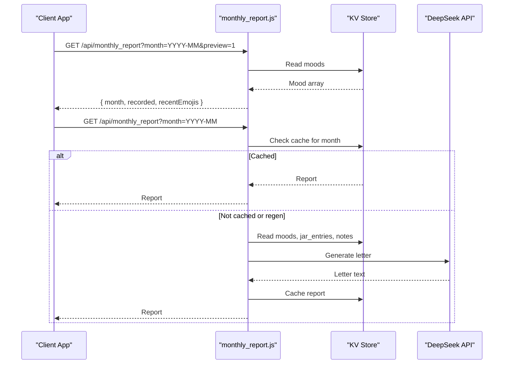
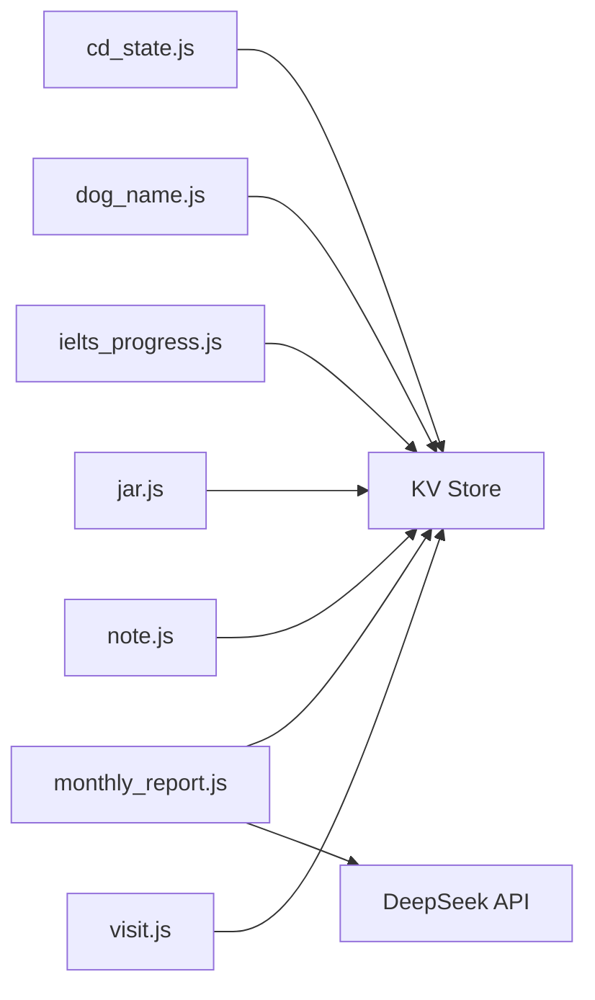

# Utility APIs

<cite>
**Referenced Files in This Document**
- [cd_state.js](file://functions/api/cd_state.js)
- [dog_name.js](file://functions/api/dog_name.js)
- [ielts_progress.js](file://functions/api/ielts_progress.js)
- [jar.js](file://functions/api/jar.js)
- [monthly_report.js](file://functions/api/monthly_report.js)
- [note.js](file://functions/api/note.js)
- [visit.js](file://functions/api/visit.js)
</cite>

## Table of Contents
1. [Introduction](#introduction)
2. [Project Structure](#project-structure)
3. [Core Components](#core-components)
4. [Architecture Overview](#architecture-overview)
5. [Detailed Component Analysis](#detailed-component-analysis)
6. [Dependency Analysis](#dependency-analysis)
7. [Performance Considerations](#performance-considerations)
8. [Troubleshooting Guide](#troubleshooting-guide)
9. [Conclusion](#conclusion)

## Introduction
This document provides comprehensive API documentation for the utility endpoints that power personal tracking and content features:
- CD state management
- Dog name generation
- IELTS progress tracking
- Jar operations (saving short notes or quotes)
- Monthly reports (AI-generated letters based on mood, jar entries, and notes)
- Note management
- Visit tracking

All endpoints are serverless functions that use a key-value store to persist data and return JSON responses with CORS headers enabled. The monthly report endpoint integrates with an external AI service to generate personalized letters.

## Project Structure
The utility endpoints are implemented as individual serverless function files under the API directory. Each file exports request handlers for HTTP methods and uses environment variables for configuration and storage access.

**Diagram sources**
- [cd_state.js:1-28](file://functions/api/cd_state.js#L1-L28)
- [dog_name.js:1-25](file://functions/api/dog_name.js#L1-L25)
- [ielts_progress.js:1-231](file://functions/api/ielts_progress.js#L1-L231)
- [jar.js:1-31](file://functions/api/jar.js#L1-L31)
- [monthly_report.js:1-171](file://functions/api/monthly_report.js#L1-L171)
- [note.js:1-30](file://functions/api/note.js#L1-L30)
- [visit.js:1-49](file://functions/api/visit.js#L1-L49)

**Section sources**
- [cd_state.js:1-28](file://functions/api/cd_state.js#L1-L28)
- [dog_name.js:1-25](file://functions/api/dog_name.js#L1-L25)
- [ielts_progress.js:1-231](file://functions/api/ielts_progress.js#L1-L231)
- [jar.js:1-31](file://functions/api/jar.js#L1-L31)
- [monthly_report.js:1-171](file://functions/api/monthly_report.js#L1-L171)
- [note.js:1-30](file://functions/api/note.js#L1-L30)
- [visit.js:1-49](file://functions/api/visit.js#L1-L49)

## Core Components
Each endpoint is self-contained and follows consistent patterns:
- CORS support via Access-Control-* headers
- Environment-based KV store access using LIUYINGCHUN_MOOD_KV
- Beijing time utilities for date/time formatting
- JSON request/response payloads

Key responsibilities:
- cd_state: Persist and retrieve application-wide CD-related state
- dog_name: Get or set a user’s dog name preference
- ielts_progress: Track study levels and word lists; compute streaks and current item
- jar: Append daily quotes or notes into a “jar” list
- monthly_report: Generate monthly letters by aggregating moods, jar entries, and notes, optionally calling an AI service
- note: Save daily reflection notes with mood and timestamp
- visit: Record anonymous visits with device type and city

**Section sources**
- [cd_state.js:1-28](file://functions/api/cd_state.js#L1-L28)
- [dog_name.js:1-25](file://functions/api/dog_name.js#L1-L25)
- [ielts_progress.js:1-231](file://functions/api/ielts_progress.js#L1-L231)
- [jar.js:1-31](file://functions/api/jar.js#L1-L31)
- [monthly_report.js:1-171](file://functions/api/monthly_report.js#L1-L171)
- [note.js:1-30](file://functions/api/note.js#L1-L30)
- [visit.js:1-49](file://functions/api/visit.js#L1-L49)

## Architecture Overview
The system architecture centers around lightweight serverless endpoints interacting with a key-value store and, for one endpoint, an external AI provider.

**Diagram sources**
- [ielts_progress.js:169-230](file://functions/api/ielts_progress.js#L169-L230)
- [monthly_report.js:30-69](file://functions/api/monthly_report.js#L30-L69)
- [monthly_report.js:71-170](file://functions/api/monthly_report.js#L71-L170)

## Detailed Component Analysis

### CD State Management (/api/cd_state)
Purpose:
- Manage application-wide CD-related state such as dogs count, tokens earned/used, daily date, and flip tokens.

Endpoints:
- OPTIONS: Preflight handling
- GET: Retrieve current state from KV store; returns default state if none exists
- POST: Update state by writing a JSON object to KV store

Request/Response:
- GET Response: JSON object with fields like dogs, tokens_earned, tokens_used, daily_date, flip_tokens
- POST Request: JSON object containing state fields
- POST Response: { ok: true }

Business Logic:
- Default state is applied when no persisted value exists
- All writes replace the entire state object

Integration Patterns:
- Simple CRUD-like pattern over a single KV key
- Consistent CORS headers across all methods

Usage Scenarios:
- Initialize default state on first run
- Persist user preferences or counters between sessions

Common Implementation Patterns:
- Use env.LIUYINGCHUN_MOOD_KV.get/put for persistence
- Return standardized JSON responses with Content-Type and CORS headers

**Section sources**
- [cd_state.js:1-28](file://functions/api/cd_state.js#L1-L28)

### Dog Name Generation (/api/dog_name)
Purpose:
- Provide a persistent dog name preference with a default fallback.

Endpoints:
- OPTIONS: Preflight handling
- GET: Retrieve stored dog name; defaults to a predefined name if missing
- POST: Set or update the dog name

Request/Response:
- GET Response: { name: string }
- POST Request: { name: string }
- POST Response: { ok: true }

Business Logic:
- If no name is stored, a default name is returned
- POST accepts optional name; defaults to the same fallback if omitted

Integration Patterns:
- Single-key KV persistence
- Minimal validation; stores provided value or default

Usage Scenarios:
- Personalize greeting messages with the user’s chosen dog name
- Allow users to change their pet name at any time

Common Implementation Patterns:
- Read/write a single KV key
- Graceful fallback to default values

**Section sources**
- [dog_name.js:1-25](file://functions/api/dog_name.js#L1-L25)

### IELTS Progress Tracking (/api/ielts_progress)
Purpose:
- Track study progress across multiple levels and word lists, compute streaks, and identify the current learning item.

Endpoints:
- OPTIONS: Preflight handling
- GET: Retrieve normalized progress data and computed summaries
- POST: Update a specific list’s status (todo, doing, done)

Data Model:
- Levels: Array of level objects with id, title, total, and lists
- Lists: Array of items with id, title, status, updatedDate
- Checkins: Array of dates indicating study activity
- Summary: Includes totalLists, completedLists, streakDays, currentItem

Request/Response:
- GET Response: { updatedAt, todayStudy, summary, levels[] }
- POST Request: { levelId, listId, status }
- POST Response: Updated response; may include praised flag and praiseMessage when completing a list

Business Logic:
- Normalization ensures schema consistency and merges study dates derived from list updates
- Streak calculation counts consecutive days ending at today or yesterday
- Current item selection prioritizes “doing”, then “todo” within the active level
- Completion triggers optional praise message

Error Handling:
- Invalid payload returns 400
- Missing level or list returns 404

Integration Patterns:
- Complex normalization and aggregation logic
- Persistent KV storage with versioned key
- Optional praise feedback on completion

Usage Scenarios:
- Display current learning item and progress overview
- Track daily study habits and streaks
- Celebrate milestones with praise messages

Common Implementation Patterns:
- Build default data structure and merge saved data
- Compute derived metrics (streak, totals, current item)
- Validate inputs and return structured errors

**Diagram sources**
- [ielts_progress.js:191-230](file://functions/api/ielts_progress.js#L191-L230)

**Section sources**
- [ielts_progress.js:1-231](file://functions/api/ielts_progress.js#L1-L231)

### Jar Operations (/api/jar)
Purpose:
- Append short quotes or notes (“jar entries”) with date and time stamps.

Endpoints:
- OPTIONS: Preflight handling
- POST: Add a new entry to the jar list

Request/Response:
- POST Request: { text: string }
- POST Response: { ok: true }

Business Logic:
- Entries are prepended to the array so newest appears first
- Date and time are recorded in Beijing timezone

Integration Patterns:
- Simple append operation to a KV-stored array
- No read endpoint; consumers can fetch jar entries via other mechanisms or cache locally

Usage Scenarios:
- Capture daily reflections or favorite quotes
- Aggregate personal insights over time

Common Implementation Patterns:
- Parse JSON body
- Prepend new entry with metadata
- Persist entire array back to KV

**Section sources**
- [jar.js:1-31](file://functions/api/jar.js#L1-L31)

### Monthly Reports (/api/monthly_report)
Purpose:
- Generate a monthly letter summarizing mood records, jar entries, and notes, optionally leveraging an AI service.

Endpoints:
- OPTIONS: Preflight handling
- GET: Retrieve or generate monthly report; supports preview mode and regeneration

Query Parameters:
- month: Required, format YYYY-MM
- regen: Optional, set to 1 to bypass cache and regenerate
- preview: Optional, set to 1 to return only mood data without AI generation

Request/Response:
- GET Response: { month, generatedAt, moodData, jarEntries, notes, moodCounts, dominantMood, letter }
- Preview Response: { month, recorded, recentEmojis }

Business Logic:
- Validates month parameter
- Supports preview mode returning aggregated mood data
- Caches generated reports per month
- Aggregates moods, jar entries, and notes for the given month
- Computes mood distribution and dominant mood
- Calls external AI service to generate a letter; falls back to default text on failure

Integration Patterns:
- Reads multiple KV keys: moods, jar_entries, note_* prefixes
- Integrates with DeepSeek API using an environment-provided key
- Caches generated letters per month

Usage Scenarios:
- Generate reflective monthly letters for personal review
- Preview mood statistics before generating full report
- Regenerate letters when underlying data changes

Common Implementation Patterns:
- Query parameters control behavior (preview, regen)
- Robust error handling with fallback content
- Structured aggregation and reporting

**Diagram sources**
- [monthly_report.js:30-69](file://functions/api/monthly_report.js#L30-L69)
- [monthly_report.js:71-170](file://functions/api/monthly_report.js#L71-L170)

**Section sources**
- [monthly_report.js:1-171](file://functions/api/monthly_report.js#L1-L171)

### Note Management (/api/note)
Purpose:
- Save daily reflection notes with associated mood and timestamp.

Endpoints:
- OPTIONS: Preflight handling
- POST: Create a note for the current day

Request/Response:
- POST Request: { text: string, mood: string }
- POST Response: { ok: true }

Business Logic:
- Notes are keyed by date (Beijing timezone)
- Stores text, mood, and time in a single KV entry per day

Integration Patterns:
- Simple write-only endpoint
- Consumers can enumerate notes by prefixing keys

Usage Scenarios:
- Daily journaling with mood tagging
- Aggregation for monthly reports

Common Implementation Patterns:
- Derive date and time from Beijing timezone
- Overwrite previous day’s note if re-submitted

**Section sources**
- [note.js:1-30](file://functions/api/note.js#L1-L30)

### Visit Tracking (/api/visit)
Purpose:
- Record anonymous visits with device type and city information.

Endpoints:
- OPTIONS: Preflight handling
- POST: Log a visit

Request/Response:
- POST Request: Empty body (metadata extracted from headers and request context)
- POST Response: { ok: true }

Business Logic:
- Extracts city from request context (cf.city or cf.region), defaults to unknown
- Parses User-Agent to determine device type (iPhone, iPad, Android, Mac, Windows, Unknown)
- Records time and city per day in a KV array

Integration Patterns:
- Lightweight analytics collection
- Uses Cloudflare request context for geolocation

Usage Scenarios:
- Track daily visit counts and device distribution
- Inform UI or analytics dashboards

Common Implementation Patterns:
- Parse UA with regex heuristics
- Append entries to a daily array in KV

**Section sources**
- [visit.js:1-49](file://functions/api/visit.js#L1-L49)

## Dependency Analysis
Component relationships and dependencies:
- All endpoints depend on the KV store for persistence
- monthly_report depends on external AI service for letter generation
- ielts_progress performs complex normalization and aggregation internally
- Other endpoints are simple CRUD-like operations

**Diagram sources**
- [cd_state.js:1-28](file://functions/api/cd_state.js#L1-L28)
- [dog_name.js:1-25](file://functions/api/dog_name.js#L1-L25)
- [ielts_progress.js:1-231](file://functions/api/ielts_progress.js#L1-L231)
- [jar.js:1-31](file://functions/api/jar.js#L1-L31)
- [monthly_report.js:1-171](file://functions/api/monthly_report.js#L1-L171)
- [note.js:1-30](file://functions/api/note.js#L1-L30)
- [visit.js:1-49](file://functions/api/visit.js#L1-L49)

**Section sources**
- [ielts_progress.js:1-231](file://functions/api/ielts_progress.js#L1-L231)
- [monthly_report.js:1-171](file://functions/api/monthly_report.js#L1-L171)

## Performance Considerations
- KV reads/writes are synchronous in terms of API calls but asynchronous in execution; batch operations where possible
- For ielts_progress, normalization and aggregation occur on each request; consider caching normalized results if traffic increases
- monthly_report invokes an external AI service; enable caching and preview mode to reduce latency and cost
- Avoid large payloads; keep jar entries and notes concise
- Use query parameters (preview, regen) to optimize monthly report generation

[No sources needed since this section provides general guidance]

## Troubleshooting Guide
Common issues and resolutions:
- CORS errors: Ensure requests include proper headers and handle OPTIONS preflight
- Invalid month format: monthly_report requires YYYY-MM; validate client-side
- Missing level or list: ielts_progress POST returns 404 if identifiers do not exist
- External AI failures: monthly_report falls back to default letter; check environment configuration for API key
- Timezone discrepancies: All timestamps use Beijing timezone; ensure client aligns expectations

**Section sources**
- [ielts_progress.js:191-230](file://functions/api/ielts_progress.js#L191-L230)
- [monthly_report.js:30-69](file://functions/api/monthly_report.js#L30-L69)
- [monthly_report.js:136-158](file://functions/api/monthly_report.js#L136-L158)

## Conclusion
These utility endpoints provide a cohesive set of tools for personal tracking, reflection, and content generation. They follow consistent patterns for CORS, KV persistence, and JSON payloads, while offering advanced features like streak computation and AI-generated letters. By leveraging preview modes, caching, and robust error handling, clients can integrate these APIs reliably and efficiently.

[No sources needed since this section summarizes without analyzing specific files]