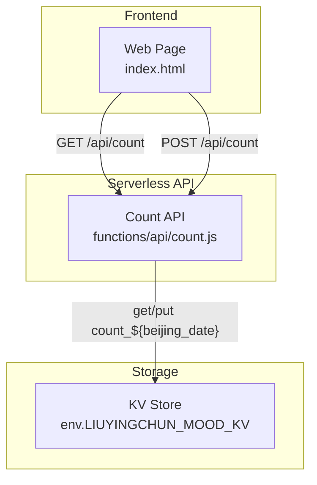
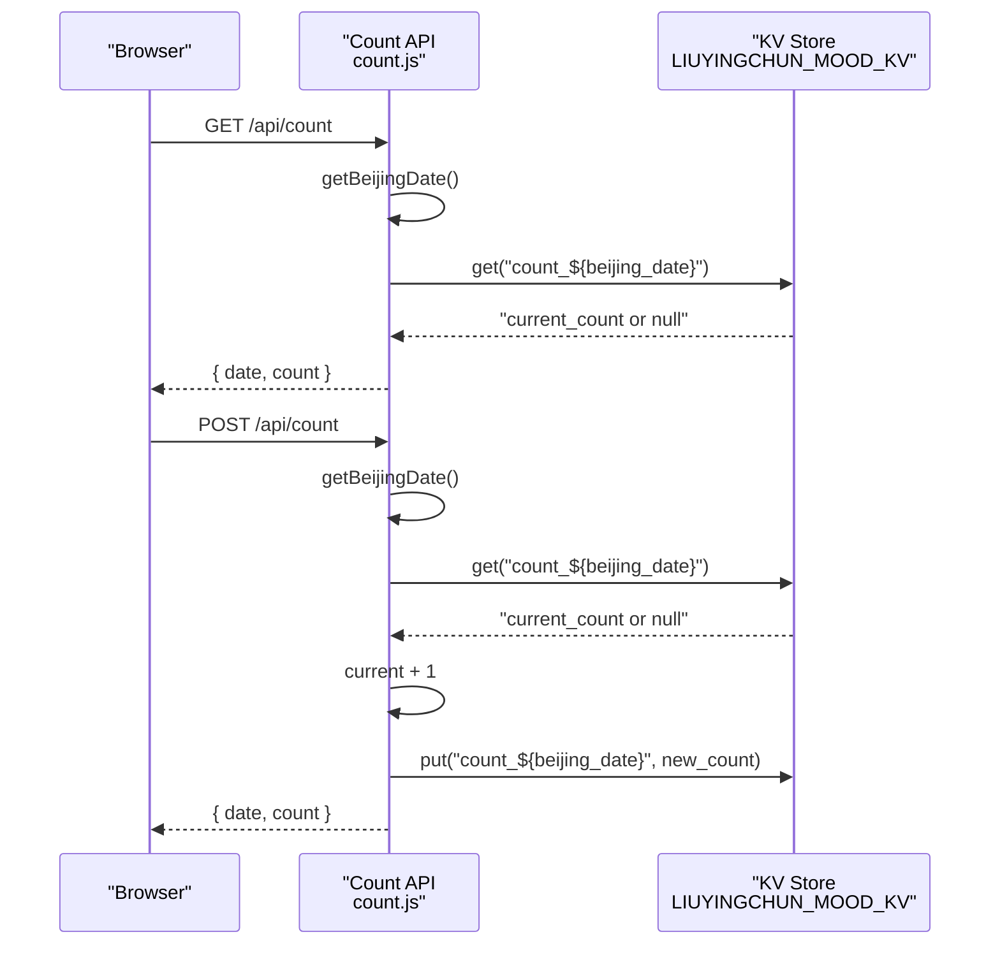
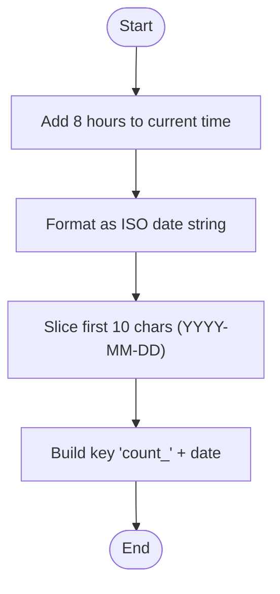
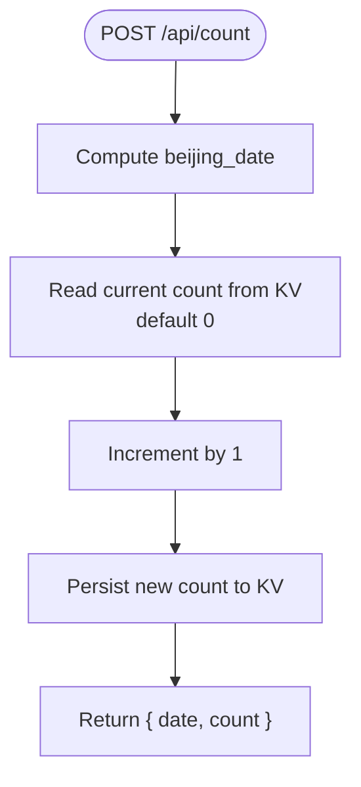
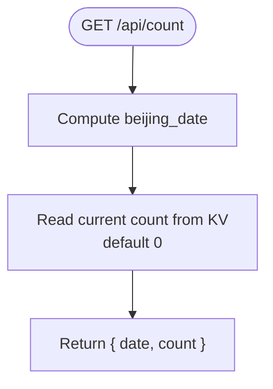
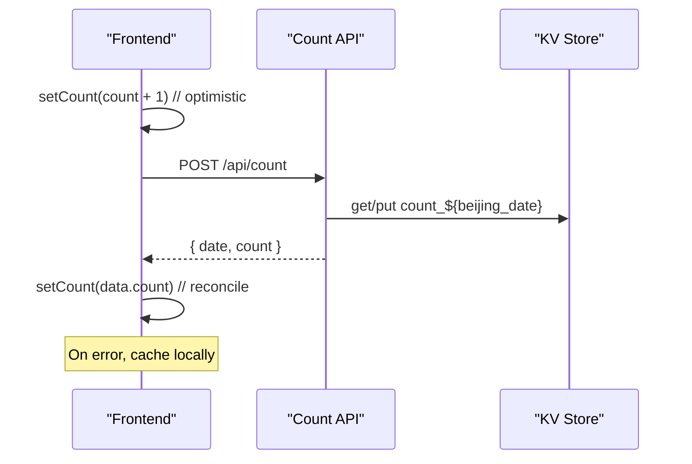
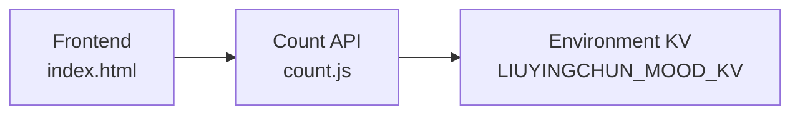

# Counter Data Model

<cite>
**Referenced Files in This Document**   
- [count.js](file://functions/api/count.js)
- [index.html](file://index.html)
</cite>

## Table of Contents
1. [Introduction](#introduction)
2. [Project Structure](#project-structure)
3. [Core Components](#core-components)
4. [Architecture Overview](#architecture-overview)
5. [Detailed Component Analysis](#detailed-component-analysis)
6. [Dependency Analysis](#dependency-analysis)
7. [Performance Considerations](#performance-considerations)
8. [Troubleshooting Guide](#troubleshooting-guide)
9. [Conclusion](#conclusion)

## Introduction
This document describes the data model and behavior of the interaction counter system used to track daily counts. The system:
- Generates a date-based key using Beijing time (UTC+8).
- Stores a simple integer value per day under a predictable key pattern.
- Supports increment operations via an HTTP POST endpoint and read operations via GET.
- Persists values in a KV store exposed through an environment variable.

The design ensures that each calendar day in Beijing time has its own isolated counter, preventing cross-day conflicts.

## Project Structure
The counter functionality is implemented as a serverless API function and consumed by the frontend.

**Diagram sources**
- [count.js:16-31](file://functions/api/count.js#L16-L31)
- [index.html:2650-2663](file://index.html#L2650-L2663)

**Section sources**
- [count.js:1-33](file://functions/api/count.js#L1-L33)
- [index.html:2650-2663](file://index.html#L2650-L2663)

## Core Components
- Key generation strategy:
  - Uses Beijing timezone (UTC+8) to compute the current date string.
  - Produces keys in the format `count_${beijing_date}` where `${beijing_date}` is a YYYY-MM-DD string.
- Counter value structure:
  - A single integer stored as a string in KV.
- Operations:
  - Read: GET returns the current count for today’s Beijing date.
  - Increment: POST reads the current value, increments by one, and persists it back.

Key behaviors:
- Date isolation: Each day gets its own key, so counters do not conflict across dates.
- Default value: If no entry exists, the count defaults to zero.
- Timezone alignment: All date computations use UTC+8 to ensure consistent daily boundaries.

**Section sources**
- [count.js:7-10](file://functions/api/count.js#L7-L10)
- [count.js:16-31](file://functions/api/count.js#L16-L31)

## Architecture Overview
The counter system follows a simple request-response flow with optimistic UI updates on the client side.

**Diagram sources**
- [count.js:16-31](file://functions/api/count.js#L16-L31)
- [index.html:2650-2663](file://index.html#L2650-L2663)

## Detailed Component Analysis

### Key Generation Strategy
- Purpose: Ensure daily isolation and deterministic key naming.
- Method:
  - Compute current time in UTC+8.
  - Format as YYYY-MM-DD.
  - Prepend with `count_` to form the final key.
- Result: Keys like `count_YYYY-MM-DD`, unique per day in Beijing time.

**Diagram sources**
- [count.js:7-10](file://functions/api/count.js#L7-L10)

**Section sources**
- [count.js:7-10](file://functions/api/count.js#L7-L10)

### Counter Value Structure
- Type: Integer represented as a string in KV.
- Default: Zero when absent.
- Update: Incremented by one on each successful POST.

**Section sources**
- [count.js:18-28](file://functions/api/count.js#L18-L28)

### Increment Operation Flow
- Steps:
  - Compute today’s Beijing date.
  - Retrieve current count from KV; default to zero if missing.
  - Increment by one.
  - Persist the new count under the same key.
  - Return the updated count and date.

**Diagram sources**
- [count.js:24-31](file://functions/api/count.js#L24-L31)

**Section sources**
- [count.js:24-31](file://functions/api/count.js#L24-L31)

### Read Operation Flow
- Steps:
  - Compute today’s Beijing date.
  - Retrieve current count from KV; default to zero if missing.
  - Return the count and date.

**Diagram sources**
- [count.js:16-22](file://functions/api/count.js#L16-L22)

**Section sources**
- [count.js:16-22](file://functions/api/count.js#L16-L22)

### Frontend Interaction and Optimistic Updates
- Behavior:
  - Immediately update local UI state (optimistic update).
  - Send POST to server to persist increment.
  - On success, reconcile with server response.
  - On failure, cache locally for later sync.

**Diagram sources**
- [index.html:2650-2663](file://index.html#L2650-L2663)
- [count.js:24-31](file://functions/api/count.js#L24-L31)

**Section sources**
- [index.html:2650-2663](file://index.html#L2650-L2663)

### Concurrency Handling
- Current implementation:
  - No explicit locking or atomic increment at the application level.
  - Each POST performs a read-modify-write sequence against KV.
- Implications:
  - Concurrent POSTs may interleave, potentially causing lost updates.
  - For high-concurrency scenarios, consider atomic increment APIs or transactional patterns provided by the storage layer.

[No sources needed since this section provides general guidance]

### Caching and Optimization Strategies
- Server-side caching:
  - None implemented in the counter API itself.
- Client-side caching:
  - Optimistic UI updates improve perceived performance.
  - Local fallback on network errors helps resilience.

[No sources needed since this section provides general guidance]

## Dependency Analysis
- The counter API depends on:
  - Environment-provided KV store (`LIUYINGCHUN_MOOD_KV`).
  - JavaScript Date utilities for timezone conversion.
- The frontend depends on:
  - The `/api/count` endpoints for reading and incrementing.
  - Local storage for offline resilience.

**Diagram sources**
- [count.js:16-31](file://functions/api/count.js#L16-L31)
- [index.html:2650-2663](file://index.html#L2650-L2663)

**Section sources**
- [count.js:16-31](file://functions/api/count.js#L16-L31)
- [index.html:2650-2663](file://index.html#L2650-L2663)

## Performance Considerations
- Key design:
  - Simple string keys enable O(1) lookups in KV.
- Latency:
  - Network round-trips dominate latency; optimistic UI reduces perceived delay.
- Scalability:
  - Daily partitioning avoids large monolithic values.
  - Consider batching or idempotent operations if concurrency increases.

[No sources needed since this section provides general guidance]

## Troubleshooting Guide
- Incorrect date boundary:
  - Verify that the server computes Beijing time correctly before generating keys.
- Missing initial value:
  - If KV does not contain a key, the count should default to zero.
- Lost updates due to concurrency:
  - Monitor for inconsistent counts under heavy concurrent writes.
  - Evaluate atomic increment features of the KV provider if available.
- CORS issues:
  - Ensure OPTIONS preflight responses are handled by the API.

**Section sources**
- [count.js:1-14](file://functions/api/count.js#L1-L14)

## Conclusion
The counter data model uses a straightforward, date-partitioned key scheme aligned with Beijing time to isolate daily counts. It supports basic read and increment operations with optimistic UI updates on the client. While simple and effective for low-to-moderate traffic, additional measures such as atomic increments or transactions may be necessary to guarantee consistency under high concurrency.