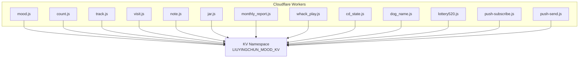
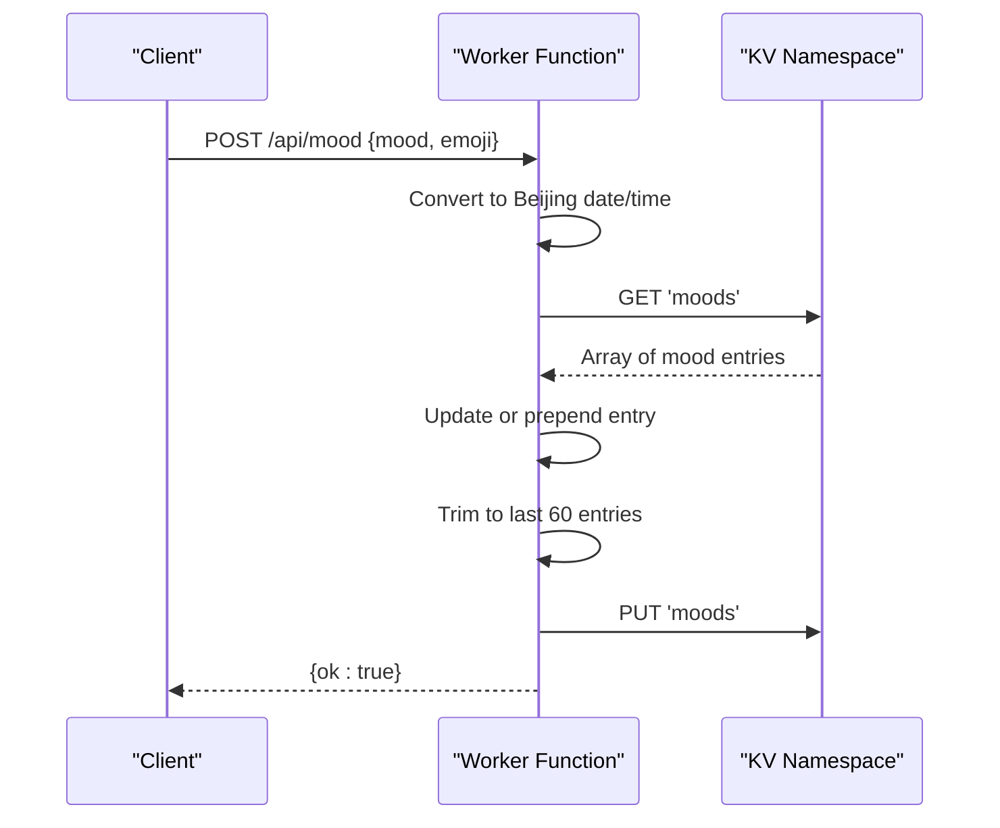
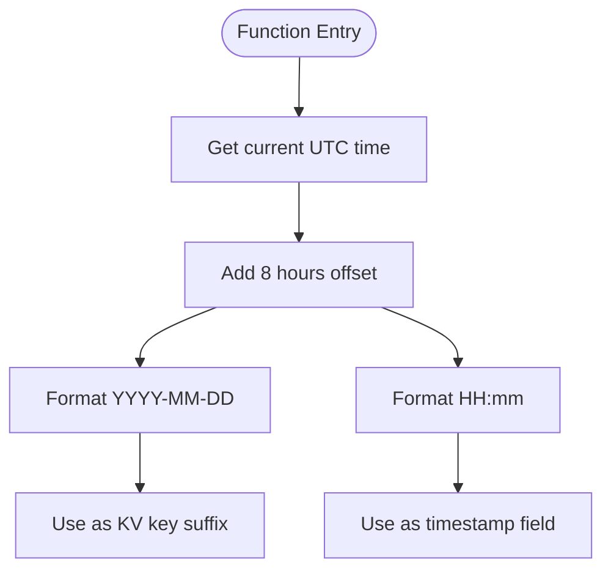
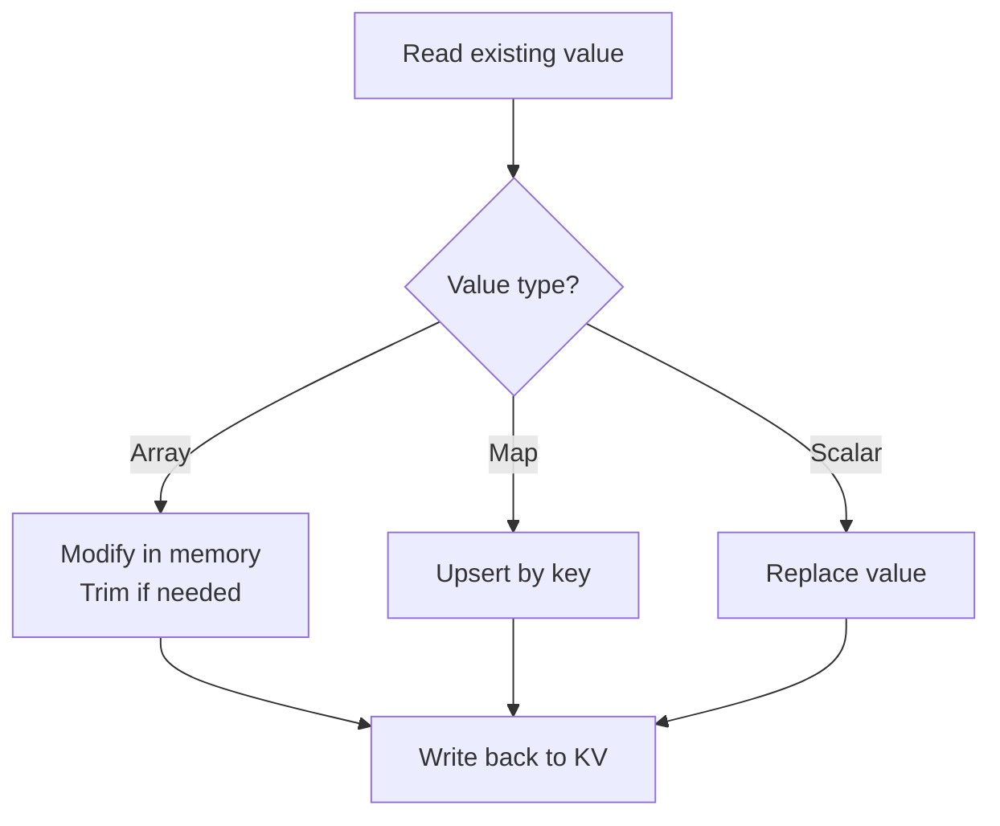
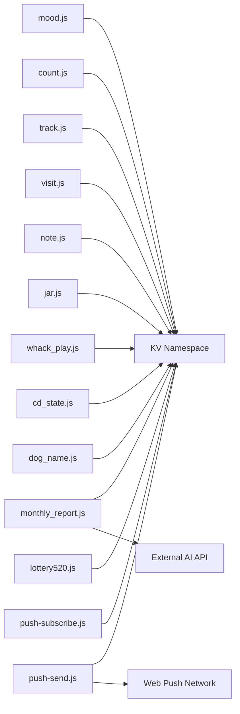
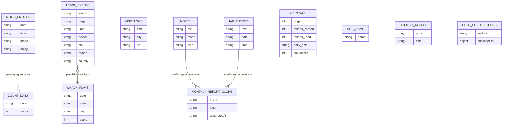

# Data Management

<cite>
**Referenced Files in This Document**
- [mood.js](file://functions/api/mood.js)
- [count.js](file://functions/api/count.js)
- [track.js](file://functions/api/track.js)
- [visit.js](file://functions/api/visit.js)
- [note.js](file://functions/api/note.js)
- [jar.js](file://functions/api/jar.js)
- [monthly_report.js](file://functions/api/monthly_report.js)
- [whack_play.js](file://functions/api/whack_play.js)
- [cd_state.js](file://functions/api/cd_state.js)
- [dog_name.js](file://functions/api/dog_name.js)
- [lottery520.js](file://functions/api/lottery520.js)
- [push-subscribe.js](file://functions/api/push-subscribe.js)
- [push-send.js](file://functions/api/push-send.js)
</cite>

## Table of Contents
1. [Introduction](#introduction)
2. [Project Structure](#project-structure)
3. [Core Components](#core-components)
4. [Architecture Overview](#architecture-overview)
5. [Detailed Component Analysis](#detailed-component-analysis)
6. [Dependency Analysis](#dependency-analysis)
7. [Performance Considerations](#performance-considerations)
8. [Troubleshooting Guide](#troubleshooting-guide)
9. [Conclusion](#conclusion)
10. [Appendices](#appendices)

## Introduction
This document describes the data persistence layer built on Cloudflare KV Storage for the application. It focuses on three primary domains:
- Mood entries and daily counters
- User tracking events and visit logs
- Supporting datasets (notes, jar entries, game states, push subscriptions, etc.)

It explains entity relationships, field definitions, validation rules, timezone handling using Beijing time conversion, date-based key patterns, data access patterns, caching strategies, performance considerations, lifecycle management (retention and archival), and security and privacy controls.

## Project Structure
The persistence layer is implemented as a set of serverless functions under functions/api/. Each function exposes HTTP endpoints that read from or write to a single KV namespace named LIUYINGCHUN_MOOD_KV. The data model is organized by logical entities stored as JSON values or date-prefixed keys.

**Diagram sources**
- [mood.js:19-43](file://functions/api/mood.js#L19-L43)
- [count.js:16-32](file://functions/api/count.js#L16-L32)
- [track.js:11-43](file://functions/api/track.js#L11-L43)
- [visit.js:33-48](file://functions/api/visit.js#L33-L48)
- [note.js:21-29](file://functions/api/note.js#L21-L29)
- [jar.js:21-30](file://functions/api/jar.js#L21-L30)
- [monthly_report.js:30-69](file://functions/api/monthly_report.js#L30-L69)
- [whack_play.js:21-43](file://functions/api/whack_play.js#L21-L43)
- [cd_state.js:13-26](file://functions/api/cd_state.js#L13-L26)
- [dog_name.js:11-23](file://functions/api/dog_name.js#L11-L23)
- [lottery520.js:19-41](file://functions/api/lottery520.js#L19-L41)
- [push-subscribe.js:11-22](file://functions/api/push-subscribe.js#L11-L22)
- [push-send.js:112-154](file://functions/api/push-send.js#L112-L154)

**Section sources**
- [mood.js:1-44](file://functions/api/mood.js#L1-L44)
- [count.js:1-33](file://functions/api/count.js#L1-L33)
- [track.js:1-44](file://functions/api/track.js#L1-L44)
- [visit.js:1-49](file://functions/api/visit.js#L1-L49)
- [note.js:1-30](file://functions/api/note.js#L1-L30)
- [jar.js:1-31](file://functions/api/jar.js#L1-L31)
- [monthly_report.js:1-171](file://functions/api/monthly_report.js#L1-L171)
- [whack_play.js:1-44](file://functions/api/whack_play.js#L1-L44)
- [cd_state.js:1-27](file://functions/api/cd_state.js#L1-L27)
- [dog_name.js:1-24](file://functions/api/dog_name.js#L1-L24)
- [lottery520.js:1-43](file://functions/api/lottery520.js#L1-L43)
- [push-subscribe.js:1-23](file://functions/api/push-subscribe.js#L1-L23)
- [push-send.js:1-155](file://functions/api/push-send.js#L1-L155)

## Core Components
This section defines the core data models used across the application. All values are persisted as JSON strings in the LIUYINGCHUN_MOOD_KV namespace.

### Mood Entries
- Purpose: Track daily mood records with emoji and timestamp.
- Key: moods
- Value type: Array of mood entry objects
- Entry fields:
  - date: string (YYYY-MM-DD, Beijing time)
  - time: string (HH:mm, Beijing time)
  - mood: string (one of predefined categories)
  - emoji: string (emoji representation)
- Validation rules:
  - date must be a valid YYYY-MM-DD string
  - time must be HH:mm format
  - mood should be one of the supported categories
  - emoji should be a non-empty string
- Retention policy: Keep only the most recent 60 entries (days).

**Section sources**
- [mood.js:7-13](file://functions/api/mood.js#L7-L13)
- [mood.js:19-43](file://functions/api/mood.js#L19-L43)

### Interaction Counters
- Purpose: Count daily interactions (e.g., number of mood submissions per day).
- Key pattern: count_{YYYY-MM-DD}
- Value type: String-encoded integer
- Behavior:
  - GET returns current count for today (Beijing date)
  - POST increments the counter by one and persists it
- Validation rules:
  - Key suffix must match YYYY-MM-DD
  - Value must be parseable as an integer

**Section sources**
- [count.js:7-10](file://functions/api/count.js#L7-L10)
- [count.js:16-32](file://functions/api/count.js#L16-L32)

### User Tracking Events
- Purpose: Record user interaction events with device and location metadata.
- Key: track_events
- Value type: Array of event objects
- Event fields:
  - event: string (event name)
  - page: string (page identifier; defaults to index)
  - time: string (Beijing datetime formatted as "YYYY-MM-DD HH:mm:ss")
  - device: string ("mobile" or "desktop")
  - city: string (from Cloudflare request.cf.city or fallback)
  - region: string (from Cloudflare request.cf.region)
  - country: string (from Cloudflare request.cf.country)
- Retention policy: Keep at most 2000 entries; drop oldest when exceeded.

**Section sources**
- [track.js:11-43](file://functions/api/track.js#L11-L43)

### Visit Logs
- Purpose: Log visits per day with time, city, and user agent.
- Key pattern: visit_{YYYY-MM-DD}
- Value type: Array of visit entry objects
- Entry fields:
  - time: string (HH:mm, Beijing time)
  - city: string (from Cloudflare cf.city or cf.region or fallback)
  - ua: string (parsed device/platform label)
- Behavior: Append new visit entries per day.

**Section sources**
- [visit.js:7-15](file://functions/api/visit.js#L7-L15)
- [visit.js:17-27](file://functions/api/visit.js#L17-L27)
- [visit.js:33-48](file://functions/api/visit.js#L33-L48)

### Notes
- Purpose: Store daily reflection notes with optional mood tag.
- Key pattern: note_{YYYY-MM-DD}
- Value type: Object
- Fields:
  - text: string (note content)
  - mood: string (optional mood tag)
  - time: string (HH:mm, Beijing time)
- Behavior: One note per day; overwrites previous note for the same date.

**Section sources**
- [note.js:7-15](file://functions/api/note.js#L7-L15)
- [note.js:21-29](file://functions/api/note.js#L21-L29)

### Jar Entries
- Purpose: Collect saved quotes or messages with timestamps.
- Key: jar_entries
- Value type: Array of entry objects
- Entry fields:
  - text: string (message content)
  - date: string (YYYY-MM-DD, Beijing time)
  - time: string (HH:mm, Beijing time)
- Behavior: Prepend new entries to the array.

**Section sources**
- [jar.js:7-15](file://functions/api/jar.js#L7-L15)
- [jar.js:21-30](file://functions/api/jar.js#L21-L30)

### Monthly Report Cache
- Purpose: Cache generated monthly reports keyed by month.
- Key pattern: monthly_report:{YYYY-MM}
- Value type: Object containing report metadata and generated letter
- Behavior:
  - GET checks cache first; if missing, generates report and caches it
  - Supports preview mode returning summary without AI generation
  - Supports regeneration via query parameter

**Section sources**
- [monthly_report.js:30-69](file://functions/api/monthly_report.js#L30-L69)
- [monthly_report.js:71-170](file://functions/api/monthly_report.js#L71-L170)

### Game and Utility States
- whack_plays: Array of play records with date, time, city, score
- cd_state: Object representing game state counters and daily date
- dog_name: Simple string value for pet name
- lottery520_result: Single record object storing prize and time

**Section sources**
- [whack_play.js:7-15](file://functions/api/whack_play.js#L7-L15)
- [whack_play.js:21-43](file://functions/api/whack_play.js#L21-L43)
- [cd_state.js:7-26](file://functions/api/cd_state.js#L7-L26)
- [dog_name.js:11-23](file://functions/api/dog_name.js#L11-L23)
- [lottery520.js:9-12](file://functions/api/lottery520.js#L9-L12)
- [lottery520.js:19-41](file://functions/api/lottery520.js#L19-L41)

### Push Subscriptions
- push_subscriptions: Map of endpoint -> subscription object
- Behavior:
  - Subscribe: Upsert subscription by endpoint
  - Send: Retrieve all subscriptions and send encrypted Web Push messages

**Section sources**
- [push-subscribe.js:11-22](file://functions/api/push-subscribe.js#L11-L22)
- [push-send.js:112-154](file://functions/api/push-send.js#L112-L154)

## Architecture Overview
The system uses Cloudflare Workers to expose REST-like endpoints. Each endpoint reads/writes to the shared KV namespace LIUYINGCHUN_MOOD_KV. Timezone handling consistently converts UTC to Beijing time before generating keys and timestamps.

**Diagram sources**
- [mood.js:26-43](file://functions/api/mood.js#L26-L43)

## Detailed Component Analysis

### Timezone Handling Strategy
- All date/time computations convert UTC to Beijing time by adding 8 hours.
- Date formatting produces:
  - date: YYYY-MM-DD
  - time: HH:mm
  - full datetime: "YYYY-MM-DD HH:mm:ss"
- This ensures consistent keying and sorting across regions.

**Diagram sources**
- [mood.js:7-13](file://functions/api/mood.js#L7-L13)
- [count.js:7-10](file://functions/api/count.js#L7-L10)
- [visit.js:7-15](file://functions/api/visit.js#L7-L15)
- [note.js:7-15](file://functions/api/note.js#L7-L15)
- [jar.js:7-15](file://functions/api/jar.js#L7-L15)
- [whack_play.js:7-15](file://functions/api/whack_play.js#L7-L15)
- [lottery520.js:9-12](file://functions/api/lottery520.js#L9-L12)
- [track.js:24-24](file://functions/api/track.js#L24-L24)

**Section sources**
- [mood.js:7-13](file://functions/api/mood.js#L7-L13)
- [count.js:7-10](file://functions/api/count.js#L7-L10)
- [visit.js:7-15](file://functions/api/visit.js#L7-L15)
- [note.js:7-15](file://functions/api/note.js#L7-L15)
- [jar.js:7-15](file://functions/api/jar.js#L7-L15)
- [whack_play.js:7-15](file://functions/api/whack_play.js#L7-L15)
- [lottery520.js:9-12](file://functions/api/lottery520.js#L9-L12)
- [track.js:24-24](file://functions/api/track.js#L24-L24)

### Data Access Patterns
- Arrays:
  - moods: Read entire array, update in memory, trim, then write back
  - track_events: Append and trim to fixed size
  - jar_entries: Prepend new entries
  - whack_plays: Append new play records
- Maps:
  - push_subscriptions: Upsert by endpoint key
- Scalars:
  - count_{date}: Integer string increment
  - note_{date}: Overwrite daily note
  - cd_state, dog_name, lottery520_result: Full object/string replacement

**Diagram sources**
- [mood.js:30-39](file://functions/api/mood.js#L30-L39)
- [track.js:28-33](file://functions/api/track.js#L28-L33)
- [jar.js:23-26](file://functions/api/jar.js#L23-L26)
- [whack_play.js:35-38](file://functions/api/whack_play.js#L35-L38)
- [push-subscribe.js:16-20](file://functions/api/push-subscribe.js#L16-L20)
- [count.js:24-28](file://functions/api/count.js#L24-L28)
- [note.js:21-25](file://functions/api/note.js#L21-L25)

**Section sources**
- [mood.js:30-39](file://functions/api/mood.js#L30-L39)
- [track.js:28-33](file://functions/api/track.js#L28-L33)
- [jar.js:23-26](file://functions/api/jar.js#L23-L26)
- [whack_play.js:35-38](file://functions/api/whack_play.js#L35-L38)
- [push-subscribe.js:16-20](file://functions/api/push-subscribe.js#L16-L20)
- [count.js:24-28](file://functions/api/count.js#L24-L28)
- [note.js:21-25](file://functions/api/note.js#L21-L25)

### Caching Strategies
- Monthly report cache:
  - Key: monthly_report:{YYYY-MM}
  - GET checks cache; if present, return immediately
  - If missing, generate report and store result
  - Supports preview mode to bypass AI generation
- Other data:
  - No explicit in-memory caching beyond KV’s own behavior
  - Daily counters and arrays are read-modify-write on each request

**Section sources**
- [monthly_report.js:30-69](file://functions/api/monthly_report.js#L30-L69)

### Error Handling
- Track events:
  - Try-catch around processing; returns {ok: false} on error
- Push send:
  - Validates secret; returns unauthorized if invalid
  - Returns not found if no subscriptions exist
  - Aggregates results and counts failures
- General:
  - Many endpoints return minimal success responses; consider adding input validation errors

**Section sources**
- [track.js:38-43](file://functions/api/track.js#L38-L43)
- [push-send.js:112-154](file://functions/api/push-send.js#L112-L154)

## Dependency Analysis
All endpoints depend on a single KV namespace LIUYINGCHUN_MOOD_KV. Some endpoints also rely on external services:
- Monthly report generation calls an external AI API using an environment-provided key.
- Push sending uses Web Push protocol with VAPID and encryption helpers.

**Diagram sources**
- [monthly_report.js:136-158](file://functions/api/monthly_report.js#L136-L158)
- [push-send.js:112-154](file://functions/api/push-send.js#L112-L154)

**Section sources**
- [monthly_report.js:136-158](file://functions/api/monthly_report.js#L136-L158)
- [push-send.js:112-154](file://functions/api/push-send.js#L112-L154)

## Performance Considerations
- KV operations:
  - Read-modify-write patterns on arrays cause O(n) scans and full rewrites
  - Trimming large arrays (e.g., track_events up to 2000) reduces growth but still incurs cost
- Optimization opportunities:
  - Batch writes where possible
  - Use smaller, more granular keys to reduce payload sizes
  - Consider pagination for large arrays (e.g., track_events)
- Concurrency:
  - KV provides eventual consistency; concurrent updates may overwrite changes
  - For counters, consider atomic operations if available or implement optimistic locking
- External dependencies:
  - Monthly report generation involves network calls; cache aggressively and support preview mode

[No sources needed since this section provides general guidance]

## Troubleshooting Guide
- Invalid inputs:
  - Ensure mood and emoji are provided for mood entries
  - Validate month format for monthly report queries
- Timezone issues:
  - Verify that client sends requests in expected timezone or server-side conversion is applied
- Data retention:
  - Check trimming logic for moods (60 entries) and track_events (2000 entries)
- Push notifications:
  - Confirm PUSH_SECRET and VAPID keys are configured
  - Validate subscription endpoint presence

**Section sources**
- [monthly_report.js:30-39](file://functions/api/monthly_report.js#L30-L39)
- [push-send.js:112-154](file://functions/api/push-send.js#L112-L154)

## Conclusion
The application’s data persistence layer leverages Cloudflare KV Storage with consistent Beijing time handling and date-based key patterns. Core entities include mood entries, daily counters, tracking events, visit logs, notes, jar entries, and auxiliary states. Retention policies cap array sizes to control storage growth. Caching is primarily applied to monthly reports. Security includes secret-based authorization for push sending and careful handling of user metadata. Future improvements can introduce stronger validation, concurrency safeguards, and pagination for large datasets.

[No sources needed since this section summarizes without analyzing specific files]

## Appendices

### Entity Relationship Diagram

**Diagram sources**
- [mood.js:26-43](file://functions/api/mood.js#L26-L43)
- [count.js:16-32](file://functions/api/count.js#L16-L32)
- [track.js:11-43](file://functions/api/track.js#L11-L43)
- [visit.js:33-48](file://functions/api/visit.js#L33-L48)
- [note.js:21-29](file://functions/api/note.js#L21-L29)
- [jar.js:21-30](file://functions/api/jar.js#L21-L30)
- [monthly_report.js:71-170](file://functions/api/monthly_report.js#L71-L170)
- [whack_play.js:21-43](file://functions/api/whack_play.js#L21-L43)
- [cd_state.js:13-26](file://functions/api/cd_state.js#L13-L26)
- [dog_name.js:11-23](file://functions/api/dog_name.js#L11-L23)
- [lottery520.js:19-41](file://functions/api/lottery520.js#L19-L41)
- [push-subscribe.js:11-22](file://functions/api/push-subscribe.js#L11-L22)