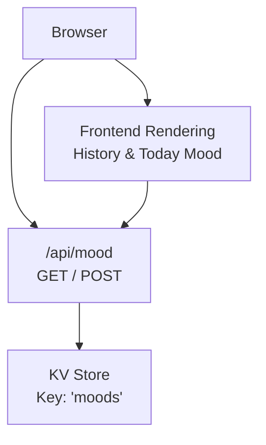
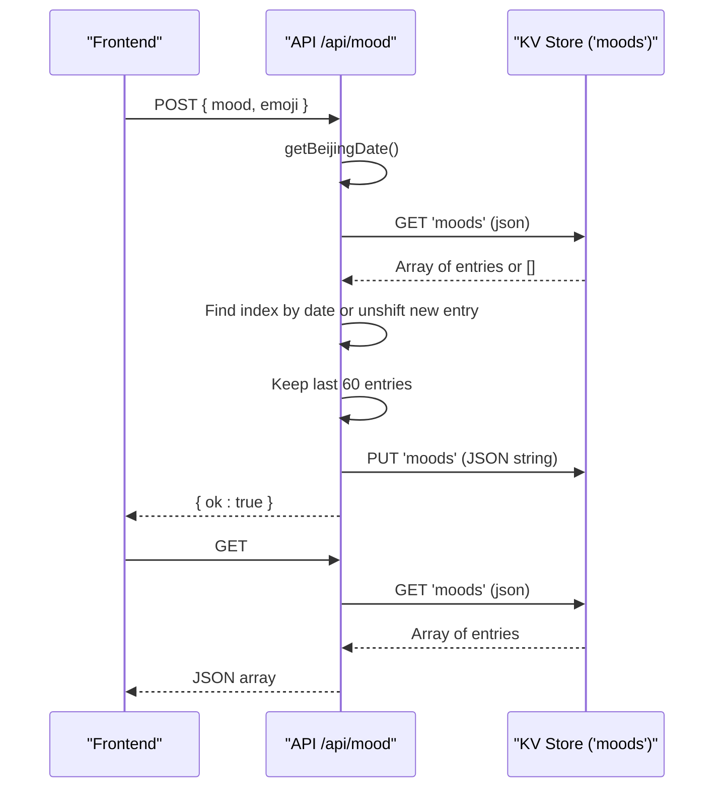
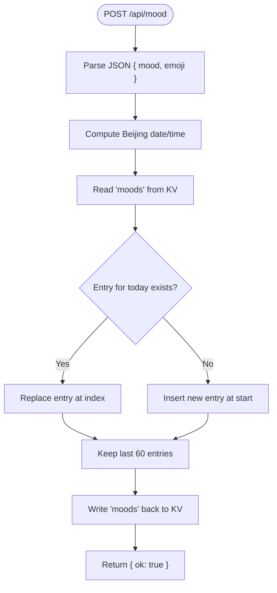
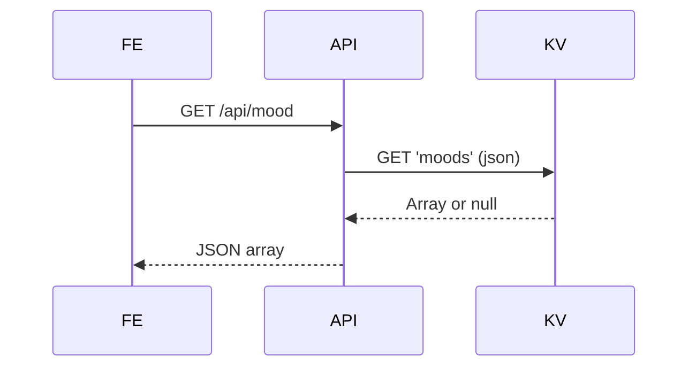
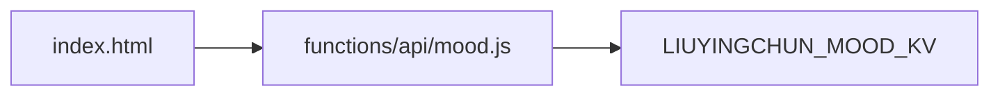

# Mood Data Model

<cite>
**Referenced Files in This Document**
- [mood.js](file://functions/api/mood.js)
- [index.html](file://index.html)
</cite>

## Table of Contents
1. [Introduction](#introduction)
2. [Project Structure](#project-structure)
3. [Core Components](#core-components)
4. [Architecture Overview](#architecture-overview)
5. [Detailed Component Analysis](#detailed-component-analysis)
6. [Dependency Analysis](#dependency-analysis)
7. [Performance Considerations](#performance-considerations)
8. [Troubleshooting Guide](#troubleshooting-guide)
9. [Conclusion](#conclusion)

## Introduction
This document describes the data model and behavior for the mood tracking system. It explains the schema of a mood entry, how Beijing timezone is enforced to ensure consistent date/time storage across users, the KV storage key structure and array-based organization, CRUD operations (GET/POST), the 60-day retention policy, data access patterns, error handling, and performance considerations.

## Project Structure
The mood feature is implemented as a serverless API endpoint that reads/writes to a KV store under a single key. The frontend fetches and renders the mood history and updates UI based on today’s mood.

**Diagram sources**
- [mood.js:19-43](file://functions/api/mood.js#L19-L43)
- [index.html:3828-3868](file://index.html#L3828-L3868)

**Section sources**
- [mood.js:1-43](file://functions/api/mood.js#L1-L43)
- [index.html:3828-3868](file://index.html#L3828-L3868)

## Core Components
- API Endpoint: Provides GET to retrieve all moods and POST to create/update today’s mood.
- Timezone Handling: Uses a function to compute current Beijing time and format date/time consistently.
- Storage: A single KV key "moods" stores an array of mood entries.
- Retention Policy: Keeps only the most recent 60 entries (days).
- Frontend Integration: Fetches moods, finds today’s entry, and renders history limited to 60 items.

**Section sources**
- [mood.js:7-13](file://functions/api/mood.js#L7-L13)
- [mood.js:19-43](file://functions/api/mood.js#L19-L43)
- [index.html:3828-3868](file://index.html#L3828-L3868)

## Architecture Overview
The system follows a simple request/response pattern with a single KV-backed array. All timestamps are normalized to Beijing time at write time so that clients in any timezone see consistent dates.

**Diagram sources**
- [mood.js:19-43](file://functions/api/mood.js#L19-L43)

## Detailed Component Analysis

### Mood Entry Schema
A mood entry is a JSON object stored within the array under the KV key "moods". Each entry contains:
- date: String in YYYY-MM-DD format representing the day in Beijing time.
- time: String in HH:mm format representing the time in Beijing time.
- mood: String describing the user’s mood.
- emoji: Optional string containing an emoji representation of the mood.

Validation rules inferred from implementation and usage:
- date must match the current Beijing date at write time; entries for the same date are updated rather than duplicated.
- time is derived from the current Beijing time at write time.
- mood is required for a valid entry.
- emoji is optional; if missing, the frontend falls back to a default emoji when rendering.

Example entry shape:
- { date: "YYYY-MM-DD", time: "HH:mm", mood: "<string>", emoji: "<optional emoji>" }

**Section sources**
- [mood.js:26-35](file://functions/api/mood.js#L26-L35)
- [index.html:3852-3867](file://index.html#L3852-L3867)

### Beijing Timezone Handling
- The function computes current time by adding 8 hours offset to UTC and formats it into:
  - date: first 10 characters of ISO string (YYYY-MM-DD)
  - time: minutes portion starting at index 11 (HH:mm)
- This ensures all stored dates/times reflect Beijing time regardless of client timezone.

Behavior details:
- On POST, both date and time are generated server-side using this function.
- On GET, the frontend also uses the same offset to determine “today” for display logic.

**Section sources**
- [mood.js:7-13](file://functions/api/mood.js#L7-L13)
- [index.html:3832-3833](file://index.html#L3832-L3833)

### KV Storage Key Structure and Array Organization
- Key: "moods"
- Value: JSON array of mood entries
- Organization:
  - New entries are inserted at the beginning of the array (most recent first).
  - If an entry already exists for the same date, it is replaced in place.
  - After insertion/replacement, the array is truncated to keep only the most recent 60 entries.

Access patterns:
- GET returns the entire array.
- POST reads the array, modifies it, then writes it back.

**Section sources**
- [mood.js:19-24](file://functions/api/mood.js#L19-L24)
- [mood.js:26-43](file://functions/api/mood.js#L26-L43)

### CRUD Operations

#### POST /api/mood
- Purpose: Create or update today’s mood entry.
- Input: JSON body with fields mood and emoji.
- Processing:
  - Compute Beijing date/time.
  - Read existing array from KV.
  - If an entry for today exists, replace it; otherwise insert at the front.
  - Truncate to 60 entries.
  - Write back to KV.
- Output: { ok: true }

**Diagram sources**
- [mood.js:26-43](file://functions/api/mood.js#L26-L43)

**Section sources**
- [mood.js:26-43](file://functions/api/mood.js#L26-L43)

#### GET /api/mood
- Purpose: Retrieve all mood entries.
- Processing:
  - Read "moods" from KV as JSON; default to empty array if not present.
  - Return the array.
- Output: JSON array of mood entries.

**Diagram sources**
- [mood.js:19-24](file://functions/api/mood.js#L19-L24)

**Section sources**
- [mood.js:19-24](file://functions/api/mood.js#L19-L24)

### 60-Day Retention Policy
- Implementation: After each write, the array is truncated to retain only the most recent 60 entries.
- Effect: Ensures bounded storage size and simplifies frontend rendering.
- Frontend alignment: The UI also limits rendering to the first 60 entries.

**Section sources**
- [mood.js:37-39](file://functions/api/mood.js#L37-L39)
- [index.html:3852-3867](file://index.html#L3852-L3867)

### Data Access Patterns
- Read-heavy: GET returns the full array for history and today detection.
- Write path: POST performs read-modify-write on the same array.
- Consistency: Since there is a single key and sequential writes, conflicts are resolved by replacing the entry for the same date.

**Section sources**
- [mood.js:19-43](file://functions/api/mood.js#L19-L43)

### Error Handling
- CORS: Preflight OPTIONS requests are handled to allow cross-origin calls.
- Missing data: GET defaults to an empty array if no data exists.
- Network errors: Frontend handles fetch failures gracefully by showing an empty state message.

**Section sources**
- [mood.js:1-5](file://functions/api/mood.js#L1-L5)
- [mood.js:15-17](file://functions/api/mood.js#L15-L17)
- [mood.js:19-24](file://functions/api/mood.js#L19-L24)
- [index.html:3828-3841](file://index.html#L3828-L3841)

### Performance Considerations
- Single-key array: Simple but can grow; capped at 60 entries to limit payload size.
- Read-modify-write: Each POST reads the entire array, modifies it, and writes it back. With a cap of 60 entries, this remains efficient.
- Frontend slicing: The UI slices the first 60 entries for rendering to avoid unnecessary DOM work.
- Timezone normalization: Server-side computation avoids client drift and reduces reconciliation complexity.

[No sources needed since this section provides general guidance]

## Dependency Analysis
The mood module depends on:
- KV environment binding named LIUYINGCHUN_MOOD_KV for persistence.
- Frontend code that consumes the API for display and interaction.

**Diagram sources**
- [mood.js:19-43](file://functions/api/mood.js#L19-L43)
- [index.html:3828-3868](file://index.html#L3828-L3868)

**Section sources**
- [mood.js:19-43](file://functions/api/mood.js#L19-L43)
- [index.html:3828-3868](file://index.html#L3828-L3868)

## Performance Considerations
- Payload size is bounded by the 60-entry cap, keeping network responses small.
- Minimal processing per request due to straightforward array manipulation.
- Avoids complex indexing or secondary structures; suitable for low-to-moderate traffic.

[No sources needed since this section provides general guidance]

## Troubleshooting Guide
- Empty history: If GET returns an empty array, no moods have been recorded yet.
- Duplicate entries: Ensure POST uses the correct Beijing date; duplicates should not occur because same-date entries are replaced.
- CORS issues: Verify that preflight OPTIONS requests are allowed; the API includes appropriate headers.
- Frontend display: If the UI shows no history despite data being present, check that the client correctly parses the JSON array and respects the 60-item slice.

**Section sources**
- [mood.js:19-24](file://functions/api/mood.js#L19-L24)
- [mood.js:26-43](file://functions/api/mood.js#L26-L43)
- [index.html:3828-3868](file://index.html#L3828-L3868)

## Conclusion
The mood tracking system uses a simple, robust data model centered around a single KV key storing an array of mood entries. By normalizing timestamps to Beijing time on the server, it guarantees consistent date/time semantics across clients. The 60-entry retention policy keeps storage and payloads manageable, while the GET/POST endpoints provide straightforward CRUD operations. The frontend integrates seamlessly to display history and reflect today’s mood.