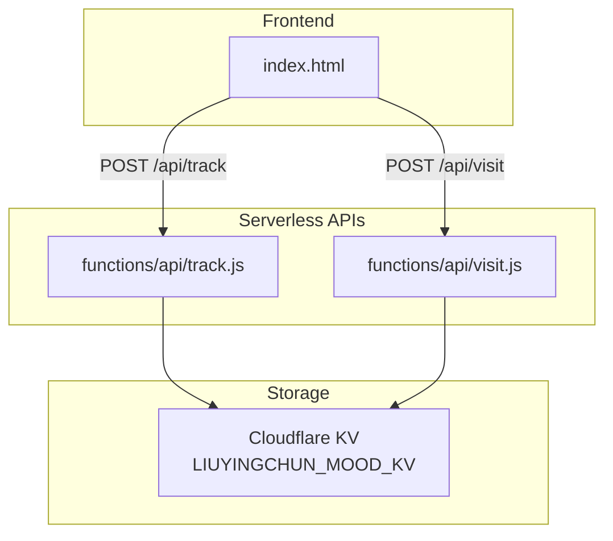
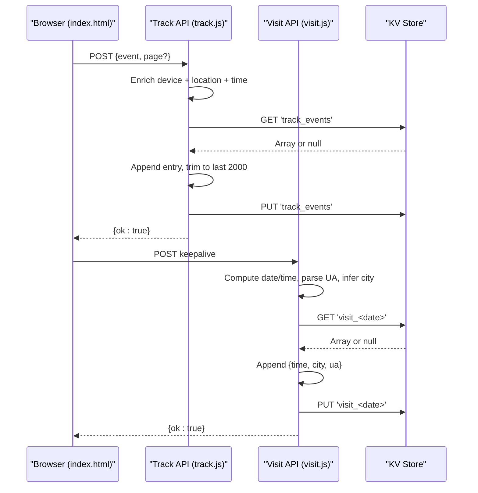
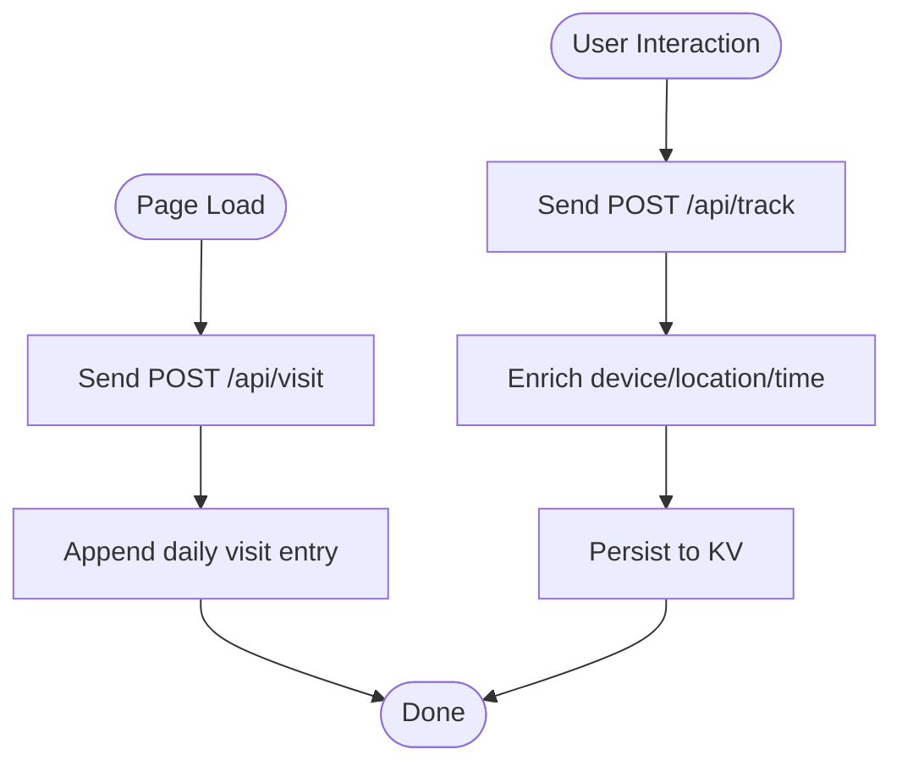
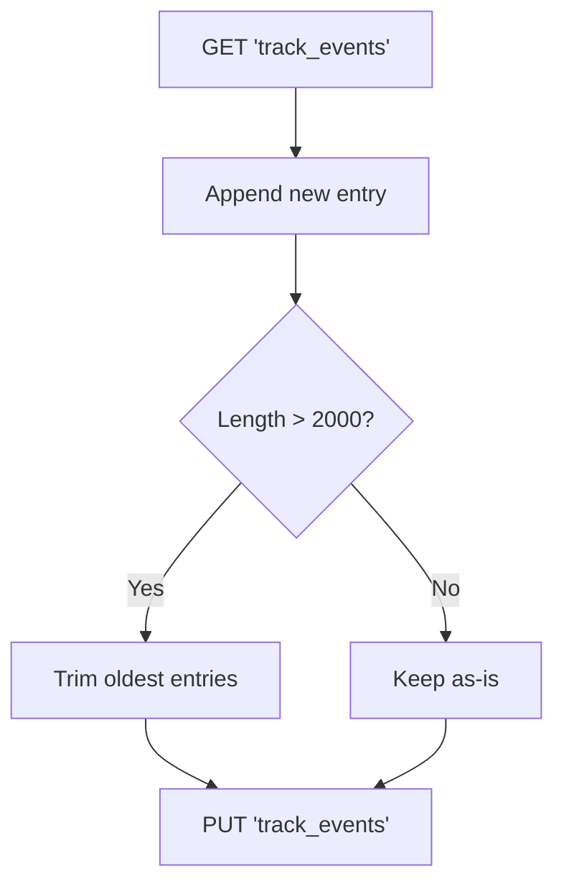
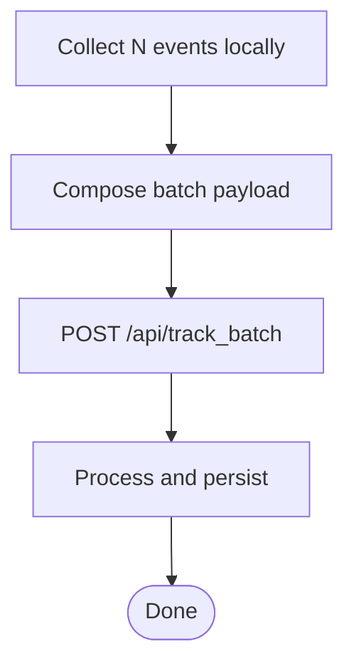
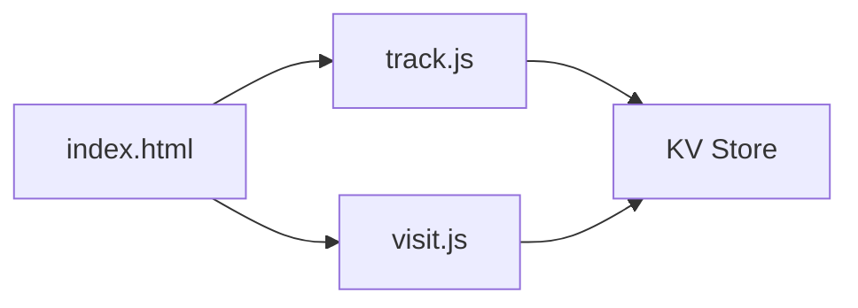

# Tracking Data Model

<cite>
**Referenced Files in This Document**
- [track.js](file://functions/api/track.js)
- [visit.js](file://functions/api/visit.js)
- [index.html](file://index.html)
</cite>

## Table of Contents
1. [Introduction](#introduction)
2. [Project Structure](#project-structure)
3. [Core Components](#core-components)
4. [Architecture Overview](#architecture-overview)
5. [Detailed Component Analysis](#detailed-component-analysis)
6. [Dependency Analysis](#dependency-analysis)
7. [Performance Considerations](#performance-considerations)
8. [Troubleshooting Guide](#troubleshooting-guide)
9. [Conclusion](#conclusion)

## Introduction
This document describes the tracking data model and analytics behavior for the user tracking and analytics system implemented in this repository. It focuses on:
- The track event schema, including event type, page navigation, timestamp, device information, and geographic location (city, region, country).
- Data collection patterns and event categorization.
- Storage strategies using a key-value store.
- Privacy considerations, retention policies, and anonymization techniques.
- Examples of track events, batch processing patterns, and integration with analytics dashboards.
- Performance implications of high-frequency tracking and aggregation strategies.

## Project Structure
The tracking functionality is implemented as serverless API functions under the functions/api directory and is triggered from the frontend index page.

**Diagram sources**
- [index.html:3741-3742](file://index.html#L3741-L3742)
- [track.js:11-33](file://functions/api/track.js#L11-L33)
- [visit.js:33-43](file://functions/api/visit.js#L33-L43)

**Section sources**
- [index.html:3741-3742](file://index.html#L3741-L3742)
- [track.js:1-44](file://functions/api/track.js#L1-L44)
- [visit.js:1-49](file://functions/api/visit.js#L1-L49)

## Core Components
- Track API: Accepts event and optional page metadata, enriches with device and location, normalizes timestamps, and persists to a single array in KV.
- Visit API: Records daily visit entries with time, city, and parsed user agent.
- Frontend: Sends a visit request on page load; other pages can send track events.

Key responsibilities:
- Event ingestion and enrichment
- Timezone normalization
- Location inference via Cloudflare headers
- Device classification
- Retention management for tracked events

**Section sources**
- [track.js:11-33](file://functions/api/track.js#L11-L33)
- [visit.js:7-27](file://functions/api/visit.js#L7-L27)
- [index.html:3741-3742](file://index.html#L3741-L3742)

## Architecture Overview
The tracking pipeline follows a simple request-response flow with in-memory enrichment and persistent storage.

**Diagram sources**
- [index.html:3741-3742](file://index.html#L3741-L3742)
- [track.js:11-33](file://functions/api/track.js#L11-L33)
- [visit.js:33-43](file://functions/api/visit.js#L33-L43)

## Detailed Component Analysis

### Track Event Schema
The track event object stored in KV has the following fields:
- event: string — the action or interaction being tracked.
- page: string — the page identifier; defaults to "index" if not provided.
- time: string — normalized timestamp in local format without timezone offset.
- device: string — "mobile" or "desktop", derived from User-Agent.
- city: string — inferred from Cloudflare request context; fallback value used when unavailable.
- region: string — inferred from Cloudflare request context; may be empty.
- country: string — inferred from Cloudflare request context; may be empty.

Example record shape:
- { event, page, time, device, city, region, country }

Notes:
- The timestamp is adjusted by a fixed offset before formatting.
- Geographic fields are sourced from Cloudflare’s request context and may be absent depending on routing and provider configuration.

**Section sources**
- [track.js:15-26](file://functions/api/track.js#L15-L26)

### Data Collection Patterns
- Visit tracking: On page load, the frontend sends a lightweight visit request to record a daily visit entry with time, city, and parsed user agent.
- Event tracking: Clients call the track endpoint with an event name and optional page name. The server enriches the payload and stores it.

**Diagram sources**
- [index.html:3741-3742](file://index.html#L3741-L3742)
- [track.js:11-33](file://functions/api/track.js#L11-L33)
- [visit.js:33-43](file://functions/api/visit.js#L33-L43)

**Section sources**
- [index.html:3741-3742](file://index.html#L3741-L3742)
- [track.js:11-33](file://functions/api/track.js#L11-L33)
- [visit.js:33-43](file://functions/api/visit.js#L33-L43)

### Event Categorization
- Events are categorized by the event field sent by the client. No server-side taxonomy is enforced; clients should define consistent event names.
- Page categorization uses the page field, defaulting to "index".

Recommendations:
- Use a stable naming convention for events (e.g., feature.action).
- Keep page identifiers short and meaningful.

**Section sources**
- [track.js:13-26](file://functions/api/track.js#L13-L26)

### Storage Strategies
- Track events are stored as a JSON array under a single key.
- A retention policy trims the array to the most recent 2000 entries on each write.
- Visit data is partitioned by date using keys like visit_<date>.

**Diagram sources**
- [track.js:28-33](file://functions/api/track.js#L28-L33)

**Section sources**
- [track.js:28-33](file://functions/api/track.js#L28-L33)
- [visit.js:39-43](file://functions/api/visit.js#L39-L43)

### Privacy Considerations
- No explicit user identifiers are collected in the track or visit endpoints.
- Geographic data is coarse-grained (city, region, country) and sourced from Cloudflare; values may be missing.
- Device classification is binary (mobile/desktop), reducing granularity.

Recommendations:
- Avoid sending personally identifiable information in event payloads.
- Consider adding consent checks before enabling tracking.
- Provide a mechanism to disable tracking per user session.

**Section sources**
- [track.js:15-26](file://functions/api/track.js#L15-L26)
- [visit.js:17-27](file://functions/api/visit.js#L17-L27)

### Data Retention Policies
- Track events: Only the latest 2000 records are retained in KV.
- Visit events: Stored per day; no explicit cleanup logic is present in the visit endpoint.

Recommendations:
- Implement periodic cleanup for old visit keys.
- Define retention windows aligned with privacy requirements.

**Section sources**
- [track.js:28-33](file://functions/api/track.js#L28-L33)
- [visit.js:39-43](file://functions/api/visit.js#L39-L43)

### Anonymization Techniques
- No user IDs or cookies are included in the tracked payloads.
- Device info is simplified to mobile/desktop.
- Location is limited to city/region/country from Cloudflare headers.

Recommendations:
- Hash or truncate any additional identifiers if introduced later.
- Normalize or drop sensitive fields at ingestion.

**Section sources**
- [track.js:15-26](file://functions/api/track.js#L15-L26)
- [visit.js:17-27](file://functions/api/visit.js#L17-L27)

### Examples of Track Events
Representative examples (field shapes only):
- { event: "button_click", page: "home", time: "...", device: "mobile", city: "...", region: "...", country: "..." }
- { event: "page_view", page: "settings", time: "...", device: "desktop", city: "...", region: "", country: "" }

These illustrate how event and page fields vary while device and location are auto-enriched.

**Section sources**
- [track.js:13-26](file://functions/api/track.js#L13-L26)

### Batch Processing Patterns
Current implementation processes one event per request. For higher throughput:
- Client-side batching: Aggregate multiple events and send them in a single request.
- Server-side batching: Extend the API to accept an array of events and process them atomically.

Note: A dedicated batch endpoint is not present in the current codebase; implement it by extending the existing track logic.

[No sources needed since this diagram shows conceptual workflow, not actual code structure]

### Integration with Analytics Dashboards
- Dashboard consumers can read the KV key containing track events and render charts or tables.
- Daily visit counts can be aggregated from visit_<date> keys.

Suggested approach:
- Export or mirror KV data to a queryable store for dashboards.
- Pre-aggregate metrics (events by hour, device distribution, top cities).

[No sources needed since this section provides general guidance]

## Dependency Analysis
The tracking components depend on:
- Cloudflare runtime features: request.cf for geolocation and CORS handling.
- KV Store: LIUYINGCHUN_MOOD_KV for persistence.
- Frontend: index.html triggers visit tracking on load.

**Diagram sources**
- [index.html:3741-3742](file://index.html#L3741-L3742)
- [track.js:11-33](file://functions/api/track.js#L11-L33)
- [visit.js:33-43](file://functions/api/visit.js#L33-L43)

**Section sources**
- [index.html:3741-3742](file://index.html#L3741-L3742)
- [track.js:1-44](file://functions/api/track.js#L1-L44)
- [visit.js:1-49](file://functions/api/visit.js#L1-L49)

## Performance Considerations
- High-frequency tracking: Each track request performs a read-modify-write on a single KV array. Frequent writes can cause contention and increased latency.
- Retention trimming: Trimming to 2000 entries reduces growth but still requires full array reads/writes.
- Timezone adjustment: Fixed offset arithmetic is performed per request; consider caching or precomputing where possible.

Optimization recommendations:
- Introduce client-side batching to reduce request volume.
- Add server-side rate limiting and idempotency keys.
- Consider asynchronous queuing for heavy workloads.
- Partition events by date or category to reduce hot-key contention.

[No sources needed since this section provides general guidance]

## Troubleshooting Guide
Common issues and resolutions:
- Missing location fields: Verify Cloudflare geolocation is enabled and that request.cf contains expected values.
- Incorrect timestamps: Confirm timezone offset logic matches your deployment region and business rules.
- KV access errors: Ensure the correct KV namespace binding is configured for LIUYINGCHUN_MOOD_KV.
- CORS failures: Confirm Access-Control headers are set correctly for cross-origin requests.

Operational tips:
- Inspect KV contents directly to validate schema and retention behavior.
- Monitor error responses from the track endpoint.

**Section sources**
- [track.js:1-9](file://functions/api/track.js#L1-L9)
- [track.js:11-43](file://functions/api/track.js#L11-L43)
- [visit.js:1-9](file://functions/api/visit.js#L1-L9)
- [visit.js:33-48](file://functions/api/visit.js#L33-L48)

## Conclusion
The tracking system captures user interactions with a minimal, privacy-conscious schema and stores them in a key-value store with a simple retention strategy. While effective for small-scale analytics, scaling to high-frequency tracking will benefit from batching, partitioning, and possibly offloading to a more scalable analytics backend. Adhering to the recommended privacy and performance practices will help maintain reliability and compliance.