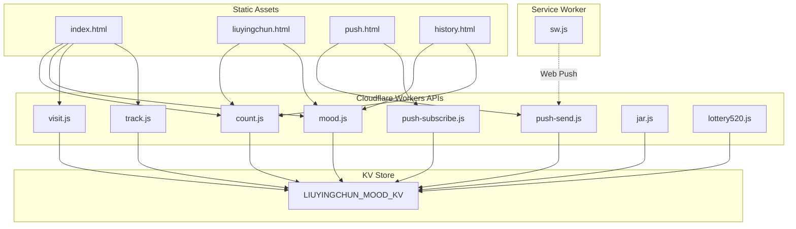
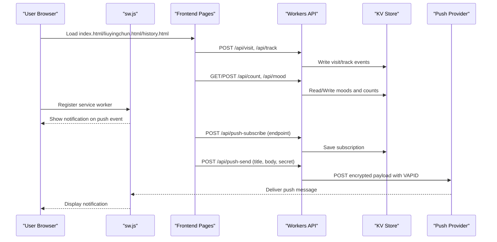
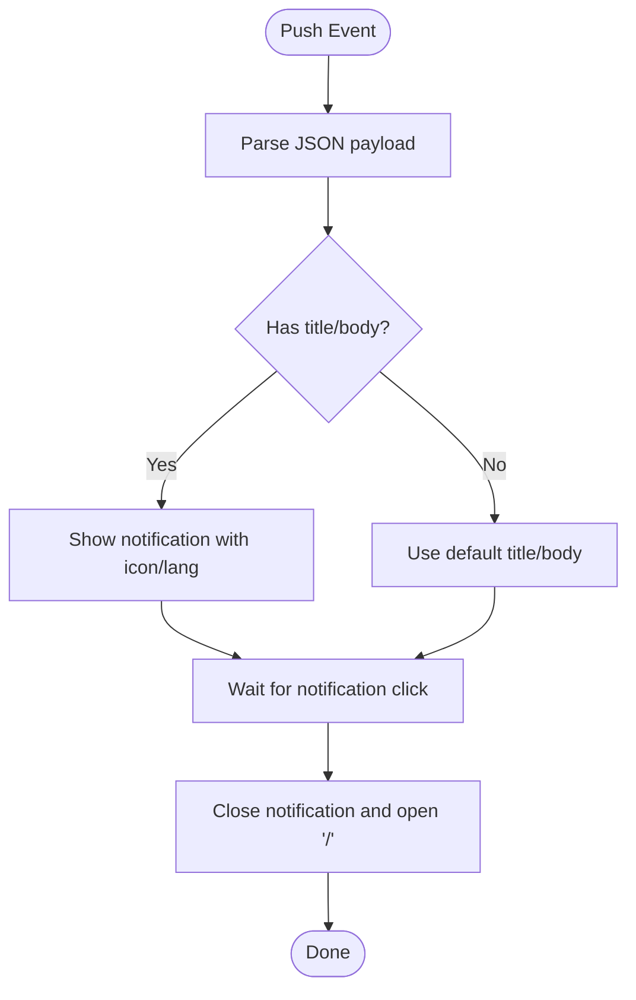
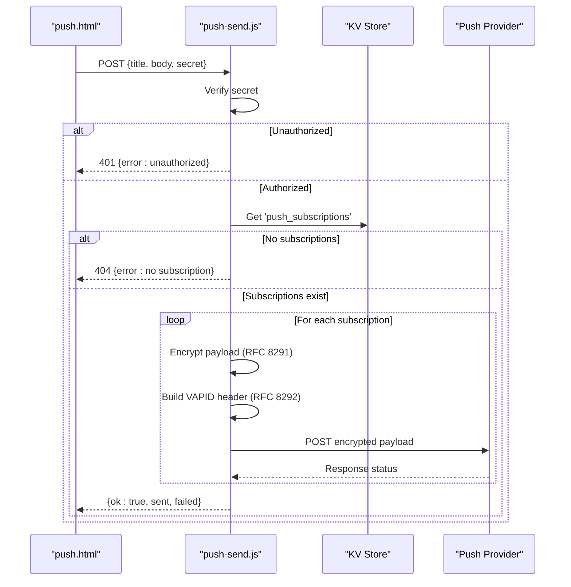
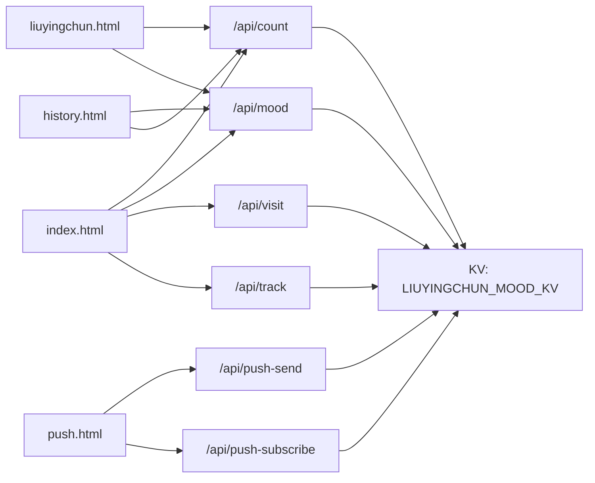

# Deployment Guide

<cite>
**Referenced Files in This Document**
- [sw.js](file://sw.js)
- [index.html](file://index.html)
- [liuyingchun.html](file://liuyingchun.html)
- [push.html](file://push.html)
- [history.html](file://history.html)
- [functions/api/count.js](file://functions/api/count.js)
- [functions/api/mood.js](file://functions/api/mood.js)
- [functions/api/push-send.js](file://functions/api/push-send.js)
- [functions/api/push-subscribe.js](file://functions/api/push-subscribe.js)
- [functions/api/visit.js](file://functions/api/visit.js)
- [functions/api/track.js](file://functions/api/track.js)
- [functions/api/jar.js](file://functions/api/jar.js)
- [functions/api/lottery520.js](file://functions/api/lottery520.js)
</cite>

## Table of Contents
1. Introduction
2. Project Structure
3. Core Components
4. Architecture Overview
5. Detailed Component Analysis
6. Dependency Analysis
7. Performance Considerations
8. Troubleshooting Guide
9. Conclusion
10. Appendices

## Introduction
This guide documents how to productionize Liu Yingchun's Happy Corner on Cloudflare Workers. It covers project configuration, environment variables, KV storage bindings, service worker deployment considerations, caching strategies, version management, domain and SSL setup, CDN optimization for static assets, monitoring and logging, backup and disaster recovery, scaling, troubleshooting, and performance optimization.

The application consists of:
- Static HTML pages served from the root (index.html, liuyingchun.html, push.html, history.html)
- A minimal Service Worker (sw.js) for web push notifications
- Cloudflare Workers API functions under functions/api/ that persist data to a KV store and send encrypted web push messages

## Project Structure
At a high level:
- Root-level HTML files are static assets served by Cloudflare Pages or a custom origin behind Cloudflare CDN.
- The service worker sw.js handles push events and notification clicks.
- API endpoints under functions/api/ implement business logic using Cloudflare Workers with KV storage.

**Diagram sources**
- [index.html:1-800](file://index.html#L1-L800)
- [liuyingchun.html:1-368](file://liuyingchun.html#L1-L368)
- [push.html:1-205](file://push.html#L1-L205)
- [history.html:1-177](file://history.html#L1-L177)
- [sw.js:1-17](file://sw.js#L1-L17)
- [functions/api/count.js:1-33](file://functions/api/count.js#L1-L33)
- [functions/api/mood.js:1-44](file://functions/api/mood.js#L1-L44)
- [functions/api/push-send.js:1-155](file://functions/api/push-send.js#L1-L155)
- [functions/api/push-subscribe.js:1-23](file://functions/api/push-subscribe.js#L1-L23)
- [functions/api/visit.js:1-49](file://functions/api/visit.js#L1-L49)
- [functions/api/track.js:1-44](file://functions/api/track.js#L1-L44)
- [functions/api/jar.js:1-31](file://functions/api/jar.js#L1-L31)
- [functions/api/lottery520.js:1-43](file://functions/api/lottery520.js#L1-L43)

**Section sources**
- [index.html:1-800](file://index.html#L1-L800)
- [sw.js:1-17](file://sw.js#L1-L17)
- [functions/api/count.js:1-33](file://functions/api/count.js#L1-L33)
- [functions/api/mood.js:1-44](file://functions/api/mood.js#L1-L44)
- [functions/api/push-send.js:1-155](file://functions/api/push-send.js#L1-L155)
- [functions/api/push-subscribe.js:1-23](file://functions/api/push-subscribe.js#L1-L23)
- [functions/api/visit.js:1-49](file://functions/api/visit.js#L1-L49)
- [functions/api/track.js:1-44](file://functions/api/track.js#L1-L44)
- [functions/api/jar.js:1-31](file://functions/api/jar.js#L1-L31)
- [functions/api/lottery520.js:1-43](file://functions/api/lottery520.js#L1-L43)

## Core Components
- Static UI: index.html, liuyingchun.html, push.html, history.html provide user interfaces and call APIs.
- Service Worker: sw.js listens for push events and displays notifications; on click, opens the app root.
- API Functions:
  - count.js: GET/POST daily praise counts stored per Beijing date.
  - mood.js: GET/POST mood entries; maintains last 60 days.
  - push-send.js: Sends encrypted web push messages using RFC 8291/8292 with VAPID.
  - push-subscribe.js: Stores push subscriptions keyed by endpoint.
  - visit.js: Records visits with city, device info, and time.
  - track.js: Tracks events and page views with geo/device metadata.
  - jar.js: Stores text entries with timestamps.
  - lottery520.js: One-time lottery result storage.

All API functions use CORS headers and read/write to a single KV namespace bound as LIUYINGCHUN_MOOD_KV.

**Section sources**
- [functions/api/count.js:1-33](file://functions/api/count.js#L1-L33)
- [functions/api/mood.js:1-44](file://functions/api/mood.js#L1-L44)
- [functions/api/push-send.js:1-155](file://functions/api/push-send.js#L1-L155)
- [functions/api/push-subscribe.js:1-23](file://functions/api/push-subscribe.js#L1-L23)
- [functions/api/visit.js:1-49](file://functions/api/visit.js#L1-L49)
- [functions/api/track.js:1-44](file://functions/api/track.js#L1-L44)
- [functions/api/jar.js:1-31](file://functions/api/jar.js#L1-L31)
- [functions/api/lottery520.js:1-43](file://functions/api/lottery520.js#L1-L43)

## Architecture Overview
The runtime architecture is:
- Browser loads static HTML pages and registers sw.js if supported.
- Frontend calls /api/* endpoints which route to Cloudflare Workers functions.
- Workers read/write to KV (LIUYINGCHUN_MOOD_KV).
- Web push flow uses push-subscribe to register endpoints and push-send to deliver encrypted messages via VAPID.

**Diagram sources**
- [push.html:166-201](file://push.html#L166-L201)
- [functions/api/push-subscribe.js:11-22](file://functions/api/push-subscribe.js#L11-L22)
- [functions/api/push-send.js:112-154](file://functions/api/push-send.js#L112-L154)
- [sw.js:1-16](file://sw.js#L1-L16)
- [functions/api/visit.js:33-47](file://functions/api/visit.js#L33-L47)
- [functions/api/track.js:11-37](file://functions/api/track.js#L11-L37)
- [functions/api/count.js:16-31](file://functions/api/count.js#L16-L31)
- [functions/api/mood.js:19-42](file://functions/api/mood.js#L19-L42)

## Detailed Component Analysis

### Service Worker (sw.js)
Responsibilities:
- Listen for push events and display notifications with title/body/icon/badge/language.
- On notification click, close the notification and open the app root window.

Production considerations:
- Ensure HTTPS and proper origin for push registration.
- Keep sw.js small and cacheable; serve with immutable caching where appropriate.
- Validate that the icon path (/avatar.png) exists at the site root.

**Diagram sources**
- [sw.js:1-16](file://sw.js#L1-L16)

**Section sources**
- [sw.js:1-17](file://sw.js#L1-L17)

### API: Count (functions/api/count.js)
- GET returns today’s praise count (Beijing timezone key).
- POST increments the daily count and returns updated value.
- Uses KV key pattern count_{YYYY-MM-DD}.

Operational notes:
- Timezone handling ensures consistent daily buckets.
- KV writes are idempotent per request; consider rate limiting if needed.

**Section sources**
- [functions/api/count.js:1-33](file://functions/api/count.js#L1-L33)

### API: Mood (functions/api/mood.js)
- GET returns an array of mood entries (last 60 days).
- POST adds or updates today’s entry; trims to 60 entries.
- Stores as JSON string under key 'moods'.

Operational notes:
- Truncation prevents unbounded growth.
- Consider adding validation for mood/emoji values.

**Section sources**
- [functions/api/mood.js:1-44](file://functions/api/mood.js#L1-L44)

### API: Push Send (functions/api/push-send.js)
- Validates a shared secret against env.PUSH_SECRET.
- Retrieves push subscriptions from KV ('push_subscriptions').
- Encrypts payload per RFC 8291 and signs request with VAPID (RFC 8292).
- Posts to each subscription endpoint with Content-Encoding aes128gcm and TTL.

Environment variables required:
- PUSH_SECRET: Shared secret to authorize sending pushes.
- VAPID_PUBLIC_KEY, VAPID_PRIVATE_KEY: ECDSA keys for VAPID signing.

Error handling:
- Returns unauthorized if secret mismatch.
- Returns no subscription if none registered.
- Aggregates results and reports sent/failed counts.

**Diagram sources**
- [functions/api/push-send.js:112-154](file://functions/api/push-send.js#L112-L154)
- [push.html:166-201](file://push.html#L166-L201)

**Section sources**
- [functions/api/push-send.js:1-155](file://functions/api/push-send.js#L1-L155)
- [push.html:166-201](file://push.html#L166-L201)

### API: Push Subscribe (functions/api/push-subscribe.js)
- Stores subscription objects keyed by endpoint to avoid duplicates.
- Validates presence of endpoint.

Operational notes:
- Endpoint-based deduplication ensures one subscription per browser/device.

**Section sources**
- [functions/api/push-subscribe.js:1-23](file://functions/api/push-subscribe.js#L1-L23)

### API: Visit and Track (functions/api/visit.js, functions/api/track.js)
- visit.js records daily visit entries with time, city, and device type derived from User-Agent.
- track.js records events with device, city, region, country, and timestamp; caps at 2000 entries.

Operational notes:
- Both rely on Cloudflare request.cf fields for geolocation when available.
- Consider anonymizing or aggregating sensitive fields in production.

**Section sources**
- [functions/api/visit.js:1-49](file://functions/api/visit.js#L1-L49)
- [functions/api/track.js:1-44](file://functions/api/track.js#L1-L44)

### API: Jar and Lottery (functions/api/jar.js, functions/api/lottery520.js)
- jar.js stores text entries with date/time; prepends new entries.
- lottery520.js enforces one-time play per session by storing result under a single key.

Operational notes:
- Enforce client-side checks to prevent repeated submissions where applicable.

**Section sources**
- [functions/api/jar.js:1-31](file://functions/api/jar.js#L1-L31)
- [functions/api/lottery520.js:1-43](file://functions/api/lottery520.js#L1-L43)

## Dependency Analysis
- All API functions depend on a single KV namespace bound as LIUYINGCHUN_MOOD_KV.
- push-send.js depends on VAPID keys and a shared secret for authorization.
- Frontend pages depend on network access to /api/* endpoints and availability of sw.js for push features.

**Diagram sources**
- [index.html:1-800](file://index.html#L1-L800)
- [liuyingchun.html:1-368](file://liuyingchun.html#L1-L368)
- [push.html:1-205](file://push.html#L1-L205)
- [history.html:1-177](file://history.html#L1-L177)
- [functions/api/count.js:1-33](file://functions/api/count.js#L1-L33)
- [functions/api/mood.js:1-44](file://functions/api/mood.js#L1-L44)
- [functions/api/visit.js:1-49](file://functions/api/visit.js#L1-L49)
- [functions/api/track.js:1-44](file://functions/api/track.js#L1-L44)
- [functions/api/push-send.js:1-155](file://functions/api/push-send.js#L1-L155)
- [functions/api/push-subscribe.js:1-23](file://functions/api/push-subscribe.js#L1-L23)

**Section sources**
- [functions/api/count.js:1-33](file://functions/api/count.js#L1-L33)
- [functions/api/mood.js:1-44](file://functions/api/mood.js#L1-L44)
- [functions/api/visit.js:1-49](file://functions/api/visit.js#L1-L49)
- [functions/api/track.js:1-44](file://functions/api/track.js#L1-L44)
- [functions/api/push-send.js:1-155](file://functions/api/push-send.js#L1-L155)
- [functions/api/push-subscribe.js:1-23](file://functions/api/push-subscribe.js#L1-L23)

## Performance Considerations
- Static asset caching:
  - Serve HTML, CSS, JS, images with long Cache-Control and immutable tags for content-hashed assets.
  - Use Cloudflare CDN caching rules to optimize delivery globally.
- KV operations:
  - Batch reads/writes where possible; keep payloads small.
  - Use compact keys and limit retention (e.g., 60-day mood list, 2000 track events).
- Push messages:
  - Minimize payload size; reuse VAPID keys across deployments.
  - Set appropriate TTL to reduce retries.
- Frontend:
  - Defer non-critical scripts; preload critical assets like splash image.
  - Avoid heavy animations on low-power devices.

[No sources needed since this section provides general guidance]

## Troubleshooting Guide
Common issues and resolutions:
- Push not received:
  - Verify PUSH_SECRET matches server-side expectation.
  - Confirm VAPID_PUBLIC_KEY and VAPID_PRIVATE_KEY are correctly set.
  - Ensure push subscriptions exist in KV and endpoints are valid.
  - Check sw.js is registered and active; confirm HTTPS and correct origin.
- Notifications not opening app:
  - Ensure sw.js notificationclick handler opens '/'.
  - Verify root URL resolves to index.html.
- CORS errors:
  - Confirm API functions return Access-Control-Allow-Origin and methods.
  - Ensure frontend requests include Content-Type when posting JSON.
- Data not persisting:
  - Verify LIUYINGCHUN_MOOD_KV binding is configured and accessible.
  - Check KV quotas and limits; ensure keys are unique and within size limits.
- Timezone inconsistencies:
  - All functions compute Beijing time by adding 8 hours; ensure client expectations align.

**Section sources**
- [functions/api/push-send.js:112-154](file://functions/api/push-send.js#L112-L154)
- [sw.js:1-16](file://sw.js#L1-L16)
- [functions/api/count.js:1-33](file://functions/api/count.js#L1-L33)
- [functions/api/mood.js:1-44](file://functions/api/mood.js#L1-L44)
- [functions/api/visit.js:1-49](file://functions/api/visit.js#L1-L49)
- [functions/api/track.js:1-44](file://functions/api/track.js#L1-L44)

## Conclusion
This deployment guide outlines how to productionize Liu Yingchun's Happy Corner on Cloudflare Workers with KV-backed persistence, secure web push, and optimized static asset delivery. Follow the environment variable setup, KV bindings, and CDN configurations described below to ensure reliable operation, scalability, and observability.

[No sources needed since this section summarizes without analyzing specific files]

## Appendices

### Cloudflare Workers Deployment Process
- Project configuration:
  - Deploy static assets (HTML, images) via Cloudflare Pages or your origin behind Cloudflare CDN.
  - Deploy API functions under functions/api/ as Workers routes mapped to /api/* paths.
- Environment variables:
  - PUSH_SECRET: Secret used by push-send to authorize sending messages.
  - VAPID_PUBLIC_KEY, VAPID_PRIVATE_KEY: ECDSA keys for VAPID authentication.
- KV storage binding:
  - Bind a KV namespace to the name LIUYINGCHUN_MOOD_KV in your Workers configuration.
  - Ensure all API functions can read/write to this KV instance.

**Section sources**
- [functions/api/push-send.js:112-154](file://functions/api/push-send.js#L112-L154)
- [functions/api/count.js:16-31](file://functions/api/count.js#L16-L31)
- [functions/api/mood.js:19-42](file://functions/api/mood.js#L19-L42)
- [functions/api/visit.js:33-47](file://functions/api/visit.js#L33-L47)
- [functions/api/track.js:11-37](file://functions/api/track.js#L11-L37)
- [functions/api/jar.js:21-29](file://functions/api/jar.js#L21-L29)
- [functions/api/lottery520.js:19-41](file://functions/api/lottery520.js#L19-L41)

### Service Worker Deployment Considerations
- Registration:
  - Ensure sw.js is served from the site root and registered by the main page.
- Caching:
  - Cache sw.js with strict versioning; update only when changes occur.
- Push support:
  - Confirm HTTPS, correct origin, and that the browser supports push.
  - Provide icon and badge assets at expected paths.

**Section sources**
- [sw.js:1-16](file://sw.js#L1-L16)
- [push.html:166-201](file://push.html#L166-L201)

### Caching Strategies and Version Management
- Static assets:
  - Use immutable caching for hashed assets; set long-lived Cache-Control for unchanged resources.
  - Implement cache busting for HTML by including deploy timestamps or version queries.
- API responses:
  - Apply short cache times for dynamic endpoints; do not cache user-specific data.
- Versioning:
  - Tag builds with semantic versions; update references in HTML to force refresh.
  - Maintain backward compatibility for API contracts during rollouts.

[No sources needed since this section provides general guidance]

### Domain Configuration, SSL, and CDN Optimization
- Domain:
  - Point your domain to Cloudflare and enable DNS records for your site and API routes.
- SSL:
  - Enable Always Use HTTPS and configure TLS settings in Cloudflare.
  - Ensure origins present valid certificates or use Cloudflare’s managed certs.
- CDN:
  - Enable Brotli/Gzip compression.
  - Configure cache rules for static assets; bypass cache for API routes.
  - Use Page Rules or R2/CDN integration for large media if needed.

[No sources needed since this section provides general guidance]

### Monitoring and Logging
- Cloudflare Analytics:
  - Monitor requests, bandwidth, and error rates via the Cloudflare dashboard.
- Error tracking:
  - Add structured logging in Workers to capture errors and metrics; integrate with external services if desired.
- Performance monitoring:
  - Track KV latency and request durations; set alerts for abnormal spikes.
- Push analytics:
  - Log successful and failed push deliveries; correlate with subscription counts.

[No sources needed since this section provides general guidance]

### Backup Strategies and Disaster Recovery
- KV backups:
  - Schedule periodic exports of KV namespaces to object storage (e.g., R2 or S3-compatible).
  - Retain backups for at least 30 days; test restore procedures regularly.
- Disaster recovery:
  - Document environment variables and KV schema.
  - Prepare runbooks for restoring KV from backups and re-registering service workers.
- Rollback plan:
  - Keep previous versions of static assets and Workers; switch traffic back quickly if issues arise.

[No sources needed since this section provides general guidance]

### Scaling Considerations
- Traffic spikes:
  - Rely on Cloudflare’s global edge network; minimize origin load by caching aggressively.
- KV scaling:
  - Monitor KV throughput and adjust key design to avoid hotspots.
  - Consider sharding keys by date or user to distribute load.
- Push scaling:
  - Queue push jobs if volume increases; batch and throttle requests to providers.

[No sources needed since this section provides general guidance]

### Troubleshooting Common Deployment Issues
- CORS failures:
  - Ensure API functions return appropriate Access-Control headers for preflight and actual requests.
- Push secrets mismatch:
  - Verify PUSH_SECRET matches between frontend and backend; rotate securely if compromised.
- Missing KV binding:
  - Confirm LIUYINGCHUN_MOOD_KV is bound in Workers configuration and accessible at runtime.
- Service worker not updating:
  - Clear browser caches; ensure sw.js has a new hash or version to trigger re-registration.

**Section sources**
- [functions/api/count.js:1-33](file://functions/api/count.js#L1-L33)
- [functions/api/mood.js:1-44](file://functions/api/mood.js#L1-L44)
- [functions/api/push-send.js:112-154](file://functions/api/push-send.js#L112-L154)
- [sw.js:1-16](file://sw.js#L1-L16)