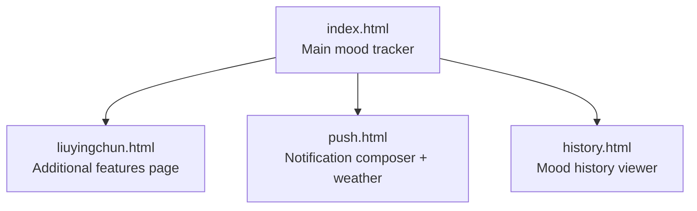
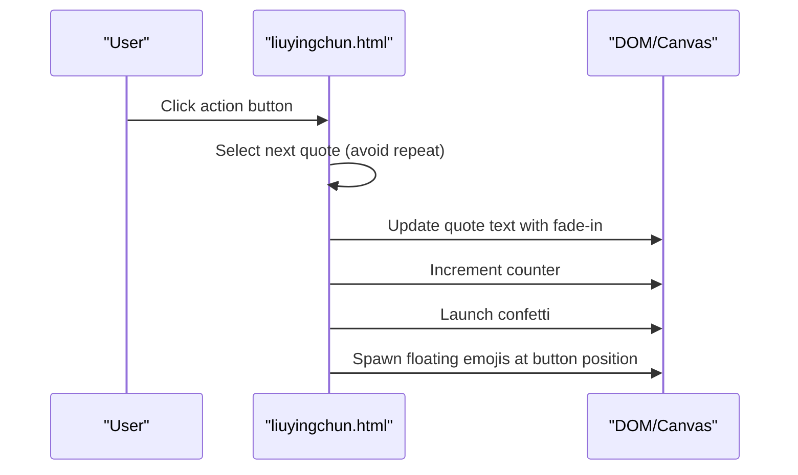
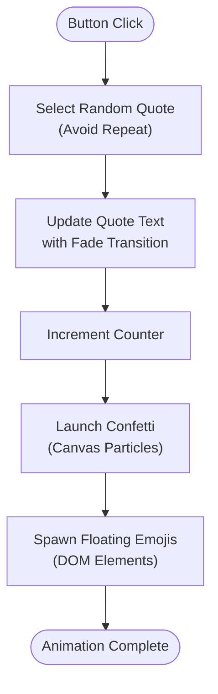
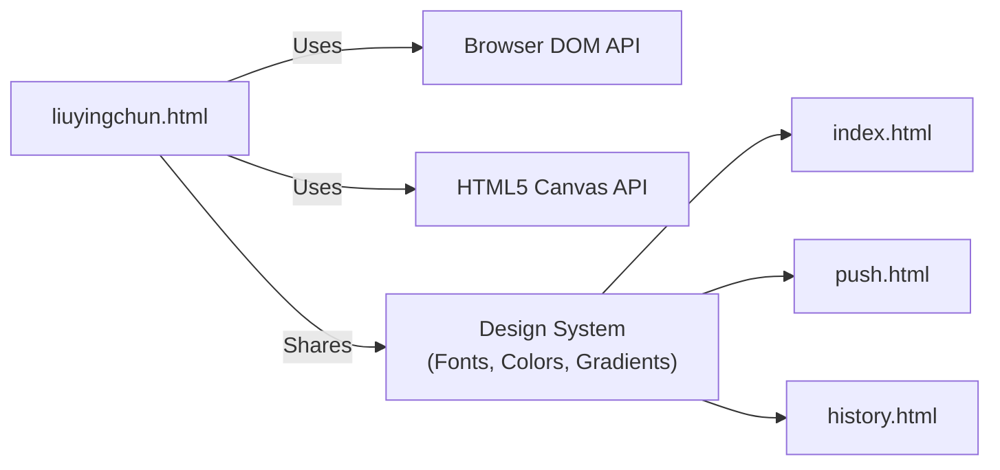

# Additional Features (liuyingchun.html)

<cite>
**Referenced Files in This Document**
- [liuyingchun.html](file://liuyingchun.html)
- [index.html](file://index.html)
- [push.html](file://push.html)
- [history.html](file://history.html)
</cite>

## Table of Contents
1. [Introduction](#introduction)
2. [Project Structure](#project-structure)
3. [Core Components](#core-components)
4. [Architecture Overview](#architecture-overview)
5. [Detailed Component Analysis](#detailed-component-analysis)
6. [Dependency Analysis](#dependency-analysis)
7. [Performance Considerations](#performance-considerations)
8. [Troubleshooting Guide](#troubleshooting-guide)
9. [Conclusion](#conclusion)

## Introduction
This document explains the additional features page implemented in liuyingchun.html. It is a standalone, self-contained mini-app that provides supplementary functionality beyond the core mood tracking experience. The page focuses on an interactive “praise machine” with animated feedback, a counter, and a warm, playful interface. While it does not integrate external APIs directly, it complements the main application by offering a lighthearted interaction loop and consistent visual language across the project’s pages.

The additional features page is designed to:
- Provide quick emotional uplift through randomized quotes
- Offer engaging micro-interactions (confetti, floating emojis, twinkling stars)
- Track user interactions locally via a simple counter
- Maintain a cohesive design system aligned with the rest of the app

## Project Structure
The repository includes several HTML entry points:
- index.html: Main mood tracking application
- liuyingchun.html: Additional features page (“praise machine”)
- push.html: Notification composition tool with optional weather integration
- history.html: Mood history viewer

**Diagram sources**
- [index.html:1-200](file://index.html#L1-L200)
- [liuyingchun.html:1-200](file://liuyingchun.html#L1-L200)
- [push.html:1-120](file://push.html#L1-L120)
- [history.html:1-120](file://history.html#L1-L120)

**Section sources**
- [index.html:1-200](file://index.html#L1-L200)
- [liuyingchun.html:1-200](file://liuyingchun.html#L1-L200)
- [push.html:1-120](file://push.html#L1-L120)
- [history.html:1-120](file://history.html#L1-L120)

## Core Components
The additional features page implements the following components:
- Quote generator: Randomly selects from a curated list of encouraging quotes
- Interaction buttons: Three action buttons that trigger praise generation
- Counter: Tracks how many times the user has received praise
- Visual effects: Confetti animation, floating emojis, twinkling background stars
- Responsive layout: Adapts button grid for mobile screens

Key responsibilities:
- Generate non-repeating random quotes
- Animate quote transitions
- Spawn floating emojis from the clicked button
- Render confetti using Canvas
- Manage local state (count, last index)

**Section sources**
- [liuyingchun.html:227-365](file://liuyingchun.html#L227-L365)

## Architecture Overview
The additional features page is a single-page client-side application with no server dependencies. It uses:
- DOM manipulation for UI updates
- CSS animations for visual polish
- Canvas API for confetti rendering
- Local variables for state management

**Diagram sources**
- [liuyingchun.html:254-341](file://liuyingchun.html#L254-L341)

## Detailed Component Analysis

### Praise Machine Interface
The interface centers around a card-like container with:
- A crown icon and title
- A quote display area with decorative quotation mark
- Three action buttons arranged in a responsive grid
- A counter showing total praises received

Design patterns:
- Glassmorphism-style card with backdrop blur
- Gradient backgrounds and soft shadows
- Rounded corners and generous padding
- Consistent typography using Noto Serif SC and Playfair Display

Accessibility considerations:
- Buttons are keyboard-focusable
- Text contrast meets readability standards
- Animations do not block content

**Section sources**
- [liuyingchun.html:30-170](file://liuyingchun.html#L30-L170)

### Quote Generation Logic
The quote generator ensures variety by avoiding consecutive repeats:
- Maintains a list of quotes
- Tracks the last selected index
- Randomly selects a new index different from the previous one
- Updates the displayed quote with a smooth transition

Complexity analysis:
- Time complexity: O(1) per selection (random access)
- Space complexity: O(n) where n is the number of quotes stored

Error handling:
- Graceful fallback if quote array is empty (not applicable in current implementation)
- No network calls, so no network error handling needed

**Section sources**
- [liuyingchun.html:228-273](file://liuyingchun.html#L228-L273)

### Visual Effects System
The page implements three types of visual effects:

#### Confetti Animation
- Uses HTML5 Canvas for particle rendering
- Particles have random properties: size, color, speed, angle, spin, drift, shape
- Animation loop runs via requestAnimationFrame
- Automatically resizes canvas on window resize

Performance characteristics:
- Efficient particle cleanup when off-screen
- Single animation frame loop shared across all particles
- Memory usage proportional to active particle count

#### Floating Emojis
- Creates temporary DOM elements positioned relative to the clicked button
- Each emoji floats upward with rotation and scaling
- Elements are automatically removed after animation completes

#### Background Stars
- Dynamically generates twinkling star elements
- Random sizes, positions, and animation delays
- Pure CSS animations for performance

**Diagram sources**
- [liuyingchun.html:254-341](file://liuyingchun.html#L254-L341)

**Section sources**
- [liuyingchun.html:291-357](file://liuyingchun.html#L291-L357)

### Data Visualization Components
While this page doesn't display traditional charts or graphs, it provides:
- Real-time counter visualization
- Animated quote transitions
- Particle-based confetti visualization
- Dynamic star field background

These components serve as micro-interactions rather than data visualization tools.

**Section sources**
- [liuyingchun.html:159-170](file://liuyingchun.html#L159-L170)
- [liuyingchun.html:291-357](file://liuyingchun.html#L291-L357)

### External API Integrations
The additional features page itself does not make any external API calls. However, related pages in the application demonstrate external integrations:

#### Weather Integration (push.html)
The push.html page integrates with Open-Meteo API to fetch weather data:
- Fetches forecast data for Chongqing coordinates
- Maps weather codes to descriptive text
- Displays temperature ranges
- Handles network errors gracefully

This shows the pattern used elsewhere in the application for external service integration.

**Section sources**
- [push.html:142-164](file://push.html#L142-L164)

## Dependency Analysis
The additional features page has minimal dependencies:
- No external JavaScript libraries
- No server-side dependencies
- Uses only native browser APIs (DOM, Canvas, CSS animations)

Relationships with other pages:
- Shares design language with index.html (fonts, colors, gradients)
- Complements the mood tracking workflow by providing emotional support
- Does not share data or state with other pages

**Diagram sources**
- [liuyingchun.html:7-8](file://liuyingchun.html#L7-L8)
- [index.html:9](file://index.html#L9)
- [push.html:1-10](file://push.html#L1-L10)
- [history.html:1-10](file://history.html#L1-L10)

**Section sources**
- [liuyingchun.html:7-8](file://liuyingchun.html#L7-L8)
- [index.html:9](file://index.html#L9)

## Performance Considerations
The additional features page is optimized for performance:
- Lightweight implementation with no external dependencies
- Efficient animation loops using requestAnimationFrame
- Automatic cleanup of DOM elements after animations
- Minimal memory footprint
- Responsive design reduces layout thrashing

Potential optimizations:
- Implement lazy loading for heavy animations if needed
- Consider using CSS transforms instead of top/left positioning for better GPU acceleration
- Add debouncing for rapid button clicks to prevent excessive DOM manipulation

[No sources needed since this section provides general guidance]

## Troubleshooting Guide
Common issues and solutions:

### Quotes Not Appearing
- Check if the quote array is properly initialized
- Verify DOM element IDs match the script references
- Ensure CSS classes for animations are applied correctly

### Confetti Not Rendering
- Verify Canvas element exists and has proper dimensions
- Check browser compatibility with Canvas API
- Ensure requestAnimationFrame is supported

### Animations Not Smooth
- Check for heavy operations in animation loops
- Verify device performance capabilities
- Consider reducing particle count for lower-end devices

### Mobile Layout Issues
- Test responsive breakpoints
- Verify touch event handling
- Check viewport meta tag configuration

**Section sources**
- [liuyingchun.html:227-365](file://liuyingchun.html#L227-L365)

## Conclusion
The additional features page in liuyingchun.html provides a delightful, self-contained experience that complements the main mood tracking application. Through its interactive praise machine, animated feedback, and warm design language, it offers users a moment of joy and encouragement. While it operates independently without external dependencies, it maintains consistency with the broader application's visual identity and enhances the overall user experience by providing emotional support alongside functional mood tracking features.

The page demonstrates effective use of modern web technologies including Canvas animations, CSS transitions, and responsive design patterns. Its lightweight architecture makes it fast-loading and easy to maintain while delivering rich interactive experiences.

[No sources needed since this section summarizes without analyzing specific files]