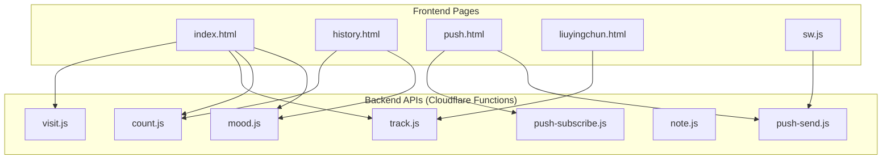
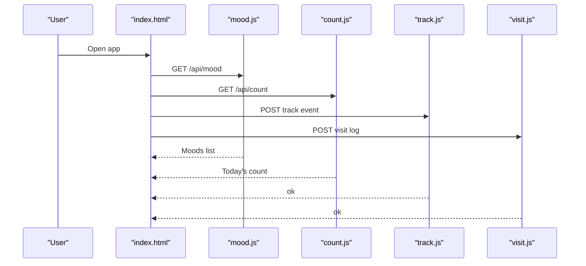
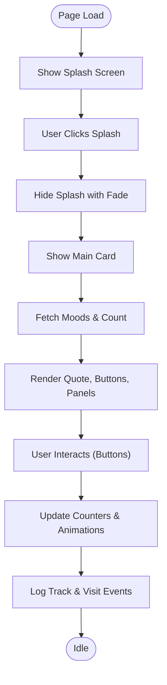
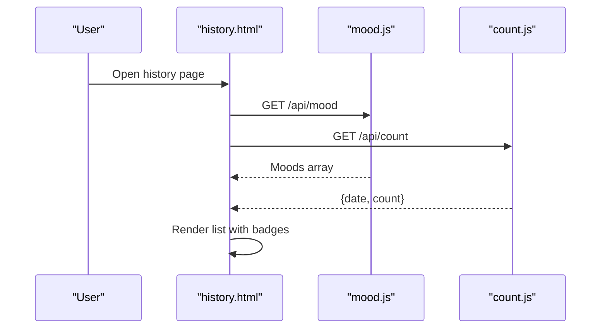
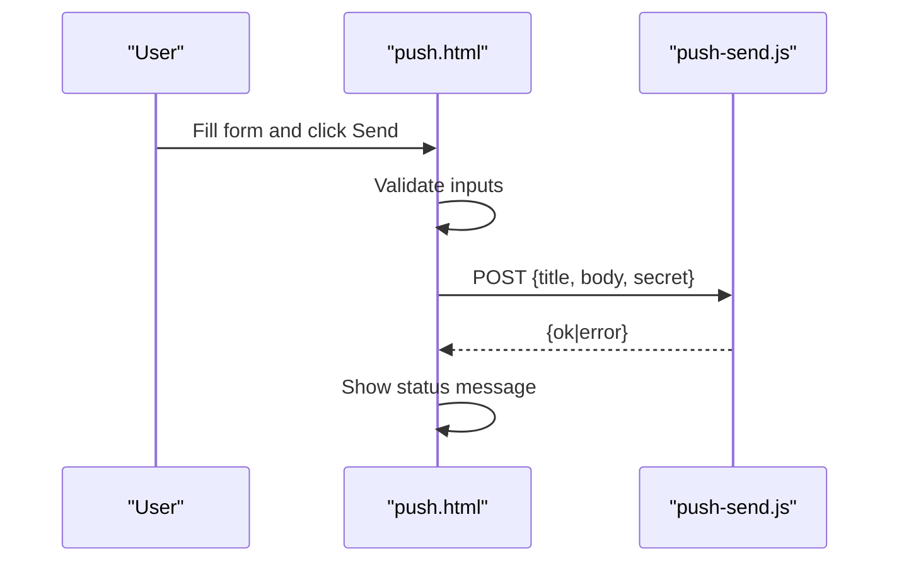
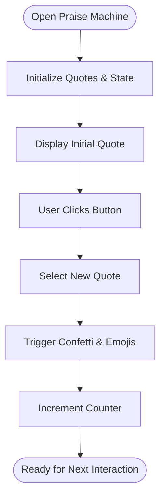
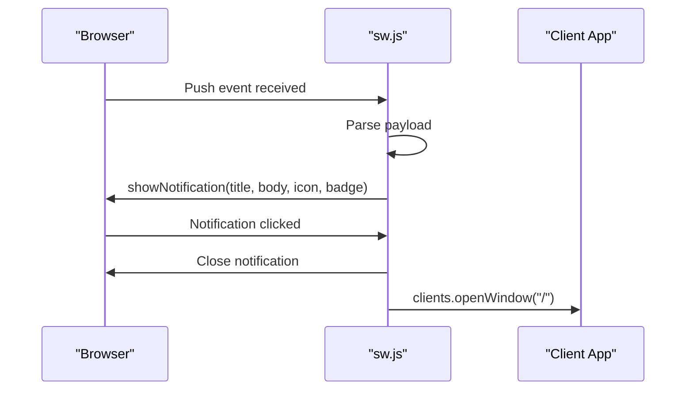
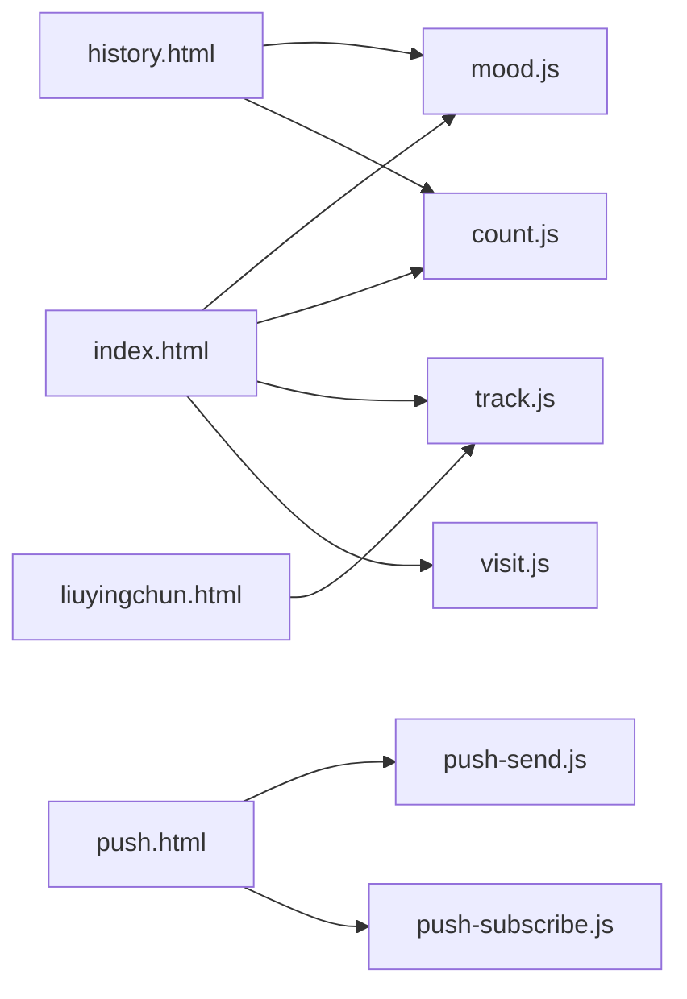

# Frontend Architecture

<cite>
**Referenced Files in This Document**
- [index.html](file://index.html)
- [history.html](file://history.html)
- [push.html](file://push.html)
- [liuyingchun.html](file://liuyingchun.html)
- [sw.js](file://sw.js)
- [mood.js](file://functions/api/mood.js)
- [count.js](file://functions/api/count.js)
- [push-send.js](file://functions/api/push-send.js)
- [track.js](file://functions/api/track.js)
- [visit.js](file://functions/api/visit.js)
- [note.js](file://functions/api/note.js)
- [push-subscribe.js](file://functions/api/push-subscribe.js)
</cite>

## Table of Contents
1. [Introduction](#introduction)
2. [Project Structure](#project-structure)
3. [Core Components](#core-components)
4. [Architecture Overview](#architecture-overview)
5. [Detailed Component Analysis](#detailed-component-analysis)
6. [Dependency Analysis](#dependency-analysis)
7. [Performance Considerations](#performance-considerations)
8. [Troubleshooting Guide](#troubleshooting-guide)
9. [Conclusion](#conclusion)

## Introduction
This document describes the frontend architecture of a multi-page, mobile-first web application centered around mood tracking, encouragement, and messaging workflows. The primary page is index.html, which includes a splash screen, a mood tracking interface, side panels for metrics and history, and an animation system. Supporting pages include:
- history.html: A dedicated view to review recent mood records.
- push.html: A form to send notifications to the user via Web Push.
- liuyingchun.html: A standalone “praise machine” with confetti animations.

The application uses vanilla HTML/CSS/JS with no framework dependencies. It communicates with serverless API functions for persistence, analytics, and push notification delivery.

## Project Structure
The frontend consists of four HTML entry points and a service worker for push notifications. Backend logic is implemented as Cloudflare Functions under functions/api/.

**Diagram sources**
- [index.html:1-800](file://index.html#L1-L800)
- [history.html:132-174](file://history.html#L132-L174)
- [push.html:137-201](file://push.html#L137-L201)
- [liuyingchun.html:227-365](file://liuyingchun.html#L227-L365)
- [sw.js:1-16](file://sw.js#L1-L16)
- [mood.js:19-43](file://functions/api/mood.js#L19-L43)
- [count.js:16-32](file://functions/api/count.js#L16-L32)
- [push-send.js:112-154](file://functions/api/push-send.js#L112-L154)
- [track.js:11-43](file://functions/api/track.js#L11-L43)
- [visit.js:33-48](file://functions/api/visit.js#L33-L48)
- [note.js:21-29](file://functions/api/note.js#L21-L29)
- [push-subscribe.js:11-22](file://functions/api/push-subscribe.js#L11-L22)

**Section sources**
- [index.html:1-800](file://index.html#L1-L800)
- [history.html:1-177](file://history.html#L1-L177)
- [push.html:1-205](file://push.html#L1-L205)
- [liuyingchun.html:1-368](file://liuyingchun.html#L1-L368)
- [sw.js:1-17](file://sw.js#L1-L17)

## Core Components
- Splash Screen: An animated welcome overlay that fades out to reveal the main app.
- Mood Tracking Interface: Central card with quote display, action buttons, counters, and side panels.
- Side Panels: Left panel shows live metrics; right panel shows recent mood history.
- History Page: Lists recent moods and today’s praise count.
- Push Page: Form to compose and send notifications using Web Push.
- Praise Machine Page: Standalone motivational quotes with confetti and floating emojis.
- Service Worker: Handles incoming push events and notification clicks.

Key responsibilities:
- UI state transitions (splash, main content visibility).
- Event handling for actions (soothe, relax, praise).
- Data fetching and rendering for moods and counts.
- Animation systems (confetti, floating elements, CSS keyframes).
- Responsive layouts across desktop and mobile.

**Section sources**
- [index.html:32-175](file://index.html#L32-L175)
- [index.html:217-519](file://index.html#L217-L519)
- [index.html:547-718](file://index.html#L547-L718)
- [history.html:132-174](file://history.html#L132-L174)
- [push.html:137-201](file://push.html#L137-L201)
- [liuyingchun.html:227-365](file://liuyingchun.html#L227-L365)
- [sw.js:1-16](file://sw.js#L1-L16)

## Architecture Overview
The frontend follows a simple client-server model:
- Client-side pages render UI and handle interactions.
- Serverless functions provide data persistence and push delivery.
- The service worker enables background notifications.

**Diagram sources**
- [index.html:1-800](file://index.html#L1-L800)
- [mood.js:19-43](file://functions/api/mood.js#L19-L43)
- [count.js:16-32](file://functions/api/count.js#L16-L32)
- [track.js:11-43](file://functions/api/track.js#L11-L43)
- [visit.js:33-48](file://functions/api/visit.js#L33-L48)

## Detailed Component Analysis

### Main Application (index.html)
- Splash Screen:
  - Animated dog image and greeting lines fade in.
  - Clicking the splash hides it and reveals the main content.
- Main Content:
  - Central card displays quotes and action buttons (“哄我”, “轻松一下”).
  - Counter updates on interactions.
  - Side panels show metrics and recent mood history.
  - Mobile-specific history grid appears below the card.
- Animations:
  - CSS keyframes for float, bounce, and pulse effects.
  - Canvas-based confetti and floating emoji particles.
- Responsiveness:
  - Media queries adjust layout for screens under 780px.
  - Flexbox and grid used for adaptive layouts.

**Diagram sources**
- [index.html:32-175](file://index.html#L32-L175)
- [index.html:217-519](file://index.html#L217-L519)
- [index.html:547-718](file://index.html#L547-L718)

**Section sources**
- [index.html:32-175](file://index.html#L32-L175)
- [index.html:217-519](file://index.html#L217-L519)
- [index.html:547-718](file://index.html#L547-L718)

### History Page (history.html)
- Purpose: Display recent mood entries and today’s praise count.
- Data Flow:
  - Fetches moods from /api/mood and today’s count from /api/count.
  - Renders a list with emoji, mood text, date/time, and optional badge for today’s count.
- Error Handling:
  - Shows loading and error states if requests fail.

**Diagram sources**
- [history.html:132-174](file://history.html#L132-L174)
- [mood.js:19-43](file://functions/api/mood.js#L19-L43)
- [count.js:16-32](file://functions/api/count.js#L16-L32)

**Section sources**
- [history.html:132-174](file://history.html#L132-L174)

### Push Page (push.html)
- Purpose: Compose and send notifications to the user via Web Push.
- Features:
  - Preset message buttons and dynamic weather preset.
  - Password-protected sending.
  - Status feedback for success or errors.
- Data Flow:
  - Validates input fields.
  - Sends POST to /api/push-send with title, body, secret.
  - Displays status messages based on response.

**Diagram sources**
- [push.html:137-201](file://push.html#L137-L201)
- [push-send.js:112-154](file://functions/api/push-send.js#L112-L154)

**Section sources**
- [push.html:137-201](file://push.html#L137-L201)

### Praise Machine Page (liuyingchun.html)
- Purpose: Provide motivational quotes with interactive animations.
- Features:
  - Randomized quotes without repetition.
  - Confetti canvas animation and floating emojis.
  - Background stars generated dynamically.
- Data Flow:
  - Local state manages quote selection and counter.
  - Optional analytics logging via track API.

**Diagram sources**
- [liuyingchun.html:227-365](file://liuyingchun.html#L227-L365)

**Section sources**
- [liuyingchun.html:227-365](file://liuyingchun.html#L227-L365)

### Service Worker (sw.js)
- Purpose: Handle push events and notification clicks.
- Behavior:
  - On push event, shows a browser notification with title/body/icon/badge.
  - On notification click, closes the notification and opens the app root.

**Diagram sources**
- [sw.js:1-16](file://sw.js#L1-L16)

**Section sources**
- [sw.js:1-16](file://sw.js#L1-L16)

## Dependency Analysis
- Frontend-to-API Dependencies:
  - index.html depends on mood.js, count.js, track.js, visit.js.
  - history.html depends on mood.js, count.js.
  - push.html depends on push-send.js and optionally push-subscribe.js.
  - liuyingchun.html may depend on track.js for analytics.
- Backend Internals:
  - All APIs use CORS headers and Cloudflare KV storage.
  - push-send.js implements RFC 8291/8292 encryption and VAPID signing.
  - track.js and visit.js collect usage data with timezone-aware timestamps.

**Diagram sources**
- [index.html:1-800](file://index.html#L1-L800)
- [history.html:132-174](file://history.html#L132-L174)
- [push.html:137-201](file://push.html#L137-L201)
- [liuyingchun.html:227-365](file://liuyingchun.html#L227-L365)
- [mood.js:19-43](file://functions/api/mood.js#L19-L43)
- [count.js:16-32](file://functions/api/count.js#L16-L32)
- [push-send.js:112-154](file://functions/api/push-send.js#L112-L154)
- [track.js:11-43](file://functions/api/track.js#L11-L43)
- [visit.js:33-48](file://functions/api/visit.js#L33-L48)
- [push-subscribe.js:11-22](file://functions/api/push-subscribe.js#L11-L22)

**Section sources**
- [index.html:1-800](file://index.html#L1-L800)
- [history.html:132-174](file://history.html#L132-L174)
- [push.html:137-201](file://push.html#L137-L201)
- [liuyingchun.html:227-365](file://liuyingchun.html#L227-L365)
- [mood.js:19-43](file://functions/api/mood.js#L19-L43)
- [count.js:16-32](file://functions/api/count.js#L16-L32)
- [push-send.js:112-154](file://functions/api/push-send.js#L112-L154)
- [track.js:11-43](file://functions/api/track.js#L11-L43)
- [visit.js:33-48](file://functions/api/visit.js#L33-L48)
- [push-subscribe.js:11-22](file://functions/api/push-subscribe.js#L11-L22)

## Performance Considerations
- Animations:
  - Use CSS transforms and opacity for smooth animations; avoid layout thrashing.
  - Canvas-based confetti should be throttled to prevent excessive redraws.
- Network Requests:
  - Batch independent fetch calls where possible (e.g., Promise.all for moods and count).
  - Implement retry logic for transient network failures.
- Rendering:
  - Minimize DOM manipulations by updating innerHTML sparingly.
  - Use efficient selectors and avoid heavy computations in event handlers.
- Mobile Optimization:
  - Reduce particle counts on smaller screens.
  - Defer non-critical animations until after initial paint.

[No sources needed since this section provides general guidance]

## Troubleshooting Guide
- Splash Screen Not Disappearing:
  - Ensure click handler toggles the correct class to hide the splash.
- Moods Not Loading:
  - Check CORS headers and KV storage access in mood.js.
  - Verify network connectivity and API availability.
- Push Notifications Failing:
  - Confirm subscription exists in push_subscriptions.
  - Validate VAPID keys and PUSH_SECRET environment variables.
  - Inspect browser console for permission denials.
- Analytics Not Recorded:
  - Verify track.js endpoint accepts POST requests.
  - Check Cloudflare KV limits and quotas.

**Section sources**
- [index.html:32-175](file://index.html#L32-L175)
- [mood.js:19-43](file://functions/api/mood.js#L19-L43)
- [push-send.js:112-154](file://functions/api/push-send.js#L112-L154)
- [track.js:11-43](file://functions/api/track.js#L11-L43)

## Conclusion
The frontend architecture is a straightforward, framework-free implementation focused on usability and charm. It leverages modern CSS animations, responsive design patterns, and minimal JavaScript to deliver a cohesive experience across devices. The backend APIs provide robust data persistence and secure push notifications. Future enhancements could include modularizing JavaScript into separate modules, adding more granular analytics, and improving error resilience with retries and fallbacks.

[No sources needed since this section summarizes without analyzing specific files]