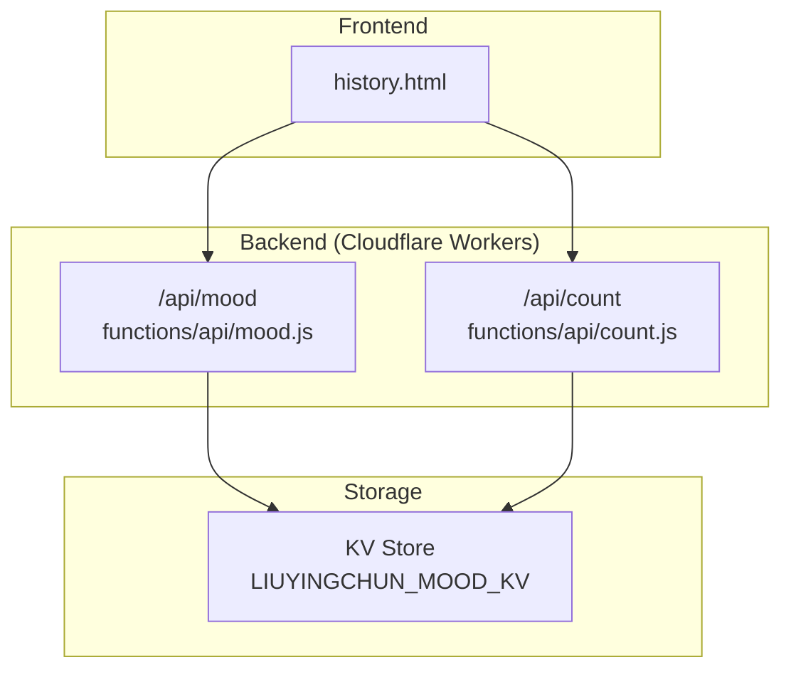
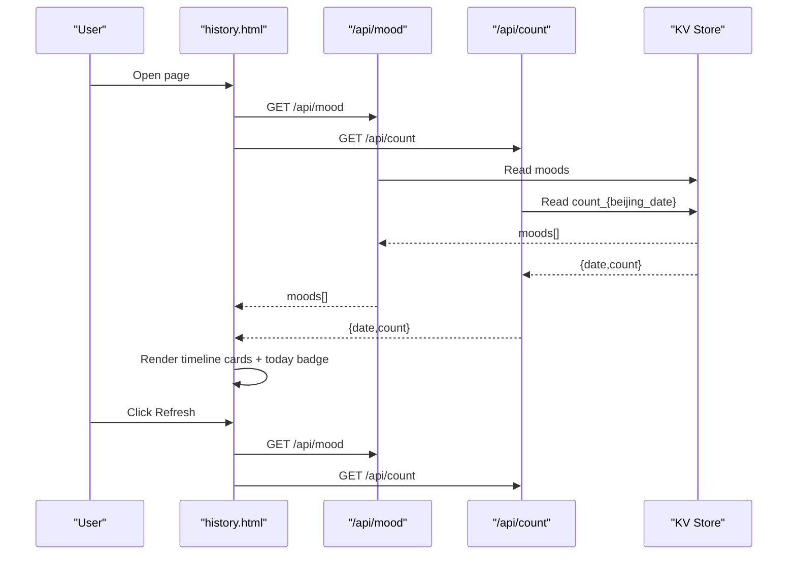
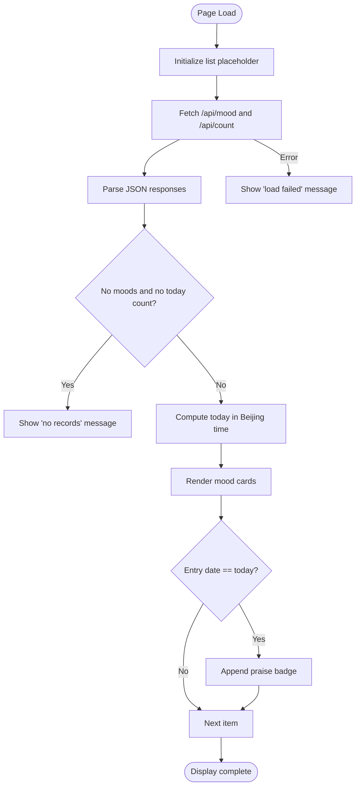
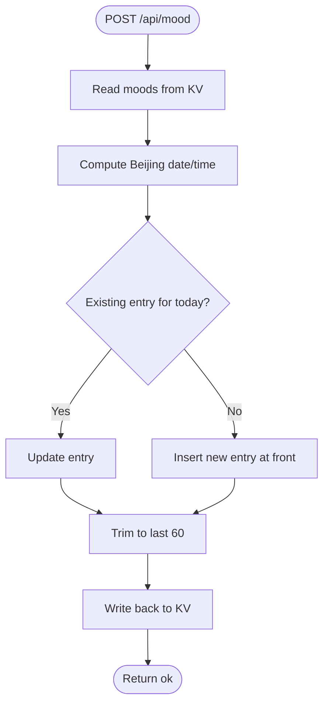
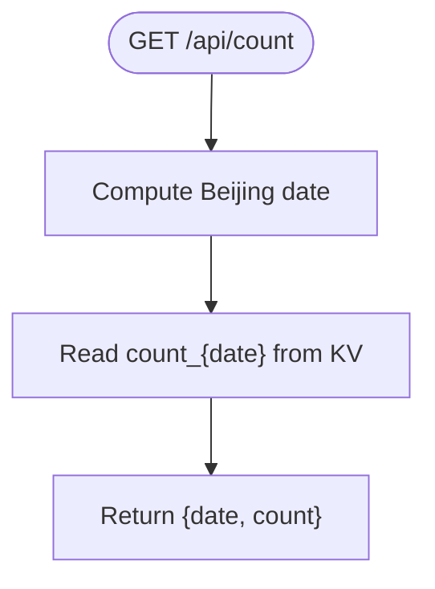
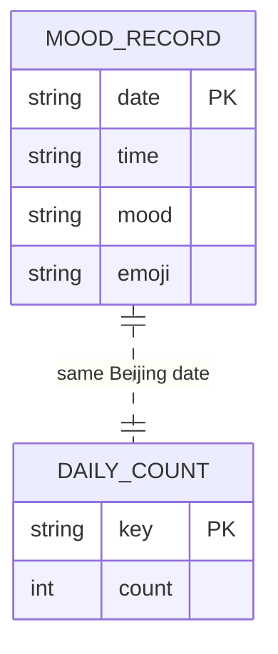
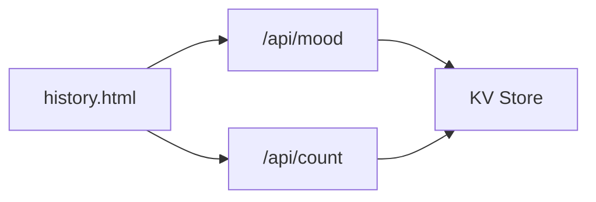

# History Viewer (history.html)

<cite>
**Referenced Files in This Document**
- [history.html](file://history.html)
- [mood.js](file://functions/api/mood.js)
- [count.js](file://functions/api/count.js)
</cite>

## Table of Contents
1. [Introduction](#introduction)
2. [Project Structure](#project-structure)
3. [Core Components](#core-components)
4. [Architecture Overview](#architecture-overview)
5. [Detailed Component Analysis](#detailed-component-analysis)
6. [Dependency Analysis](#dependency-analysis)
7. [Performance Considerations](#performance-considerations)
8. [Troubleshooting Guide](#troubleshooting-guide)
9. [Conclusion](#conclusion)

## Introduction
This document explains the history viewer page that displays past mood records over a rolling 60-day window. It covers:
- Timeline visualization and mood progression
- Grid layout for mood entries with emojis, dates, and optional time stamps
- Responsive design across screen sizes
- Data fetching from the mood API and daily praise count endpoint
- Date formatting with Beijing timezone handling
- Visual representation of mood trends via color-coded cards
- Styling details for timeline cards, mood indicators, and navigation elements
- User interaction patterns for browsing historical data and refreshing

## Project Structure
The project is a small static site with serverless functions providing APIs:
- Frontend: a single HTML page that renders the history viewer
- Backend: two Cloudflare Worker endpoints for mood retrieval and daily praise counts

**Diagram sources**
- [history.html:132-173](file://history.html#L132-L173)
- [mood.js:19-24](file://functions/api/mood.js#L19-L24)
- [count.js:16-22](file://functions/api/count.js#L16-L22)

**Section sources**
- [history.html:1-177](file://history.html#L1-L177)
- [mood.js:1-44](file://functions/api/mood.js#L1-L44)
- [count.js:1-33](file://functions/api/count.js#L1-L33)

## Core Components
- History viewer page (HTML/CSS/JS): Renders a card-based list of mood entries, shows today’s praise count badge when applicable, and provides a refresh button.
- Mood API: Returns an array of mood records (date, time, mood, emoji), limited to the most recent 60 days on write.
- Count API: Provides the number of praises recorded for the current day in Beijing time.

Key responsibilities:
- Fetching and rendering mood data
- Handling Beijing timezone for date/time display
- Showing a “today” badge with praise count
- Error handling and empty states

**Section sources**
- [history.html:132-173](file://history.html#L132-L173)
- [mood.js:19-43](file://functions/api/mood.js#L19-L43)
- [count.js:16-32](file://functions/api/count.js#L16-L32)

## Architecture Overview
The history viewer fetches mood records and today’s praise count concurrently, then renders a timeline-like list. The backend uses a KV store to persist mood entries and daily counts.

**Diagram sources**
- [history.html:132-173](file://history.html#L132-L173)
- [mood.js:19-24](file://functions/api/mood.js#L19-L24)
- [count.js:16-22](file://functions/api/count.js#L16-L22)

## Detailed Component Analysis

### History Viewer Page (history.html)
- Layout and styling:
  - A centered card container with rounded corners and soft shadows
  - Gradient background and pastel palette for a friendly UI
  - List items styled as timeline cards with emoji, mood text, date/time, and optional praise badge
  - A gradient refresh button with hover effect
- Rendering logic:
  - On load, fetch both mood and count endpoints in parallel
  - If no data exists, show an empty state message
  - Compute today’s date using Beijing timezone offset (+8 hours)
  - For each mood entry, render an item card; if the entry date matches today, append a praise badge showing the count
  - Catch network errors and show a failure message
- Interactions:
  - Initial automatic load on page open
  - Manual refresh via the refresh button

**Diagram sources**
- [history.html:132-173](file://history.html#L132-L173)

**Section sources**
- [history.html:7-117](file://history.html#L7-L117)
- [history.html:120-173](file://history.html#L120-L173)

### Mood API (functions/api/mood.js)
- CORS configuration for cross-origin requests
- Beijing timezone helper to compute local date and time strings
- GET handler returns stored mood records as JSON
- POST handler:
  - Accepts mood and emoji
  - Computes Beijing date/time
  - Reads existing moods, updates or inserts the current day’s entry
  - Trims the array to keep only the most recent 60 entries
  - Persists back to KV

**Diagram sources**
- [mood.js:26-43](file://functions/api/mood.js#L26-L43)

**Section sources**
- [mood.js:1-44](file://functions/api/mood.js#L1-L44)

### Count API (functions/api/count.js)
- CORS configuration
- Beijing timezone helper for date-only string
- GET handler returns today’s praise count
- POST handler increments the count for today and persists it

**Diagram sources**
- [count.js:16-22](file://functions/api/count.js#L16-L22)

**Section sources**
- [count.js:1-33](file://functions/api/count.js#L1-L33)

### Data Model and Storage
- Mood record fields:
  - date: YYYY-MM-DD (Beijing)
  - time: HH:mm (Beijing)
  - mood: string label
  - emoji: string symbol
- Daily praise count:
  - Keyed by date in Beijing time
  - Integer counter incremented per praise event

**Diagram sources**
- [mood.js:26-43](file://functions/api/mood.js#L26-L43)
- [count.js:16-32](file://functions/api/count.js#L16-L32)

## Dependency Analysis
- Frontend dependencies:
  - Fetches /api/mood and /api/count
  - Uses DOM manipulation to render cards and badges
- Backend dependencies:
  - Both endpoints depend on KV storage under the LIUYINGCHUN_MOOD_KV namespace
  - Timezone calculation relies on adding 8 hours to UTC to simulate Beijing time

**Diagram sources**
- [history.html:132-173](file://history.html#L132-L173)
- [mood.js:19-43](file://functions/api/mood.js#L19-L43)
- [count.js:16-32](file://functions/api/count.js#L16-L32)

**Section sources**
- [history.html:132-173](file://history.html#L132-L173)
- [mood.js:1-44](file://functions/api/mood.js#L1-L44)
- [count.js:1-33](file://functions/api/count.js#L1-L33)

## Performance Considerations
- Parallel fetching: The page retrieves mood and count data concurrently to reduce total latency.
- Minimal DOM operations: The list is rendered in one pass using array mapping and join.
- Data size control: The backend trims mood records to the most recent 60 entries, limiting payload size.
- Network resilience: Errors are caught and surfaced to the user with a clear message.

[No sources needed since this section provides general guidance]

## Troubleshooting Guide
- No records displayed:
  - Check whether any mood entries exist in KV and whether the count endpoint returns zero for today.
  - Ensure the initial load function runs and that the empty state is not shown due to missing data.
- Network errors:
  - The page shows a failure message when fetch fails; verify connectivity and CORS settings.
- Incorrect date/time:
  - Confirm that the client-side computation of today’s date aligns with the backend’s Beijing timezone offset (+8 hours).
- Refresh behavior:
  - Clicking the refresh button re-invokes the load function; ensure it resets the list before refetching.

**Section sources**
- [history.html:132-173](file://history.html#L132-L173)
- [mood.js:19-43](file://functions/api/mood.js#L19-L43)
- [count.js:16-32](file://functions/api/count.js#L16-L32)

## Conclusion
The history viewer presents a clean, responsive timeline of mood records over the last 60 days. It combines concurrent API calls, Beijing timezone-aware date handling, and simple yet effective visual cues (emojis, colors, and badges) to help users understand mood trends at a glance. The architecture is straightforward, with minimal frontend complexity and clear separation of concerns between the page and serverless endpoints.

[No sources needed since this section summarizes without analyzing specific files]