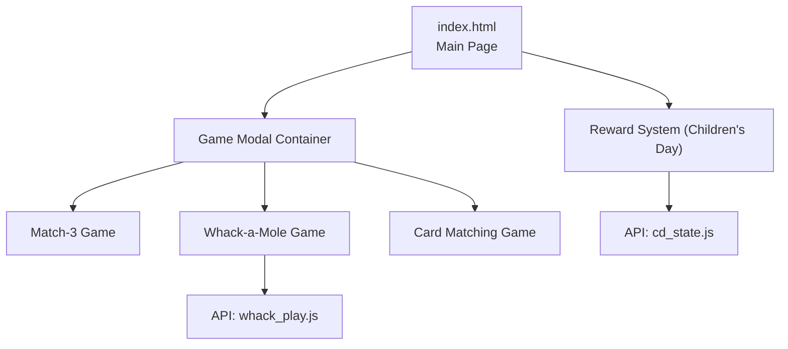
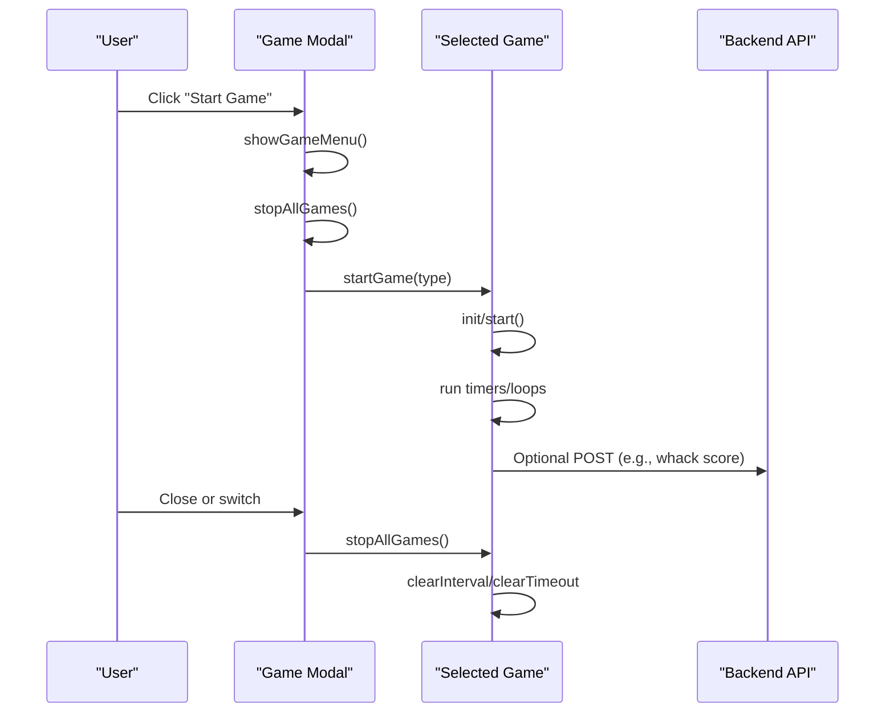
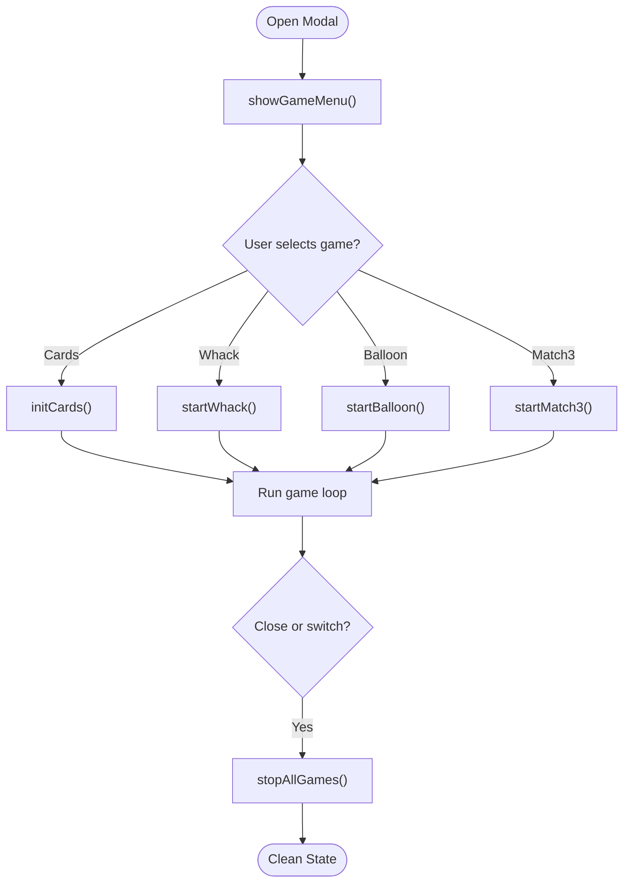
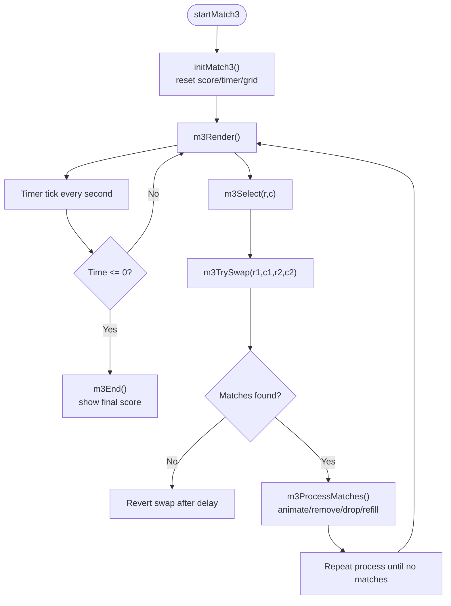
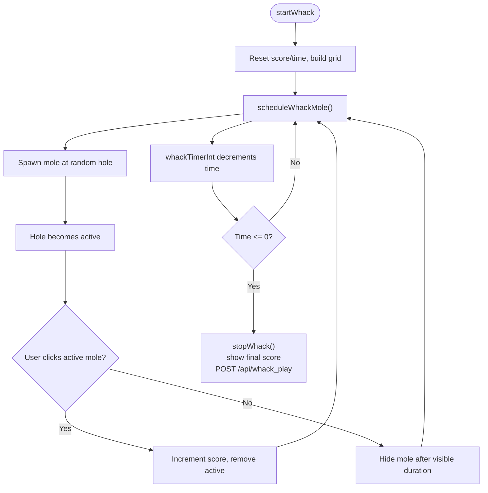
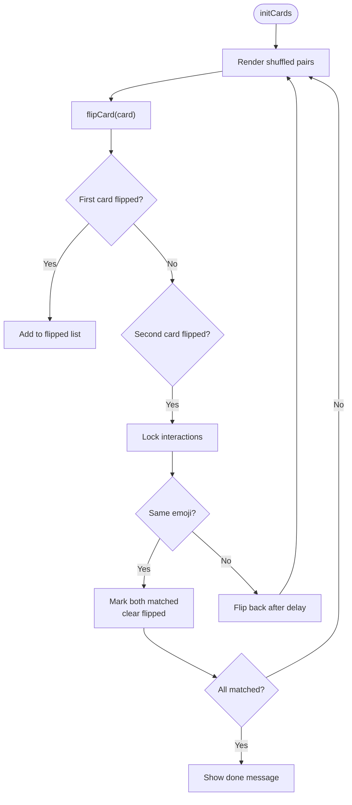
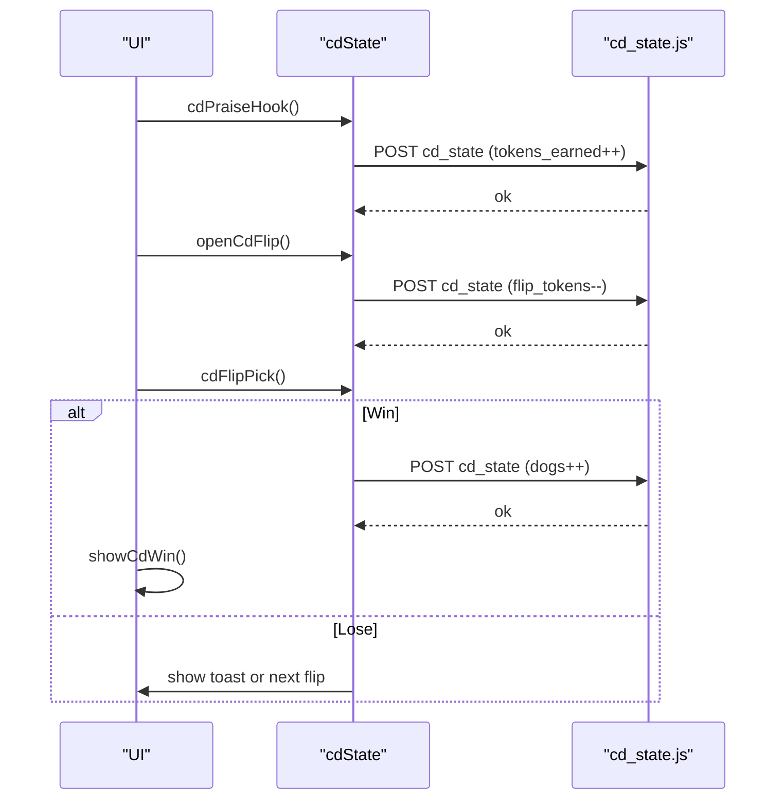
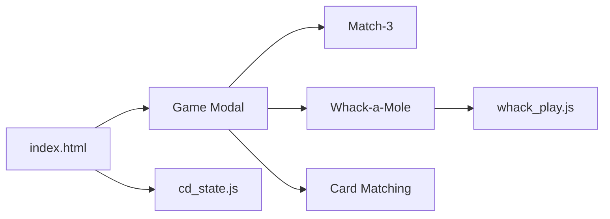

# Game Integration & State Management

<cite>
**Referenced Files in This Document**   
- [index.html](file://index.html)
- [whack_play.js](file://functions/api/whack_play.js)
- [cd_state.js](file://functions/api/cd_state.js)
</cite>

## Table of Contents
1. [Introduction](#introduction)
2. [Project Structure](#project-structure)
3. [Core Components](#core-components)
4. [Architecture Overview](#architecture-overview)
5. [Detailed Component Analysis](#detailed-component-analysis)
6. [Dependency Analysis](#dependency-analysis)
7. [Performance Considerations](#performance-considerations)
8. [Troubleshooting Guide](#troubleshooting-guide)
9. [Conclusion](#conclusion)

## Introduction
This document explains how individual games integrate with the modal system, including initialization, state synchronization, resource management, and memory cleanup. It also details the game switching mechanism between whack-a-mole, match-3, and card matching games, event handling patterns, performance monitoring for smooth transitions, examples of game container setup, state persistence across sessions, and integration with the reward system.

## Project Structure
The application is a single-page interface that hosts multiple mini-games inside a bottom modal. The main page provides UI, styles, and shared utilities. Each game has its own lifecycle functions and DOM containers within the modal. Backend APIs persist game-related state and scores.

**Diagram sources**
- [index.html:2477-2546](file://index.html#L2477-L2546)
- [whack_play.js:1-44](file://functions/api/whack_play.js#L1-L44)
- [cd_state.js:1-28](file://functions/api/cd_state.js#L1-L28)

**Section sources**
- [index.html:2477-2546](file://index.html#L2477-L2546)
- [whack_play.js:1-44](file://functions/api/whack_play.js#L1-L44)
- [cd_state.js:1-28](file://functions/api/cd_state.js#L1-L28)

## Core Components
- Game Modal Container: A unified modal that hosts all games, manages visibility, title updates, and global stop/reset actions.
- Match-3 Game: Grid-based puzzle with timer, score tracking, swap validation, cascading matches, and end-state display.
- Whack-a-Mole Game: Timed click game with dynamic difficulty, scoring, and optional reward integration.
- Card Matching Game: Flip-and-match pairs with move counting and completion detection.
- Reward System: Children’s Day activity that tracks tokens, flip opportunities, dog collection, and win/gift screens.

Key responsibilities:
- Initialization: Each game exposes start/init functions to set up timers, grids, and state.
- Switching: Centralized function hides other games and shows the selected one.
- Cleanup: Centralized stopAllGames clears intervals and resets states.
- Persistence: Reward state persists via API; game scores are local during session.

**Section sources**
- [index.html:2674-2711](file://index.html#L2674-L2711)
- [index.html:2713-2839](file://index.html#L2713-L2839)
- [index.html:2841-2889](file://index.html#L2841-L2889)
- [index.html:2891-2993](file://index.html#L2891-L2993)
- [index.html:3473-3705](file://index.html#L3473-L3705)

## Architecture Overview
The modal acts as a host for multiple game instances. When a user selects a game, the system stops any running games, switches visibility, initializes the new game, and starts its loop. On closing or switching, it ensures all timers and intervals are cleared to prevent leaks.

**Diagram sources**
- [index.html:2674-2711](file://index.html#L2674-L2711)
- [index.html:2713-2839](file://index.html#L2713-L2839)
- [index.html:2891-2993](file://index.html#L2891-L2993)
- [whack_play.js:29-43](file://functions/api/whack_play.js#L29-L43)

## Detailed Component Analysis

### Game Modal and Switching Mechanism
- Container: The modal includes menu and four game sections (cards, whack, balloon, match3).
- Switching: startGame toggles visibility and sets the modal title.
- Global Stop: stopAllGames calls stop functions for each game to ensure clean state.

**Diagram sources**
- [index.html:2674-2711](file://index.html#L2674-L2711)
- [index.html:2713-2839](file://index.html#L2713-L2839)
- [index.html:2891-2993](file://index.html#L2891-L2993)

**Section sources**
- [index.html:2674-2711](file://index.html#L2674-L2711)

### Match-3 Game
- Initialization: Sets score, timer, grid size, palette, and generates initial grid without pre-existing matches.
- Interaction: Validates adjacent swaps; if no match, reverts swap after delay.
- Processing: Finds matches, animates removal, drops tiles, refills, and repeats until no matches remain.
- End State: Shows final score and reset button.

**Diagram sources**
- [index.html:2713-2839](file://index.html#L2713-L2839)

**Section sources**
- [index.html:2713-2839](file://index.html#L2713-L2839)

### Whack-a-Mole Game
- Initialization: Resets score/time, builds grid, schedules moles with increasing speed based on elapsed time.
- Interaction: Click active mole to score; hide mole after visible duration.
- Timer: Decrements time; when zero, stops game, shows final score, posts score to backend, and optionally grants flip token for reward system.
- Cleanup: Clears all scheduled timeouts and intervals.

**Diagram sources**
- [index.html:2891-2993](file://index.html#L2891-L2993)
- [whack_play.js:29-43](file://functions/api/whack_play.js#L29-L43)

**Section sources**
- [index.html:2891-2993](file://index.html#L2891-L2993)
- [whack_play.js:1-44](file://functions/api/whack_play.js#L1-L44)

### Card Matching Game
- Initialization: Creates shuffled pairs, renders cards, resets flipped/moves/lock state.
- Interaction: Flips two cards; if match, marks matched; else flips back after delay.
- Completion: Detects when all cards are matched and shows done message.

**Diagram sources**
- [index.html:2841-2889](file://index.html#L2841-L2889)

**Section sources**
- [index.html:2841-2889](file://index.html#L2841-L2889)

### Reward System Integration
- Tokens: Earned per praise; daily reset logic ensures fresh tokens each day.
- Flip Tokens: Granted when whack score reaches threshold; persisted via API.
- Collection: Collect dogs through flip game; upon reaching target, show gift screen.
- Persistence: State saved to backend KV store; UI updates reflect current state.

**Diagram sources**
- [index.html:3473-3705](file://index.html#L3473-L3705)
- [cd_state.js:1-28](file://functions/api/cd_state.js#L1-L28)

**Section sources**
- [index.html:3473-3705](file://index.html#L3473-L3705)
- [cd_state.js:1-28](file://functions/api/cd_state.js#L1-L28)

## Dependency Analysis
- index.html depends on:
  - DOM elements for modal and game containers.
  - Local storage for temporary state (e.g., dog name, eye care mode).
  - Backend APIs for persistent state (whack plays, children’s day state).
- Backend APIs depend on:
  - KV storage for persistent data.
  - Request context for CORS and metadata.

**Diagram sources**
- [index.html:2477-2546](file://index.html#L2477-L2546)
- [whack_play.js:1-44](file://functions/api/whack_play.js#L1-L44)
- [cd_state.js:1-28](file://functions/api/cd_state.js#L1-L28)

**Section sources**
- [index.html:2477-2546](file://index.html#L2477-L2546)
- [whack_play.js:1-44](file://functions/api/whack_play.js#L1-L44)
- [cd_state.js:1-28](file://functions/api/cd_state.js#L1-L28)

## Performance Considerations
- Timer Management: Each game uses setInterval/clearInterval and setTimeout/clearTimeout; centralized stopAllGames prevents leaks.
- DOM Updates: Games render grids by innerHTML; avoid excessive reflows by batching updates where possible.
- Animation: CSS animations used for visual feedback; keep animation durations short to maintain responsiveness.
- Network Calls: POST requests for scores and state are fire-and-forget with error suppression to avoid blocking UI.

[No sources needed since this section provides general guidance]

## Troubleshooting Guide
- Game not starting: Ensure showGameMenu clears previous game state and startGame sets correct visibility.
- Timers not stopping: Verify stopAllGames calls stop functions for all active games.
- State not persisting: Check API endpoints and KV keys; ensure POST payloads match expected schema.
- Reward flow broken: Confirm flip tokens and dogs counters update correctly and UI reflects changes.

**Section sources**
- [index.html:2674-2711](file://index.html#L2674-L2711)
- [index.html:2891-2993](file://index.html#L2891-L2993)
- [whack_play.js:29-43](file://functions/api/whack_play.js#L29-L43)
- [cd_state.js:21-27](file://functions/api/cd_state.js#L21-L27)

## Conclusion
The modal system provides a robust host for multiple mini-games with clear lifecycle management, state synchronization, and resource cleanup. The architecture separates concerns between UI, game logic, and backend persistence, enabling smooth transitions and reliable state management. Integrating rewards enhances engagement while maintaining performance and usability.

[No sources needed since this section summarizes without analyzing specific files]