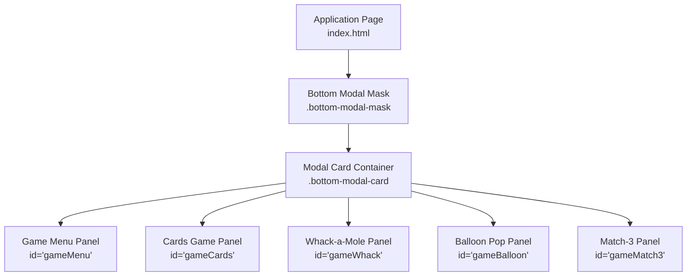
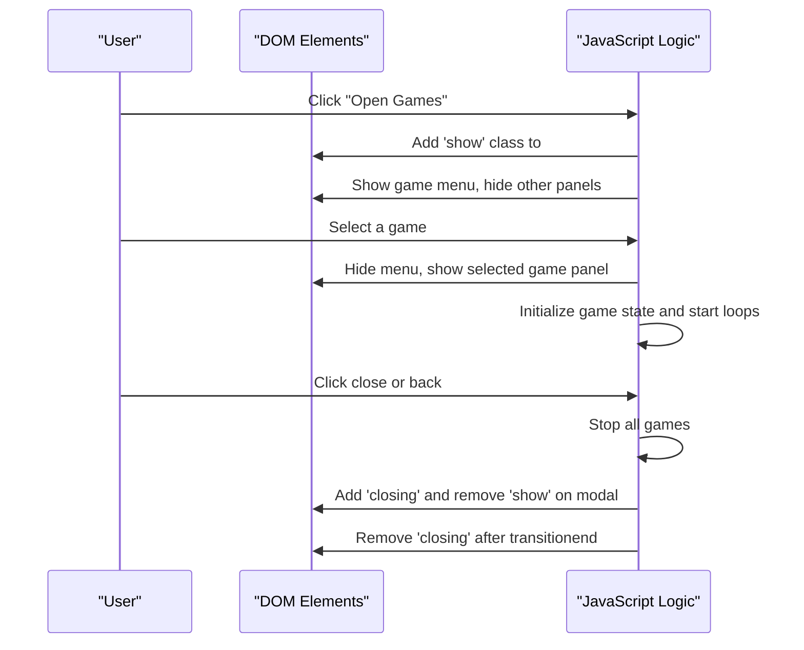
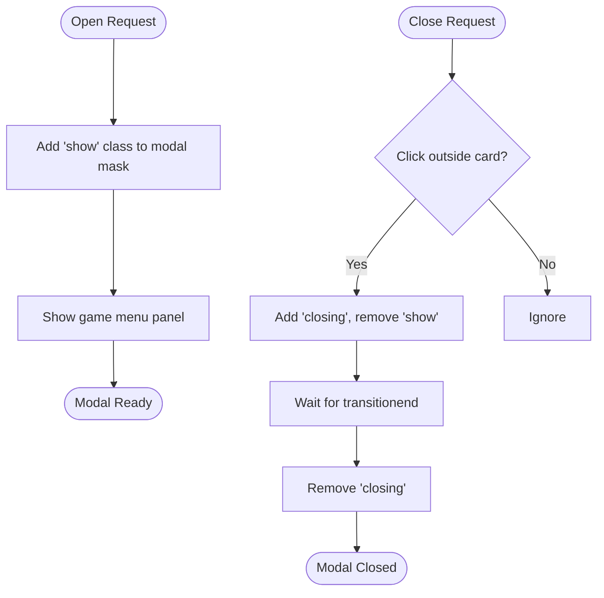
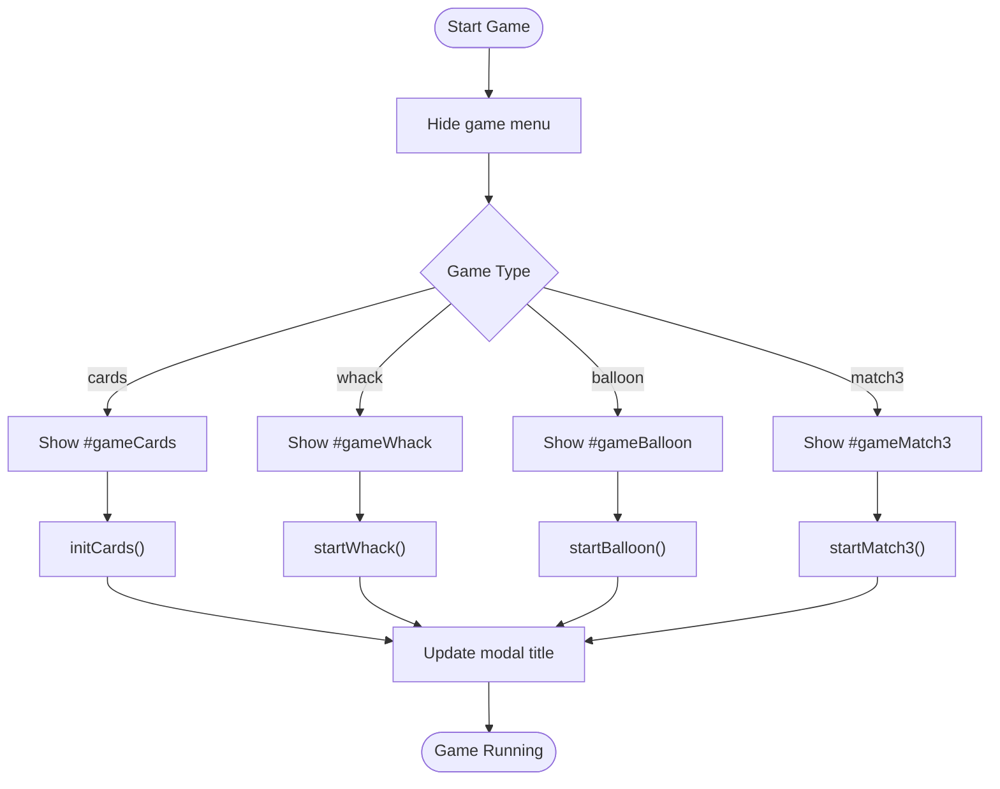
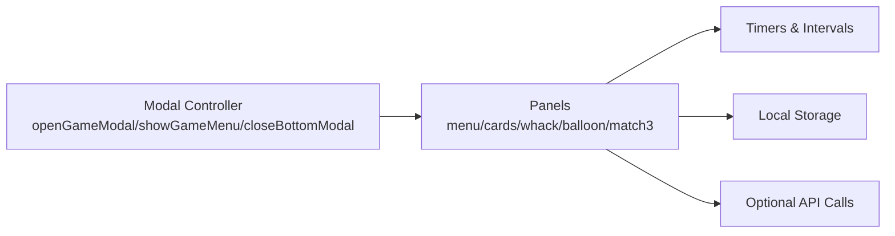

# Game Modal System

<cite>
**Referenced Files in This Document**
- [index.html](file://index.html)
</cite>

## Table of Contents
1. [Introduction](#introduction)
2. [Project Structure](#project-structure)
3. [Core Components](#core-components)
4. [Architecture Overview](#architecture-overview)
5. [Detailed Component Analysis](#detailed-component-analysis)
6. [Dependency Analysis](#dependency-analysis)
7. [Performance Considerations](#performance-considerations)
8. [Troubleshooting Guide](#troubleshooting-guide)
9. [Conclusion](#conclusion)

## Introduction
This document explains the game modal system implemented in the application. It covers the bottom modal architecture, overlay management, and game container structure. It also documents the modal lifecycle (open/close animations), game switching logic, state persistence across mini-games, responsive design, touch gesture handling, and performance optimizations for smooth animations. Examples include CSS class names used by the modal system and JavaScript event handlers that control behavior.

## Project Structure
The game modal system is implemented within a single-page application file. The relevant parts include:
- A reusable bottom modal mask and card pattern for overlays
- A dedicated game modal with a menu and multiple game containers
- JavaScript functions to open, switch, and close games
- CSS classes for responsive layout and animation transitions

**Diagram sources**
- [index.html:753-802](file://index.html#L753-L802)
- [index.html:2477-2533](file://index.html#L2477-L2533)

**Section sources**
- [index.html:753-802](file://index.html#L753-L802)
- [index.html:2477-2533](file://index.html#L2477-L2533)

## Core Components
- Bottom modal mask and card: Provides a consistent overlay and animated card container for modals.
- Game modal: A specific modal instance containing a game menu and multiple game panels.
- Game switching logic: Centralized function to show/hide game panels and update the modal title.
- Lifecycle helpers: Functions to open the game modal, return to the menu, and stop all running games.
- Close handler: Unified close logic with transition support and click-outside-to-close behavior.

Key responsibilities:
- Overlay management via CSS classes and z-index layering
- Animation transitions for opening and closing
- State isolation per game panel
- Event delegation for user interactions

**Section sources**
- [index.html:753-802](file://index.html#L753-L802)
- [index.html:2477-2533](file://index.html#L2477-L2533)
- [index.html:2674-2711](file://index.html#L2674-L2711)
- [index.html:3042-3048](file://index.html#L3042-L3048)

## Architecture Overview
The modal system uses a layered approach:
- The page body contains the main UI and a fixed overlay mask for modals.
- Each modal consists of a mask element and a card container.
- The game modal includes a menu and several mutually exclusive game panels.
- JavaScript toggles visibility and manages timers and state per game.

**Diagram sources**
- [index.html:2674-2711](file://index.html#L2674-L2711)
- [index.html:3042-3048](file://index.html#L3042-L3048)

## Detailed Component Analysis

### Bottom Modal Architecture
- Mask: Fixed overlay with backdrop blur, opacity transition, and pointer-events gating.
- Card: Centered container with scale/opacity transitions; supports open and closing states.
- Header: Title and close button; close triggers unified lifecycle.

CSS classes:
- `.bottom-modal-mask`
- `.bottom-modal-mask.show`
- `.bottom-modal-mask.closing`
- `.bottom-modal-card`
- `.bottom-modal-header`
- `.bottom-modal-title`
- `.bottom-modal-close`

Behavior:
- Opening adds `.show`; closing adds `.closing` then removes `.show`.
- Click outside the card closes the modal.

**Section sources**
- [index.html:753-802](file://index.html#L753-L802)
- [index.html:3042-3048](file://index.html#L3042-L3048)

### Game Modal Structure
- ID: `gameModal`
- Header: Title updates based on active game; close button stops all games before closing.
- Panels:
  - Game menu: Grid of buttons to start games.
  - Cards game: Grid of cards with flip/match logic.
  - Whack-a-mole: 3x3 grid with timed spawning and scoring.
  - Balloon pop: Floating balloons with click-to-pop.
  - Match-3: 7x7 grid with swap and match detection.

HTML elements:
- `#gameMenu`
- `#gameCards`
- `#gameWhack`
- `#gameBalloon`
- `#gameMatch3`
- `#cardGrid`
- `#whackGrid`
- `#balloonArea`
- `#m3Grid`

**Section sources**
- [index.html:2477-2533](file://index.html#L2477-L2533)

### Modal Lifecycle (Open/Close Animations)
- Open:
  - `openGameModal()` adds `.show` to the modal mask and shows the game menu.
- Close:
  - `closeBottomModal(id, e)` validates click target, adds `.closing`, removes `.show`, and cleans up `.closing` after `transitionend`.

Animation details:
- Mask opacity transition controls overlay fade-in/out.
- Card transform and opacity transitions provide scale-based entrance/exit.

**Diagram sources**
- [index.html:2674-2677](file://index.html#L2674-L2677)
- [index.html:3042-3048](file://index.html#L3042-L3048)

**Section sources**
- [index.html:2674-2677](file://index.html#L2674-L2677)
- [index.html:3042-3048](file://index.html#L3042-L3048)

### Game Switching Logic
- `startGame(type)`:
  - Hides the menu.
  - Shows the corresponding game panel.
  - Updates the modal title.
  - Initializes and starts the selected game.
- `showGameMenu()`:
  - Stops all games.
  - Resets session flags.
  - Shows the menu and hides all game panels.
  - Restores default title.
- `stopAllGames()`:
  - Calls stop functions for each game to clear intervals and timers.

**Diagram sources**
- [index.html:2690-2711](file://index.html#L2690-L2711)

**Section sources**
- [index.html:2690-2711](file://index.html#L2690-L2711)

### State Persistence Across Mini-Games
- Local storage usage:
  - Praise count and mood data are persisted locally when network requests fail.
  - Children’s Day activity state (tokens, dogs, flip tokens) is saved to local storage and synced to the server when possible.
- Session flags:
  - `cdWhackSession` tracks whether a whack session came from a challenge flow.
- Game-specific state:
  - Each game maintains its own variables (scores, timers, grids) and clears them on stop/reset.

Examples:
- Optimistic count increment with fallback to localStorage.
- Children’s Day state save/update functions.

**Section sources**
- [index.html:2650-2663](file://index.html#L2650-L2663)
- [index.html:3500-3525](file://index.html#L3500-L3525)
- [index.html:3587-3595](file://index.html#L3587-L3595)

### Responsive Modal Design
- Media queries adjust layout for smaller screens.
- Side panels and history panels are hidden on mobile.
- Modal card width and padding adapt to screen size.
- Game grids use flexible layouts and relative units.

Key patterns:
- Use of percentage widths and min/max constraints.
- Flexbox and grid for responsive arrangement.
- Touch-friendly button sizes and spacing.

**Section sources**
- [index.html:805-809](file://index.html#L805-L809)
- [index.html:1717-1756](file://index.html#L1717-L1756)

### Touch Gesture Handling
- Pointer events for draggable widget:
  - Handles both touch and mouse inputs.
  - Distinguishes between drag and tap/pet actions.
  - Prevents default scrolling during drag.
- Modal interaction:
  - Click-outside-to-close relies on event target validation.

Implementation highlights:
- Passive vs non-passive listeners for scroll performance.
- Threshold checks to differentiate taps from drags.
- Dynamic direction flipping based on movement vector.

**Section sources**
- [index.html:4283-4336](file://index.html#L4283-L4336)
- [index.html:3042-3048](file://index.html#L3042-L3048)

### Performance Optimization for Smooth Animations
- CSS transitions over JavaScript-driven animations where possible.
- Debounced and throttled operations for frequent updates.
- Interval cleanup in stop functions to prevent memory leaks.
- Minimal DOM manipulation during render cycles.

Best practices observed:
- Using `transitionend` to clean up transient classes.
- Clearing intervals and timeouts in stop functions.
- Avoiding heavy computations inside animation frames.

**Section sources**
- [index.html:3042-3048](file://index.html#L3042-L3048)
- [index.html:2988-2993](file://index.html#L2988-L2993)
- [index.html:3037-3040](file://index.html#L3037-L3040)

### Examples of Modal CSS Classes
- Overlay mask:
  - `.bottom-modal-mask`
  - `.bottom-modal-mask.show`
  - `.bottom-modal-mask.closing`
- Card container:
  - `.bottom-modal-card`
- Header and controls:
  - `.bottom-modal-header`
  - `.bottom-modal-title`
  - `.bottom-modal-close`
- Game UI:
  - `.game-menu-grid`
  - `.game-menu-item`
  - `.game-back`
  - `.card-grid`
  - `.whack-grid`
  - `.balloon-area`

**Section sources**
- [index.html:753-802](file://index.html#L753-L802)
- [index.html:1717-1756](file://index.html#L1717-L1756)

### Examples of JavaScript Event Handlers
- Open modal:
  - `openGameModal()`
- Show menu:
  - `showGameMenu()`
- Start game:
  - `startGame(type)`
- Stop all games:
  - `stopAllGames()`
- Close modal:
  - `closeBottomModal(id, e)`
- Game-specific handlers:
  - `initCards()`, `flipCard(card)`
  - `startWhack()`, `whackHit(hole, idx)`, `stopWhack()`
  - `startBalloon()`, `spawnBalloon()`, `stopBalloon()`
  - `startMatch3()`, `m3Select(r, c)`, `m3ProcessMatches()`, `stopMatch3()`

**Section sources**
- [index.html:2674-2711](file://index.html#L2674-L2711)
- [index.html:2845-2889](file://index.html#L2845-L2889)
- [index.html:2929-2993](file://index.html#L2929-L2993)
- [index.html:2999-3040](file://index.html#L2999-L3040)
- [index.html:2720-2839](file://index.html#L2720-L2839)
- [index.html:3042-3048](file://index.html#L3042-L3048)

### Game Integration Patterns
- Panel visibility toggling using inline styles (`display`).
- Title synchronization with active game.
- Centralized stop/cleanup to ensure no overlapping timers.
- Optional integration with external APIs for scores and state.

Patterns observed:
- Consistent initialization and teardown per game.
- Event delegation for dynamic elements (e.g., dynamically created cards).
- Graceful error handling for network calls.

**Section sources**
- [index.html:2690-2711](file://index.html#L2690-L2711)
- [index.html:2957-2961](file://index.html#L2957-L2961)

## Dependency Analysis
The modal system depends on:
- DOM elements for masks, cards, and game panels.
- CSS classes for styling and transitions.
- JavaScript functions for lifecycle and game logic.
- Optional API endpoints for persistence and analytics.

**Diagram sources**
- [index.html:2674-2711](file://index.html#L2674-L2711)
- [index.html:2988-2993](file://index.html#L2988-L2993)
- [index.html:3037-3040](file://index.html#L3037-L3040)
- [index.html:2650-2663](file://index.html#L2650-L2663)

**Section sources**
- [index.html:2674-2711](file://index.html#L2674-L2711)
- [index.html:2988-2993](file://index.html#L2988-L2993)
- [index.html:3037-3040](file://index.html#L3037-L3040)
- [index.html:2650-2663](file://index.html#L2650-L2663)

## Performance Considerations
- Prefer CSS transitions for simple state changes (opacity, transform).
- Ensure all intervals and timeouts are cleared when games stop or modals close.
- Minimize reflows by batching DOM updates.
- Use passive event listeners for scroll-heavy interactions.
- Avoid heavy computations inside animation callbacks.

[No sources needed since this section provides general guidance]

## Troubleshooting Guide
Common issues and resolutions:
- Modal does not close:
  - Verify click target validation in close handler.
  - Ensure `.closing` and `.show` classes are managed correctly.
- Game continues running after closing modal:
  - Confirm `stopAllGames()` is called before closing.
  - Check that each game’s stop function clears intervals/timeouts.
- Animations feel laggy:
  - Reduce unnecessary DOM manipulations.
  - Use CSS transforms and opacity for animations.
- Touch gestures interfere with scrolling:
  - Ensure passive listeners are used appropriately.
  - Prevent default only when necessary during drag.

**Section sources**
- [index.html:3042-3048](file://index.html#L3042-L3048)
- [index.html:2988-2993](file://index.html#L2988-L2993)
- [index.html:3037-3040](file://index.html#L3037-L3040)
- [index.html:4283-4336](file://index.html#L4283-L4336)

## Conclusion
The game modal system provides a robust, responsive, and performant overlay mechanism for mini-games. It uses a consistent bottom modal architecture with clear lifecycle management, centralized game switching logic, and careful state handling. The implementation emphasizes smooth animations, touch-friendly interactions, and clean separation of concerns across game panels. By following the documented patterns and best practices, developers can extend the system with new games while maintaining consistency and performance.

[No sources needed since this section summarizes without analyzing specific files]