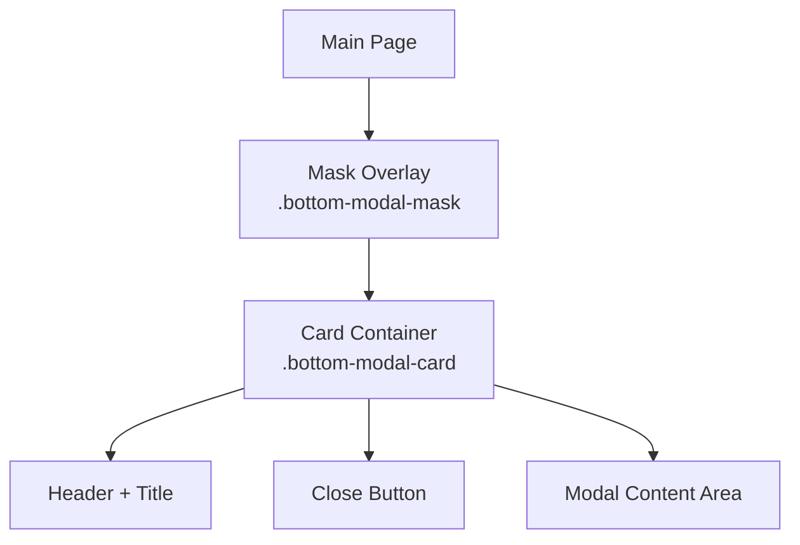
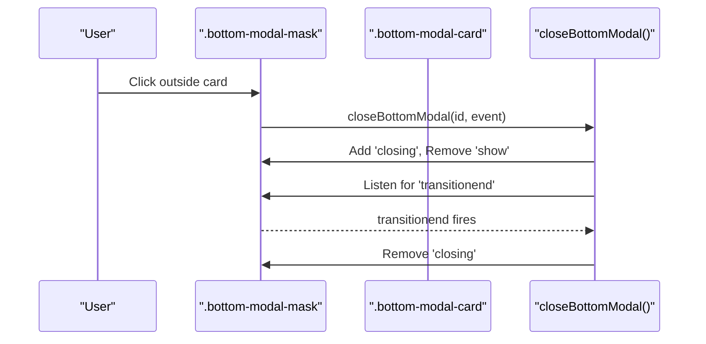
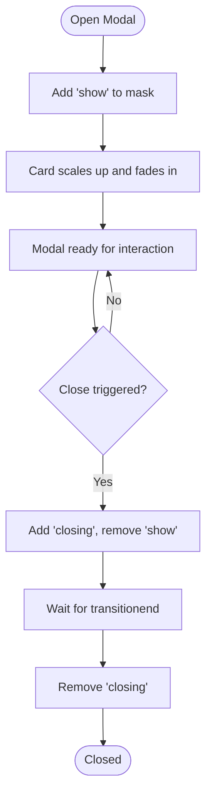
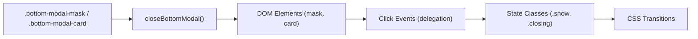

# Modal Architecture & Lifecycle

<cite>
**Referenced Files in This Document**
- [index.html](file://index.html)
</cite>

## Table of Contents
1. [Introduction](#introduction)
2. [Project Structure](#project-structure)
3. [Core Components](#core-components)
4. [Architecture Overview](#architecture-overview)
5. [Detailed Component Analysis](#detailed-component-analysis)
6. [Dependency Analysis](#dependency-analysis)
7. [Performance Considerations](#performance-considerations)
8. [Troubleshooting Guide](#troubleshooting-guide)
9. [Conclusion](#conclusion)

## Introduction
This document explains the modal system architecture used in the application, focusing on mask overlays, card containers, and animation transitions. It covers the modal lifecycle (open/close), event delegation patterns, accessibility considerations for keyboard navigation and screen readers, CSS class structure (.bottom-modal-mask, .bottom-modal-card), JavaScript state management, responsive design patterns, initialization examples, animation timing functions, and performance optimization techniques for smooth transitions.

## Project Structure
The modal system is implemented within a single-page application where HTML markup, CSS styles, and JavaScript logic coexist in one file. The modal overlay and its content are defined inline with the rest of the UI. Key elements include:
- Mask overlay container: .bottom-modal-mask
- Card container: .bottom-modal-card
- Header and close button inside the card
- Multiple modal instances (e.g., history modal, game modal) sharing the same visual pattern

[No sources needed since this diagram shows conceptual workflow, not actual code structure]

**Section sources**
- [index.html:753-802](file://index.html#L753-L802)
- [index.html:2467-2546](file://index.html#L2467-L2546)

## Core Components
- Mask overlay (.bottom-modal-mask): Fixed-position backdrop that captures clicks to close the modal when clicking outside the card. It uses opacity and pointer-events to control visibility and interaction.
- Card container (.bottom-modal-card): Centered content panel with gradient background, rounded corners, scrollable content area, and transition-driven scale/opacity animations.
- Header and close button: Provide title context and an explicit close action.
- Event delegation: Clicks on the mask trigger closeBottomModal only when the click target is the mask itself, preventing accidental closes when interacting with card content.

Key responsibilities:
- Visual layering via z-index and backdrop blur
- Animation states via CSS classes (.show, .closing)
- Safe closing behavior through event delegation
- Scrollable content within constrained viewport height

**Section sources**
- [index.html:753-802](file://index.html#L753-L802)
- [index.html:2467-2546](file://index.html#L2467-L2546)
- [index.html:3042-3048](file://index.html#L3042-L3048)

## Architecture Overview
The modal system follows a simple overlay pattern:
- Opening: Add .show to the mask; the card scales up and fades in.
- Closing: Add .closing and remove .show; after transitionend, remove .closing.
- Event delegation: The mask’s onclick handler ensures only background clicks close the modal.
- Accessibility: Escape key handling is present elsewhere in the page; modal-specific focus management can be added to improve keyboard navigation.

**Diagram sources**
- [index.html:753-802](file://index.html#L753-L802)
- [index.html:3042-3048](file://index.html#L3042-L3048)

## Detailed Component Analysis

### CSS Classes and Animations
- .bottom-modal-mask
  - Fixed overlay covering the viewport
  - Uses backdrop-filter blur for depth
  - Controls visibility via opacity and pointer-events
  - Transition duration: 0.28s ease
- .bottom-modal-card
  - Gradient background, rounded corners, shadow
  - Scales from 0.92 to 1 and fades in/out
  - Max-height 72vh with overflow-y auto for scrolling
- State classes
  - .show: Enables mask and card visibility
  - .closing: Triggers fade-out/scale-down before cleanup

Animation timing functions:
- Ease curves are applied consistently across transitions for smoothness.
- Card transform and opacity transitions are synchronized with mask opacity changes.

Responsive design:
- The card adapts to mobile viewports using percentage widths and max-height constraints.
- Padding and font sizes adjust for smaller screens.

**Section sources**
- [index.html:753-802](file://index.html#L753-L802)

### JavaScript Lifecycle Methods
- closeBottomModal(id, e)
  - Validates click target to ensure only mask clicks close the modal
  - Adds .closing and removes .show to initiate closing animation
  - Listens for transitionend to remove .closing once animation completes
- openGameModal()
  - Opens the game modal by showing the mask and card
  - Used by buttons like “张玲的摸鱼小游戏”

Initialization example:
- Buttons call openGameModal() to display the game modal.
- Close actions call closeBottomModal('gameModal') or closeBottomModal('historyModal').

**Diagram sources**
- [index.html:3042-3048](file://index.html#L3042-L3048)
- [index.html:2440-2441](file://index.html#L2440-L2441)
- [index.html:2477-2482](file://index.html#L2477-L2482)

**Section sources**
- [index.html:3042-3048](file://index.html#L3042-L3048)
- [index.html:2440-2441](file://index.html#L2440-L2441)
- [index.html:2477-2482](file://index.html#L2477-L2482)

### Event Delegation Patterns
- Mask-level onclick delegates closing to closeBottomModal only when the clicked element is the mask itself.
- Prevents unintended closures when users interact with card content (buttons, links, inputs).
- Ensures consistent UX across multiple modal instances.

Best practices:
- Always pass the event object to validate target identity.
- Avoid attaching per-element listeners for close actions; rely on mask delegation.

**Section sources**
- [index.html:3042-3048](file://index.html#L3042-L3048)
- [index.html:2467-2482](file://index.html#L2467-L2482)

### Accessibility Considerations
Keyboard navigation and screen readers:
- Escape key handling exists elsewhere in the page; consider adding modal-specific focus trapping and returning focus to the trigger element upon close.
- Ensure the close button has accessible labels and roles.
- Use aria-hidden on underlying content when modal is open.
- Announce modal state changes to screen readers using aria-live regions if dynamic content updates occur.

Recommendations:
- Add role="dialog" and aria-modal="true" to the mask or card.
- Focus the first interactive element inside the modal when opened.
- Trap focus within the modal until closed.

[No sources needed since this section provides general guidance]

### Responsive Design Patterns
- The card uses width: 100% with max-width constraints to fit various screen sizes.
- Max-height 72vh prevents overflow beyond the viewport.
- Padding and typography adapt to smaller devices.
- Backdrop blur and shadows remain effective across devices.

**Section sources**
- [index.html:753-802](file://index.html#L753-L802)

## Dependency Analysis
The modal system depends on:
- CSS classes for visual states and animations
- JavaScript functions for lifecycle control
- DOM elements for mask and card containers
- Event handlers for user interactions

**Diagram sources**
- [index.html:753-802](file://index.html#L753-L802)
- [index.html:3042-3048](file://index.html#L3042-L3048)

**Section sources**
- [index.html:753-802](file://index.html#L753-L802)
- [index.html:3042-3048](file://index.html#L3042-L3048)

## Performance Considerations
- Prefer CSS transitions over JavaScript animations for smoother performance.
- Use requestAnimationFrame for any JS-driven animations to sync with the browser repaint cycle.
- Minimize layout thrashing by batching DOM reads/writes.
- Debounce or throttle frequent events (e.g., resize) if recalculating positions.
- Avoid heavy computations during modal open/close; defer non-critical tasks.
- Use will-change sparingly for animated properties to hint the compositor.

[No sources needed since this section provides general guidance]

## Troubleshooting Guide
Common issues and resolutions:
- Modal does not close on background click
  - Verify that the onclick handler checks e.target against the mask element.
  - Ensure no child elements intercept the click without stopping propagation.
- Closing animation does not complete
  - Confirm that transitionend listener is attached and removes .closing.
  - Check for conflicting CSS that might prevent transitions.
- Keyboard navigation not working
  - Add Escape key handling specific to the modal.
  - Implement focus trapping and return focus to the trigger element.
- Screen reader announcements missing
  - Add aria-live regions or update aria attributes to reflect modal state.

**Section sources**
- [index.html:3042-3048](file://index.html#L3042-L3048)

## Conclusion
The modal system leverages a straightforward overlay pattern with clear separation between mask and card components. Its lifecycle is managed through CSS state classes and a concise JavaScript function that handles closing animations safely via event delegation. For improved accessibility, add focus management and ARIA attributes. Performance is optimized by relying on CSS transitions and minimizing expensive operations during state changes.

[No sources needed since this section summarizes without analyzing specific files]