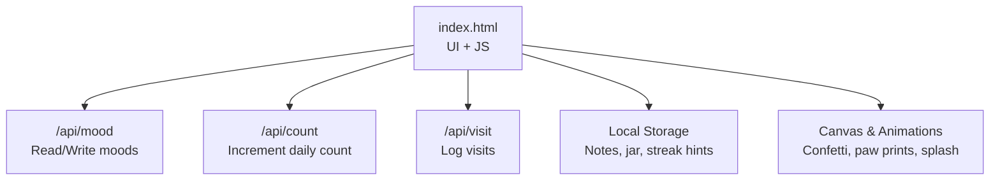
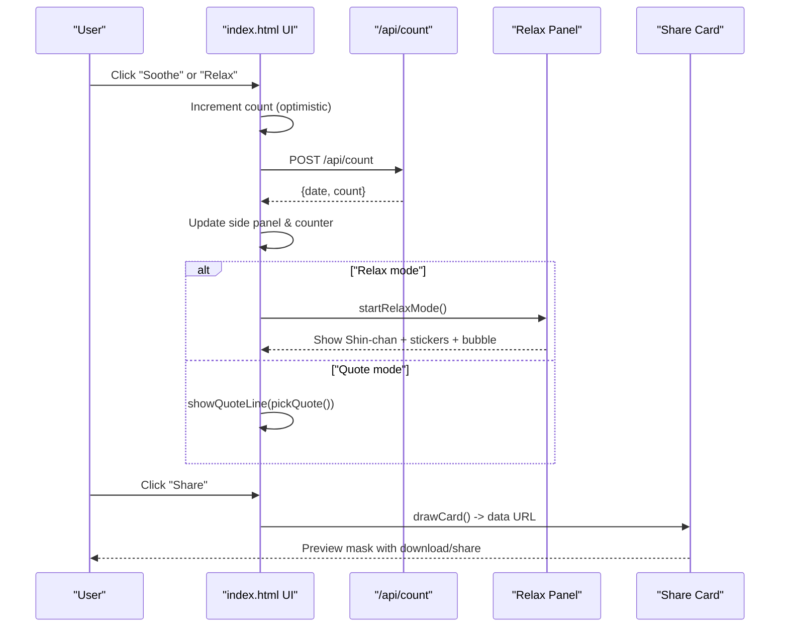
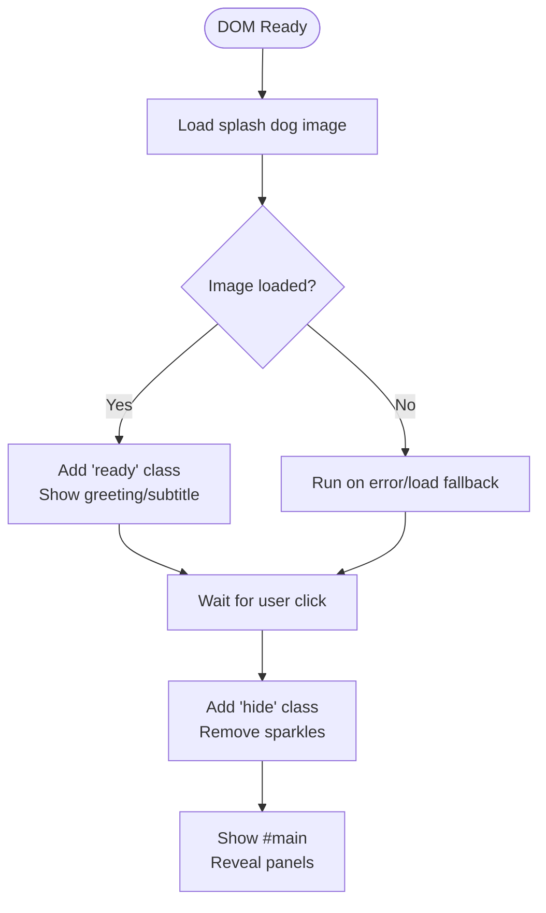
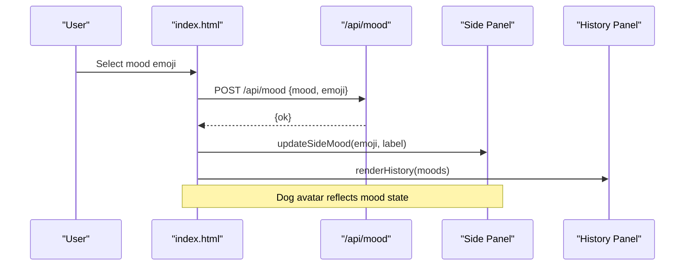
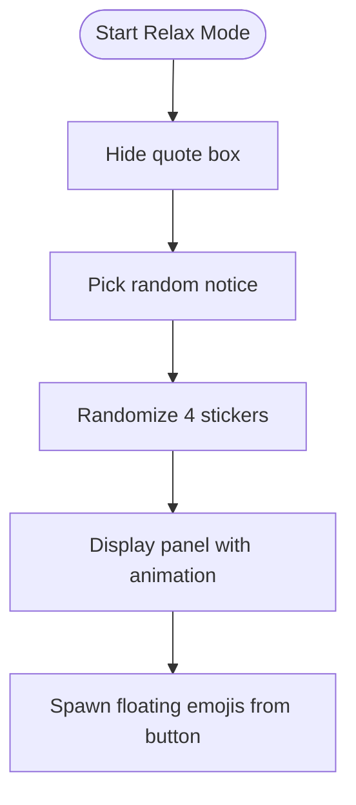
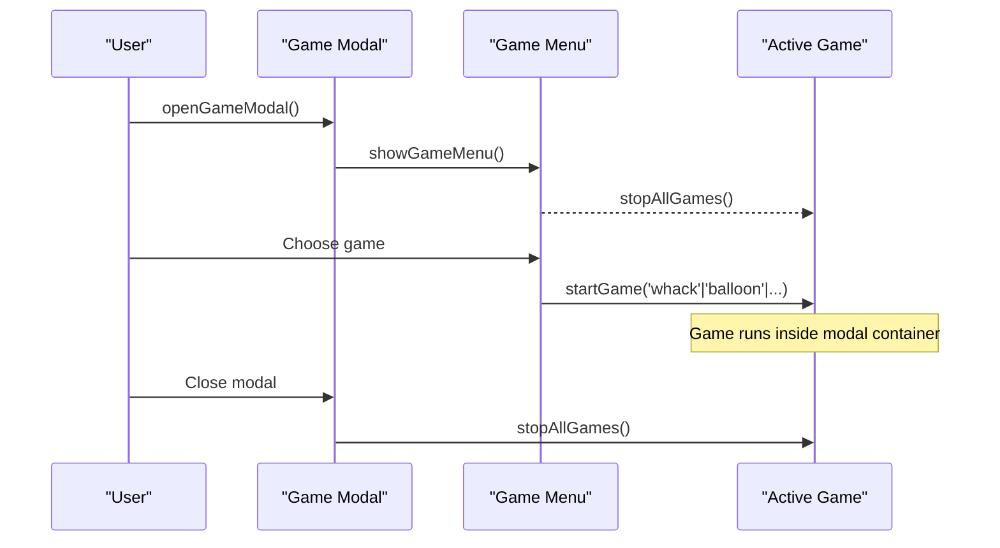
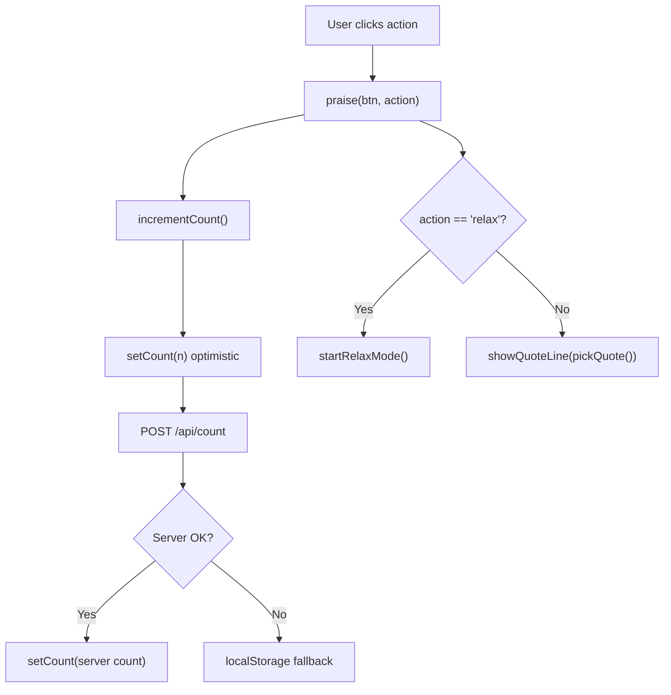
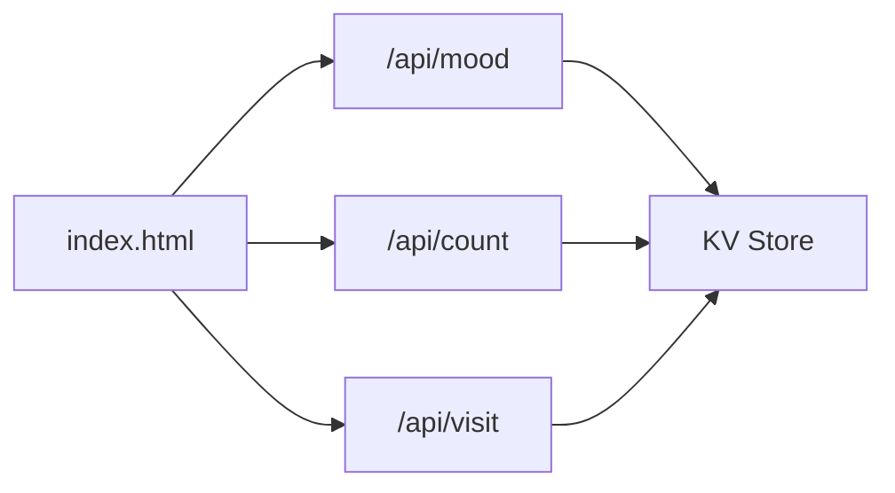

# Main Application (index.html)

<cite>
**Referenced Files in This Document**
- [index.html](file://index.html)
- [mood.js](file://functions/api/mood.js)
- [count.js](file://functions/api/count.js)
- [visit.js](file://functions/api/visit.js)
</cite>

## Table of Contents
1. [Introduction](#introduction)
2. [Project Structure](#project-structure)
3. [Core Components](#core-components)
4. [Architecture Overview](#architecture-overview)
5. [Detailed Component Analysis](#detailed-component-analysis)
6. [Dependency Analysis](#dependency-analysis)
7. [Performance Considerations](#performance-considerations)
8. [Troubleshooting Guide](#troubleshooting-guide)
9. [Conclusion](#conclusion)

## Introduction
This document explains the main application interface implemented in index.html. It covers:
- Splash screen with an animated dog character and greeting system
- Mood tracking interface with emoji selection and daily counter
- Relaxation panel featuring Shin-chan animations and motivational quotes
- Game modal system for mini-games
- Responsive design using CSS custom properties and media queries for a mobile-first approach
- JavaScript architecture for event handling, mood recording, counter updates, modal interactions, and API communication
- UI component system including side panels for statistics, history display, and bottom modals for games
- Styling approach with glassmorphism effects, animations, and theme consistency

## Project Structure
The application is a single-page HTML file that embeds all styles and scripts. It integrates with serverless functions to persist mood entries, daily praise counts, and visit logs.

**Diagram sources**
- [index.html:3741-3780](file://index.html#L3741-L3780)
- [index.html:2650-2663](file://index.html#L2650-L2663)
- [index.html:3828-3870](file://index.html#L3828-L3870)
- [mood.js:19-43](file://functions/api/mood.js#L19-L43)
- [count.js:16-32](file://functions/api/count.js#L16-L32)
- [visit.js:33-48](file://functions/api/visit.js#L33-L48)

**Section sources**
- [index.html:1-175](file://index.html#L1-L175)
- [index.html:3741-3780](file://index.html#L3741-L3780)
- [mood.js:1-44](file://functions/api/mood.js#L1-L44)
- [count.js:1-33](file://functions/api/count.js#L1-L33)
- [visit.js:1-49](file://functions/api/visit.js#L1-L49)

## Core Components
- Splash Screen: Animated dog image, staggered greeting lines, optional Children’s Day sparkles, and click-to-dismiss transition into the main content.
- Quote Box: Displays randomized encouraging quotes with smooth reveal transitions.
- Action Buttons: “Soothe” and “Relax” buttons trigger mood recording, counter increment, quote display, and relaxation mode.
- Relaxation Panel: Shows Shin-chan animation, floating stickers, and a bubble with a notice; triggered by “Relax”.
- Side Panels: Left panel shows live stats (count, today’s mood); right panel shows recent mood history. On mobile, history moves inline.
- Bottom Modals: Game menu and game containers; also used for preview, reflection, and jar views.
- Share Card Generator: Renders current quote and mood into a shareable image via Canvas.
- Eye Care Mode: Optional warm color overlay and adjusted themes.

**Section sources**
- [index.html:32-152](file://index.html#L32-L152)
- [index.html:217-325](file://index.html#L217-L325)
- [index.html:313-422](file://index.html#L313-L422)
- [index.html:547-718](file://index.html#L547-L718)
- [index.html:753-800](file://index.html#L753-L800)
- [index.html:1089-1205](file://index.html#L1089-L1205)
- [index.html:1207-1315](file://index.html#L1207-L1315)
- [index.html:1317-1386](file://index.html#L1317-L1386)
- [index.html:1389-1568](file://index.html#L1389-L1568)
- [index.html:3211-3375](file://index.html#L3211-L3375)

## Architecture Overview
The app follows a client-side SPA pattern with minimal DOM manipulation and clear separation between UI state and persistence:
- UI state: counters, selected mood, active panels/modals
- Persistence: KV-backed APIs for moods and counts; local storage for notes and jar
- Event-driven flow: user actions trigger optimistic UI updates, then API calls, then re-renders or animations

**Diagram sources**
- [index.html:3107-3145](file://index.html#L3107-L3145)
- [index.html:3147-3171](file://index.html#L3147-L3171)
- [index.html:2650-2663](file://index.html#L2650-L2663)
- [index.html:3211-3375](file://index.html#L3211-L3375)

## Detailed Component Analysis

### Splash Screen Implementation
- Animated dog image enters with bounce and float keyframes; greeting and subtitle fade in with delays.
- Optional Children’s Day sparkles are injected dynamically when enabled.
- Dismissal triggers a smooth transition to the main content and reveals side/history panels.

**Diagram sources**
- [index.html:3741-3780](file://index.html#L3741-L3780)
- [index.html:3713-3736](file://index.html#L3713-L3736)
- [index.html:120-127](file://index.html#L120-L127)

**Section sources**
- [index.html:32-152](file://index.html#L32-L152)
- [index.html:3741-3780](file://index.html#L3741-L3780)
- [index.html:3713-3736](file://index.html#L3713-L3736)

### Mood Tracking Interface
- Emoji selection sets the active mood and updates the dog state.
- Each action increments the daily praise counter with optimistic UI update, followed by server sync.
- Today’s mood is fetched and displayed in the left panel; history renders in both desktop and mobile layouts.

**Diagram sources**
- [index.html:3828-3870](file://index.html#L3828-L3870)
- [mood.js:19-43](file://functions/api/mood.js#L19-L43)

**Section sources**
- [index.html:3828-3870](file://index.html#L3828-L3870)
- [mood.js:1-44](file://functions/api/mood.js#L1-L44)

### Relaxation Panel with Shin-chan Animations
- Triggered by “Relax”; hides quote box and shows a stage with Shin-chan image, bubble notice, and floating stickers.
- Uses CSS animations for bounce, float, and sticker entrance/floating.

**Diagram sources**
- [index.html:3147-3171](file://index.html#L3147-L3171)
- [index.html:3377-3391](file://index.html#L3377-L3391)

**Section sources**
- [index.html:313-422](file://index.html#L313-L422)
- [index.html:3147-3171](file://index.html#L3147-L3171)
- [index.html:3377-3391](file://index.html#L3377-L3391)

### Game Modal System
- Bottom modal hosts a game menu and multiple game canvets/containers.
- Functions manage opening/closing, stopping previous games, and switching views.
- Special integration with Children’s Day activity to launch challenge games and flip-card rewards.

**Diagram sources**
- [index.html:2669-2687](file://index.html#L2669-L2687)
- [index.html:3587-3595](file://index.html#L3587-L3595)

**Section sources**
- [index.html:2669-2687](file://index.html#L2669-L2687)
- [index.html:3587-3595](file://index.html#L3587-L3595)

### Responsive Design Patterns
- Mobile-first layout with base styles optimized for small screens and progressive enhancement for larger viewports.
- Media queries adjust spacing, hide side panels on mobile, and switch history to inline grid.
- CSS custom properties drive dynamic animation timing and sparkle positioning.

Key patterns:
- Viewport-based adjustments for body alignment and padding
- Conditional visibility of side/history panels below breakpoints
- Flexible sizing for images and cards using min(), vw units
- Custom properties for animation durations and delays

**Section sources**
- [index.html:25-30](file://index.html#L25-L30)
- [index.html:191-195](file://index.html#L191-L195)
- [index.html:501-519](file://index.html#L501-L519)
- [index.html:805-809](file://index.html#L805-L809)
- [index.html:120-127](file://index.html#L120-L127)

### JavaScript Architecture
- Event handling: Button clicks trigger praise flow, which updates counters, shows quotes or relax mode, and launches animations.
- Counter updates: Optimistic UI increment followed by server synchronization; offline fallback stores locally.
- Modal interactions: Centralized open/close functions with consistent transitions and backdrop behavior.
- API communication: Fetch-based calls to /api/mood, /api/count, /api/visit with CORS headers handled by serverless functions.

**Diagram sources**
- [index.html:3107-3145](file://index.html#L3107-L3145)
- [index.html:2650-2663](file://index.html#L2650-L2663)

**Section sources**
- [index.html:3107-3145](file://index.html#L3107-L3145)
- [index.html:2650-2663](file://index.html#L2650-L2663)
- [index.html:3828-3870](file://index.html#L3828-L3870)

### UI Component System
- Side panels: Left panel displays live count and today’s mood; right panel lists recent moods. Both use glassmorphism styling and subtle animations.
- History display: Desktop uses a scrollable list; mobile switches to a compact grid.
- Bottom modals: Used for games, previews, reflections, and jar views with consistent masks and card transitions.

**Section sources**
- [index.html:547-718](file://index.html#L547-L718)
- [index.html:753-800](file://index.html#L753-L800)
- [index.html:1089-1205](file://index.html#L1089-L1205)
- [index.html:1207-1315](file://index.html#L1207-L1315)
- [index.html:1389-1568](file://index.html#L1389-L1568)

### Styling Approach
- Glassmorphism: Semi-transparent backgrounds with backdrop-filter blur and soft borders create depth and focus.
- Animations: Keyframes for splash dog bounce/float, quote reveal, counter jiggle, confetti particles, and background paw prints.
- Theme consistency: Warm palette with accent colors; eye care mode adjusts backgrounds and surfaces for reduced contrast.

**Section sources**
- [index.html:217-230](file://index.html#L217-L230)
- [index.html:274-325](file://index.html#L274-L325)
- [index.html:521-545](file://index.html#L521-L545)
- [index.html:3393-3453](file://index.html#L3393-L3453)
- [index.html:1317-1386](file://index.html#L1317-L1386)

## Dependency Analysis
- Client dependencies:
  - DOM elements for panels, modals, and animations
  - Canvas for confetti and share card generation
  - Local storage for notes and jar entries
- Server dependencies:
  - /api/mood: GET returns mood list; POST saves/upserts today’s mood
  - /api/count: GET returns today’s count; POST increments it
  - /api/visit: POST logs visit metadata

**Diagram sources**
- [index.html:3741-3780](file://index.html#L3741-L3780)
- [mood.js:19-43](file://functions/api/mood.js#L19-L43)
- [count.js:16-32](file://functions/api/count.js#L16-L32)
- [visit.js:33-48](file://functions/api/visit.js#L33-L48)

**Section sources**
- [index.html:3741-3780](file://index.html#L3741-L3780)
- [mood.js:1-44](file://functions/api/mood.js#L1-L44)
- [count.js:1-33](file://functions/api/count.js#L1-L33)
- [visit.js:1-49](file://functions/api/visit.js#L1-L49)

## Performance Considerations
- Optimistic UI updates reduce perceived latency for counter increments.
- Canvas animations are throttled via requestAnimationFrame and cleaned up when empty.
- Background paw prints and sparkles are lightweight DOM nodes with CSS-only animations.
- Image preloading for splash assets improves initial animation timing.

[No sources needed since this section provides general guidance]

## Troubleshooting Guide
- If the splash dog does not animate, ensure the image loads successfully; fallback logic triggers even on error.
- If mood history appears empty, check network connectivity to /api/mood; fallback messages are shown on failure.
- If the daily count does not increment, verify /api/count POST succeeds; offline writes are stored locally but may not sync until online.
- For share card issues, confirm canvas rendering completes before displaying the preview mask.

**Section sources**
- [index.html:3741-3780](file://index.html#L3741-L3780)
- [index.html:3828-3870](file://index.html#L3828-L3870)
- [index.html:3211-3375](file://index.html#L3211-L3375)

## Conclusion
The main application delivers a cohesive, mobile-first experience with thoughtful animations, accessible interactions, and reliable data persistence. The modular structure separates UI concerns from API interactions, enabling smooth transitions, responsive layouts, and consistent theming across components.

[No sources needed since this section summarizes without analyzing specific files]