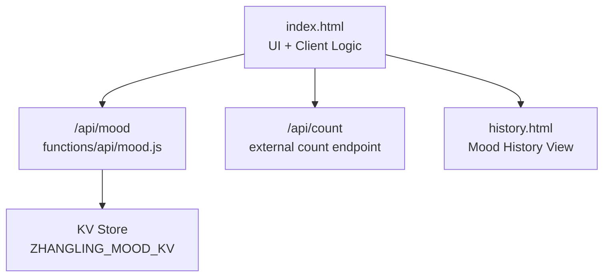
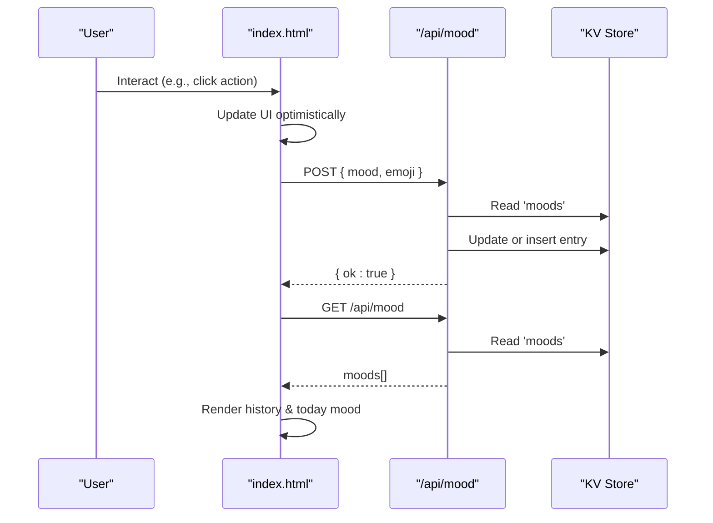
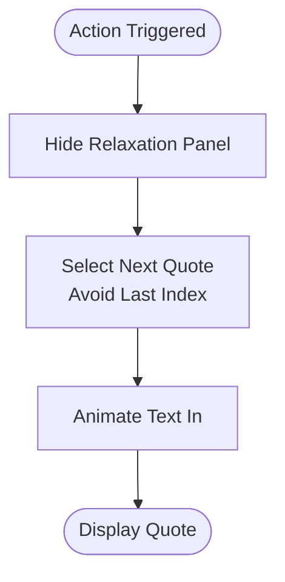
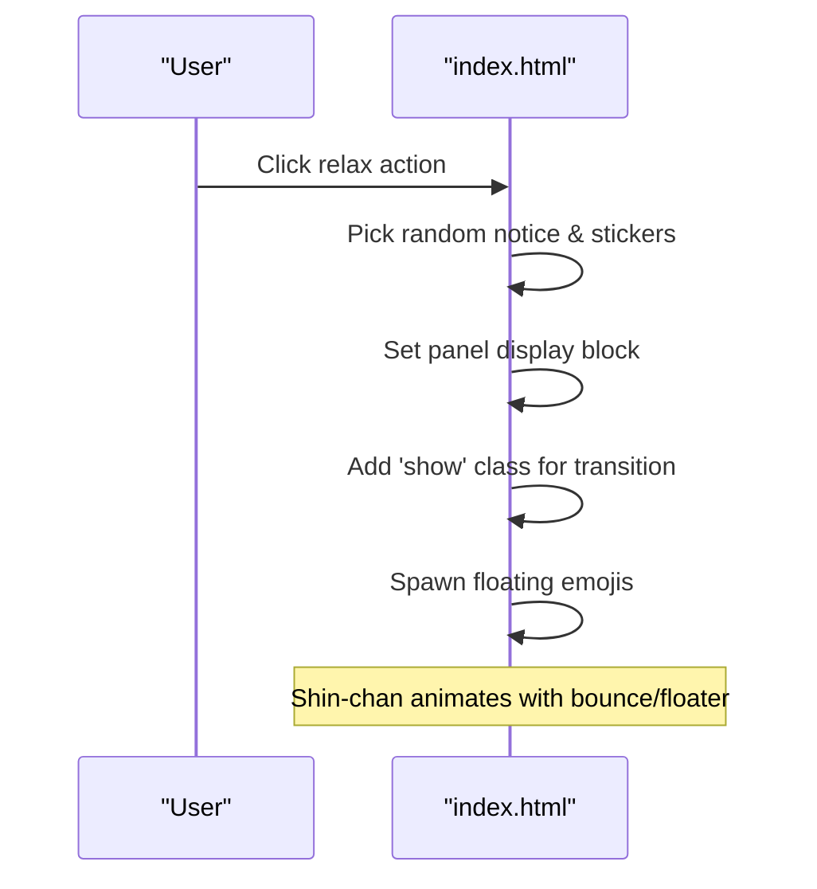
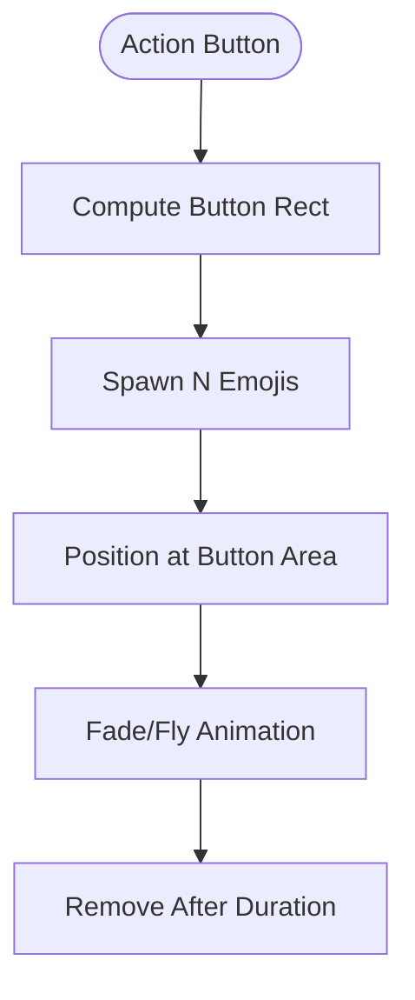
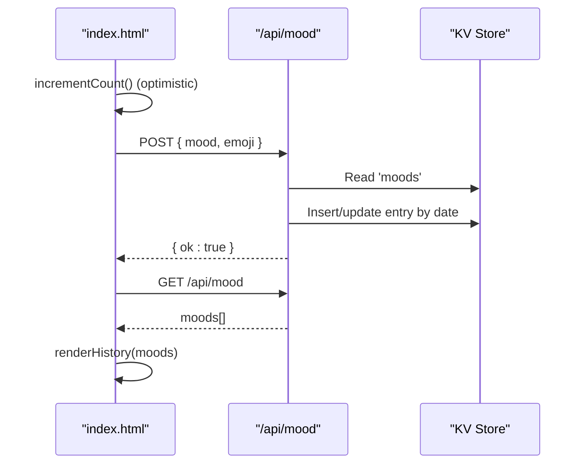
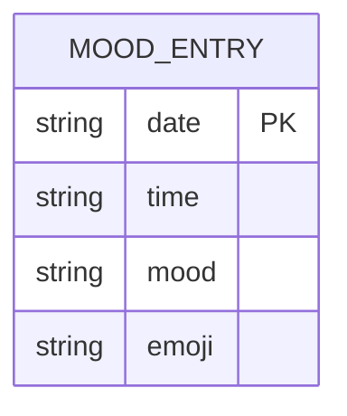
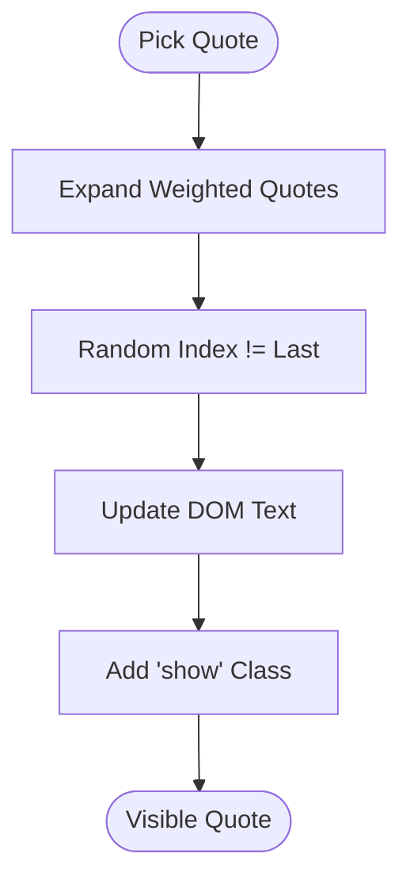
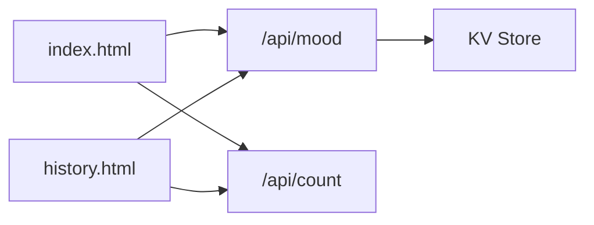

# Mood Tracking Interface

<cite>
**Referenced Files in This Document**
- [index.html](file://index.html)
- [functions/api/mood.js](file://functions/api/mood.js)
- [history.html](file://history.html)
</cite>

## Table of Contents
1. [Introduction](#introduction)
2. [Project Structure](#project-structure)
3. [Core Components](#core-components)
4. [Architecture Overview](#architecture-overview)
5. [Detailed Component Analysis](#detailed-component-analysis)
6. [Dependency Analysis](#dependency-analysis)
7. [Performance Considerations](#performance-considerations)
8. [Troubleshooting Guide](#troubleshooting-guide)
9. [Conclusion](#conclusion)
10. [Appendices](#appendices)

## Introduction
This document explains the mood tracking interface components, focusing on:
- Quote box system with Shin-chan background and motivational quotes
- Relaxation panel with Shin-chan animations, bubble messages, and floating stickers
- Mood recording workflow including state management, API communication, and optimistic UI updates
- Styling approach using glassmorphism effects, gradient backgrounds, and a consistent color scheme
- Examples of mood data structure, emoji mapping, and time-based quote rotation logic

The interface is implemented as a single-page application with embedded styles and scripts, backed by serverless API functions for persistence.

## Project Structure
The project centers around a main HTML page that contains all UI markup, styling, and client-side logic. A serverless API function handles mood data persistence. A separate history page visualizes stored moods.

**Diagram sources**
- [index.html:2383-2396](file://index.html#L2383-L2396)
- [functions/api/mood.js:19-43](file://functions/api/mood.js#L19-L43)
- [history.html:132-176](file://history.html#L132-L176)

**Section sources**
- [index.html:1-200](file://index.html#L1-L200)
- [functions/api/mood.js:1-44](file://functions/api/mood.js#L1-L44)
- [history.html:132-176](file://history.html#L132-L176)

## Core Components
- Quote Box: Displays rotating motivational quotes with fade-in transitions and a subtle paw decoration. It hides when switching to relaxation mode.
- Relaxation Panel: Shows a Shin-chan image with bounce/floating animation, a bubble message, and four floating stickers that animate independently.
- Emoji Selection Mechanism: Floating emojis spawn from the action button area to provide playful feedback during interactions.
- Side Panels: Left panel shows counters and current mood; right panel shows historical entries. Mobile uses an embedded grid view.
- Share Card: Generates a canvas-based card image with gradients, shadows, and text wrapping for sharing or saving.

Key behaviors:
- Clicking the primary action triggers either a quote display or relaxation mode based on the action type.
- The relaxation panel toggles visibility with smooth transitions and random content selection.
- The share flow renders a high-resolution card via Canvas and offers preview/download.

**Section sources**
- [index.html:274-311](file://index.html#L274-L311)
- [index.html:313-422](file://index.html#L313-L422)
- [index.html:3377-3391](file://index.html#L3377-L3391)
- [index.html:3211-3341](file://index.html#L3211-L3341)

## Architecture Overview
The interface follows a client-driven architecture:
- User interactions trigger local state changes (optimistic UI).
- Quotes and relaxation content are selected locally from arrays.
- Mood data is persisted via a serverless API that reads/writes to a key-value store.
- History is rendered both in side panels and a dedicated history page.

**Diagram sources**
- [index.html:3107-3124](file://index.html#L3107-L3124)
- [index.html:3828-3842](file://index.html#L3828-L3842)
- [functions/api/mood.js:26-43](file://functions/api/mood.js#L26-L43)

## Detailed Component Analysis

### Quote Box System
- Visuals: Gradient background, rounded corners, paw decoration, and animated text reveal.
- Behavior: On action, hide relaxation panel, show quote with fade-in transition.
- Content Rotation: Uses a weighted pool expanded from quotes with weights, ensuring no immediate repeat of the last quote.

**Diagram sources**
- [index.html:3134-3145](file://index.html#L3134-L3145)
- [index.html:3126-3132](file://index.html#L3126-L3132)

**Section sources**
- [index.html:274-311](file://index.html#L274-L311)
- [index.html:2577-2623](file://index.html#L2577-L2623)
- [index.html:3126-3145](file://index.html#L3126-L3145)

### Relaxation Panel with Shin-chan Animations
- Visuals: Stage with radial and linear gradients, inset shadow, border, and overflow hidden.
- Elements:
  - Shin-chan image with bounce and float animations.
  - Bubble message positioned above with a tail pseudo-element.
  - Four floating stickers with staggered positions and independent float animations.
- Behavior: Random notice and sticker selection; panel reveals with transition; floating emojis spawn from the action button.

**Diagram sources**
- [index.html:3147-3171](file://index.html#L3147-L3171)
- [index.html:3377-3391](file://index.html#L3377-L3391)

**Section sources**
- [index.html:313-422](file://index.html#L313-L422)
- [index.html:2601-2617](file://index.html#L2601-L2617)
- [index.html:3147-3171](file://index.html#L3147-L3171)

### Emoji Selection Mechanism
- Floating emojis spawn from the action button’s bounding rectangle with staggered delays and random selection from a small set.
- Emojis are appended to the body and removed after a short duration to avoid clutter.

**Diagram sources**
- [index.html:3377-3391](file://index.html#L3377-L3391)

**Section sources**
- [index.html:3377-3391](file://index.html#L3377-L3391)

### Mood Recording Workflow
- State Management:
  - Local counter increments immediately (optimistic update), then reconciles with server response.
  - Today’s mood loaded from API and used to update side panel and dog state.
  - History rendered from fetched moods array.
- API Communication:
  - GET /api/mood returns moods array.
  - POST /api/mood sends { mood, emoji }, persists to KV, and returns success.
  - Timezone handling ensures Beijing date/time consistency across client and server.
- Optimistic UI Updates:
  - Counter increments before network call; if network fails, falls back to localStorage.
  - History refreshes after successful load.

**Diagram sources**
- [index.html:2650-2661](file://index.html#L2650-L2661)
- [index.html:3828-3842](file://index.html#L3828-L3842)
- [functions/api/mood.js:26-43](file://functions/api/mood.js#L26-L43)

**Section sources**
- [index.html:2650-2661](file://index.html#L2650-L2661)
- [index.html:3828-3842](file://index.html#L3828-L3842)
- [functions/api/mood.js:7-13](file://functions/api/mood.js#L7-L13)
- [functions/api/mood.js:19-43](file://functions/api/mood.js#L19-L43)

### Styling Approach
- Glassmorphism: Semi-transparent backgrounds with backdrop blur and soft borders create frosted panels.
- Gradients: Radial and linear gradients define backgrounds, buttons, and stage areas for depth and warmth.
- Color Scheme: Warm neutrals, soft pinks, and muted browns unify the interface; accents highlight interactive elements.
- Animations: Keyframes control bounce, float, fade-in, and pop effects for engaging micro-interactions.

Examples:
- Main machine card uses backdrop-filter blur and gradient border.
- Relaxation stage combines radial and linear gradients with inset shadow.
- Buttons use gradient fills and ripple-like active states.

**Section sources**
- [index.html:217-230](file://index.html#L217-L230)
- [index.html:327-338](file://index.html#L327-L338)
- [index.html:437-490](file://index.html#L437-L490)
- [index.html:398-422](file://index.html#L398-L422)

### Data Models and Mapping
- Mood Entry:
  - Fields: date (YYYY-MM-DD), time (HH:mm), mood (string), emoji (string)
  - Stored as JSON array under key 'moods'
- Emoji Mapping:
  - Client maintains a small set of floating emojis for animations
  - Dog mood state maps mood labels to internal states for visuals
- Quote Pool:
  - Weighted quotes expanded into a flat pool to support random selection without immediate repeats

**Diagram sources**
- [functions/api/mood.js:26-43](file://functions/api/mood.js#L26-L43)

**Section sources**
- [functions/api/mood.js:26-43](file://functions/api/mood.js#L26-L43)
- [index.html:2622-2623](file://index.html#L2622-L2623)
- [index.html:3965-3966](file://index.html#L3965-L3966)
- [index.html:2577-2623](file://index.html#L2577-L2623)

### Time-Based Quote Rotation Logic
- Quote Pool Expansion: Quotes have weights; the pool is expanded accordingly to influence selection probability.
- Avoid Repeat: The selection loop ensures the next quote differs from the previous one.
- Display Transition: Text fades in with a slight transform to enhance perceived motion.

**Diagram sources**
- [index.html:2620-2623](file://index.html#L2620-L2623)
- [index.html:3126-3145](file://index.html#L3126-L3145)

**Section sources**
- [index.html:2620-2623](file://index.html#L2620-L2623)
- [index.html:3126-3145](file://index.html#L3126-L3145)

## Dependency Analysis
- index.html depends on:
  - Serverless endpoints: /api/mood, /api/count
  - Assets: shinchan_splash_clear.png, avatar.png
  - CSS classes and DOM nodes for UI state
- functions/api/mood.js depends on:
  - Environment KV store ZHANGLING_MOOD_KV
  - CORS headers for cross-origin requests
- history.html depends on:
  - /api/mood and /api/count to render history and counts

**Diagram sources**
- [index.html:2638-2661](file://index.html#L2638-L2661)
- [index.html:3828-3842](file://index.html#L3828-L3842)
- [functions/api/mood.js:19-43](file://functions/api/mood.js#L19-L43)
- [history.html:132-176](file://history.html#L132-L176)

**Section sources**
- [index.html:2638-2661](file://index.html#L2638-L2661)
- [index.html:3828-3842](file://index.html#L3828-L3842)
- [functions/api/mood.js:19-43](file://functions/api/mood.js#L19-L43)
- [history.html:132-176](file://history.html#L132-L176)

## Performance Considerations
- Optimistic UI: Immediate counter updates reduce perceived latency; reconciliation with server ensures accuracy.
- Efficient Rendering: DOM updates are minimal; transitions rely on CSS transforms and opacity for GPU acceleration.
- Asset Preloading: Critical images are preloaded to avoid layout shifts and improve first interaction speed.
- Network Resilience: Fallback to localStorage for offline scenarios where applicable.

[No sources needed since this section provides general guidance]

## Troubleshooting Guide
- No mood records: If the API returns empty or errors, history displays a friendly empty state.
- Offline behavior: Count increments locally and persists to localStorage when network calls fail.
- Image loading: Shin-chan assets are preloaded; fallbacks ensure animations still work even if images fail to load.

**Section sources**
- [index.html:3828-3842](file://index.html#L3828-L3842)
- [index.html:2650-2661](file://index.html#L2650-L2661)
- [index.html:3050-3055](file://index.html#L3050-L3055)

## Conclusion
The mood tracking interface delivers a warm, animated experience with clear separation between presentation and persistence. The quote box and relaxation panel provide engaging feedback, while the mood recording workflow ensures reliable state synchronization with optimistic updates. The styling leverages glassmorphism and gradients to create a cohesive visual identity. Extending the system involves adding new quotes, stickers, or relaxing messages, and optionally integrating additional APIs for richer features.

[No sources needed since this section summarizes without analyzing specific files]

## Appendices

### Example: Mood Data Structure
- Date: YYYY-MM-DD (Beijing timezone)
- Time: HH:mm (Beijing timezone)
- Mood: String label (e.g., “很好”, “还行”, “有点累”, “不太好”)
- Emoji: String emoji representing the mood

**Section sources**
- [functions/api/mood.js:26-43](file://functions/api/mood.js#L26-L43)

### Example: Emoji Mapping
- Floating emojis: Small set used for spawn animations
- Dog mood map: Maps mood labels to internal states for visual cues

**Section sources**
- [index.html:2622-2623](file://index.html#L2622-L2623)
- [index.html:3965-3966](file://index.html#L3965-L3966)

### Example: Time-Based Quote Rotation Logic
- Weighted expansion of quotes into a pool
- Random selection avoiding immediate repeats
- Smooth text reveal with CSS transitions

**Section sources**
- [index.html:2620-2623](file://index.html#L2620-L2623)
- [index.html:3126-3145](file://index.html#L3126-L3145)