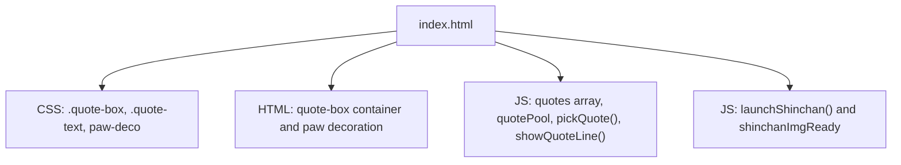
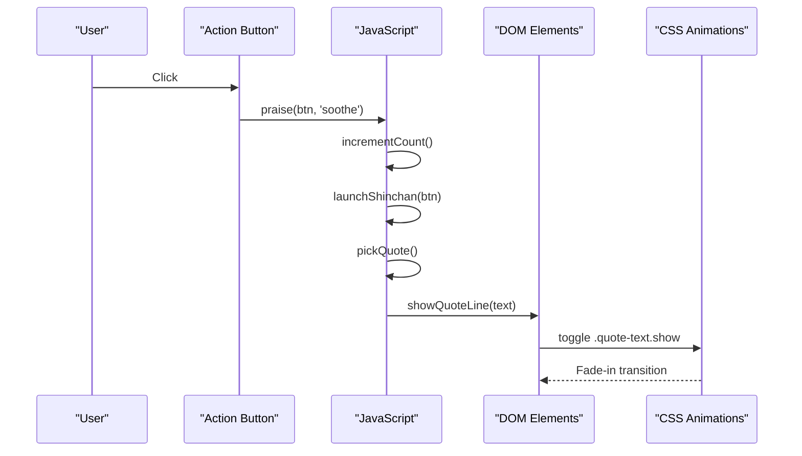
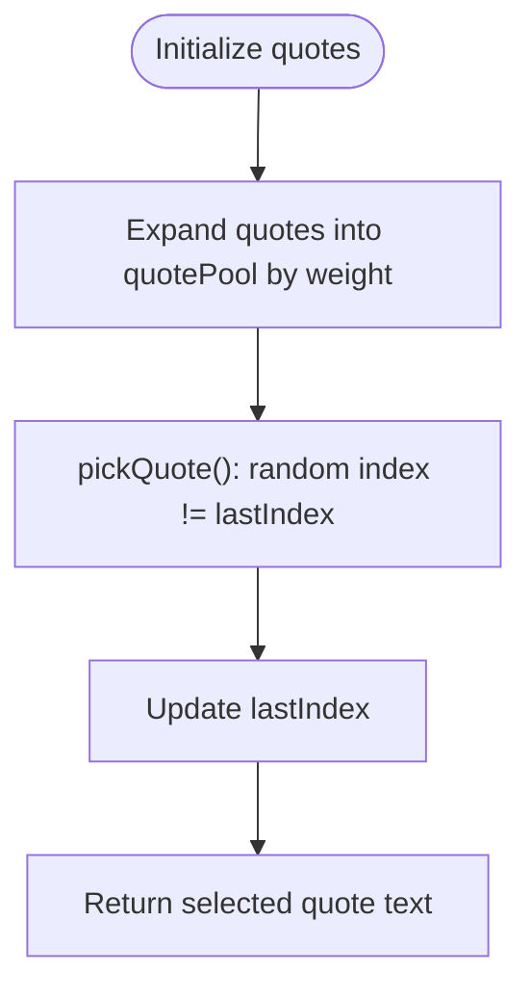
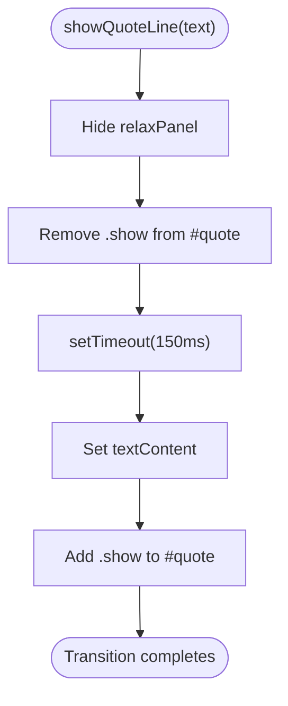
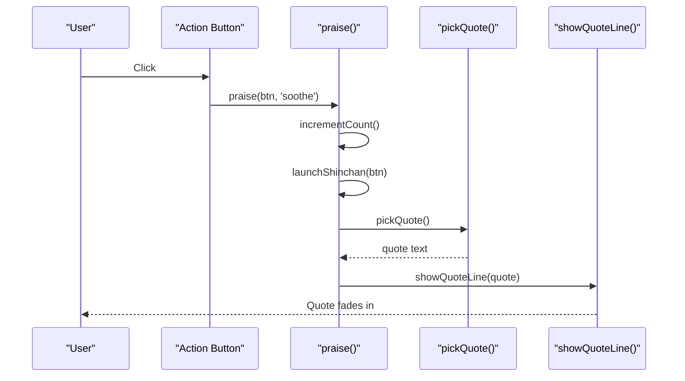

# Quote Box & Motivational System

<cite>
**Referenced Files in This Document**
- [index.html](file://index.html)
</cite>

## Table of Contents
1. [Introduction](#introduction)
2. [Project Structure](#project-structure)
3. [Core Components](#core-components)
4. [Architecture Overview](#architecture-overview)
5. [Detailed Component Analysis](#detailed-component-analysis)
6. [Dependency Analysis](#dependency-analysis)
7. [Performance Considerations](#performance-considerations)
8. [Troubleshooting Guide](#troubleshooting-guide)
9. [Conclusion](#conclusion)

## Introduction
This document explains the quote box implementation and its motivational system, focusing on:
- Shin-chan background integration
- Quote data structure and rotation logic
- Animation transitions and visual effects (fade-in, paw print decorations)
- CSS styling for .quote-box with gradient backgrounds, border styling, and flexbox layout
- JavaScript logic for quote selection, display timing, and smooth transitions using CSS classes like .quote-text.show

The system is implemented as a single-page interface where user interactions trigger personalized quotes and playful animations.

## Project Structure
The quote box and related features are contained within the main HTML file. The relevant parts include:
- Inline CSS defining styles for .quote-box, .quote-text, paw decorations, and Shin-chan background
- HTML markup for the quote container and decorative elements
- JavaScript that manages quote data, selection, display timing, and animation triggers

**Diagram sources**
- [index.html:275-311](file://index.html#L275-L311)
- [index.html:2383-2396](file://index.html#L2383-L2396)
- [index.html:2577-2620](file://index.html#L2577-L2620)
- [index.html:3050-3094](file://index.html#L3050-L3094)

**Section sources**
- [index.html:275-311](file://index.html#L275-L311)
- [index.html:2383-2396](file://index.html#L2383-L2396)
- [index.html:2577-2620](file://index.html#L2577-L2620)
- [index.html:3050-3094](file://index.html#L3050-L3094)

## Core Components
- Quote Data Structure: An array of objects containing text and weight fields; expanded into a flat pool for weighted random selection.
- Quote Rotation Logic: Random selection avoiding immediate repeats by tracking the last index.
- Display Timing: Smooth fade-in transition triggered by adding a CSS class after a short delay.
- Visual Effects: Paw print decorations inside the quote box and floating paw prints across the page; Shin-chan background image integrated at the bottom with mask gradient.

Key responsibilities:
- CSS defines gradients, borders, flexbox layout, and transitions for .quote-box and .quote-text.
- JS handles quote selection, DOM updates, and animation class toggling.
- Background assets and decorative elements enhance the user experience.

**Section sources**
- [index.html:2577-2620](file://index.html#L2577-L2620)
- [index.html:3126-3145](file://index.html#L3126-L3145)
- [index.html:275-311](file://index.html#L275-L311)
- [index.html:177-215](file://index.html#L177-L215)

## Architecture Overview
The quote system follows a simple event-driven flow:
- User clicks an action button to receive praise or enter relax mode.
- For standard praise, the system selects a quote and displays it with a fade-in transition.
- For relax mode, the system shows a different panel with Shin-chan imagery and stickers.
- Background decorations and Shin-chan pop-ups add playful feedback.

**Diagram sources**
- [index.html:3107-3145](file://index.html#L3107-L3145)
- [index.html:3067-3094](file://index.html#L3067-L3094)

## Detailed Component Analysis

### Quote Data Structure and Pool Expansion
- Data format: Array of objects with text and weight properties.
- Pool expansion: Weighted items are duplicated according to their weights to create a flat selection pool.
- Selection strategy: Random index chosen from the pool, ensuring no immediate repeat by comparing with the last selected index.

Complexity:
- Pool creation: O(n) where n is the number of quote entries.
- Selection: O(1) average time due to direct array access.

**Diagram sources**
- [index.html:2577-2620](file://index.html#L2577-L2620)
- [index.html:3126-3132](file://index.html#L3126-L3132)

**Section sources**
- [index.html:2577-2620](file://index.html#L2577-L2620)
- [index.html:3126-3132](file://index.html#L3126-L3132)

### Display Timing and Transitions
- Transition mechanism: The element’s opacity and transform are animated via CSS when the .show class is added.
- Timing: After removing the .show class, a short timeout sets new text content and adds .show to trigger the transition.
- Relax mode handling: The relax panel is hidden before displaying the quote, ensuring clean state transitions.

**Diagram sources**
- [index.html:3134-3145](file://index.html#L3134-L3145)

**Section sources**
- [index.html:3134-3145](file://index.html#L3134-L3145)

### CSS Styling for .quote-box
- Gradient background: Uses a linear gradient for a soft, warm appearance.
- Border styling: Solid border with a subtle color to frame the box.
- Flexbox layout: Centers content vertically and horizontally with gap spacing.
- Paw decoration: Absolute positioned paw emoji inside the box for decorative effect.

Accessibility and responsiveness:
- Min-height ensures adequate space for multi-line quotes.
- Padding and gap provide comfortable spacing between elements.

**Section sources**
- [index.html:275-311](file://index.html#L275-L311)

### Shin-chan Background Integration
- Background image: Fixed-position image at the bottom center with mask gradient to blend smoothly.
- Responsiveness: Max-width constraints ensure proper scaling on smaller screens.
- Interaction: Pop-up images and speech bubbles appear near action buttons during praise events.

Visual behavior:
- Low opacity and pointer-events disabled to avoid interfering with user interactions.
- Preloading ensures quick display when triggered.

**Section sources**
- [index.html:177-195](file://index.html#L177-L195)
- [index.html:3050-3094](file://index.html#L3050-L3094)

### Paw Print Decorations
- Background paws: Floating paw emojis scattered across the viewport with gentle sway animations.
- In-box paw deco: A static paw emoji placed inside the quote box for thematic consistency.

Animation details:
- Sway keyframes rotate and translate paws slightly to create a lively feel.
- Opacity variations keep decorations subtle.

**Section sources**
- [index.html:197-215](file://index.html#L197-L215)
- [index.html:290-296](file://index.html#L290-L296)

### Quote Selection and Display Flow
- Trigger: User interaction calls praise function.
- Side effects: Increment counter, launch Shin-chan pop-up, update UI states.
- Quote selection: pickQuote returns a non-repeating random quote.
- Display: showQuoteLine updates DOM and triggers CSS transition.

**Diagram sources**
- [index.html:3107-3145](file://index.html#L3107-L3145)

**Section sources**
- [index.html:3107-3145](file://index.html#L3107-L3145)

## Dependency Analysis
- CSS dependencies:
  - .quote-box relies on flexbox and gradient backgrounds.
  - .quote-text depends on transition properties and .show class.
- JS dependencies:
  - praise() depends on incrementCount(), launchShinchan(), pickQuote(), and showQuoteLine().
  - launchShinchan() depends on shinchanImgReady promise and DOM manipulation.
- Asset dependencies:
  - Shin-chan image preloaded via Promise to ensure availability.

Coupling:
- High cohesion within the quote module; low coupling to other features except for shared UI elements like counters and panels.

Potential circular dependencies:
- None detected; functions are unidirectional in call flow.

External integrations:
- API endpoints for count persistence and mood/history retrieval exist elsewhere but do not affect quote display logic directly.

**Section sources**
- [index.html:3107-3145](file://index.html#L3107-L3145)
- [index.html:3050-3094](file://index.html#L3050-L3094)

## Performance Considerations
- CSS transitions are GPU-accelerated where possible (opacity and transform).
- Avoiding heavy DOM operations during transitions; only textContent changes.
- Preloading Shin-chan image reduces latency for pop-ups.
- Lightweight paw decorations use minimal DOM nodes and CSS animations.

Optimization opportunities:
- Debounce rapid quote changes if needed.
- Use requestAnimationFrame for complex animations beyond CSS.

[No sources needed since this section provides general guidance]

## Troubleshooting Guide
Common issues and resolutions:
- Quote does not fade in:
  - Ensure .quote-text has the .show class added after setting textContent.
  - Verify CSS transition properties are defined correctly.
- Shin-chan pop-up not appearing:
  - Check shinchanImgReady promise resolution and image path.
  - Confirm DOM insertion and cleanup timers.
- Paw decorations not visible:
  - Inspect z-index and opacity values.
  - Ensure animations are not overridden by other styles.

**Section sources**
- [index.html:3134-3145](file://index.html#L3134-L3145)
- [index.html:3050-3094](file://index.html#L3050-L3094)

## Conclusion
The quote box and motivational system combine thoughtful CSS styling, efficient JavaScript logic, and playful visual effects to deliver an engaging user experience. The design emphasizes smooth transitions, consistent theming with Shin-chan and paw decorations, and robust quote rotation mechanics. By adhering to the documented patterns, future enhancements can maintain clarity and performance while expanding functionality.

[No sources needed since this section summarizes without analyzing specific files]