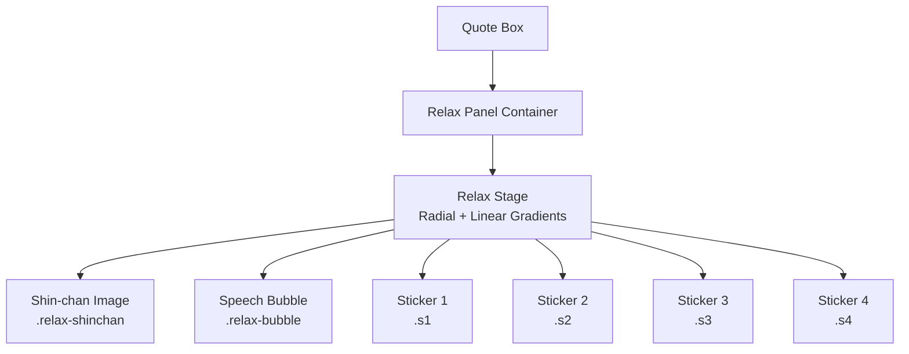
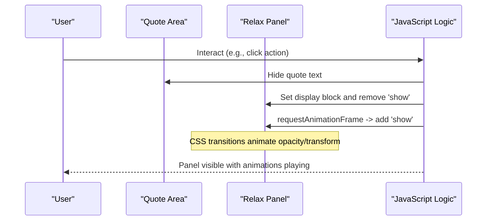
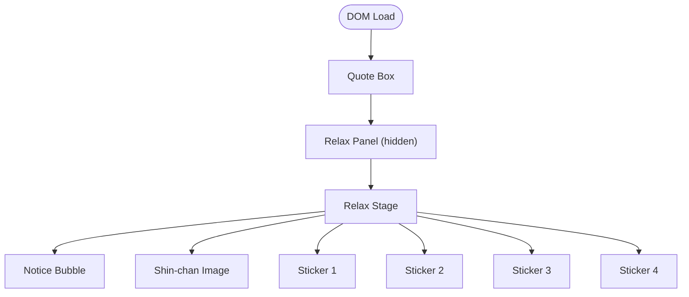
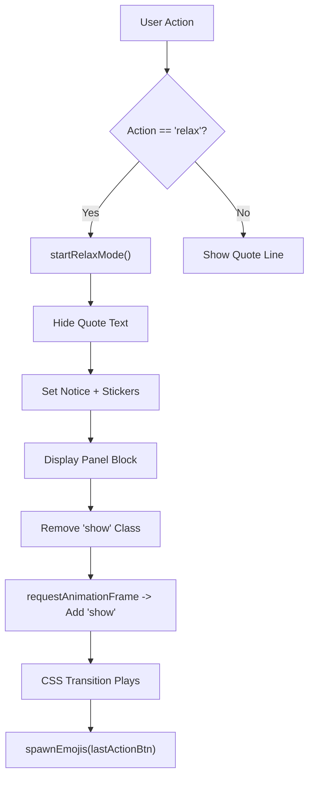
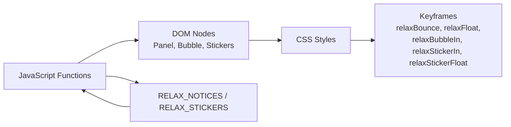

# Relaxation Panel & Animations

<cite>
**Referenced Files in This Document**
- [index.html](file://index.html)
</cite>

## Table of Contents
1. [Introduction](#introduction)
2. [Project Structure](#project-structure)
3. [Core Components](#core-components)
4. [Architecture Overview](#architecture-overview)
5. [Detailed Component Analysis](#detailed-component-analysis)
6. [Dependency Analysis](#dependency-analysis)
7. [Performance Considerations](#performance-considerations)
8. [Troubleshooting Guide](#troubleshooting-guide)
9. [Conclusion](#conclusion)

## Introduction
This document explains the relaxation panel architecture that features a Shin-chan character, a speech bubble message system, and floating sticker effects. It covers the keyframe animations (relaxBounce, relaxFloat, relaxBubbleIn), positioning strategies for the stage and stickers, and the JavaScript logic that toggles panel visibility and triggers animations when users interact with the interface.

## Project Structure
The relaxation panel is embedded within the main page and consists of:
- A container that holds the stage and content
- A stage background with radial gradients and subtle shadows
- A Shin-chan image with bounce and float animations
- A centered speech bubble with an arrow
- Four floating stickers at predefined positions

**Diagram sources**
- [index.html:313-396](file://index.html#L313-L396)
- [index.html:2386-2395](file://index.html#L2386-L2395)

**Section sources**
- [index.html:313-396](file://index.html#L313-L396)
- [index.html:2386-2395](file://index.html#L2386-L2395)

## Core Components
- .relax-panel: The outer container that is hidden by default and shown via a class toggle to animate in.
- .relax-stage: The visual stage with rounded corners, a soft radial gradient at the top, a linear gradient background, border, overflow clipping, and an inset shadow for depth.
- .relax-shinchan: The character image with a bounce entrance and continuous float animation, plus a drop-shadow filter.
- .relax-bubble: A centered speech bubble with a CSS arrow created using a pseudo-element.
- .relax-sticker.s1..s4: Floating stickers positioned at four corners/edges with slight rotations and a gentle vertical float.

Key animation keyframes:
- relaxBounce: Entrance from below with scale and opacity transition.
- relaxFloat: Continuous vertical float for the character.
- relaxBubbleIn: Fade-in and slight upward movement for the bubble.
- relaxStickerIn: Fade-in for stickers.
- relaxStickerFloat: Gentle vertical float for stickers.

**Section sources**
- [index.html:313-422](file://index.html#L313-L422)

## Architecture Overview
The relaxation panel is triggered by user interaction. When activated, it hides the quote text, populates the bubble and stickers, reveals the panel with a smooth transition, and plays associated animations.

**Diagram sources**
- [index.html:3107-3171](file://index.html#L3107-L3171)
- [index.html:313-325](file://index.html#L313-L325)

## Detailed Component Analysis

### Relax Stage (.relax-stage)
- Purpose: Provides a visually distinct area for the character, bubble, and stickers.
- Styling highlights:
  - Rounded corners and padding
  - Radial gradient at the top for a soft highlight
  - Linear gradient background for warmth
  - Border and inset box-shadow for depth
  - Overflow hidden to contain floating elements

Positioning strategy:
- Uses relative positioning so absolute children can be placed precisely within the stage boundaries.

**Section sources**
- [index.html:327-338](file://index.html#L327-L338)

### Shin-chan Character (.relax-shinchan)
- Purpose: Central animated character that draws attention and adds personality.
- Animations:
  - relaxBounce on entry for a playful entrance
  - relaxFloat continuously for a gentle hover effect
- Visual enhancements:
  - Drop-shadow filter for depth
  - Responsive width using min() to fit screens

Positioning strategy:
- Centered horizontally with auto margins and top margin to space from the bubble.

**Section sources**
- [index.html:340-347](file://index.html#L340-L347)
- [index.html:398-407](file://index.html#L398-L407)

### Speech Bubble (.relax-bubble)
- Purpose: Displays a short message above the character.
- Styling highlights:
  - Semi-transparent white background
  - Soft border and rounded corners
  - Centered horizontally with transform translateX(-50%)
  - Max-width to keep readability
- Arrow styling:
  - Created via ::after pseudo-element rotated 45 degrees
  - Positioned at bottom center to point toward the character

Animation:
- relaxBubbleIn provides a smooth fade-in and slight upward movement.

**Section sources**
- [index.html:349-378](file://index.html#L349-L378)
- [index.html:409-412](file://index.html#L409-L412)

### Floating Stickers (.relax-sticker.s1..s4)
- Purpose: Add playful context around the scene with short phrases or emojis.
- Positioning:
  - s1: Top-left area
  - s2: Top-right area
  - s3: Bottom-left area
  - s4: Bottom-right area
- Each has a slight rotation for organic feel.
- Animation:
  - relaxStickerIn fades them in
  - relaxStickerFloat gently bobs them up and down

**Section sources**
- [index.html:380-396](file://index.html#L380-L396)
- [index.html:414-422](file://index.html#L414-L422)

### HTML Structure
The DOM structure nests the stage inside the panel, which sits within the quote box. Elements include:
- A notice bubble
- The Shin-chan image
- Four sticker placeholders

**Diagram sources**
- [index.html:2386-2395](file://index.html#L2386-L2395)

**Section sources**
- [index.html:2386-2395](file://index.html#L2386-L2395)

### JavaScript Logic for Visibility and Triggers
- startRelaxMode():
  - Hides the quote text
  - Randomly selects a notice message and four stickers
  - Sets panel display to block, removes 'show', then adds 'show' in the next frame to trigger CSS transitions
  - Spawns emoji effects based on last action button
- praise(action):
  - Handles general praise flow and delegates to startRelaxMode when action equals 'relax'

Data sources:
- RELAX_NOTICES: Array of messages used for the bubble
- RELAX_STICKERS: Pool of sticker texts from which four are randomly selected

**Diagram sources**
- [index.html:3107-3171](file://index.html#L3107-L3171)
- [index.html:2601-2615](file://index.html#L2601-L2615)

**Section sources**
- [index.html:3107-3171](file://index.html#L3107-L3171)
- [index.html:2601-2615](file://index.html#L2601-L2615)

## Dependency Analysis
- CSS dependencies:
  - Keyframes define motion for character, bubble, and stickers
  - Classes control visibility and transitions for the panel
- JavaScript dependencies:
  - References to DOM nodes by ID for panel, bubble, and stickers
  - Arrays of notices and stickers provide dynamic content
  - Interaction functions coordinate state changes and animation triggers

**Diagram sources**
- [index.html:3107-3171](file://index.html#L3107-L3171)
- [index.html:313-422](file://index.html#L313-L422)
- [index.html:2601-2615](file://index.html#L2601-L2615)

**Section sources**
- [index.html:3107-3171](file://index.html#L3107-L3171)
- [index.html:313-422](file://index.html#L313-L422)
- [index.html:2601-2615](file://index.html#L2601-L2615)

## Performance Considerations
- Prefer CSS animations for smooth performance; avoid frequent layout thrashing by using transforms and opacity where possible.
- Use requestAnimationFrame before adding classes to ensure transitions play reliably after display changes.
- Keep sticker count limited to four to balance visual richness and rendering cost.
- Ensure images are appropriately sized and optimized to reduce load time.

[No sources needed since this section provides general guidance]

## Troubleshooting Guide
- Panel not appearing:
  - Verify that the panel’s display is set to block before adding the 'show' class.
  - Ensure requestAnimationFrame is used to trigger the transition.
- Bubble or stickers not showing content:
  - Confirm that the notice and sticker elements exist and have IDs matching the JavaScript references.
  - Check that the arrays for notices and stickers are populated.
- Animations not playing:
  - Ensure keyframes are defined and classes are applied correctly.
  - Inspect computed styles to verify no conflicting rules override animations.

**Section sources**
- [index.html:313-325](file://index.html#L313-L325)
- [index.html:3147-3171](file://index.html#L3147-L3171)
- [index.html:349-422](file://index.html#L349-L422)

## Conclusion
The relaxation panel combines a warm, gradient-backed stage with a bouncing and floating Shin-chan character, a centered speech bubble, and four floating stickers. The JavaScript orchestrates visibility and content updates, while CSS handles smooth transitions and animations. This design delivers an engaging, lightweight interactive experience that enhances user delight during relaxation moments.

[No sources needed since this section summarizes without analyzing specific files]