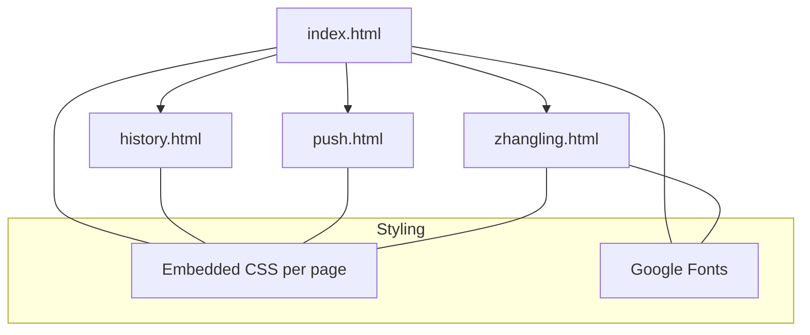
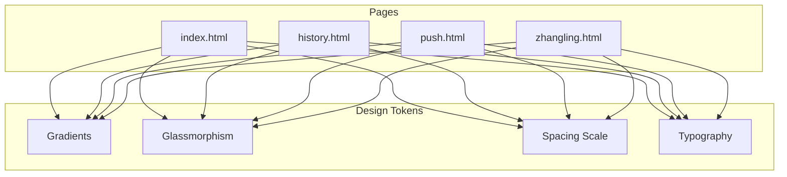
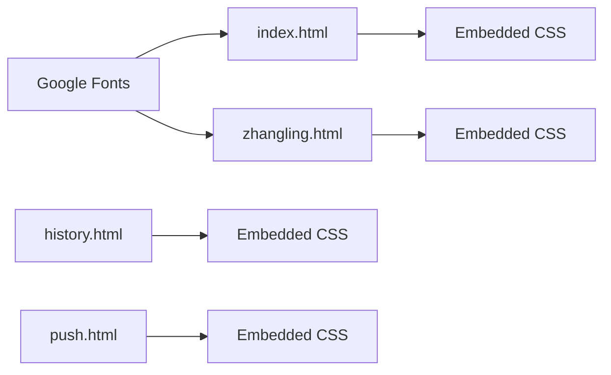

# Responsive Design & Styling System

<cite>
**Referenced Files in This Document**
- [index.html](file://index.html)
- [history.html](file://history.html)
- [push.html](file://push.html)
- [zhangling.html](file://zhangling.html)
</cite>

## Table of Contents
1. [Introduction](#introduction)
2. [Project Structure](#project-structure)
3. [Core Components](#core-components)
4. [Architecture Overview](#architecture-overview)
5. [Detailed Component Analysis](#detailed-component-analysis)
6. [Dependency Analysis](#dependency-analysis)
7. [Performance Considerations](#performance-considerations)
8. [Troubleshooting Guide](#troubleshooting-guide)
9. [Conclusion](#conclusion)
10. [Appendices](#appendices)

## Introduction
This document explains the responsive design patterns and styling system used across the application’s pages. It focuses on a mobile-first approach, media query breakpoints, adaptive layouts, glassmorphism techniques (including backdrop-filter), gradient backgrounds, consistent spacing, CSS custom properties usage, animations, and cross-browser compatibility strategies. Examples are drawn from the actual HTML files to illustrate how these patterns are implemented in practice.

## Project Structure
The project is composed of several single-page HTML documents, each with embedded styles and scripts:
- index.html: Main page with splash screen, main card, side panels, history panel, and modal overlays.
- history.html: A simple mood history view with a card layout and list items.
- push.html: A message composition form with presets and status feedback.
- zhangling.html: A compact praise machine with action buttons and confetti effects.

**Diagram sources**
- [index.html:1-20](file://index.html#L1-L20)
- [history.html:1-20](file://history.html#L1-L20)
- [push.html:1-20](file://push.html#L1-L20)
- [zhangling.html:1-20](file://zhangling.html#L1-L20)

**Section sources**
- [index.html:1-20](file://index.html#L1-L20)
- [history.html:1-20](file://history.html#L1-L20)
- [push.html:1-20](file://push.html#L1-L20)
- [zhangling.html:1-20](file://zhangling.html#L1-L20)

## Core Components
- Glassmorphic cards and panels: Semi-transparent backgrounds with backdrop blur and subtle borders/shadows for depth.
- Gradient backgrounds: Radial and linear gradients create soft, warm atmospheres across pages.
- Responsive grids and flex layouts: Flexbox for centering and stacking; Grid for multi-column actions that collapse on small screens.
- Media queries: Breakpoints adjust layout and sizing for smaller devices.
- Animations: Keyframes for entrance, floating, and micro-interactions; CSS transitions for hover/active states.
- Accessibility-friendly focus and contrast: Clear color hierarchy and readable typography.

Key implementation references:
- Glassmorphism via backdrop-filter and semi-transparent backgrounds on cards and panels.
- Gradients applied to body backgrounds, quote boxes, and buttons.
- Media queries at specific widths to adapt spacing, sizes, and visibility.
- CSS custom properties used for animation timing/delay variables.

**Section sources**
- [index.html:218-230](file://index.html#L218-L230)
- [index.html:548-567](file://index.html#L548-L567)
- [index.html:614-632](file://index.html#L614-L632)
- [index.html:753-787](file://index.html#L753-L787)
- [index.html:275-288](file://index.html#L275-L288)
- [index.html:437-475](file://index.html#L437-L475)
- [index.html:25-30](file://index.html#L25-L30)
- [index.html:191-195](file://index.html#L191-L195)
- [index.html:501-519](file://index.html#L501-L519)
- [index.html:125-126](file://index.html#L125-L126)
- [history.html:21-29](file://history.html#L21-L29)
- [history.html:54-62](file://history.html#L54-L62)
- [push.html:20-27](file://push.html#L20-L27)
- [zhangling.html:30-41](file://zhangling.html#L30-L41)
- [zhangling.html:107-111](file://zhangling.html#L107-L111)
- [zhangling.html:153-157](file://zhangling.html#L153-L157)

## Architecture Overview
The styling architecture is page-scoped with embedded CSS, ensuring self-contained components. Shared visual language is achieved through consistent use of:
- Soft radial/linear gradients for backgrounds
- Glassmorphic surfaces with backdrop blur
- Rounded corners and layered shadows
- Consistent spacing scales and typography
- Mobile-first responsive rules

[No diagram sources needed since this diagram shows conceptual relationships]

## Detailed Component Analysis

### Glassmorphism System
- Technique: Semi-transparent background colors combined with backdrop-filter blur to create frosted-glass panels.
- Usage: Main machine card, side panels, history panel, and modal overlays.
- Visual cues: Subtle borders and layered box-shadows enhance depth without heavy opacity.

References:
- Machine card with backdrop blur and border radius.
- Side panel and history panel with similar glass treatment.
- Modal mask with backdrop blur overlay.

**Section sources**
- [index.html:218-230](file://index.html#L218-L230)
- [index.html:548-567](file://index.html#L548-L567)
- [index.html:614-632](file://index.html#L614-L632)
- [index.html:753-787](file://index.html#L753-L787)

### Gradient Backgrounds
- Body backgrounds use radial gradients for a warm, centered glow.
- Quote boxes and UI elements use linear gradients to add subtle color shifts.
- Buttons employ vibrant gradients for primary actions.

References:
- Radial gradients on body and splash screen.
- Linear gradients on quote boxes and buttons.

**Section sources**
- [index.html:13-23](file://index.html#L13-L23)
- [index.html:33-45](file://index.html#L33-L45)
- [index.html:275-288](file://index.html#L275-L288)
- [index.html:459-465](file://index.html#L459-L465)
- [history.html:10-19](file://history.html#L10-L19)
- [history.html:54-62](file://history.html#L54-L62)
- [push.html:10-18](file://push.html#L10-L18)
- [push.html:68-83](file://push.html#L68-L83)
- [zhangling.html:11-21](file://zhangling.html#L11-L21)
- [zhangling.html:113-127](file://zhangling.html#L113-L127)

### Responsive Layouts and Breakpoints
- Mobile-first base styles ensure readability and touch targets on small screens.
- Media queries adjust layout, padding, font sizes, and visibility for smaller devices.
- Grid-based action rows collapse to single column on narrow screens.

Breakpoints observed:
- 780px: Adjusts body layout, background image scaling, and button sizing on the main page.
- 640px: Collapses multi-column action grid to a single column on the praise machine page.

References:
- Media queries for body, background image, and buttons on the main page.
- Action row grid collapsing on the praise machine page.

**Section sources**
- [index.html:25-30](file://index.html#L25-L30)
- [index.html:191-195](file://index.html#L191-L195)
- [index.html:501-519](file://index.html#L501-L519)
- [zhangling.html:153-157](file://zhangling.html#L153-L157)

### Adaptive Spacing Patterns
- Consistent use of padding/margin scales across cards, panels, and lists.
- Flexible widths using percentage and min() functions to maintain proportions.
- Centered content with flexbox for vertical and horizontal alignment.

References:
- Card padding and margins.
- Button dimensions and spacing.
- List item gaps and paddings.

**Section sources**
- [index.html:218-230](file://index.html#L218-L230)
- [index.html:437-475](file://index.html#L437-L475)
- [history.html:21-29](file://history.html#L21-L29)
- [history.html:54-62](file://history.html#L54-L62)
- [push.html:20-27](file://push.html#L20-L27)

### CSS Custom Properties and Animation Variables
- CSS custom properties are used to parameterize animation durations and delays for dynamic sparkle elements.
- Inline style assignment sets per-element variables for staggered animations.

References:
- Using var(--dur, default) and var(--delay, default) in keyframe animations.
- Dynamic element creation setting inline CSS variables.

**Section sources**
- [index.html:125-126](file://index.html#L125-L126)
- [index.html:3763](file://index.html#L3763)

### Animation Libraries and Techniques
- Native CSS keyframes and transitions provide smooth interactions without external libraries.
- Common patterns:
  - Entrance animations with fade/slide transforms.
  - Floating/bobbing effects for decorative elements.
  - Micro-interactions on buttons (hover lift, active press).
  - Confetti and emoji bursts via JavaScript-driven DOM and canvas.

References:
- Splash dog entrance and float animations.
- Quote text reveal transitions.
- Button ripple effect on active state.
- Confetti and floating emojis on the praise machine page.

**Section sources**
- [index.html:59-73](file://index.html#L59-L73)
- [index.html:298-311](file://index.html#L298-L311)
- [index.html:477-490](file://index.html#L477-L490)
- [zhangling.html:171-201](file://zhangling.html#L171-L201)
- [zhangling.html:291-341](file://zhangling.html#L291-L341)

### Cross-Browser Compatibility Strategies
- Use of standard CSS features widely supported in modern browsers:
  - backdrop-filter for glassmorphism.
  - CSS Grid and Flexbox for layouts.
  - CSS custom properties for theming and animation parameters.
- Graceful fallbacks:
  - Transparent backgrounds and solid borders when backdrop-filter is unsupported.
  - Fallback fonts and safe color contrasts.
- Viewport meta tag ensures proper scaling on mobile devices.

References:
- Backdrop blur on cards and panels.
- Viewport meta tags across pages.
- Fallback font stacks.

**Section sources**
- [index.html:218-230](file://index.html#L218-L230)
- [index.html:548-567](file://index.html#L548-L567)
- [index.html:614-632](file://index.html#L614-L632)
- [index.html:753-787](file://index.html#L753-L787)
- [index.html:5-6](file://index.html#L5-L6)
- [history.html:4-5](file://history.html#L4-L5)
- [push.html:4-5](file://push.html#L4-L5)
- [zhangling.html:4-5](file://zhangling.html#L4-L5)

### Examples of Responsive Components
- Main machine card: Adapts width and padding; uses glassmorphism and gradients.
- Action buttons: Full-width on mobile, consistent height and rounded corners; hover/active states.
- History panel: Fixed side panel on desktop; hidden or adapted on mobile.
- Mobile history grid: Compact grid of mood entries for small screens.
- Praise machine action row: Multi-column grid collapses to single column on narrow screens.

**Section sources**
- [index.html:218-230](file://index.html#L218-L230)
- [index.html:437-475](file://index.html#L437-L475)
- [index.html:614-632](file://index.html#L614-L632)
- [index.html:684-718](file://index.html#L684-L718)
- [zhangling.html:107-111](file://zhangling.html#L107-L111)
- [zhangling.html:153-157](file://zhangling.html#L153-L157)

## Dependency Analysis
- Pages share a common visual language but remain independent with embedded styles.
- Typography dependencies: Google Fonts loaded via link tags for elegant serif and italic accents.
- No external CSS frameworks or animation libraries are used; all styling is native CSS.
- Scripts are page-specific and do not introduce shared styling dependencies.

**Diagram sources**
- [index.html:9](file://index.html#L9)
- [zhangling.html:7](file://zhangling.html#L7)

**Section sources**
- [index.html:9](file://index.html#L9)
- [zhangling.html:7](file://zhangling.html#L7)

## Performance Considerations
- Prefer CSS animations over JS-heavy effects where possible to reduce reflows.
- Use backdrop-filter judiciously; it can be GPU-intensive on low-end devices.
- Limit the number of animated elements simultaneously to avoid jank.
- Keep images optimized and use appropriate sizes for different screens.
- Avoid excessive nested transforms and large shadow blurs on scrollable areas.

[No sources needed since this section provides general guidance]

## Troubleshooting Guide
Common issues and resolutions:
- Backdrop blur not visible: Ensure the element has a semi-transparent background and sufficient contrast behind it; consider fallback borders/shadows if unsupported.
- Layout breaks on small screens: Verify viewport meta tag presence and test media queries at target breakpoints.
- Animations too heavy: Reduce concurrent animations and simplify keyframes; prefer transform and opacity changes.
- Font loading delays: Preload critical fonts or use font-display strategies to improve perceived performance.

**Section sources**
- [index.html:218-230](file://index.html#L218-L230)
- [index.html:5-6](file://index.html#L5-L6)
- [index.html:25-30](file://index.html#L25-L30)
- [zhangling.html:171-201](file://zhangling.html#L171-L201)

## Conclusion
The application employs a cohesive, mobile-first responsive design system built on native CSS. Glassmorphism, gradients, and consistent spacing create a warm, modern aesthetic. Media queries ensure adaptability across devices, while CSS animations deliver delightful interactions without external libraries. The approach balances visual richness with performance and accessibility, providing a robust foundation for future enhancements.

[No sources needed since this section summarizes without analyzing specific files]

## Appendices

### Breakpoint Summary
- 780px: Used in the main page to adjust body layout, background image scaling, and button sizing.
- 640px: Used in the praise machine page to collapse multi-column action grids into a single column.

**Section sources**
- [index.html:25-30](file://index.html#L25-L30)
- [index.html:191-195](file://index.html#L191-L195)
- [index.html:501-519](file://index.html#L501-L519)
- [zhangling.html:153-157](file://zhangling.html#L153-L157)

### Glassmorphism Checklist
- Apply semi-transparent background color.
- Add backdrop-filter blur for frosted effect.
- Include subtle border and layered shadow for depth.
- Provide fallbacks for unsupported environments.

**Section sources**
- [index.html:218-230](file://index.html#L218-L230)
- [index.html:548-567](file://index.html#L548-L567)
- [index.html:614-632](file://index.html#L614-L632)
- [index.html:753-787](file://index.html#L753-L787)

### Animation Best Practices
- Use transform and opacity for smooth animations.
- Combine keyframes with transitions for complex sequences.
- Leverage CSS custom properties for dynamic timing control.
- Keep animations short and purposeful to enhance UX.

**Section sources**
- [index.html:59-73](file://index.html#L59-L73)
- [index.html:298-311](file://index.html#L298-L311)
- [index.html:477-490](file://index.html#L477-L490)
- [index.html:125-126](file://index.html#L125-L126)
- [zhangling.html:171-201](file://zhangling.html#L171-L201)