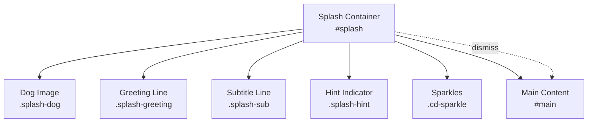
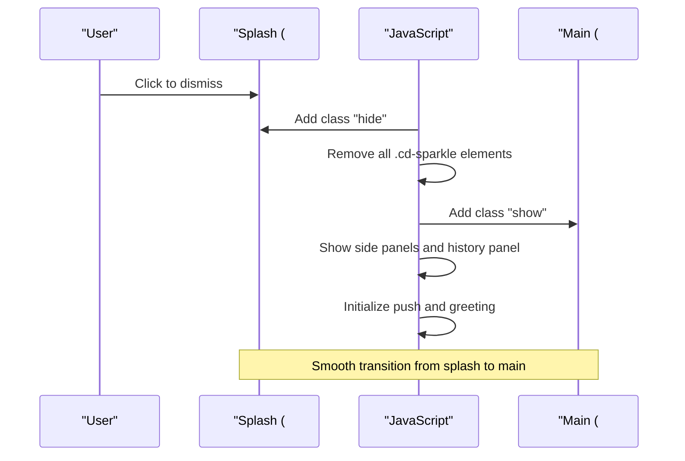
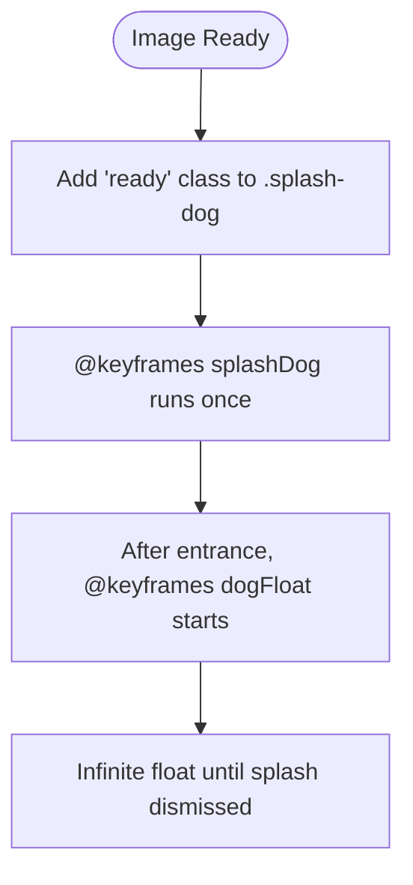
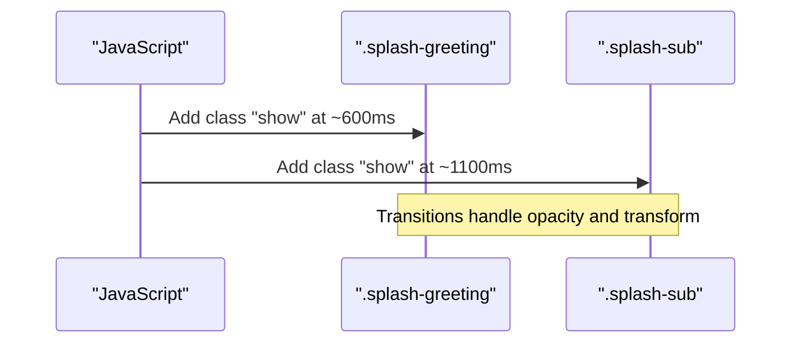
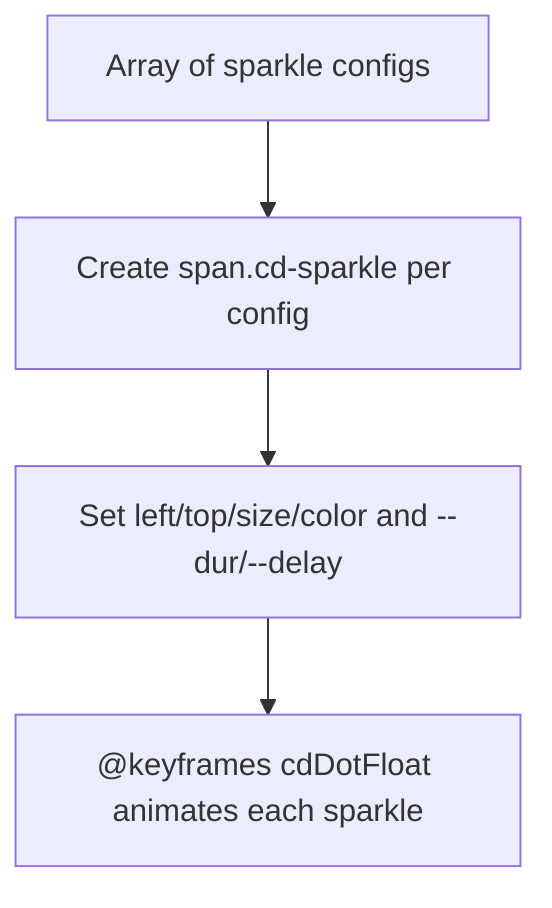
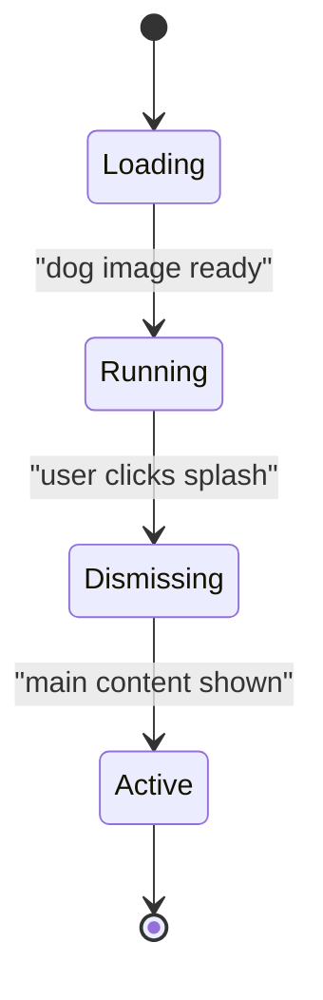
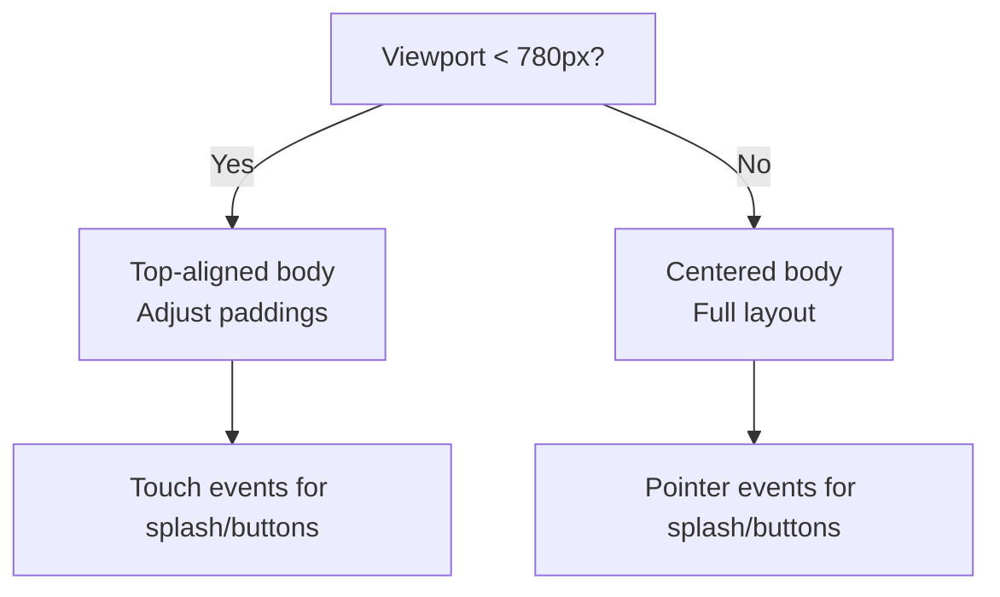
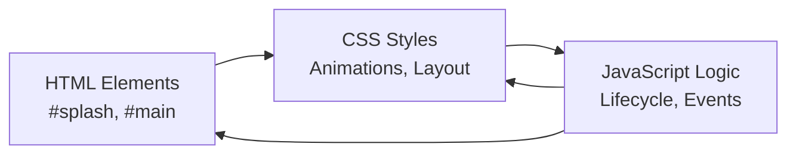

# Splash Screen & Welcome Interface

<cite>
**Referenced Files in This Document**
- [index.html](file://index.html)
</cite>

## Table of Contents
1. [Introduction](#introduction)
2. [Project Structure](#project-structure)
3. [Core Components](#core-components)
4. [Architecture Overview](#architecture-overview)
5. [Detailed Component Analysis](#detailed-component-analysis)
6. [Dependency Analysis](#dependency-analysis)
7. [Performance Considerations](#performance-considerations)
8. [Troubleshooting Guide](#troubleshooting-guide)
9. [Conclusion](#conclusion)

## Introduction
This document explains the splash screen and welcome interface implemented in index.html. It covers:
- Animated dog character with bounce and float animations
- Greeting system with staggered text reveals
- Sparkle effects using CSS custom properties
- Splash lifecycle (loading states, animation sequences, transition to main content)
- Responsive design patterns for mobile-first approach, including viewport adaptations and touch interactions
- Code examples via file references for keyframe animations and JavaScript event handling

## Project Structure
The splash screen is a full-screen overlay that appears before the main application content. It contains:
- A splash container (#splash) with an animated image, greeting lines, and a hint indicator
- CSS keyframes for entrance and floating effects
- JavaScript that orchestrates loading, staggered reveals, sparkle generation, and dismissal into the main content

**Diagram sources**
- [index.html:2345-2351](file://index.html#L2345-L2351)
- [index.html:33-50](file://index.html#L33-L50)
- [index.html:52-73](file://index.html#L52-L73)
- [index.html:120-127](file://index.html#L120-L127)
- [index.html:154-168](file://index.html#L154-L168)

**Section sources**
- [index.html:33-50](file://index.html#L33-L50)
- [index.html:154-168](file://index.html#L154-L168)
- [index.html:2345-2351](file://index.html#L2345-L2351)

## Core Components
- Splash overlay: fixed, full-screen, with smooth fade-out on dismiss
- Dog image: entrance bounce followed by continuous float
- Greeting lines: staggered reveal with transitions
- Sparkles: dynamically created dots with CSS custom properties controlling duration and delay
- Main content: fades in after splash dismissal

Key behaviors:
- The splash listens for click to dismiss and triggers a coordinated transition to the main content
- Staggered reveals are driven by timeouts after the dog enters
- Sparkles are generated from a configuration array and animated via CSS variables

**Section sources**
- [index.html:33-50](file://index.html#L33-L50)
- [index.html:52-73](file://index.html#L52-L73)
- [index.html:75-85](file://index.html#L75-L85)
- [index.html:120-127](file://index.html#L120-L127)
- [index.html:154-168](file://index.html#L154-L168)
- [index.html:2345-2351](file://index.html#L2345-L2351)

## Architecture Overview
The splash screen follows a simple state-driven flow:
1. On DOMContentLoaded, set greeting texts and optionally title subtitle
2. Ensure the dog image is ready; when ready, start the splash sequence
3. Animate the dog entrance and then reveal greeting lines with delays
4. Generate sparkles around the screen
5. On user interaction (click), dismiss the splash and reveal main content

**Diagram sources**
- [index.html:3713-3736](file://index.html#L3713-L3736)
- [index.html:2345-2351](file://index.html#L2345-L2351)
- [index.html:154-168](file://index.html#L154-L168)

## Detailed Component Analysis

### Animated Dog Character (Bounce + Float)
- Entrance animation: a bounce-like keyframe sequence brings the dog up from below with opacity changes and slight overshoots
- Continuous float: after entrance, a gentle vertical float repeats infinitely
- Trigger: adding a “ready” class starts both animations

**Diagram sources**
- [index.html:52-73](file://index.html#L52-L73)
- [index.html:3768-3779](file://index.html#L3768-L3779)

**Section sources**
- [index.html:52-73](file://index.html#L52-L73)
- [index.html:3768-3779](file://index.html#L3768-L3779)

### Greeting System with Staggered Reveals
- Two text lines: main greeting and subtitle
- Both start hidden and slide/fade in with transitions
- Staggered timing: first line appears shortly after the dog entrance, second line slightly later

**Diagram sources**
- [index.html:75-85](file://index.html#L75-L85)
- [index.html:3768-3773](file://index.html#L3768-L3773)

**Section sources**
- [index.html:75-85](file://index.html#L75-L85)
- [index.html:3768-3773](file://index.html#L3768-L3773)

### Sparkle Effects Using CSS Custom Properties
- Sparkles are small circles positioned across the viewport
- Each sparkle uses CSS custom properties --dur and --delay to control animation duration and start time
- JavaScript creates these elements and sets inline styles for position, size, color, and variables

**Diagram sources**
- [index.html:115-127](file://index.html#L115-L127)
- [index.html:3751-3765](file://index.html#L3751-L3765)

**Section sources**
- [index.html:115-127](file://index.html#L115-L127)
- [index.html:3751-3765](file://index.html#L3751-L3765)

### Splash Lifecycle: Loading States, Animation Sequences, Transition
- Loading: ensure dog image is loaded or errored before starting sequence
- Sequence: add “ready” to dog, stagger greeting reveals, generate sparkles
- Dismiss: on click, fade out splash, remove sparkles, show main content and panels, initialize greeting and quote

**Diagram sources**
- [index.html:3768-3779](file://index.html#L3768-L3779)
- [index.html:3713-3736](file://index.html#L3713-L3736)

**Section sources**
- [index.html:3768-3779](file://index.html#L3768-L3779)
- [index.html:3713-3736](file://index.html#L3713-L3736)

### Responsive Design Patterns (Mobile-First)
- Viewport meta tag ensures proper scaling on mobile devices
- Body layout switches to top-aligned content on smaller screens
- Background images and panels adapt to screen width
- Touch-friendly interactions: splash is clickable; buttons have adequate sizing and active states

**Diagram sources**
- [index.html:6](file://index.html#L6)
- [index.html:25-30](file://index.html#L25-L30)
- [index.html:191-195](file://index.html#L191-L195)

**Section sources**
- [index.html:6](file://index.html#L6)
- [index.html:25-30](file://index.html#L25-L30)
- [index.html:191-195](file://index.html#L191-L195)

### Keyframe Animations (Code Examples via References)
- Dog entrance bounce: see [index.html:62-68](file://index.html#L62-L68)
- Dog continuous float: see [index.html:70-73](file://index.html#L70-L73)
- Sparkle float: see [index.html:115-118](file://index.html#L115-L118)

**Section sources**
- [index.html:62-68](file://index.html#L62-L68)
- [index.html:70-73](file://index.html#L70-L73)
- [index.html:115-118](file://index.html#L115-L118)

### JavaScript Event Handling (Code Examples via References)
- Splash sequence trigger and staggered reveals: see [index.html:3768-3779](file://index.html#L3768-L3779)
- Sparkle creation with CSS custom properties: see [index.html:3751-3765](file://index.html#L3751-L3765)
- Dismissal and transition to main content: see [index.html:3713-3736](file://index.html#L3713-L3736)

**Section sources**
- [index.html:3768-3779](file://index.html#L3768-L3779)
- [index.html:3751-3765](file://index.html#L3751-L3765)
- [index.html:3713-3736](file://index.html#L3713-L3736)

## Dependency Analysis
- HTML structure defines the splash container and its child elements
- CSS provides styling, keyframes, and responsive rules
- JavaScript coordinates:
  - DOMContentLoaded setup
  - Image readiness checks
  - Class toggling for animations
  - Dynamic element creation for sparkles
  - Dismissal logic and main content reveal

**Diagram sources**
- [index.html:2345-2351](file://index.html#L2345-L2351)
- [index.html:33-50](file://index.html#L33-L50)
- [index.html:3713-3736](file://index.html#L3713-L3736)

**Section sources**
- [index.html:2345-2351](file://index.html#L2345-L2351)
- [index.html:33-50](file://index.html#L33-L50)
- [index.html:3713-3736](file://index.html#L3713-L3736)

## Performance Considerations
- Use CSS transforms and opacity for animations to leverage GPU acceleration
- Limit the number of sparkles to avoid excessive DOM nodes
- Debounce or throttle frequent reflows if additional dynamic elements are added
- Preload critical assets (already present via link rel preload) to reduce perceived load time

[No sources needed since this section provides general guidance]

## Troubleshooting Guide
Common issues and resolutions:
- Dog image not loading: fallback triggers runSplash on error; verify asset path and network status
- Sparkles not appearing: ensure sparkle creation loop runs and CSS variables are set; check for missing classes
- Splash not dismissing: confirm click handler is attached and dismissSplash function executes; verify no blocking overlays

**Section sources**
- [index.html:3768-3779](file://index.html#L3768-L3779)
- [index.html:3713-3736](file://index.html#L3713-L3736)

## Conclusion
The splash screen delivers a polished welcome experience with:
- A lively animated dog using bounce and float keyframes
- Staggered greeting reveals for a natural pacing
- Sparkle effects powered by CSS custom properties for varied durations and delays
- A clear lifecycle from loading through dismissal to main content
- Mobile-first responsive design ensuring usability across devices

[No sources needed since this section summarizes without analyzing specific files]