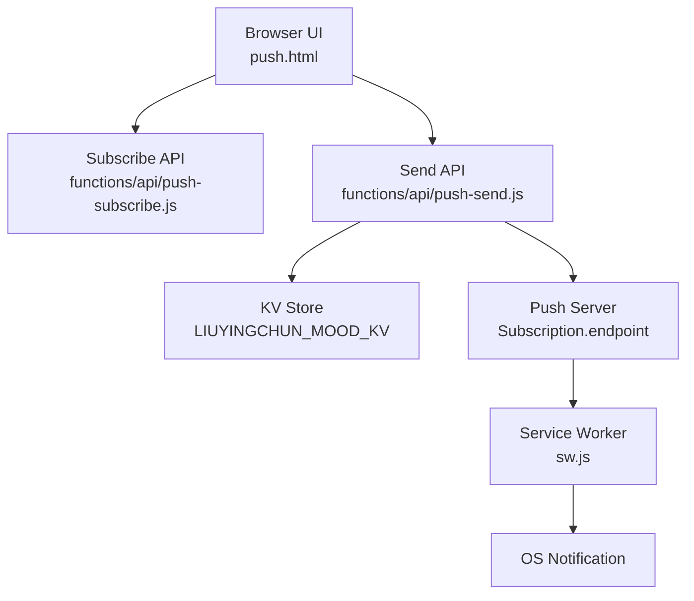
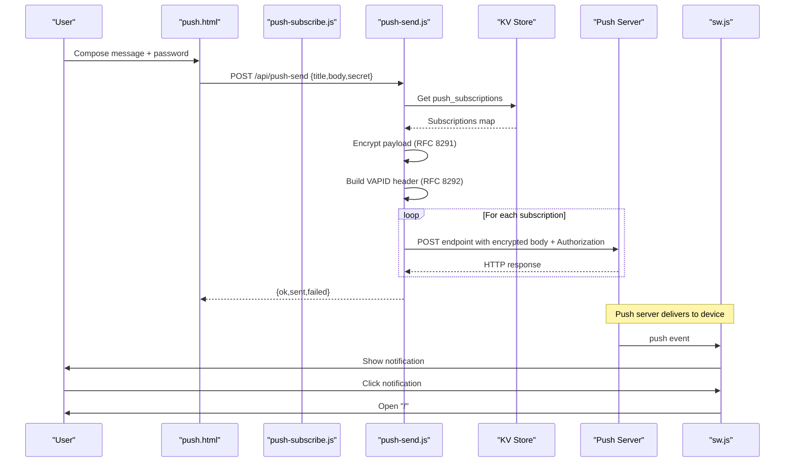
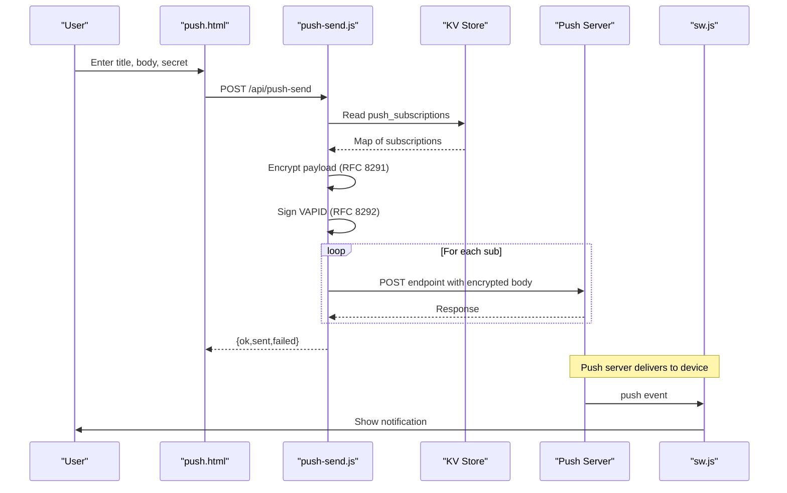
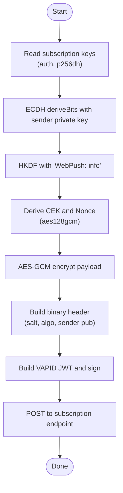

# Push Notification System (push.html)

<cite>
**Referenced Files in This Document**
- [push.html](file://push.html)
- [push-send.js](file://functions/api/push-send.js)
- [push-subscribe.js](file://functions/api/push-subscribe.js)
- [sw.js](file://sw.js)
</cite>

## Table of Contents
1. [Introduction](#introduction)
2. [Project Structure](#project-structure)
3. [Core Components](#core-components)
4. [Architecture Overview](#architecture-overview)
5. [Detailed Component Analysis](#detailed-component-analysis)
6. [Dependency Analysis](#dependency-analysis)
7. [Performance Considerations](#performance-considerations)
8. [Troubleshooting Guide](#troubleshooting-guide)
9. [Conclusion](#conclusion)

## Introduction
This document explains the push notification sender interface and end-to-end delivery flow implemented in this project. It covers:
- The user interface for composing and sending personalized messages
- Subscription management for the Web Push API
- Message encryption, VAPID authentication, and delivery to subscribers
- Service Worker handling of incoming push events and click actions
- Error handling for permission denials, network failures, and subscription expiration scenarios

## Project Structure
The push notification system spans a simple client UI, two serverless API functions, and a service worker:
- Client UI: push.html provides message composition and send controls
- Subscription storage: functions/api/push-subscribe.js stores browser subscriptions
- Sender: functions/api/push-send.js encrypts payloads, signs with VAPID, and delivers to all stored subscriptions
- Delivery: sw.js receives push events and shows notifications; handles clicks to open the app

**Diagram sources**
- [push.html:166-201](file://push.html#L166-L201)
- [push-subscribe.js:11-22](file://functions/api/push-subscribe.js#L11-L22)
- [push-send.js:112-154](file://functions/api/push-send.js#L112-L154)
- [sw.js:1-16](file://sw.js#L1-L16)

**Section sources**
- [push.html:1-205](file://push.html#L1-L205)
- [push-subscribe.js:1-23](file://functions/api/push-subscribe.js#L1-L23)
- [push-send.js:1-155](file://functions/api/push-send.js#L1-L155)
- [sw.js:1-17](file://sw.js#L1-L17)

## Core Components
- Message composition UI: title, body, presets, weather helper, password field, send button, status feedback
- Subscription management: endpoint-based storage keyed by subscription endpoint to avoid duplicates
- Sender: validates secret, retrieves subscriptions, encrypts payload per RFC 8291, signs with VAPID per RFC 8292, and posts to each subscription endpoint
- Service Worker: displays notifications from push data and opens the app on click

Key responsibilities:
- push.html: collect inputs, call APIs, show status
- push-subscribe.js: persist subscription objects
- push-send.js: secure delivery pipeline
- sw.js: render notifications and handle interactions

**Section sources**
- [push.html:116-135](file://push.html#L116-L135)
- [push.html:137-201](file://push.html#L137-L201)
- [push-subscribe.js:11-22](file://functions/api/push-subscribe.js#L11-L22)
- [push-send.js:55-104](file://functions/api/push-send.js#L55-L104)
- [push-send.js:112-154](file://functions/api/push-send.js#L112-L154)
- [sw.js:1-16](file://sw.js#L1-L16)

## Architecture Overview
The system follows a standard Web Push flow:
1. The browser obtains push permissions and creates a subscription
2. The subscription is sent to the subscribe API and stored in KV
3. When sending, the sender retrieves all subscriptions, encrypts the payload, signs with VAPID, and POSTs to each endpoint
4. The service worker receives the push event and shows a notification
5. Clicking the notification opens the main page

**Diagram sources**
- [push.html:166-201](file://push.html#L166-L201)
- [push-send.js:112-154](file://functions/api/push-send.js#L112-L154)
- [push-send.js:55-104](file://functions/api/push-send.js#L55-L104)
- [push-subscribe.js:11-22](file://functions/api/push-subscribe.js#L11-L22)
- [sw.js:1-16](file://sw.js#L1-L16)

## Detailed Component Analysis

### User Interface and Message Composition (push.html)
- Inputs:
  - Title: defaults to a friendly name
  - Body: supports preset quick-fill buttons and a weather helper that fetches current conditions for Chongqing
  - Secret: required password to authorize sending
- Actions:
  - Send triggers validation, disables the button, shows status, calls the send API, and updates UI based on response
- Status feedback:
  - Success, error, and network failure states are shown inline

Error handling in UI:
- Empty body or missing secret prevents submission
- Network errors display a retry-friendly message
- Unauthorized or no subscription errors are mapped to user-friendly text

Template support:
- Preset buttons insert predefined messages into the body
- Weather helper dynamically fills the body with localized weather info

**Section sources**
- [push.html:116-135](file://push.html#L116-L135)
- [push.html:137-164](file://push.html#L137-L164)
- [push.html:166-201](file://push.html#L166-L201)

### Subscription Management (push-subscribe.js)
- Stores subscriptions in KV under a single key
- Uses the subscription endpoint as the unique key to prevent duplicate entries
- Validates that the request contains an endpoint before saving

Operational notes:
- If a device resubscribes, the same endpoint overwrites the previous entry, keeping one active subscription per device
- Invalid requests return a clear error

**Section sources**
- [push-subscribe.js:11-22](file://functions/api/push-subscribe.js#L11-L22)

### Sender and Delivery Mechanism (push-send.js)
Authentication and authorization:
- Requires a secret matching environment configuration; returns unauthorized if mismatched

Subscription retrieval:
- Reads push_subscriptions from KV; returns not found if none exist

Message encryption (RFC 8291):
- Derives ephemeral keys via ECDH using the subscription’s public key and auth secret
- Computes content encryption key and nonce via HKDF
- Encrypts JSON payload with AES-GCM and builds the binary header including salt and sender public key

VAPID authentication (RFC 8292):
- Builds JWT-like header with audience derived from endpoint host, expiration, and subject
- Signs with ECDSA using configured private key; includes public key in Authorization header

Delivery:
- Posts encrypted octets to each subscription endpoint with appropriate headers (Content-Encoding, TTL)
- Aggregates results and reports counts of sent and failed deliveries

Error handling:
- Per-subscription errors are captured without aborting the batch
- Returns a summary response indicating success/failure counts

**Section sources**
- [push-send.js:11-32](file://functions/api/push-send.js#L11-L32)
- [push-send.js:36-51](file://functions/api/push-send.js#L36-L51)
- [push-send.js:55-83](file://functions/api/push-send.js#L55-L83)
- [push-send.js:87-104](file://functions/api/push-send.js#L87-L104)
- [push-send.js:112-154](file://functions/api/push-send.js#L112-L154)

### Service Worker and Notification Display (sw.js)
- Listens for push events, parses JSON data, and shows a notification with title, body, icon, badge, and language
- On notification click, closes the notification and opens the root URL

Behavioral notes:
- Defaults are provided for title/body when data is missing
- Click action navigates users to the main application

**Section sources**
- [sw.js:1-16](file://sw.js#L1-L16)

### End-to-End Flow Diagrams

#### Sequence: Sending a Notification

**Diagram sources**
- [push.html:166-201](file://push.html#L166-L201)
- [push-send.js:112-154](file://functions/api/push-send.js#L112-L154)
- [push-send.js:55-104](file://functions/api/push-send.js#L55-L104)
- [sw.js:1-16](file://sw.js#L1-L16)

#### Flow: Encryption and VAPID Header Construction

**Diagram sources**
- [push-send.js:55-83](file://functions/api/push-send.js#L55-L83)
- [push-send.js:87-104](file://functions/api/push-send.js#L87-L104)

## Dependency Analysis
- push.html depends on:
  - External weather API for dynamic content
  - Server endpoints: /api/push-send
- push-send.js depends on:
  - Environment variables: PUSH_SECRET, VAPID_PUBLIC_KEY, VAPID_PRIVATE_KEY
  - KV store: LIUYINGCHUN_MOOD_KV for push_subscriptions
  - Web Crypto API for encryption and signing
  - Fetch to deliver to subscription endpoints
- push-subscribe.js depends on:
  - KV store: LIUYINGCHUN_MOOOD_KV for persistence
- sw.js depends on:
  - Push API and Notification API

Coupling and cohesion:
- Clear separation between UI, storage, and delivery logic
- Minimal coupling through well-defined API contracts and standardized Web Push protocol

Potential circular dependencies:
- None observed; flows are unidirectional from UI to server to push servers to service worker

External integrations:
- Open-Meteo weather API for dynamic message content
- Web Push infrastructure (browser and platform-specific push servers)

**Section sources**
- [push.html:142-164](file://push.html#L142-L164)
- [push-send.js:112-154](file://functions/api/push-send.js#L112-L154)
- [push-subscribe.js:11-22](file://functions/api/push-subscribe.js#L11-L22)
- [sw.js:1-16](file://sw.js#L1-L16)

## Performance Considerations
- Batch delivery: All subscriptions are delivered concurrently using parallel requests to minimize total latency
- Payload size: Encrypted payloads include a small binary header plus ciphertext; keep messages concise to reduce bandwidth
- TTL: Set to a reasonable value to allow delayed delivery without excessive retries
- KV reads/writes: Single read per send and single write per subscribe; ensure KV operations remain fast
- UI responsiveness: Button disabled during send to prevent duplicate submissions

[No sources needed since this section provides general guidance]

## Troubleshooting Guide
Common issues and resolutions:
- Permission denied:
  - Ensure the site has requested push permission and the user granted it
  - Re-prompt the user to enable notifications in browser settings
- Network failures:
  - Check connectivity and CORS policies
  - Retry after transient errors; the UI indicates network errors clearly
- Subscription expired or invalid:
  - If the push server returns an error indicating the subscription is no longer valid, remove it from storage and prompt re-subscription
  - The sender will skip failed deliveries and report counts
- Unauthorized:
  - Verify the secret matches the server-side configuration
  - Ensure the correct environment variable is set for PUSH_SECRET
- No subscription:
  - Prompt the user to subscribe first; the subscribe API must be called successfully before sending

Operational checks:
- Confirm KV store contains at least one subscription under the expected key
- Validate VAPID keys are correctly configured and match the public key registered with push providers
- Inspect service worker registration and push event listeners

**Section sources**
- [push.html:166-201](file://push.html#L166-L201)
- [push-send.js:112-154](file://functions/api/push-send.js#L112-L154)
- [push-subscribe.js:11-22](file://functions/api/push-subscribe.js#L11-L22)
- [sw.js:1-16](file://sw.js#L1-L16)

## Conclusion
This push notification system provides a streamlined way to compose and send personalized messages to subscribed devices. The client UI simplifies message creation with presets and dynamic content, while the backend securely encrypts payloads and authenticates with VAPID before delivering to all stored subscriptions. The service worker ensures reliable notification display and interaction. Proper error handling and clear user feedback make the experience robust across common failure modes such as permission denials, network issues, and subscription expiration.

[No sources needed since this section summarizes without analyzing specific files]