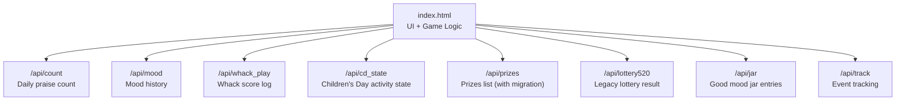
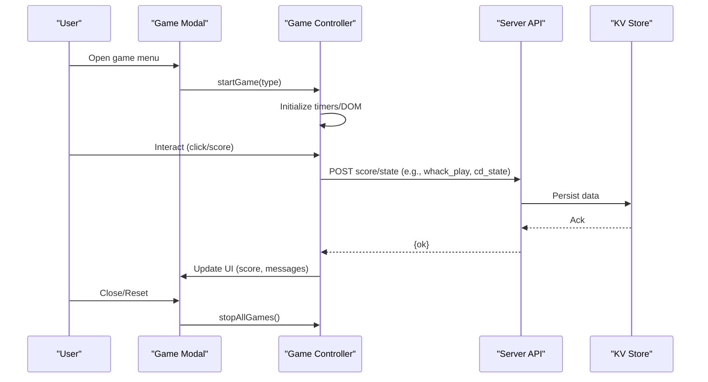
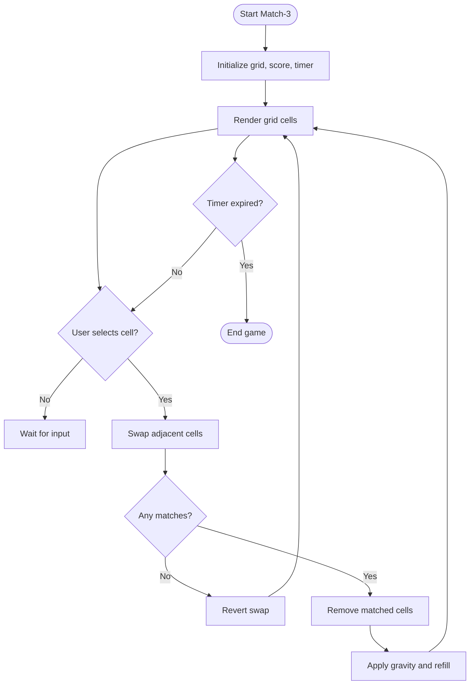
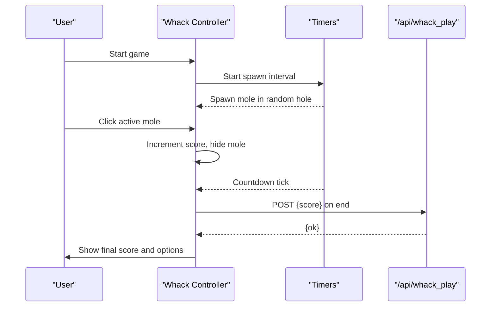
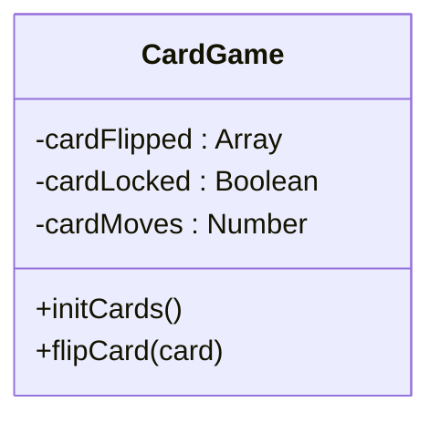
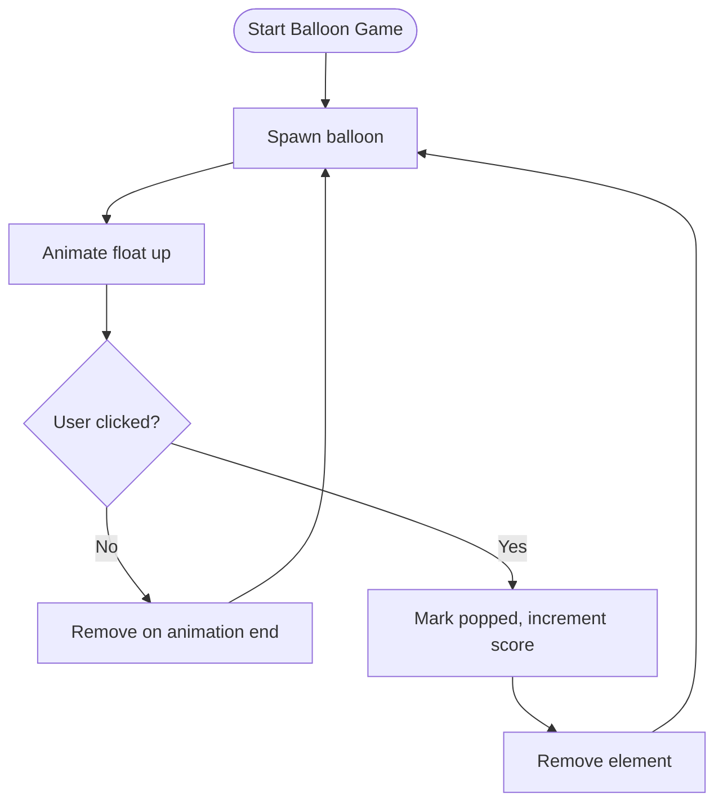
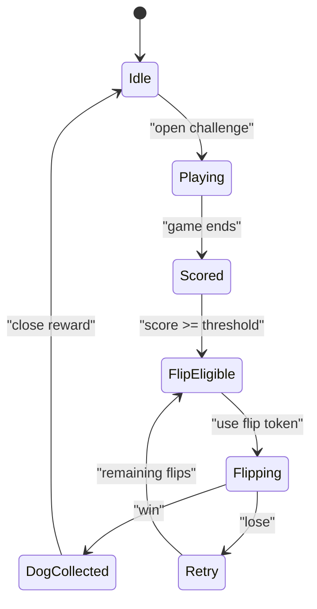
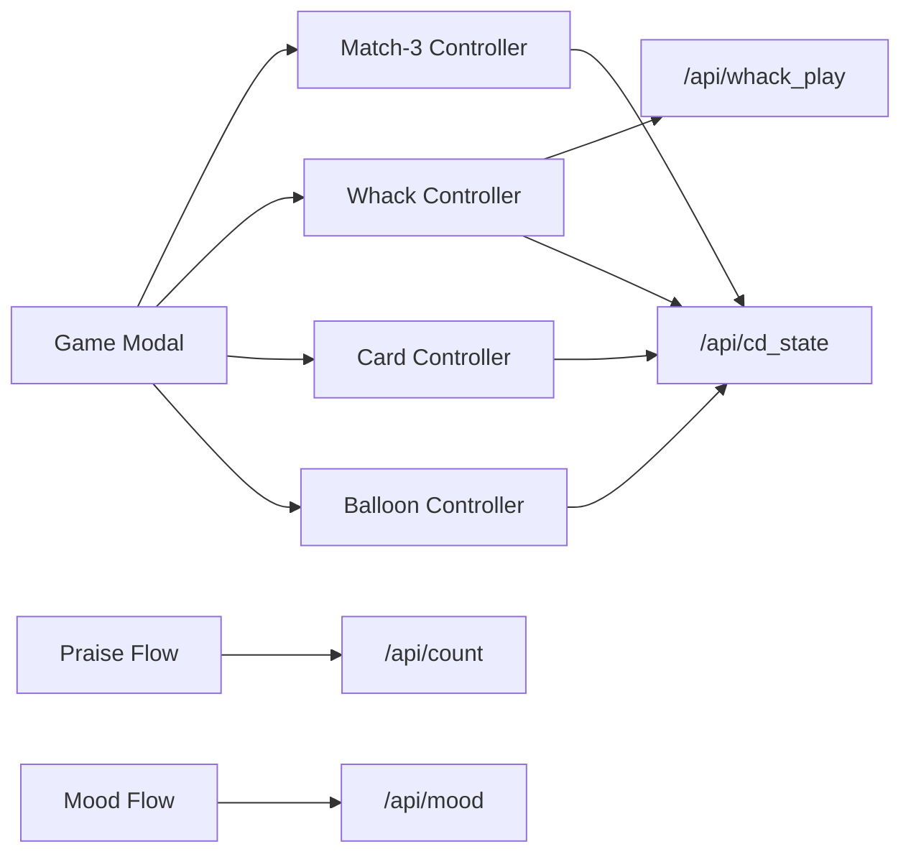

# Frontend Game Integration

<cite>
**Referenced Files in This Document**
- [index.html](file://index.html)
- [count.js](file://functions/api/count.js)
- [mood.js](file://functions/api/mood.js)
- [whack_play.js](file://functions/api/whack_play.js)
- [cd_state.js](file://functions/api/cd_state.js)
- [prizes.js](file://functions/api/prizes.js)
- [lottery520.js](file://functions/api/lottery520.js)
- [jar.js](file://functions/api/jar.js)
- [track.js](file://functions/api/track.js)
</cite>

## Table of Contents
1. Introduction
2. Project Structure
3. Core Components
4. Architecture Overview
5. Detailed Component Analysis
6. Dependency Analysis
7. Performance Considerations
8. Troubleshooting Guide
9. Conclusion

## Introduction
This document explains how all game features are integrated into the main application interface. It covers how games are embedded within index.html, including modal dialogs, game containers, and UI components. It also documents the JavaScript modules that handle game initialization, event listeners, and API communication, as well as the styling system for responsive design and accessibility. Finally, it details state management across different games, user session handling, and progress persistence with examples of embedding patterns, event propagation, and cross-game communication mechanisms.

## Project Structure
The application is a single-page frontend built inside index.html. All game UIs and logic are embedded directly in this file using modal overlays and container sections. The backend APIs are implemented as Cloudflare Workers under functions/api and provide persistent storage via KV for counts, moods, scores, and activity states.

**Diagram sources**
- [index.html:2477-2546](file://index.html#L2477-L2546)
- [count.js:16-31](file://functions/api/count.js#L16-L31)
- [mood.js:19-43](file://functions/api/mood.js#L19-L43)
- [whack_play.js:21-43](file://functions/api/whack_play.js#L21-L43)
- [cd_state.js:13-27](file://functions/api/cd_state.js#L13-L27)
- [prizes.js:14-59](file://functions/api/prizes.js#L14-L59)
- [lottery520.js:18-42](file://functions/api/lottery520.js#L18-L42)
- [jar.js:21-30](file://functions/api/jar.js#L21-L30)
- [track.js:11-43](file://functions/api/track.js#L11-L43)

**Section sources**
- [index.html:2477-2546](file://index.html#L2477-L2546)
- [count.js:16-31](file://functions/api/count.js#L16-L31)
- [mood.js:19-43](file://functions/api/mood.js#L19-L43)
- [whack_play.js:21-43](file://functions/api/whack_play.js#L21-L43)
- [cd_state.js:13-27](file://functions/api/cd_state.js#L13-L27)
- [prizes.js:14-59](file://functions/api/prizes.js#L14-L59)
- [lottery520.js:18-42](file://functions/api/lottery520.js#L18-L42)
- [jar.js:21-30](file://functions/api/jar.js#L21-L30)
- [track.js:11-43](file://functions/api/track.js#L11-L43)

## Core Components
- Modal-based game hub: A bottom modal hosts multiple mini-games, each in its own container section. Games include match-three, whack-a-mole, card matching, and balloon popping.
- Event-driven game lifecycle: Each game has start, stop, and reset handlers to manage timers, intervals, and DOM state.
- Cross-feature hooks: Some games integrate with the Children’s Day activity by granting flip tokens or updating collected items based on scores.
- Persistence layer: Scores and activity states are persisted via KV-backed APIs; local fallbacks exist for offline resilience.

Key responsibilities:
- Game modal orchestration: openGameModal, showGameMenu, startGame, stopAllGames.
- Individual game controllers: startMatch3, startWhack, initCards, startBalloon, plus their stop methods.
- State synchronization: cdState updates and persistence via /api/cd_state.
- UI feedback: modals, toasts, confetti, floating emojis, and responsive panels.

**Section sources**
- [index.html:2477-2546](file://index.html#L2477-L2546)
- [index.html:2674-2711](file://index.html#L2674-L2711)
- [index.html:2713-2839](file://index.html#L2713-L2839)
- [index.html:2841-2889](file://index.html#L2841-L2889)
- [index.html:2891-2993](file://index.html#L2891-L2993)
- [index.html:2995-3040](file://index.html#L2995-L3040)
- [index.html:3486-3585](file://index.html#L3486-L3585)

## Architecture Overview
The frontend architecture centers around a single HTML page with embedded CSS and JavaScript. Games are rendered inside modal containers and driven by event listeners. Backend APIs provide state persistence and analytics.

**Diagram sources**
- [index.html:2674-2711](file://index.html#L2674-L2711)
- [index.html:2929-2977](file://index.html#L2929-L2977)
- [index.html:3486-3585](file://index.html#L3486-L3585)
- [whack_play.js:29-43](file://functions/api/whack_play.js#L29-L43)
- [cd_state.js:21-27](file://functions/api/cd_state.js#L21-L27)

## Detailed Component Analysis

### Game Modal and Containers
- Container structure: A modal overlay contains a menu and several game-specific sections (cards, whack, balloon, match3). Only one game is visible at a time.
- Lifecycle: Opening the modal resets previous games; selecting a game hides the menu and shows the corresponding container. Closing the modal stops all running games.
- Accessibility: Buttons use semantic elements and clear labels; modal close actions respond to backdrop clicks and explicit close buttons.

Embedding pattern example paths:
- Modal markup and close behavior: [index.html:2477-2546](file://index.html#L2477-L2546), [index.html:3042-3048](file://index.html#L3042-L3048)
- Menu navigation and visibility toggling: [index.html:2674-2711](file://index.html#L2674-L2711)

**Section sources**
- [index.html:2477-2546](file://index.html#L2477-L2546)
- [index.html:2674-2711](file://index.html#L2674-L2711)
- [index.html:3042-3048](file://index.html#L3042-L3048)

### Match-Three Game
- Initialization: Creates a grid, initializes timer, and renders cells.
- Interaction: Selects adjacent cells and attempts swap; if no match, reverts swap after a short delay.
- Matching logic: Detects horizontal and vertical runs of three or more; removes matched cells, applies gravity, and refills.
- Completion: Ends when time expires, showing final score.

Flowchart of core algorithm:

**Diagram sources**
- [index.html:2713-2839](file://index.html#L2713-L2839)

**Section sources**
- [index.html:2713-2839](file://index.html#L2713-L2839)

### Whack-a-Mole Game
- Initialization: Builds a 3x3 grid, sets up timers for spawning moles and countdown.
- Interaction: Clicking an active mole increases score and hides the mole temporarily.
- Scoring and integration: On end, posts score to /api/whack_play and may grant flip tokens for the Children’s Day activity if thresholds are met.

Sequence diagram of gameplay loop:

**Diagram sources**
- [index.html:2891-2993](file://index.html#L2891-L2993)
- [whack_play.js:29-43](file://functions/api/whack_play.js#L29-L43)

**Section sources**
- [index.html:2891-2993](file://index.html#L2891-L2993)
- [whack_play.js:29-43](file://functions/api/whack_play.js#L29-L43)

### Card Matching Game
- Initialization: Shuffles pairs of emoji cards and renders them face-down.
- Interaction: Flips two cards; if they match, they stay flipped; otherwise, they flip back after a delay.
- Completion: When all pairs are matched, shows completion message and reset option.

Class-like structure overview:

**Diagram sources**
- [index.html:2841-2889](file://index.html#L2841-L2889)

**Section sources**
- [index.html:2841-2889](file://index.html#L2841-L2889)

### Balloon Popping Game
- Initialization: Spawns balloons at intervals with randomized speeds and positions.
- Interaction: Clicking a balloon increments score and triggers pop animation before removal.
- Completion: Stops spawning and timers when time expires, showing final score.

Flowchart of balloon lifecycle:

**Diagram sources**
- [index.html:2995-3040](file://index.html#L2995-L3040)

**Section sources**
- [index.html:2995-3040](file://index.html#L2995-L3040)

### Children’s Day Activity Integration
- State model: Tracks dogs collected, tokens earned/used, daily date, and flip tokens.
- Hooks: Praising increments tokens; scoring above threshold grants flip tokens; flipping can collect dogs.
- Persistence: State loaded from and saved to /api/cd_state; UI updates reflect current status.

State transitions:

**Diagram sources**
- [index.html:3486-3585](file://index.html#L3486-L3585)
- [cd_state.js:13-27](file://functions/api/cd_state.js#L13-L27)

**Section sources**
- [index.html:3486-3585](file://index.html#L3486-L3585)
- [cd_state.js:13-27](file://functions/api/cd_state.js#L13-L27)

### Styling System and Responsive Design
- Layout: Uses flexbox and grid for responsive arrangements; mobile-specific rules adjust spacing and visibility of side panels.
- Animations: CSS keyframes for splash, floating elements, and game interactions; lightweight transforms for performance.
- Eye-care mode: Applies a warm color overlay and adjusts component backgrounds for reduced eye strain.

Responsive highlights:
- Mobile-only history panel and hidden side panels below certain breakpoints.
- Action buttons and game containers adapt to smaller screens with adjusted padding and font sizes.

**Section sources**
- [index.html:25-30](file://index.html#L25-L30)
- [index.html:805-809](file://index.html#L805-L809)
- [index.html:1317-1386](file://index.html#L1317-L1386)

### Accessibility Considerations
- Semantic elements: Buttons and headings used appropriately for screen readers.
- Keyboard-friendly interactions: Modal close responds to backdrop clicks; game controls rely on click events suitable for touch and mouse.
- Visual cues: Clear focus states and animations do not impede readability; contrast maintained through consistent color palettes.

**Section sources**
- [index.html:2477-2546](file://index.html#L2477-L2546)
- [index.html:3042-3048](file://index.html#L3042-L3048)

## Dependency Analysis
Frontend dependencies between modules and APIs:
- Game controllers depend on modal utilities for visibility and lifecycle management.
- Whack game depends on /api/whack_play for score persistence and on cd_state for activity integration.
- Activity state depends on /api/cd_state for loading and saving; UI updates drive further interactions.
- Mood and counting features depend on /api/mood and /api/count respectively.

**Diagram sources**
- [index.html:2674-2711](file://index.html#L2674-L2711)
- [index.html:2929-2977](file://index.html#L2929-L2977)
- [index.html:3486-3585](file://index.html#L3486-L3585)
- [count.js:16-31](file://functions/api/count.js#L16-L31)
- [mood.js:19-43](file://functions/api/mood.js#L19-L43)
- [whack_play.js:29-43](file://functions/api/whack_play.js#L29-L43)
- [cd_state.js:13-27](file://functions/api/cd_state.js#L13-L27)

**Section sources**
- [index.html:2674-2711](file://index.html#L2674-L2711)
- [index.html:2929-2977](file://index.html#L2929-L2977)
- [index.html:3486-3585](file://index.html#L3486-L3585)
- [count.js:16-31](file://functions/api/count.js#L16-L31)
- [mood.js:19-43](file://functions/api/mood.js#L19-L43)
- [whack_play.js:29-43](file://functions/api/whack_play.js#L29-L43)
- [cd_state.js:13-27](file://functions/api/cd_state.js#L13-L27)

## Performance Considerations
- Use requestAnimationFrame for animations and canvas rendering to maintain smooth frame rates.
- Avoid heavy DOM manipulations during gameplay; batch updates where possible.
- Debounce or throttle frequent events (e.g., rapid clicks) to prevent unnecessary recalculations.
- Prefer CSS transforms and opacity for animations to leverage GPU acceleration.
- Limit concurrent timers and intervals; ensure proper cleanup on game stop to avoid memory leaks.

[No sources needed since this section provides general guidance]

## Troubleshooting Guide
Common issues and resolutions:
- Game timers not stopping: Ensure stop functions clear intervals and timeouts; verify stopAllGames is called on modal close.
- State not persisting: Check network requests to APIs; confirm CORS headers and KV keys; add error handling for failed fetches.
- UI not updating: Verify DOM references exist before manipulation; ensure modal classes are toggled correctly.
- Offline behavior: LocalStorage fallbacks should be validated; ensure dates align with server timezone calculations.

API-related checks:
- /api/count: GET returns today’s count; POST increments and persists.
- /api/mood: GET returns mood history; POST saves new entry.
- /api/whack_play: POST logs score; GET retrieves past plays.
- /api/cd_state: GET loads activity state; POST saves updated state.
- /api/prizes: GET returns prizes with migration from legacy key; POST adds new prize.
- /api/lottery520: GET checks prior play; POST prevents duplicate submissions.
- /api/jar: POST stores good mood entries.
- /api/track: POST records events with device and location metadata.

**Section sources**
- [index.html:3042-3048](file://index.html#L3042-L3048)
- [count.js:16-31](file://functions/api/count.js#L16-L31)
- [mood.js:19-43](file://functions/api/mood.js#L19-L43)
- [whack_play.js:21-43](file://functions/api/whack_play.js#L21-L43)
- [cd_state.js:13-27](file://functions/api/cd_state.js#L13-L27)
- [prizes.js:14-59](file://functions/api/prizes.js#L14-L59)
- [lottery520.js:18-42](file://functions/api/lottery520.js#L18-L42)
- [jar.js:21-30](file://functions/api/jar.js#L21-L30)
- [track.js:11-43](file://functions/api/track.js#L11-L43)

## Conclusion
The frontend integrates multiple mini-games within a unified modal interface, leveraging event-driven controllers and a consistent styling system. State management spans local storage and server-side KV persistence, enabling cross-game features like the Children’s Day activity. The architecture balances simplicity and extensibility, allowing new games to be added with minimal changes to the modal and controller layers. Proper cleanup, responsive design, and accessibility considerations ensure a robust and user-friendly experience.

[No sources needed since this section summarizes without analyzing specific files]