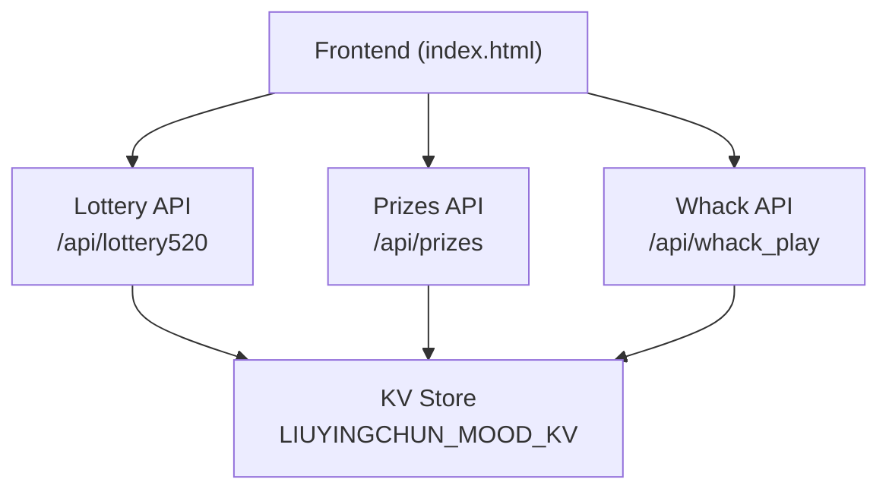
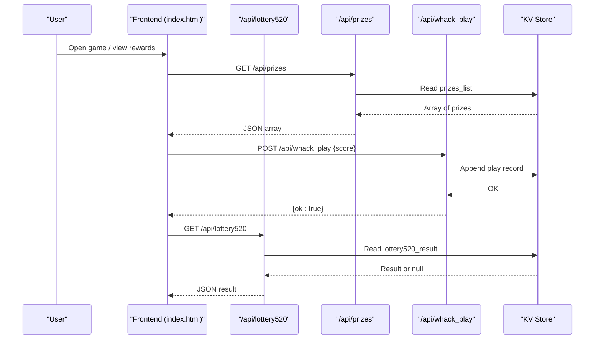
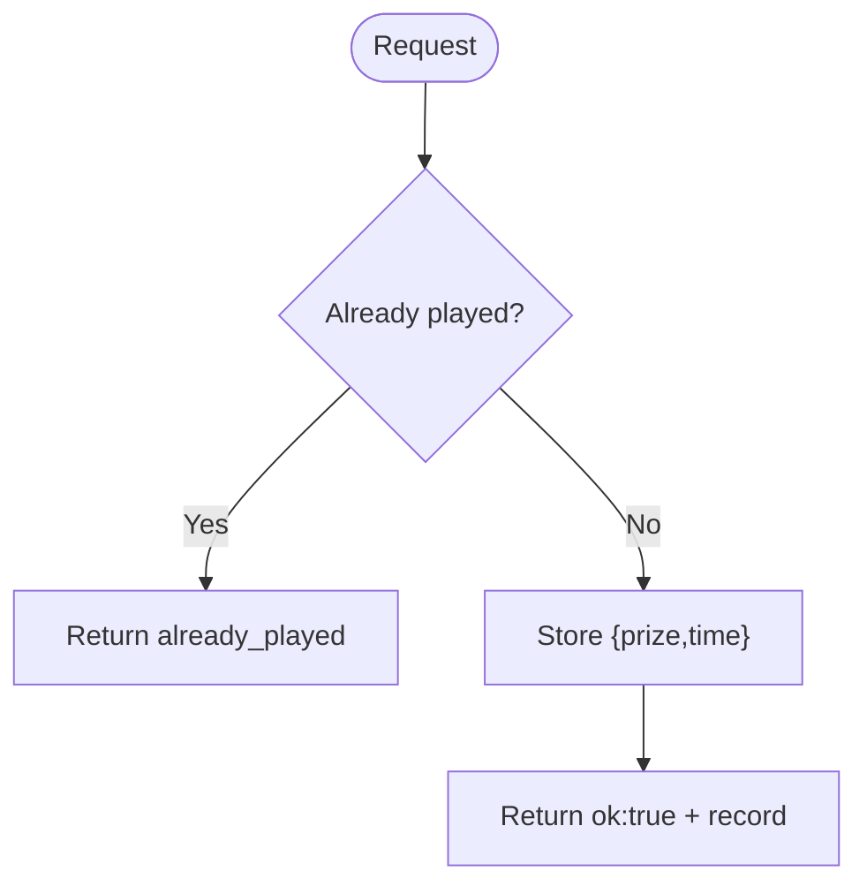
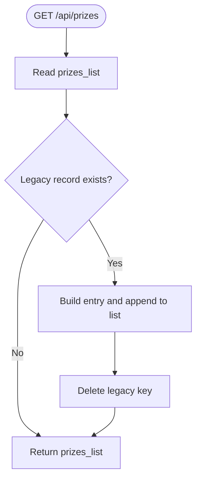
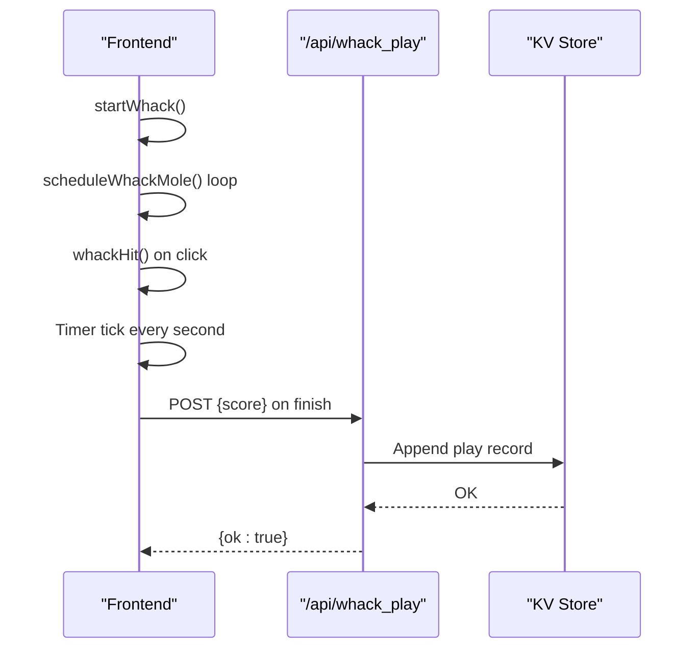
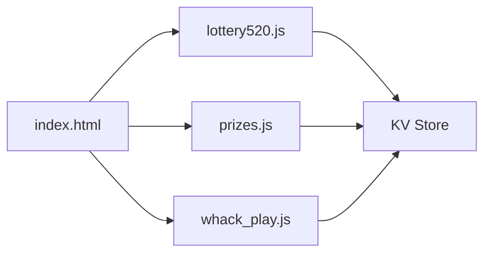

# Game Features

<cite>
**Referenced Files in This Document**
- [lottery520.js](file://functions/api/lottery520.js)
- [prizes.js](file://functions/api/prizes.js)
- [whack_play.js](file://functions/api/whack_play.js)
- [index.html](file://index.html)
</cite>

## Table of Contents
1. Introduction
2. Project Structure
3. Core Components
4. Architecture Overview
5. Detailed Component Analysis
6. Dependency Analysis
7. Performance Considerations
8. Troubleshooting Guide
9. Conclusion

## Introduction
This document explains the mini-game suite integrated into the application, focusing on:
- Lottery system for random prize distribution (/api/lottery520)
- Prize management system (/api/prizes) for reward handling and history
- Whack-a-mole interactive game (/api/whack_play) with scoring and state management
It also covers frontend integration points, game logic algorithms, probability considerations, fairness, and user engagement patterns that encourage daily interaction.

## Project Structure
The mini-games are implemented as serverless API functions under functions/api and a single-page frontend in index.html. The key files are:
- functions/api/lottery520.js: One-time lottery endpoint to record a prize draw result
- functions/api/prizes.js: CRUD-like endpoints to list and add prize records; includes migration from legacy data
- functions/api/whack_play.js: Read/write endpoint to persist whack-a-mole play scores with date/time/city metadata
- index.html: Frontend UI and game logic, including whack-a-mole gameplay, event hooks, and optional activity flows

**Diagram sources**
- [lottery520.js:1-43](file://functions/api/lottery520.js#L1-L43)
- [prizes.js:1-60](file://functions/api/prizes.js#L1-L60)
- [whack_play.js:1-44](file://functions/api/whack_play.js#L1-L44)
- [index.html:2487-2516](file://index.html#L2487-L2516)
- [index.html:2957-2961](file://index.html#L2957-L2961)

**Section sources**
- [lottery520.js:1-43](file://functions/api/lottery520.js#L1-L43)
- [prizes.js:1-60](file://functions/api/prizes.js#L1-L60)
- [whack_play.js:1-44](file://functions/api/whack_play.js#L1-L44)
- [index.html:2487-2516](file://index.html#L2487-L2516)
- [index.html:2957-2961](file://index.html#L2957-L2961)

## Core Components
- Lottery endpoint (/api/lottery520): Ensures one-time draw per session by storing a single result in KV; GET returns current result; POST saves if none exists.
- Prizes endpoint (/api/prizes): Lists all prizes; automatically migrates legacy single-record result into the new list; supports adding new prize entries.
- Whack-a-mole endpoint (/api/whack_play): Stores each play’s score with Beijing date/time and inferred city; GET returns all plays.

Key behaviors:
- CORS headers enabled for cross-origin calls from the browser
- Timezone-aware timestamps using Beijing time
- KV-backed persistence for minimal state

**Section sources**
- [lottery520.js:1-43](file://functions/api/lottery520.js#L1-L43)
- [prizes.js:1-60](file://functions/api/prizes.js#L1-L60)
- [whack_play.js:1-44](file://functions/api/whack_play.js#L1-L44)

## Architecture Overview
The frontend orchestrates user interactions and delegates stateful operations to backend APIs. Data is persisted in a KV store keyed by feature-specific identifiers.

**Diagram sources**
- [index.html:2957-2961](file://index.html#L2957-L2961)
- [prizes.js:14-39](file://functions/api/prizes.js#L14-L39)
- [whack_play.js:21-43](file://functions/api/whack_play.js#L21-L43)
- [lottery520.js:18-42](file://functions/api/lottery520.js#L18-L42)

## Detailed Component Analysis

### Lottery System (/api/lottery520)
Purpose:
- Provide a one-time random prize draw experience per session/user context.
- Persist the draw result once and prevent re-draws.

Behavior:
- GET: Returns existing result if present; otherwise null.
- POST: Accepts a prize payload; rejects if already played; stores timestamped record.

Data model:
- Key: lottery520_result
- Value: { prize, time }

Probability and fairness:
- Selection occurs client-side before submission; the backend enforces one-time use but does not compute probabilities. Ensure client-side selection uses a uniform random over available prizes to maintain fairness.

Integration:
- Frontend triggers POST after computing a prize; subsequent GET reflects the saved result.

**Diagram sources**
- [lottery520.js:26-42](file://functions/api/lottery520.js#L26-L42)

**Section sources**
- [lottery520.js:1-43](file://functions/api/lottery520.js#L1-L43)

### Prize Management System (/api/prizes)
Purpose:
- Maintain a persistent list of prizes earned across activities.
- Support migration from legacy single-record storage to a unified list.

Behavior:
- GET: Reads prizes_list; if legacy lottery520_result exists and not yet migrated, converts it into a standardized entry and deletes the legacy key.
- POST: Validates required fields and appends a new prize record.

Data model:
- Key: prizes_list
- Value: Array of { activity, prize, date, slogan }

Migration details:
- Converts legacy time string to a normalized date format and adds an activity label and optional slogan.

Integration:
- Frontend can fetch the full list to display achievements and progress.

**Diagram sources**
- [prizes.js:14-39](file://functions/api/prizes.js#L14-L39)

**Section sources**
- [prizes.js:1-60](file://functions/api/prizes.js#L1-L60)

### Whack-a-Mole Game (/api/whack_play)
Purpose:
- Provide a timed, interactive mini-game where players tap moles to earn points.
- Persist final scores with contextual metadata.

Gameplay flow:
- A 3x3 grid of holes spawns moles at increasing frequency over 30 seconds.
- Each hit awards points; when time expires, the final score is sent to the backend.

Scoring and difficulty:
- Score increments per hit.
- Spawn rate and visibility duration adapt based on elapsed time to increase difficulty.

Backend persistence:
- POST /api/whack_play stores { date, time, city, score }.
- GET /api/whack_play returns all recorded plays.

**Diagram sources**
- [index.html:2896-2993](file://index.html#L2896-L2993)
- [whack_play.js:21-43](file://functions/api/whack_play.js#L21-L43)

**Section sources**
- [index.html:2896-2993](file://index.html#L2896-L2993)
- [whack_play.js:1-44](file://functions/api/whack_play.js#L1-L44)

### Frontend Integration Points
- Whack-a-mole UI and controls:
  - Grid rendering, mole scheduling, timer, and score updates
  - On completion, posts final score to /api/whack_play
- Activity hooks:
  - Optional Children’s Day challenge path integrates with local state and UI feedback
- Reward display:
  - Fetches /api/prizes to show accumulated rewards

Relevant code paths:
- Game menu and startWhack invocation
- Whack-a-mole lifecycle and posting final score
- UI elements for game modal and results

**Section sources**
- [index.html:2487-2516](file://index.html#L2487-L2516)
- [index.html:2674-2709](file://index.html#L2674-L2709)
- [index.html:2896-2993](file://index.html#L2896-L2993)
- [index.html:2957-2961](file://index.html#L2957-L2961)

## Dependency Analysis
Coupling and cohesion:
- Frontend depends on three API endpoints for stateful features.
- Each API is cohesive around a single concern (lottery, prizes, whack plays).
- All APIs depend on a shared KV namespace for persistence.

External dependencies:
- Browser fetch API for HTTP requests
- KV store environment variable for data persistence
- Cloudflare request context for geolocation hints (city/region)

Potential circular dependencies:
- None observed; frontend calls APIs without reverse callbacks.

**Diagram sources**
- [index.html:2957-2961](file://index.html#L2957-L2961)
- [lottery520.js:1-43](file://functions/api/lottery520.js#L1-L43)
- [prizes.js:1-60](file://functions/api/prizes.js#L1-L60)
- [whack_play.js:1-44](file://functions/api/whack_play.js#L1-L44)

**Section sources**
- [index.html:2957-2961](file://index.html#L2957-L2961)
- [lottery520.js:1-43](file://functions/api/lottery520.js#L1-L43)
- [prizes.js:1-60](file://functions/api/prizes.js#L1-L60)
- [whack_play.js:1-44](file://functions/api/whack_play.js#L1-L44)

## Performance Considerations
- KV reads/writes are lightweight; ensure payloads remain small (e.g., keep play logs compact).
- Whack-a-mole scheduling uses intervals and timeouts; ensure cleanup on game stop to avoid memory leaks.
- Frontend optimistic updates improve perceived performance; always reconcile with server responses.

[No sources needed since this section provides general guidance]

## Troubleshooting Guide
Common issues and resolutions:
- Repeated lottery draws:
  - If POST returns already_played, verify that GET shows a saved result and that the frontend does not retry blindly.
- Missing prize history:
  - Confirm GET /api/prizes returns a non-empty array; check migration behavior for legacy keys.
- Whack scores not saving:
  - Verify POST payload contains a numeric score; confirm network connectivity and KV availability.

Operational checks:
- Inspect CORS headers to ensure browser requests succeed.
- Validate timezone conversion for timestamps to ensure consistency.

**Section sources**
- [lottery520.js:26-42](file://functions/api/lottery520.js#L26-L42)
- [prizes.js:14-59](file://functions/api/prizes.js#L14-L59)
- [whack_play.js:29-43](file://functions/api/whack_play.js#L29-L43)

## Conclusion
The mini-game suite combines simple, focused backend endpoints with an engaging frontend to deliver:
- A one-time lottery experience with persistent results
- A centralized prize ledger with automatic migration support
- A timed whack-a-mole game with score persistence and contextual metadata
Together, these features create a gamified loop that encourages daily interaction through achievable goals, visible progress, and rewarding outcomes.

[No sources needed since this section summarizes without analyzing specific files]