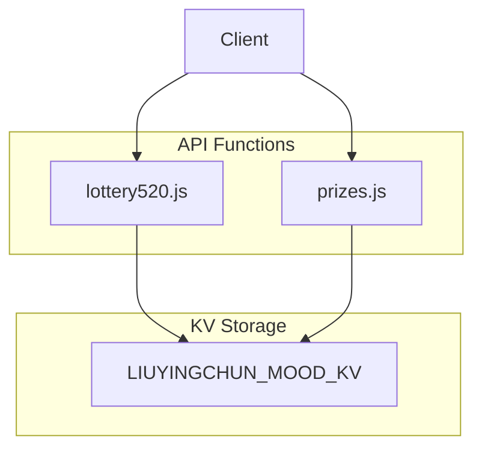
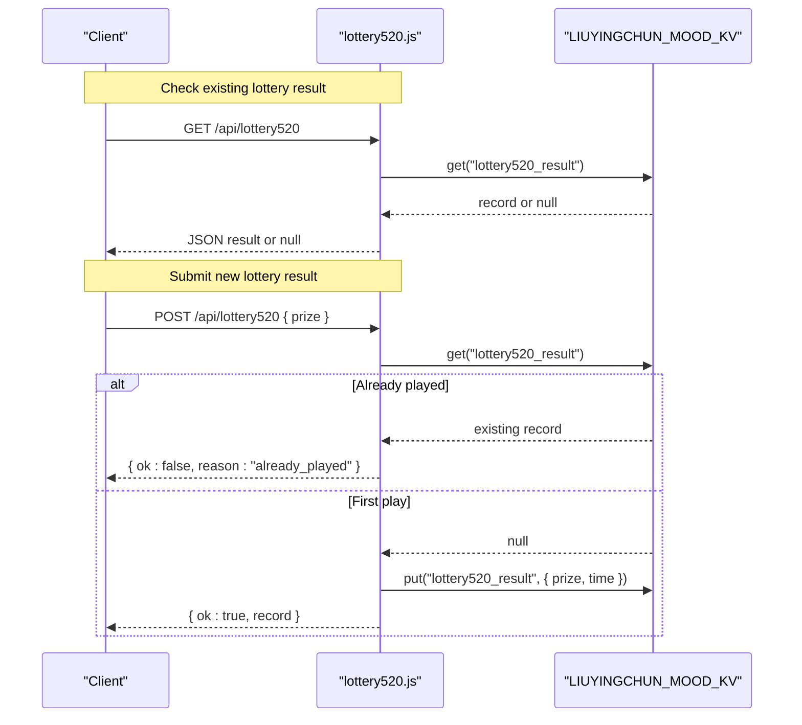
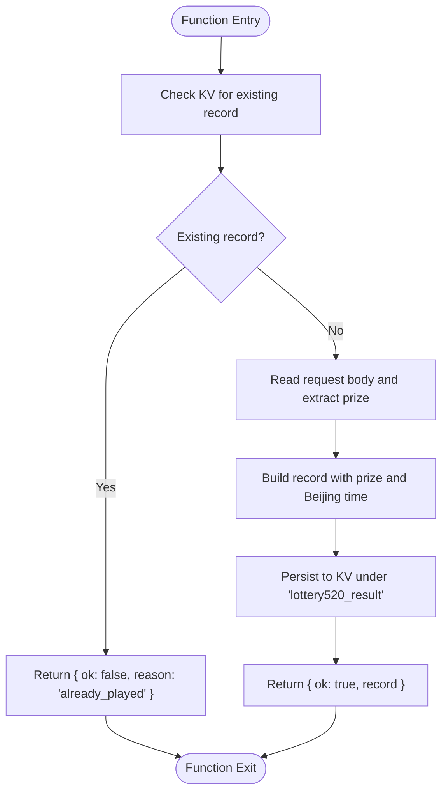
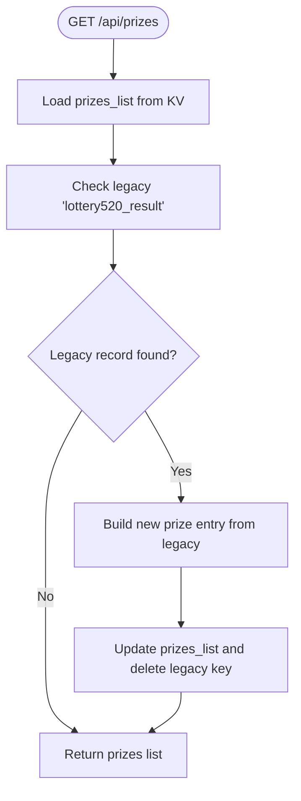
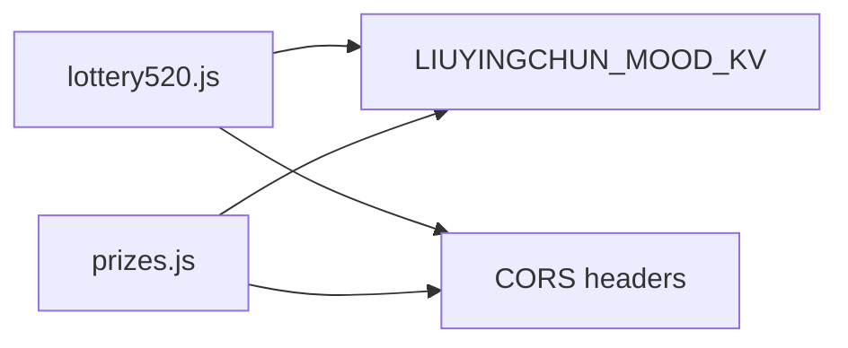

# Lottery System

<cite>
**Referenced Files in This Document**
- [lottery520.js](file://functions/api/lottery520.js)
- [prizes.js](file://functions/api/prizes.js)
</cite>

## Table of Contents
1. [Introduction](#introduction)
2. [Project Structure](#project-structure)
3. [Core Components](#core-components)
4. [Architecture Overview](#architecture-overview)
5. [Detailed Component Analysis](#detailed-component-analysis)
6. [Dependency Analysis](#dependency-analysis)
7. [Performance Considerations](#performance-considerations)
8. [Troubleshooting Guide](#troubleshooting-guide)
9. [Conclusion](#conclusion)

## Introduction
This document explains the lottery system implementation used by the project. It focuses on:
- The random prize distribution mechanism
- One-time play restriction logic
- Beijing timezone handling for timestamps
- API endpoints for checking existing results and submitting new lottery results
- Data storage structure using KV storage
- Security measures preventing multiple plays
- CORS configuration for cross-origin requests
- Examples of successful submissions and error handling for already-played scenarios

The core behavior is implemented in serverless functions that expose REST-like endpoints and persist data to a KV store.

## Project Structure
The lottery feature is implemented as a single function file under the API folder, with an additional prizes endpoint that supports migration from the legacy lottery result format.

**Diagram sources**
- [lottery520.js:1-42](file://functions/api/lottery520.js#L1-L42)
- [prizes.js:1-60](file://functions/api/prizes.js#L1-L60)

**Section sources**
- [lottery520.js:1-42](file://functions/api/lottery520.js#L1-L42)
- [prizes.js:1-60](file://functions/api/prizes.js#L1-L60)

## Core Components
- Lottery API function: exposes GET and POST handlers for the lottery flow, including one-time play enforcement and Beijing time stamping.
- Prizes API function: provides a unified list of prizes and performs a one-time migration from the legacy lottery result key to the new prizes list structure.

Key responsibilities:
- Enforce one-time play per session or environment via KV state.
- Store lottery results with prize and timestamp fields.
- Provide CORS headers for cross-origin access.
- Migrate legacy data into the current prizes model.

**Section sources**
- [lottery520.js:1-42](file://functions/api/lottery520.js#L1-L42)
- [prizes.js:1-60](file://functions/api/prizes.js#L1-L60)

## Architecture Overview
The lottery system follows a simple request/response pattern over HTTP, backed by KV storage.

**Diagram sources**
- [lottery520.js:14-42](file://functions/api/lottery520.js#L14-L42)

## Detailed Component Analysis

### Lottery API: /api/lottery520
This component implements the core lottery workflow.

- Random prize distribution mechanism:
  - The function accepts a prize value in the POST body. The selection of the prize is not performed inside this function; it is provided by the caller (for example, the frontend). Therefore, randomness is delegated to the client or upstream service that decides which prize to submit.
  - The function validates only that a prize field is present in the request payload before persisting it.

- One-time play restriction logic:
  - Before accepting a new submission, the function checks whether a record already exists in KV under the key `lottery520_result`.
  - If a record exists, the function returns an error response indicating that the user has already played.
  - If no record exists, the function persists the new result and returns success.

- Beijing timezone handling:
  - Timestamps are generated using a helper that adds eight hours to the current UTC time and formats the output as a local string suitable for display.
  - The stored timestamp uses the format produced by this helper.

- CORS configuration:
  - All responses include CORS headers allowing cross-origin requests from any origin, supporting GET, POST, and OPTIONS methods, and allowing the Content-Type header.

- API endpoints:
  - GET /api/lottery520
    - Purpose: Retrieve the existing lottery result if available.
    - Response: JSON object containing the stored record, or null if none exists.
    - Headers: application/json plus CORS headers.
  - POST /api/lottery520
    - Purpose: Submit a new lottery result.
    - Request body: JSON object with a prize field.
    - Success response: JSON object with ok set to true and the persisted record (including prize and time).
    - Error response: JSON object with ok set to false and reason set to already_played when a record already exists.

**Diagram sources**
- [lottery520.js:18-42](file://functions/api/lottery520.js#L18-L42)

**Section sources**
- [lottery520.js:1-42](file://functions/api/lottery520.js#L1-L42)

### Prizes API: /api/prizes
This component manages a unified list of prizes and handles migration from the legacy lottery result format.

- Legacy migration:
  - On GET, the function reads the current prizes list and checks for a legacy record under the key `lottery520_result`.
  - If found, it creates a new prize entry with activity set to “五月礼遇”, copies the prize value, derives a date from the legacy time, and sets a slogan.
  - It then writes the updated prizes list back to KV and deletes the legacy key.

- New prize creation:
  - POST accepts activity, prize, optional date, and optional slogan.
  - It validates required fields and appends a new prize entry to the list.

- CORS configuration:
  - Same CORS policy as the lottery API, enabling cross-origin access.

**Diagram sources**
- [prizes.js:14-40](file://functions/api/prizes.js#L14-L40)

**Section sources**
- [prizes.js:1-60](file://functions/api/prizes.js#L1-L60)

## Dependency Analysis
The lottery system depends on:
- KV storage for persistence of both the legacy lottery result and the unified prizes list.
- CORS headers for cross-origin browser access.
- Timezone adjustment for consistent Beijing timestamps.

**Diagram sources**
- [lottery520.js:1-42](file://functions/api/lottery520.js#L1-L42)
- [prizes.js:1-60](file://functions/api/prizes.js#L1-L60)

**Section sources**
- [lottery520.js:1-42](file://functions/api/lottery520.js#L1-L42)
- [prizes.js:1-60](file://functions/api/prizes.js#L1-L60)

## Performance Considerations
- Single-key lottery state: The lottery result is stored under one key, making read/write operations fast and minimizing contention.
- Migration cost: The prizes endpoint performs a one-time migration on GET; after migration, subsequent calls avoid legacy checks.
- Minimal payload: The lottery submission payload contains only the prize value, reducing network overhead.

[No sources needed since this section provides general guidance]

## Troubleshooting Guide

- Already played scenario:
  - Symptom: POST /api/lottery520 returns a failure response indicating the user has already played.
  - Cause: A record already exists in KV under the legacy key.
  - Resolution: Ensure the frontend does not allow repeated submissions once a result exists, or clear the KV state if resetting the game.

- Missing prize field:
  - Symptom: POST fails due to missing required fields.
  - Cause: The request body does not include the prize field.
  - Resolution: Include the prize field in the JSON payload.

- CORS errors:
  - Symptom: Browser blocks cross-origin requests.
  - Cause: Missing or incorrect CORS headers.
  - Resolution: Verify that the server responds with appropriate CORS headers for GET, POST, and OPTIONS.

- Timezone discrepancies:
  - Symptom: Stored timestamps appear off by several hours.
  - Cause: Using UTC instead of Beijing time.
  - Resolution: Use the provided Beijing time helper to generate timestamps.

**Section sources**
- [lottery520.js:26-42](file://functions/api/lottery520.js#L26-L42)
- [prizes.js:42-59](file://functions/api/prizes.js#L42-L59)

## Conclusion
The lottery system provides a straightforward, secure, and cross-origin-friendly API for recording a single lottery result per environment. It enforces one-time play through KV state, stores results with Beijing timestamps, and includes a migration path to unify historical data into a broader prizes model. Clients are responsible for determining the prize value, while the server ensures consistency and correctness of storage.

[No sources needed since this section summarizes without analyzing specific files]