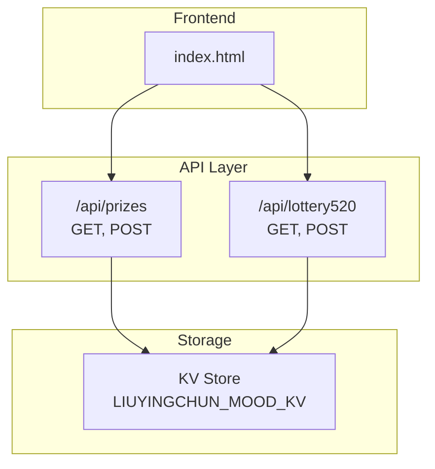
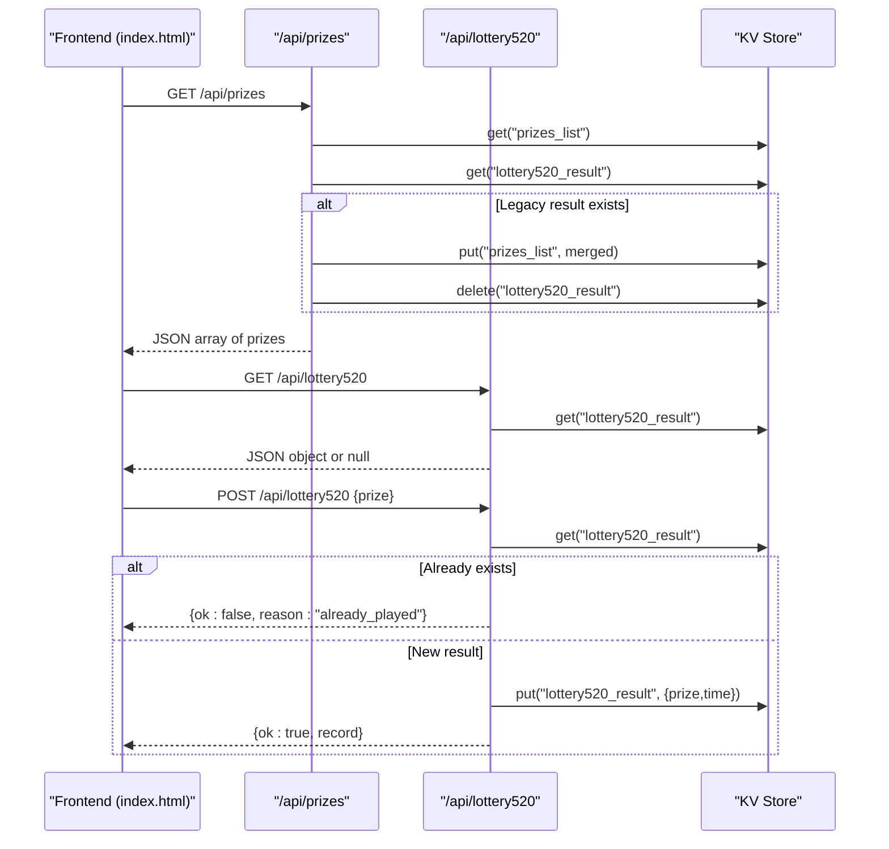
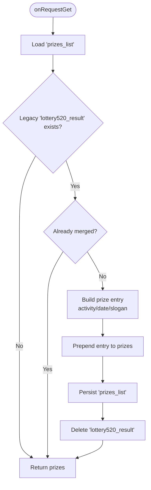
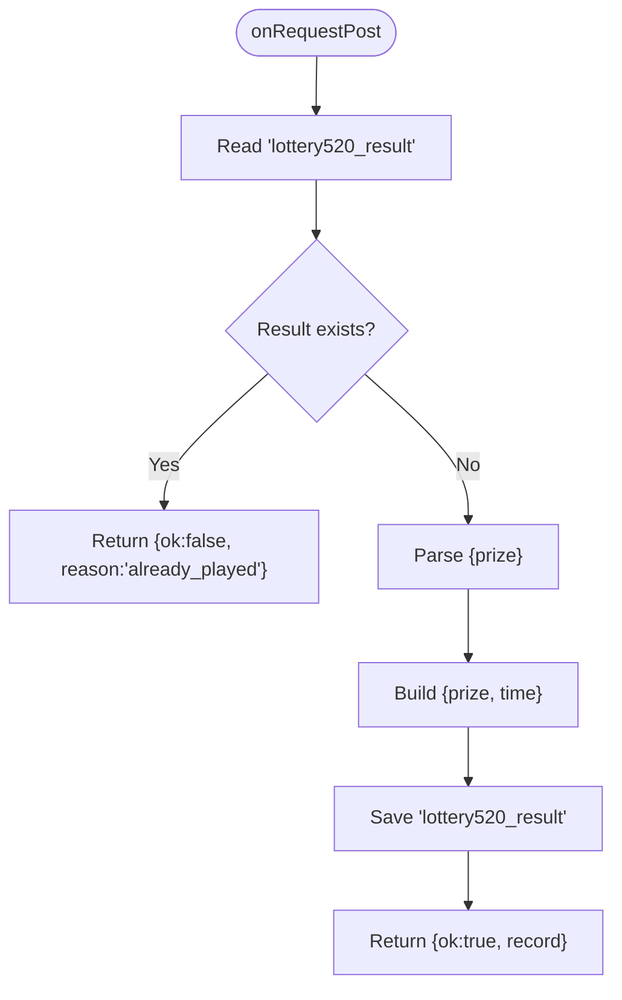
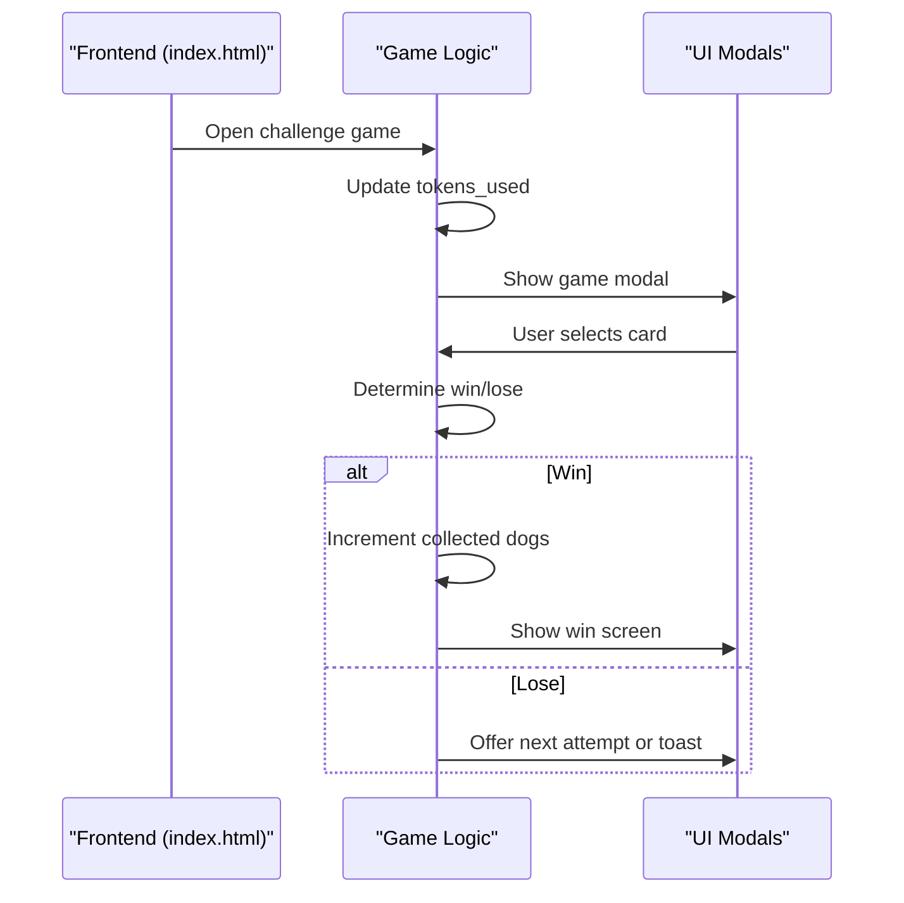
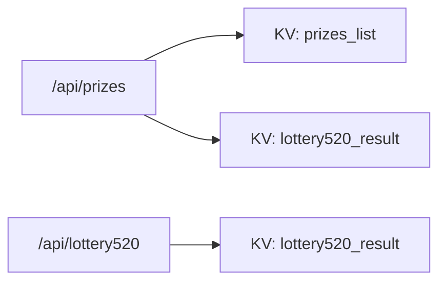

# Prize Management System

<cite>
**Referenced Files in This Document**
- [prizes.js](file://functions/api/prizes.js)
- [lottery520.js](file://functions/api/lottery520.js)
- [index.html](file://index.html)
</cite>

## Table of Contents
1. [Introduction](#introduction)
2. [Project Structure](#project-structure)
3. [Core Components](#core-components)
4. [Architecture Overview](#architecture-overview)
5. [Detailed Component Analysis](#detailed-component-analysis)
6. [Dependency Analysis](#dependency-analysis)
7. [Performance Considerations](#performance-considerations)
8. [Troubleshooting Guide](#troubleshooting-guide)
9. [Conclusion](#conclusion)

## Introduction
This document explains the prize management system that powers the lottery and reward features. It covers how prizes are defined, stored, retrieved, and distributed through the lottery flow. It also documents the API endpoints for managing prize records, the data model used by the system, and the integration points with the frontend.

The system uses a key-value store to persist:
- A list of prizes (with activity metadata).
- The result of a one-time lottery draw.

It provides two serverless functions:
- /api/prizes — manage the prize catalog and migrate legacy lottery results into the new structure.
- /api/lottery520 — record and query the single lottery result per session.

## Project Structure
At a high level, the prize-related functionality is implemented as two Cloudflare Worker-style API handlers under functions/api, and the frontend UI lives in index.html.

**Diagram sources**
- [prizes.js:1-59](file://functions/api/prizes.js#L1-L59)
- [lottery520.js:1-42](file://functions/api/lottery520.js#L1-L42)
- [index.html:3500-3705](file://index.html#L3500-L3705)

**Section sources**
- [prizes.js:1-59](file://functions/api/prizes.js#L1-L59)
- [lottery520.js:1-42](file://functions/api/lottery520.js#L1-L42)
- [index.html:3500-3705](file://index.html#L3500-L3705)

## Core Components
- Prizes Catalog API (/api/prizes)
  - GET: Returns all prizes. Performs a one-time migration from the legacy lottery result into the prizes list if present.
  - POST: Adds a new prize entry with validation.
- Lottery Result API (/api/lottery520)
  - GET: Returns the existing lottery result or null if none.
  - POST: Saves a new lottery result; rejects duplicates.

Key storage keys:
- prizes_list: Array of prize objects.
- lottery520_result: Single object representing the most recent lottery draw.

Data model:
- Prize object fields:
  - activity: string (e.g., campaign name)
  - prize: string (reward identifier or description)
  - date: string (optional; formatted date)
  - slogan: string (optional; display text)
- Lottery result object fields:
  - prize: string
  - time: string (Beijing time stamp)

**Section sources**
- [prizes.js:7-59](file://functions/api/prizes.js#L7-L59)
- [lottery520.js:7-42](file://functions/api/lottery520.js#L7-L42)

## Architecture Overview
The system follows a simple request/response pattern with a persistent key-value store. The frontend can:
- Retrieve the full prize catalog via GET /api/prizes.
- Add new prizes via POST /api/prizes.
- Query whether a lottery has been played and retrieve the result via GET /api/lottery520.
- Submit a lottery result via POST /api/lottery520 (only once).

**Diagram sources**
- [prizes.js:14-59](file://functions/api/prizes.js#L14-L59)
- [lottery520.js:18-42](file://functions/api/lottery520.js#L18-L42)

## Detailed Component Analysis

### Prizes Catalog API (/api/prizes)
Responsibilities:
- CORS handling for cross-origin requests.
- GET returns the current prize list and performs a one-time migration from the legacy lottery result into the new prizes list.
- POST validates input and appends a new prize entry.

Behavior highlights:
- Migration logic checks for an existing legacy lottery result and merges it into the prizes list with a default activity and slogan when needed.
- Duplicate prevention during migration ensures the same prize is not added twice.
- Input validation on POST requires both activity and prize fields.

**Diagram sources**
- [prizes.js:14-39](file://functions/api/prizes.js#L14-L39)

Error handling:
- POST returns a 400 response with reason "missing_fields" when required fields are absent.

**Section sources**
- [prizes.js:1-59](file://functions/api/prizes.js#L1-L59)

### Lottery Result API (/api/lottery520)
Responsibilities:
- GET retrieves the existing lottery result or null.
- POST saves a new lottery result only if none exists; otherwise returns a duplicate error.

Time handling:
- Uses Beijing time for timestamps.

**Diagram sources**
- [lottery520.js:26-42](file://functions/api/lottery520.js#L26-L42)

**Section sources**
- [lottery520.js:1-42](file://functions/api/lottery520.js#L1-L42)

### Frontend Integration Patterns
The frontend includes a Children’s Day mini-game and flip-card mechanics that simulate prize collection locally. While these flows do not directly call the prize APIs, they demonstrate how rewards can be presented and tracked in the UI.

Key behaviors:
- Token-based participation and flip-card selection.
- Local state updates for collected items and win screens.
- Optional persistence of game state to KV via a separate endpoint.

**Diagram sources**
- [index.html:3587-3705](file://index.html#L3587-L3705)

Note: These game flows are local and illustrative. They show common patterns for presenting rewards and user feedback but are not wired to /api/prizes or /api/lottery520 in this repository.

**Section sources**
- [index.html:3500-3705](file://index.html#L3500-L3705)

## Dependency Analysis
- /api/prizes depends on:
  - KV Store key "prizes_list" for the prize catalog.
  - KV Store key "lottery520_result" for legacy migration.
- /api/lottery520 depends on:
  - KV Store key "lottery520_result" for storing and retrieving the single lottery result.
- Frontend (index.html) contains game logic and UI interactions that are independent of the prize APIs in this codebase.

**Diagram sources**
- [prizes.js:7-59](file://functions/api/prizes.js#L7-L59)
- [lottery520.js:7-42](file://functions/api/lottery520.js#L7-L42)

**Section sources**
- [prizes.js:7-59](file://functions/api/prizes.js#L7-L59)
- [lottery520.js:7-42](file://functions/api/lottery520.js#L7-L42)

## Performance Considerations
- Both APIs perform minimal reads/writes to the KV store, which is suitable for low-to-moderate traffic.
- The GET /api/prizes migration runs only when a legacy result exists, avoiding unnecessary writes.
- Avoid frequent polling of /api/lottery520; cache the result client-side after the first successful fetch.
- For large prize catalogs, consider pagination or filtering at the API layer to reduce payload size.

[No sources needed since this section provides general guidance]

## Troubleshooting Guide
Common issues and resolutions:
- Missing fields on POST /api/prizes:
  - Symptom: 400 response with reason "missing_fields".
  - Resolution: Ensure both activity and prize are provided in the request body.
- Duplicate lottery attempts:
  - Symptom: POST /api/lottery520 returns {ok:false, reason:"already_played"}.
  - Resolution: Only submit once; subsequent submissions will be rejected.
- Legacy data not appearing:
  - Symptom: Old lottery result does not appear in the prize list.
  - Resolution: Verify that the legacy key exists and that GET /api/prizes is called to trigger migration.

Operational tips:
- Inspect KV keys "prizes_list" and "lottery520_result" to validate state.
- Use browser developer tools to inspect network responses from the APIs.

**Section sources**
- [prizes.js:42-59](file://functions/api/prizes.js#L42-L59)
- [lottery520.js:26-42](file://functions/api/lottery520.js#L26-L42)

## Conclusion
The prize management system provides a straightforward way to maintain a prize catalog and record a single lottery result using a key-value store. The GET /api/prizes endpoint offers automatic migration from legacy data, while POST /api/prizes allows adding new prizes with basic validation. The /api/lottery520 endpoint enforces one-time draws and returns consistent results. The frontend demonstrates typical reward presentation patterns, though its game logic is decoupled from the prize APIs in this repository.

[No sources needed since this section summarizes without analyzing specific files]