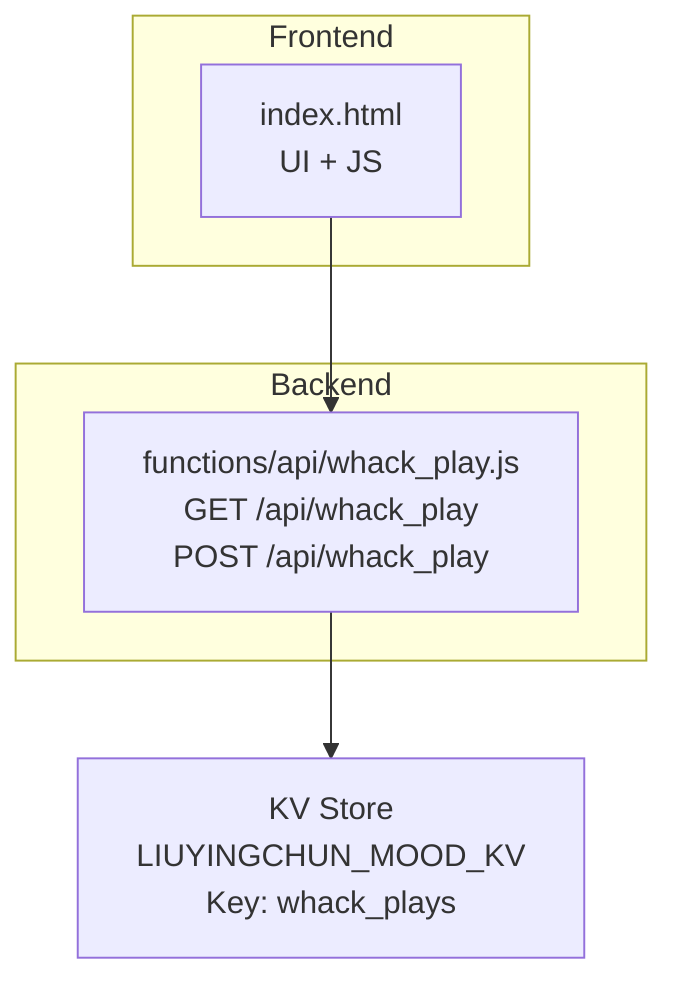
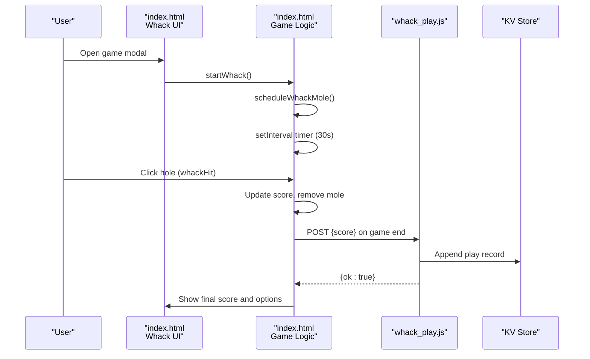
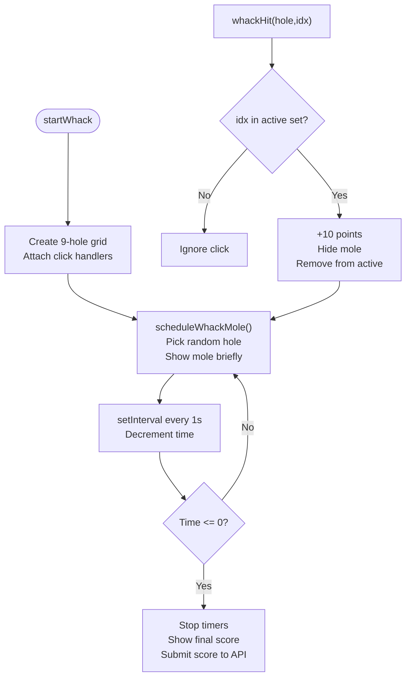
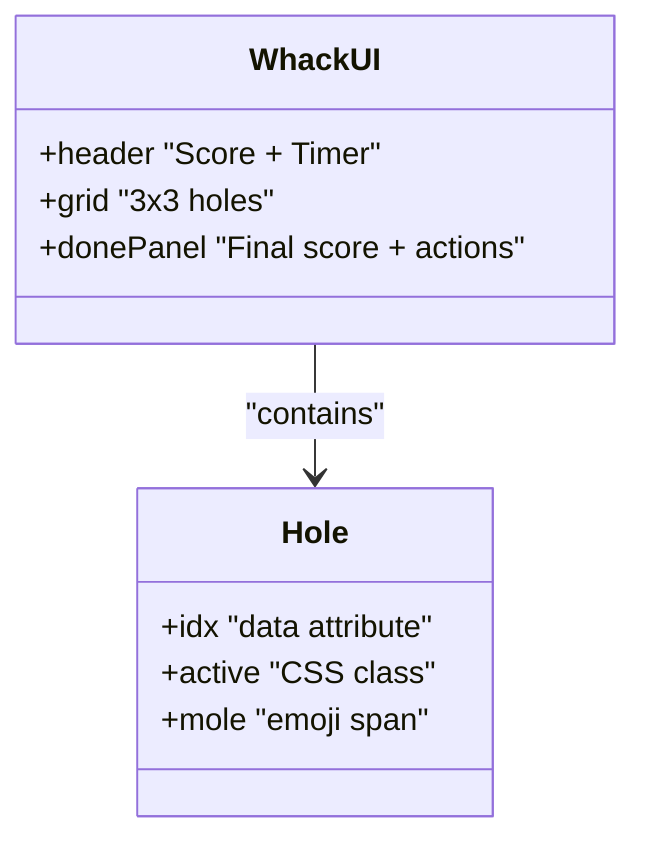
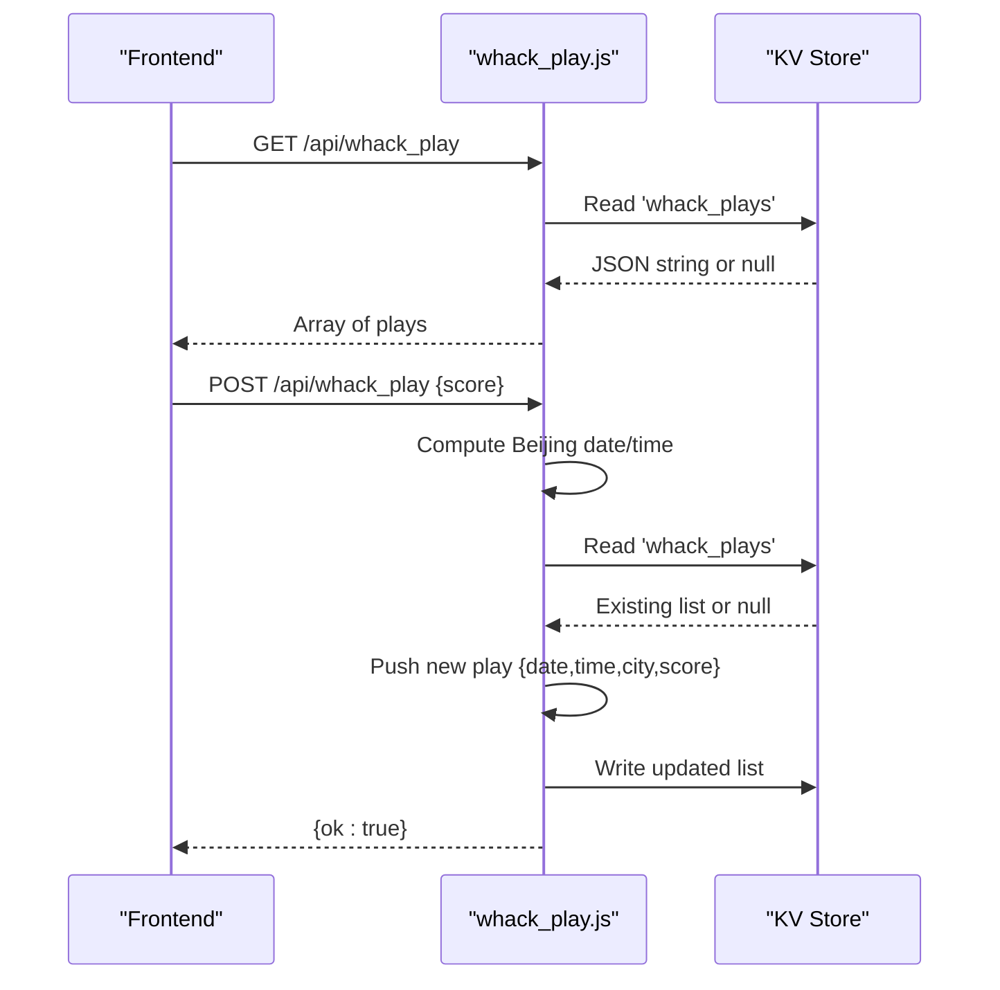
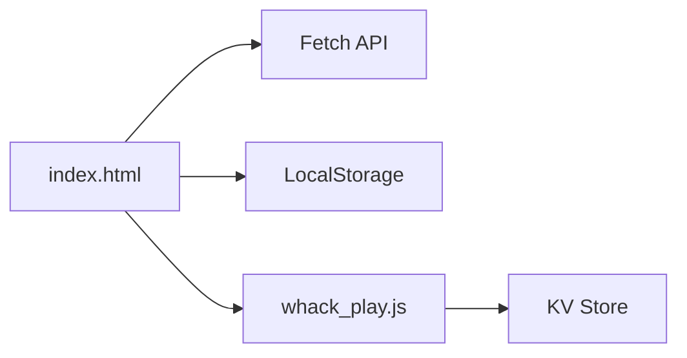

# Whack-a-Mole Game

<cite>
**Referenced Files in This Document**
- [whack_play.js](file://functions/api/whack_play.js)
- [index.html](file://index.html)
</cite>

## Table of Contents
1. [Introduction](#introduction)
2. [Project Structure](#project-structure)
3. [Core Components](#core-components)
4. [Architecture Overview](#architecture-overview)
5. [Detailed Component Analysis](#detailed-component-analysis)
6. [Dependency Analysis](#dependency-analysis)
7. [Performance Considerations](#performance-considerations)
8. [Troubleshooting Guide](#troubleshooting-guide)
9. [Conclusion](#conclusion)

## Introduction
This document explains the whack-a-mole mini-game implementation, including game mechanics, scoring, interaction patterns, API endpoints for state and score management, frontend integration (HTML/CSS/JS), backend processing, anti-cheating considerations, examples, performance notes, and responsive/mobile design.

The whack-a-mole game is one of several mini-games embedded in a single-page application. It runs inside a modal UI with a 3x3 grid of holes where animal emojis pop up. The player taps/clicks to “whack” them within a 30-second time limit. Each successful hit adds points, and at the end of the session, the final score is submitted to a serverless API endpoint that persists it in a key-value store.

## Project Structure
At a high level:
- Frontend: A single HTML file contains all UI, styles, and JavaScript logic for multiple mini-games, including whack-a-mole.
- Backend: A Cloudflare Worker-style API route handles GET/POST requests for whack play records.

**Diagram sources**
- [index.html:2502-2517](file://index.html#L2502-L2517)
- [index.html:2892-2993](file://index.html#L2892-L2993)
- [whack_play.js:1-44](file://functions/api/whack_play.js#L1-L44)

**Section sources**
- [index.html:2502-2517](file://index.html#L2502-L2517)
- [whack_play.js:1-44](file://functions/api/whack_play.js#L1-L44)

## Core Components
- Frontend game engine:
  - Grid generation and DOM manipulation for 9 holes.
  - Mole spawning and visibility scheduling with increasing difficulty over time.
  - Timer countdown and session lifecycle control.
  - Score tracking and UI updates.
  - Final score submission via fetch to the backend API.
- Backend API:
  - CORS handling and OPTIONS preflight support.
  - GET returns all recorded plays.
  - POST appends a new play record with date/time (Beijing timezone) and city metadata.

**Section sources**
- [index.html:2892-2993](file://index.html#L2892-L2993)
- [whack_play.js:1-44](file://functions/api/whack_play.js#L1-L44)

## Architecture Overview
The whack-a-mole flow connects the browser-based game loop to a lightweight serverless API and a KV-backed persistence layer.

**Diagram sources**
- [index.html:2929-2993](file://index.html#L2929-L2993)
- [whack_play.js:21-43](file://functions/api/whack_play.js#L21-L43)

## Detailed Component Analysis

### Frontend: Whack-a-Mole Game Logic
- Game state variables:
  - Score accumulator, remaining time, active holes set, timers array, and interval handle.
- Spawning system:
  - Difficulty scales by elapsed time; spawn intervals shorten and visible durations decrease as the game progresses.
  - Random selection among available holes ensures no overlap.
- Interaction:
  - Each hole has an onclick handler that checks if the mole is currently active before awarding points.
- Lifecycle:
  - Start initializes DOM grid, resets state, starts spawner and timer.
  - Stop clears all timers and intervals and resets active set.
  - On completion, displays final score and submits it to the backend.

**Diagram sources**
- [index.html:2896-2993](file://index.html#L2896-L2993)

**Section sources**
- [index.html:2892-2993](file://index.html#L2892-L2993)

### Frontend: UI Structure and Styling
- Modal container:
  - Contains header with current score and timer, the 3x3 grid, and a done panel showing final score and actions.
- Grid styling:
  - Circular holes with gradient backgrounds and shadows.
  - Mole emoji positioned below the hole and animated into view when active.
- Responsive behavior:
  - Grid uses CSS grid with equal columns; holes maintain aspect ratio.
  - Touch-friendly sizing and spacing for mobile devices.

**Diagram sources**
- [index.html:1748-1784](file://index.html#L1748-L1784)
- [index.html:2502-2517](file://index.html#L2502-L2517)

**Section sources**
- [index.html:1748-1784](file://index.html#L1748-L1784)
- [index.html:2502-2517](file://index.html#L2502-L2517)

### Backend: API Endpoints
- CORS and Preflight:
  - Allows cross-origin GET, POST, and OPTIONS with Content-Type header.
- GET /api/whack_play:
  - Returns JSON array of all recorded plays.
- POST /api/whack_play:
  - Accepts JSON body with a score field.
  - Computes Beijing date and time.
  - Extracts city from request context or falls back to region or unknown.
  - Appends a new play object to the existing list stored under a specific KV key.
  - Returns success response.

**Diagram sources**
- [whack_play.js:1-44](file://functions/api/whack_play.js#L1-L44)

**Section sources**
- [whack_play.js:1-44](file://functions/api/whack_play.js#L1-L44)

### Scoring System and Anti-Cheating Measures
- Scoring:
  - Each valid hit awards a fixed number of points.
  - Score increments only when the clicked hole is currently active.
- Timing constraints:
  - Game duration is fixed at 30 seconds.
  - Mole visibility windows are short and decrease over time, limiting opportunities.
- Client-side validation:
  - Active set prevents double-counting the same mole instance.
  - Clicks outside active holes are ignored.
- Server-side considerations:
  - The backend stores scores without re-validating gameplay logic.
  - No rate-limiting or cryptographic verification is implemented in the provided code.
  - City and timestamp metadata are derived from request context and server time.

Recommendations for stronger anti-cheating:
- Enforce server-side rules such as maximum plausible hits per second based on timing.
- Validate that score increments align with expected point values and time bounds.
- Optionally require a signed challenge token generated per session.

**Section sources**
- [index.html:2980-2986](file://index.html#L2980-L2986)
- [whack_play.js:29-43](file://functions/api/whack_play.js#L29-L43)

### Integration with Children’s Day Activity (Optional Feature)
- When the activity flag is enabled, the game can grant additional flip tokens upon reaching a score threshold.
- Session flags and local storage markers coordinate between the game and the activity UI.
- This feature does not affect core scoring but extends rewards.

**Section sources**
- [index.html:2929-2977](file://index.html#L2929-L2977)
- [index.html:3476-3585](file://index.html#L3476-L3585)

## Dependency Analysis
- index.html depends on:
  - DOM APIs for grid creation and event handling.
  - Fetch API for submitting scores.
  - LocalStorage for optional activity state.
- whack_play.js depends on:
  - Request context for geographic metadata.
  - KV Store for persistent play records.

**Diagram sources**
- [index.html:2957-2961](file://index.html#L2957-L2961)
- [whack_play.js:21-43](file://functions/api/whack_play.js#L21-L43)

**Section sources**
- [index.html:2957-2961](file://index.html#L2957-L2961)
- [whack_play.js:21-43](file://functions/api/whack_play.js#L21-L43)

## Performance Considerations
- Rendering:
  - Minimal DOM operations; grid is created once per session.
  - Mole visibility toggles via CSS classes for smooth transitions.
- Timers:
  - Single interval for countdown; recursive timeouts for mole spawning.
  - Proper cleanup in stop functions avoids memory leaks.
- Network:
  - Score submission occurs once per session; errors are silently caught to avoid blocking UI.
- Mobile:
  - Touch interactions use standard click events; ensure adequate target sizes.
  - Animations are CSS-driven for better performance.

[No sources needed since this section provides general guidance]

## Troubleshooting Guide
Common issues and resolutions:
- Score not updating:
  - Verify that the clicked hole is marked active and the active set includes the hole index.
- Mole not appearing:
  - Check that scheduleWhackMole is running and that available holes exist.
- API submission failures:
  - Ensure CORS headers are allowed and the endpoint path is correct.
  - Confirm KV store permissions and key names.
- Timer not stopping:
  - Confirm stopWhack clears both intervals and timeouts.

**Section sources**
- [index.html:2988-2993](file://index.html#L2988-L2993)
- [whack_play.js:17-19](file://functions/api/whack_play.js#L17-L19)

## Conclusion
The whack-a-mole mini-game is a self-contained frontend experience backed by a simple serverless API. It features a timed scoring loop, dynamic difficulty, and basic persistence of play records. While client-side validation prevents obvious cheating, server-side safeguards could be added to strengthen integrity. The UI is responsive and touch-friendly, suitable for desktop and mobile devices.

[No sources needed since this section summarizes without analyzing specific files]