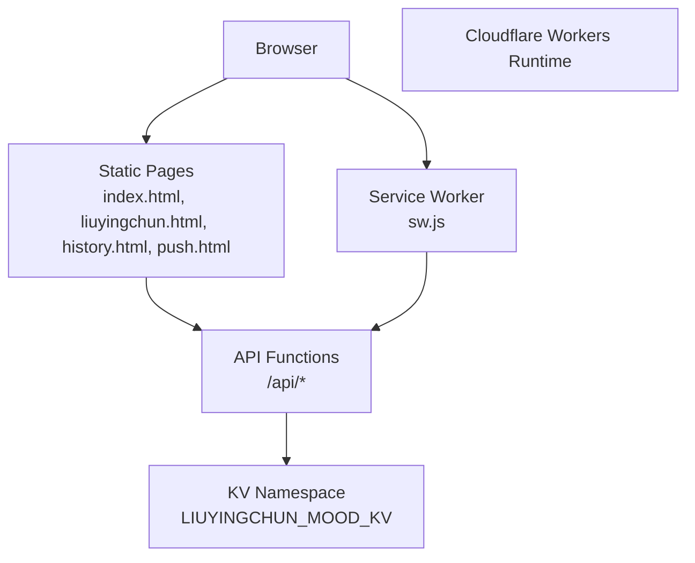
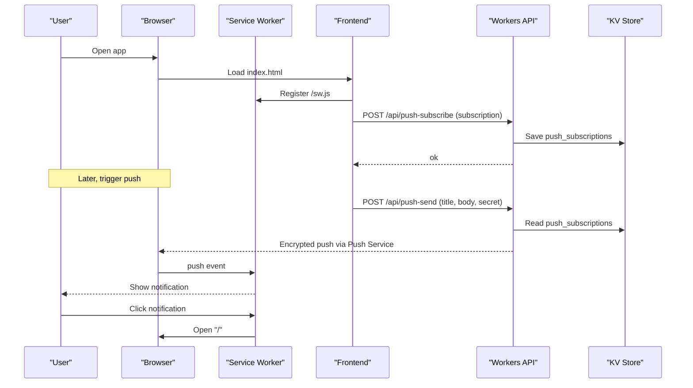
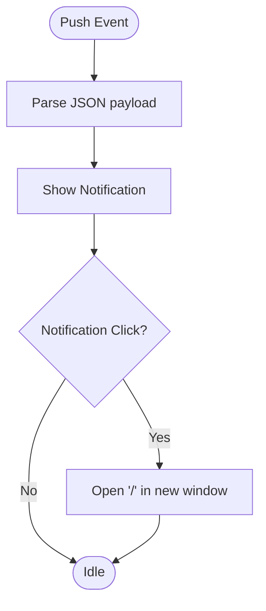
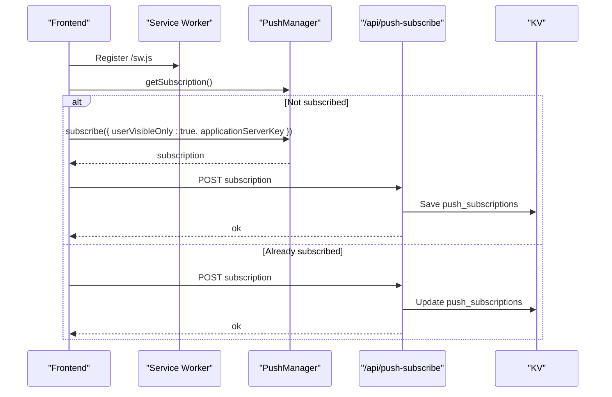
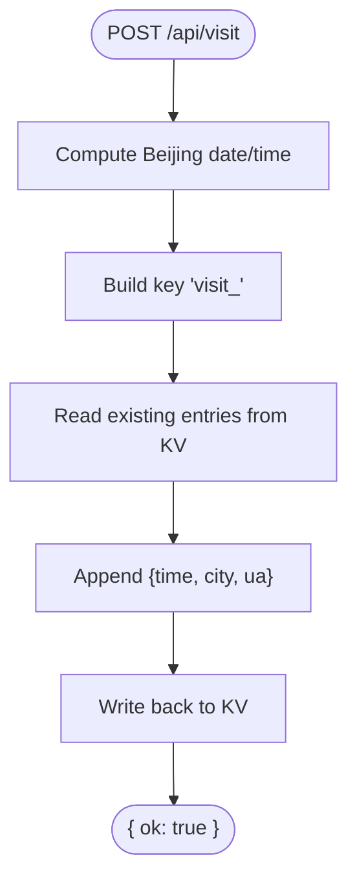
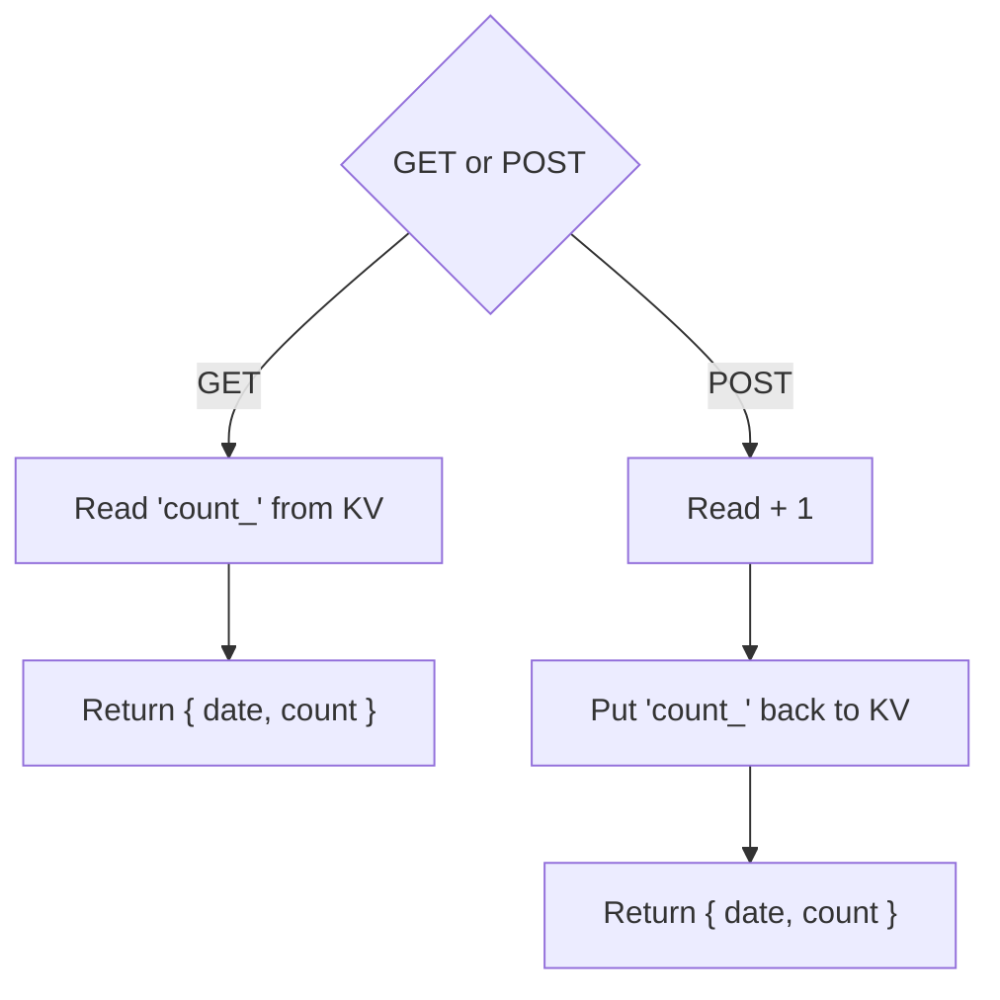
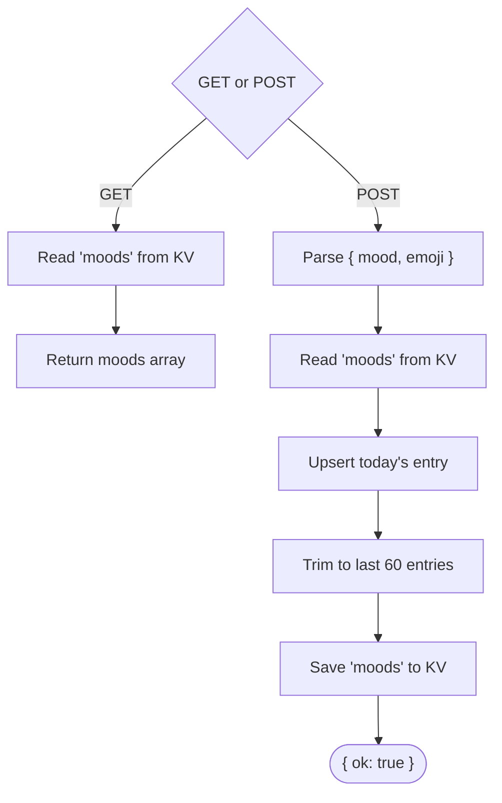
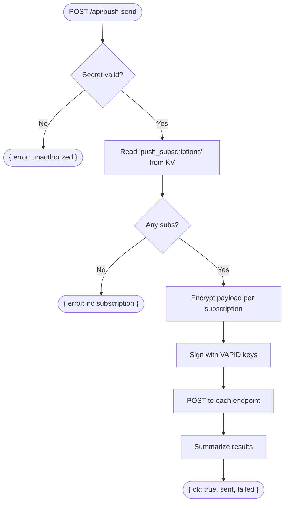
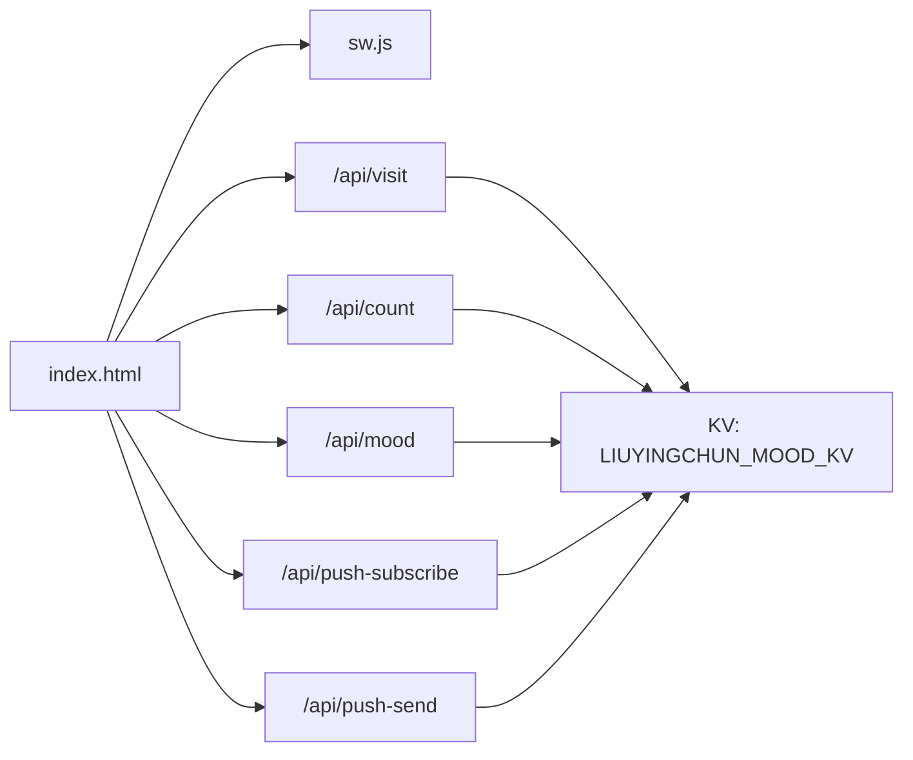

# Getting Started

<cite>
**Referenced Files in This Document**
- [index.html](file://index.html)
- [sw.js](file://sw.js)
- [.gitignore](file://.gitignore)
- [functions/api/visit.js](file://functions/api/visit.js)
- [functions/api/count.js](file://functions/api/count.js)
- [functions/api/mood.js](file://functions/api/mood.js)
- [functions/api/push-send.js](file://functions/api/push-send.js)
- [functions/api/push-subscribe.js](file://functions/api/push-subscribe.js)
</cite>

## Table of Contents
1. [Introduction](#introduction)
2. [Project Structure](#project-structure)
3. [Core Components](#core-components)
4. [Architecture Overview](#architecture-overview)
5. [Detailed Component Analysis](#detailed-component-analysis)
6. [Dependency Analysis](#dependency-analysis)
7. [Performance Considerations](#performance-considerations)
8. [Troubleshooting Guide](#troubleshooting-guide)
9. [Conclusion](#conclusion)
10. [Appendices](#appendices)

## Introduction
This guide helps you deploy and run Liu Yingchun's Happy Corner on Cloudflare Workers. It covers prerequisites, environment setup (KV storage and secrets), service worker registration, local development, testing procedures, configuration files, and troubleshooting. The application is a static site with serverless functions that use Cloudflare KV for persistence and Web Push notifications.

## Project Structure
The project consists of:
- Static frontend pages served from the repository root
- A service worker for push notifications
- Serverless API functions under functions/api/ that implement KV-backed features like mood tracking, visit counting, and push messaging

**Diagram sources**
- [index.html:4534-4560](file://index.html#L4534-L4560)
- [sw.js:1-16](file://sw.js#L1-L16)
- [functions/api/visit.js:29-48](file://functions/api/visit.js#L29-L48)
- [functions/api/count.js:16-32](file://functions/api/count.js#L16-L32)
- [functions/api/mood.js:19-43](file://functions/api/mood.js#L19-L43)
- [functions/api/push-send.js:112-154](file://functions/api/push-send.js#L112-L154)
- [functions/api/push-subscribe.js:11-22](file://functions/api/push-subscribe.js#L11-L22)

**Section sources**
- [index.html:4534-4560](file://index.html#L4534-L4560)
- [sw.js:1-16](file://sw.js#L1-L16)
- [functions/api/visit.js:29-48](file://functions/api/visit.js#L29-L48)
- [functions/api/count.js:16-32](file://functions/api/count.js#L16-L32)
- [functions/api/mood.js:19-43](file://functions/api/mood.js#L19-L43)
- [functions/api/push-send.js:112-154](file://functions/api/push-send.js#L112-L154)
- [functions/api/push-subscribe.js:11-22](file://functions/api/push-subscribe.js#L11-L22)

## Core Components
- Service Worker: Handles push events and notification clicks to open the app.
- Frontend: Registers the service worker and manages push subscription lifecycle.
- API Functions:
  - Visit tracking: records daily visits with time, city, and user agent into KV.
  - Count: reads or increments daily counts stored in KV.
  - Mood: stores and retrieves recent mood entries in KV.
  - Push subscribe: persists browser push subscriptions in KV.
  - Push send: encrypts and sends web push messages using VAPID and KV-stored subscriptions.

**Section sources**
- [sw.js:1-16](file://sw.js#L1-L16)
- [index.html:4534-4560](file://index.html#L4534-L4560)
- [functions/api/visit.js:29-48](file://functions/api/visit.js#L29-L48)
- [functions/api/count.js:16-32](file://functions/api/count.js#L16-L32)
- [functions/api/mood.js:19-43](file://functions/api/mood.js#L19-L43)
- [functions/api/push-subscribe.js:11-22](file://functions/api/push-subscribe.js#L11-L22)
- [functions/api/push-send.js:112-154](file://functions/api/push-send.js#L112-L154)

## Architecture Overview
The runtime architecture uses Cloudflare Workers to serve static assets and handle API requests. KV provides persistent key-value storage. The service worker enables push notifications by receiving encrypted payloads and displaying system notifications.

**Diagram sources**
- [index.html:4534-4560](file://index.html#L4534-L4560)
- [sw.js:1-16](file://sw.js#L1-L16)
- [functions/api/push-subscribe.js:11-22](file://functions/api/push-subscribe.js#L11-L22)
- [functions/api/push-send.js:112-154](file://functions/api/push-send.js#L112-L154)

## Detailed Component Analysis

### Service Worker (Push Notifications)
- Listens for push events and displays notifications with title/body and icon/badge.
- On notification click, closes the notification and opens the app root.

**Diagram sources**
- [sw.js:1-16](file://sw.js#L1-L16)

**Section sources**
- [sw.js:1-16](file://sw.js#L1-L16)

### Frontend Push Subscription Flow
- Registers the service worker without requiring user gesture.
- Subscribes to push only after user interaction (e.g., welcome screen).
- Sends the subscription to /api/push-subscribe for storage.

**Diagram sources**
- [index.html:4534-4560](file://index.html#L4534-L4560)
- [functions/api/push-subscribe.js:11-22](file://functions/api/push-subscribe.js#L11-L22)

**Section sources**
- [index.html:4534-4560](file://index.html#L4534-L4560)
- [functions/api/push-subscribe.js:11-22](file://functions/api/push-subscribe.js#L11-L22)

### API: Visit Tracking
- Records daily visit entries including time, city, and user agent into KV under a date-based key.
- Supports CORS preflight and returns JSON responses.

**Diagram sources**
- [functions/api/visit.js:29-48](file://functions/api/visit.js#L29-L48)

**Section sources**
- [functions/api/visit.js:29-48](file://functions/api/visit.js#L29-L48)

### API: Daily Count
- GET returns today’s count; POST increments it atomically per request.
- Uses KV keys prefixed with date.

**Diagram sources**
- [functions/api/count.js:16-32](file://functions/api/count.js#L16-L32)

**Section sources**
- [functions/api/count.js:16-32](file://functions/api/count.js#L16-L32)

### API: Mood Entries
- GET returns all moods; POST upserts today’s mood entry and keeps the last 60 days.
- Stores moods array in KV under a fixed key.

**Diagram sources**
- [functions/api/mood.js:19-43](file://functions/api/mood.js#L19-L43)

**Section sources**
- [functions/api/mood.js:19-43](file://functions/api/mood.js#L19-L43)

### API: Push Send
- Validates a shared secret from environment variables.
- Reads push subscriptions from KV, encrypts payload per RFC 8291, signs with VAPID (RFC 8292), and posts to each endpoint.
- Returns summary of sent/failed.

**Diagram sources**
- [functions/api/push-send.js:112-154](file://functions/api/push-send.js#L112-L154)

**Section sources**
- [functions/api/push-send.js:112-154](file://functions/api/push-send.js#L112-L154)

## Dependency Analysis
- Frontend depends on:
  - Service Worker at /sw.js
  - API endpoints under /api/*
  - Environment variable VAPID_PUBLIC_KEY for push subscription
- Service Worker depends on:
  - Push service and notification APIs
- API functions depend on:
  - KV namespace bound as LIUYINGCHUN_MOOD_KV
  - Secrets PUSH_SECRET, VAPID_PUBLIC_KEY, VAPID_PRIVATE_KEY

**Diagram sources**
- [index.html:4534-4560](file://index.html#L4534-L4560)
- [functions/api/visit.js:29-48](file://functions/api/visit.js#L29-L48)
- [functions/api/count.js:16-32](file://functions/api/count.js#L16-L32)
- [functions/api/mood.js:19-43](file://functions/api/mood.js#L19-L43)
- [functions/api/push-subscribe.js:11-22](file://functions/api/push-subscribe.js#L11-L22)
- [functions/api/push-send.js:112-154](file://functions/api/push-send.js#L112-L154)

**Section sources**
- [index.html:4534-4560](file://index.html#L4534-L4560)
- [functions/api/visit.js:29-48](file://functions/api/visit.js#L29-L48)
- [functions/api/count.js:16-32](file://functions/api/count.js#L16-L32)
- [functions/api/mood.js:19-43](file://functions/api/mood.js#L19-L43)
- [functions/api/push-subscribe.js:11-22](file://functions/api/push-subscribe.js#L11-L22)
- [functions/api/push-send.js:112-154](file://functions/api/push-send.js#L112-L154)

## Performance Considerations
- KV operations are fast but should be minimized; batch updates where possible.
- Avoid large payloads in KV; keep arrays trimmed (e.g., mood list limited to 60 entries).
- Use efficient CORS headers and minimal response sizes.
- Ensure images and fonts are cached appropriately by your hosting strategy.

[No sources needed since this section provides general guidance]

## Troubleshooting Guide

Common deployment issues and resolutions:

- KV not configured
  - Symptom: API calls fail to read/write data.
  - Fix: Bind a KV namespace named LIUYINGCHUN_MOOD_KV to your Worker.

- Missing or incorrect secrets
  - Symptom: Push send returns unauthorized or fails to sign.
  - Fix: Set PUSH_SECRET, VAPID_PUBLIC_KEY, and VAPID_PRIVATE_KEY as Worker secrets.

- Service worker not registering
  - Symptom: Push subscription fails.
  - Fix: Ensure /sw.js is reachable at the root and HTTPS is enabled.

- Push subscription not saved
  - Symptom: No notifications received.
  - Fix: Verify /api/push-subscribe writes to KV and that CORS allows the origin.

- Notification click does nothing
  - Symptom: Clicking notification doesn’t open the app.
  - Fix: Confirm SW handles notificationclick and opens '/'.

- CORS errors in browser console
  - Symptom: Network errors when calling /api/* from different origins.
  - Fix: Ensure API functions return proper Access-Control headers.

- Local development mismatch
  - Symptom: Works locally but not on production.
  - Fix: Ensure local dev binds the same KV namespace and secrets as production.

**Section sources**
- [functions/api/push-send.js:112-154](file://functions/api/push-send.js#L112-L154)
- [functions/api/push-subscribe.js:11-22](file://functions/api/push-subscribe.js#L11-L22)
- [sw.js:1-16](file://sw.js#L1-L16)
- [index.html:4534-4560](file://index.html#L4534-L4560)

## Conclusion
You now have a complete understanding of how Liu Yingchun's Happy Corner works on Cloudflare Workers. By setting up KV storage, configuring secrets, and deploying the static assets and service worker, you can run the app locally and in production. Use the troubleshooting guide to resolve common issues and ensure reliable push notifications and data persistence.

[No sources needed since this section summarizes without analyzing specific files]

## Appendices

### Prerequisites
- Node.js environment for local tooling (if using Wrangler or similar CLI).
- Cloudflare account with Workers and KV enabled.
- Basic understanding of serverless functions and service workers.

### Required Environment Variables and Secrets
- KV Namespace
  - Name: LIUYINGCHUN_MOOD_KV
  - Purpose: Stores moods, counts, visit logs, push subscriptions, and other app state.
- Secrets
  - PUSH_SECRET: Shared secret to authorize push sending.
  - VAPID_PUBLIC_KEY: Public key used by browsers to subscribe to push.
  - VAPID_PRIVATE_KEY: Private key used to sign push messages.

### Service Worker Registration
- The frontend registers the service worker at /sw.js.
- Push subscription occurs after user interaction to comply with browser policies.

**Section sources**
- [index.html:4534-4560](file://index.html#L4534-L4560)
- [sw.js:1-16](file://sw.js#L1-L16)

### Essential Configuration Files
- .gitignore
  - Excludes binary assets and node_modules to keep the repository clean.

**Section sources**
- [.gitignore:1-9](file://.gitignore#L1-L9)

### Local Development Setup
- Serve static files and expose /api/* routes to your local Workers runtime.
- Bind the LIUYINGCHUN_MOOD_KV namespace and set secrets (PUSH_SECRET, VAPID_PUBLIC_KEY, VAPID_PRIVATE_KEY).
- Ensure /sw.js is accessible at the root for service worker registration.

[No sources needed since this section provides general guidance]

### Testing Procedures
- Visit tracking: Call POST /api/visit and verify KV update.
- Count: Call GET /api/count and POST /api/count to increment.
- Mood: Call GET /api/mood and POST /api/mood with mood and emoji.
- Push subscription: Trigger subscription flow and confirm /api/push-subscribe saves data.
- Push send: Call POST /api/push-send with a valid secret and observe notifications.

**Section sources**
- [functions/api/visit.js:29-48](file://functions/api/visit.js#L29-L48)
- [functions/api/count.js:16-32](file://functions/api/count.js#L16-L32)
- [functions/api/mood.js:19-43](file://functions/api/mood.js#L19-L43)
- [functions/api/push-subscribe.js:11-22](file://functions/api/push-subscribe.js#L11-L22)
- [functions/api/push-send.js:112-154](file://functions/api/push-send.js#L112-L154)

### Browser Compatibility Requirements
- Modern browsers supporting:
  - Service Workers
  - Push API
  - Web Crypto API (for encryption/signing on the server side)
- HTTPS required for push notifications.

[No sources needed since this section provides general guidance]