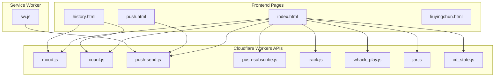
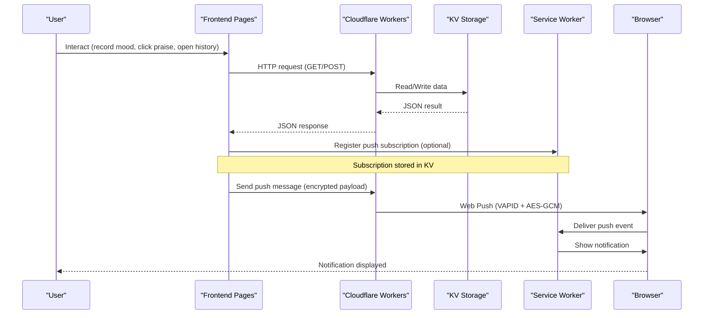
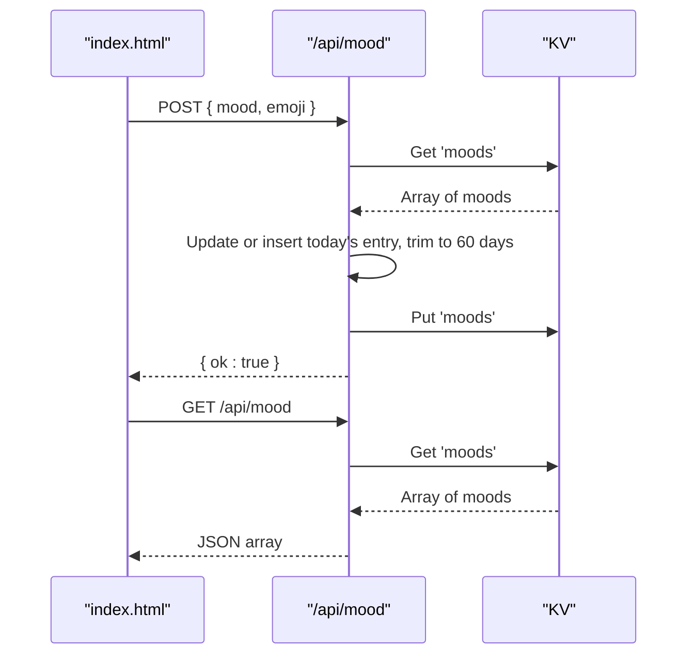
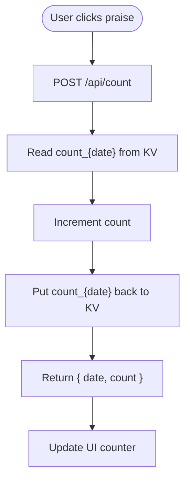
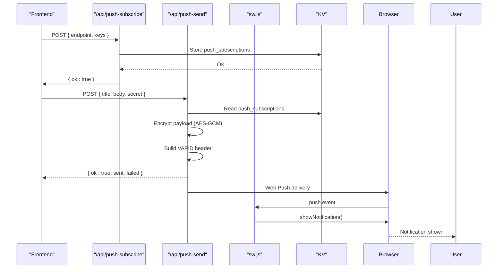
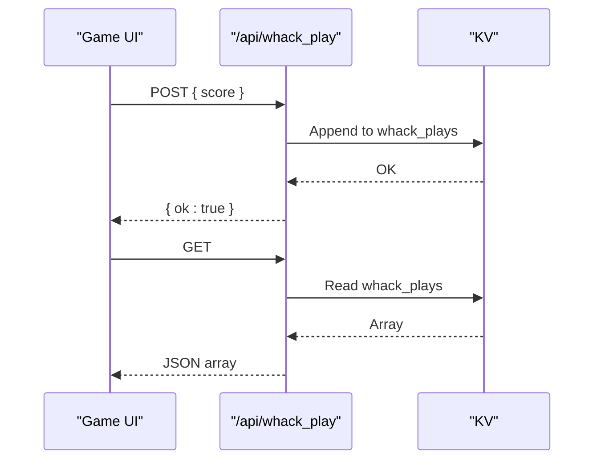
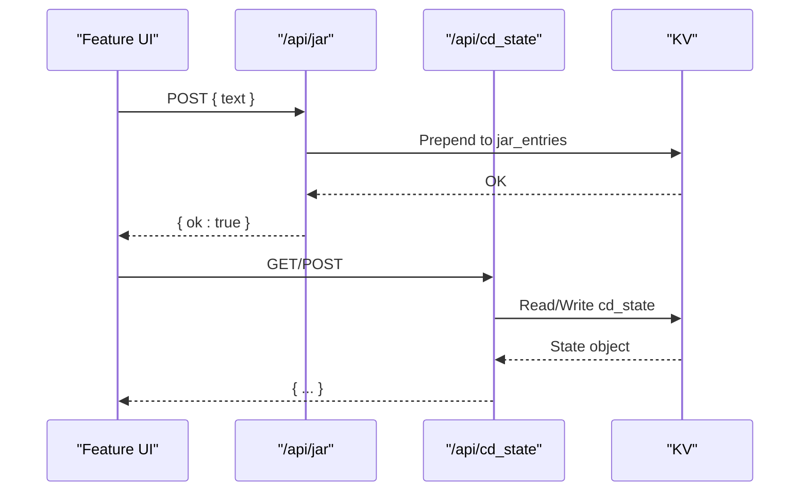
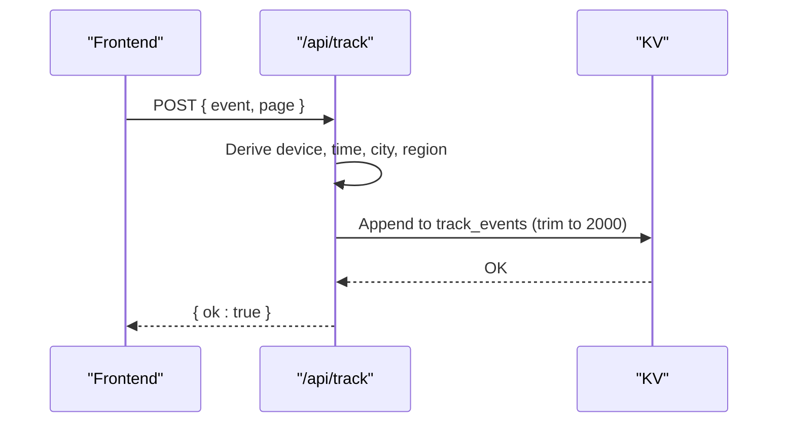
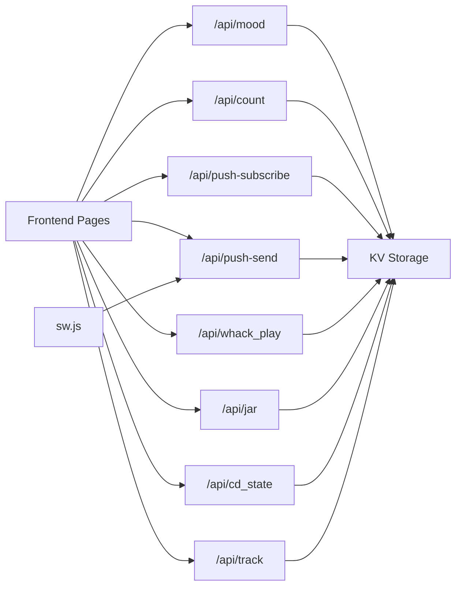

# Project Overview

<cite>
**Referenced Files in This Document**
- [index.html](file://index.html)
- [history.html](file://history.html)
- [push.html](file://push.html)
- [liuyingchun.html](file://liuyingchun.html)
- [sw.js](file://sw.js)
- [functions/api/mood.js](file://functions/api/mood.js)
- [functions/api/count.js](file://functions/api/count.js)
- [functions/api/push-send.js](file://functions/api/push-send.js)
- [functions/api/push-subscribe.js](file://functions/api/push-subscribe.js)
- [functions/api/track.js](file://functions/api/track.js)
- [functions/api/whack_play.js](file://functions/api/whack_play.js)
- [functions/api/jar.js](file://functions/api/jar.js)
- [functions/api/cd_state.js](file://functions/api/cd_state.js)
</cite>

## Table of Contents
1. Introduction
2. Project Structure
3. Core Components
4. Architecture Overview
5. Detailed Component Analysis
6. Dependency Analysis
7. Performance Considerations
8. Troubleshooting Guide
9. Conclusion

## Introduction
Liu Yingchun’s Happy Corner is a personal, mood-tracking and emotional support web application designed to provide daily motivation, gentle interaction, and light entertainment. It helps the user record moods, track daily interactions (such as “praise” counts), receive push notifications, play mini-games, and review recent history. The app emphasizes warmth, simplicity, and consistent positive reinforcement through interactive UI elements and small games.

The mission is to offer a comforting digital space where Liu Yingchun can:
- Record her mood each day with an emoji and short note
- See how many times she has been praised today
- Receive encouraging messages via push notifications
- Enjoy quick mini-games for a moment of fun
- Review her recent mood history

## Project Structure
The project consists of static frontend pages and Cloudflare Workers serverless functions that handle data persistence and messaging. A Service Worker enables Web Push notifications.

**Diagram sources**
- [index.html:1-800](file://index.html#L1-L800)
- [history.html:1-177](file://history.html#L1-L177)
- [push.html:1-205](file://push.html#L1-L205)
- [liuyingchun.html:1-368](file://liuyingchun.html#L1-L368)
- [sw.js:1-17](file://sw.js#L1-L17)
- [functions/api/mood.js:1-44](file://functions/api/mood.js#L1-L44)
- [functions/api/count.js:1-33](file://functions/api/count.js#L1-L33)
- [functions/api/push-send.js:1-155](file://functions/api/push-send.js#L1-L155)
- [functions/api/push-subscribe.js:1-23](file://functions/api/push-subscribe.js#L1-L23)
- [functions/api/track.js:1-44](file://functions/api/track.js#L1-L44)
- [functions/api/whack_play.js:1-44](file://functions/api/whack_play.js#L1-L44)
- [functions/api/jar.js:1-31](file://functions/api/jar.js#L1-L31)
- [functions/api/cd_state.js:1-28](file://functions/api/cd_state.js#L1-L28)

**Section sources**
- [index.html:1-800](file://index.html#L1-L800)
- [history.html:1-177](file://history.html#L1-L177)
- [push.html:1-205](file://push.html#L1-L205)
- [liuyingchun.html:1-368](file://liuyingchun.html#L1-L368)
- [sw.js:1-17](file://sw.js#L1-L17)

## Core Components
- Mood recording: Save or update today’s mood with an emoji and timestamp; retrieve last 60 days.
- Daily interaction counter: Increment and display the number of “praises” received today.
- Push notifications: Subscribe/unsubscribe and send encrypted push messages using Web Push API and VAPID.
- Mini-games: Track scores and sessions for a simple game.
- History viewing: Display recent mood entries with dates and times.
- Analytics tracking: Log events, device type, and location metadata from Cloudflare.

Key backend endpoints:
- /api/mood: GET list of moods; POST to save/update today’s mood
- /api/count: GET today’s praise count; POST to increment
- /api/push-subscribe: POST to store subscription endpoint
- /api/push-send: POST to send encrypted push notification
- /api/whack_play: GET/POST for mini-game session logs
- /api/jar: POST to add jar entries (e.g., notes or wishes)
- /api/cd_state: GET/POST for persistent state (tokens, counters)
- /api/track: POST to log analytics events

**Section sources**
- [functions/api/mood.js:1-44](file://functions/api/mood.js#L1-L44)
- [functions/api/count.js:1-33](file://functions/api/count.js#L1-L33)
- [functions/api/push-subscribe.js:1-23](file://functions/api/push-subscribe.js#L1-L23)
- [functions/api/push-send.js:1-155](file://functions/api/push-send.js#L1-L155)
- [functions/api/whack_play.js:1-44](file://functions/api/whack_play.js#L1-L44)
- [functions/api/jar.js:1-31](file://functions/api/jar.js#L1-L31)
- [functions/api/cd_state.js:1-28](file://functions/api/cd_state.js#L1-L28)
- [functions/api/track.js:1-44](file://functions/api/track.js#L1-L44)

## Architecture Overview
The frontend pages communicate with Cloudflare Workers APIs to persist data and trigger actions. A Service Worker handles push events and displays system notifications. Data is stored in Cloudflare KV under a dedicated namespace.

**Diagram sources**
- [index.html:1-800](file://index.html#L1-L800)
- [history.html:1-177](file://history.html#L1-L177)
- [push.html:1-205](file://push.html#L1-L205)
- [functions/api/mood.js:1-44](file://functions/api/mood.js#L1-L44)
- [functions/api/count.js:1-33](file://functions/api/count.js#L1-L33)
- [functions/api/push-send.js:1-155](file://functions/api/push-send.js#L1-L155)
- [functions/api/push-subscribe.js:1-23](file://functions/api/push-subscribe.js#L1-L23)
- [sw.js:1-17](file://sw.js#L1-L17)

## Detailed Component Analysis

### Mood Recording and History
- The main page allows recording a mood with an emoji and timestamp. The backend stores up to 60 days of entries and returns them for display.
- The history page fetches both mood records and today’s praise count to show a combined view.

**Diagram sources**
- [functions/api/mood.js:1-44](file://functions/api/mood.js#L1-L44)
- [history.html:132-174](file://history.html#L132-L174)

**Section sources**
- [functions/api/mood.js:1-44](file://functions/api/mood.js#L1-L44)
- [history.html:1-177](file://history.html#L1-L177)

### Daily Interaction Counter (Praise Count)
- Each time the user interacts (e.g., clicking “praise”), the frontend increments the daily count. The backend persists a per-day counter keyed by Beijing date.

**Diagram sources**
- [functions/api/count.js:1-33](file://functions/api/count.js#L1-L33)

**Section sources**
- [functions/api/count.js:1-33](file://functions/api/count.js#L1-L33)

### Push Notifications (Web Push + VAPID)
- The app subscribes to push notifications and stores the subscription in KV. When sending, the backend encrypts the payload using RFC 8291 and signs requests with VAPID (RFC 8292). The Service Worker shows the notification and opens the app on click.

**Diagram sources**
- [functions/api/push-subscribe.js:1-23](file://functions/api/push-subscribe.js#L1-L23)
- [functions/api/push-send.js:1-155](file://functions/api/push-send.js#L1-L155)
- [sw.js:1-17](file://sw.js#L1-L17)
- [push.html:166-201](file://push.html#L166-L201)

**Section sources**
- [functions/api/push-send.js:1-155](file://functions/api/push-send.js#L1-L155)
- [functions/api/push-subscribe.js:1-23](file://functions/api/push-subscribe.js#L1-L23)
- [sw.js:1-17](file://sw.js#L1-L17)
- [push.html:1-205](file://push.html#L1-L205)

### Mini-Games (Whack-a-Mole style)
- The game logs plays with score, date, time, and city metadata. The backend stores entries and returns them for display.

**Diagram sources**
- [functions/api/whack_play.js:1-44](file://functions/api/whack_play.js#L1-L44)

**Section sources**
- [functions/api/whack_play.js:1-44](file://functions/api/whack_play.js#L1-L44)

### Jar Notes and State Management
- Jar entries allow adding short notes with timestamps. A separate state module tracks tokens and other persistent flags used across features.

**Diagram sources**
- [functions/api/jar.js:1-31](file://functions/api/jar.js#L1-L31)
- [functions/api/cd_state.js:1-28](file://functions/api/cd_state.js#L1-L28)

**Section sources**
- [functions/api/jar.js:1-31](file://functions/api/jar.js#L1-L31)
- [functions/api/cd_state.js:1-28](file://functions/api/cd_state.js#L1-L28)

### Analytics Tracking
- Tracks events with device type and Cloudflare-provided location metadata, storing recent entries in KV.

**Diagram sources**
- [functions/api/track.js:1-44](file://functions/api/track.js#L1-L44)

**Section sources**
- [functions/api/track.js:1-44](file://functions/api/track.js#L1-L44)

## Dependency Analysis
- Frontend pages depend on Cloudflare Workers APIs for all data operations and push messaging.
- The Service Worker depends on the push-send endpoint to deliver notifications.
- All APIs use CORS headers to allow cross-origin calls from the frontend.
- Data is consistently stored in a single KV namespace, ensuring cohesion and simplifying access patterns.

**Diagram sources**
- [index.html:1-800](file://index.html#L1-L800)
- [history.html:1-177](file://history.html#L1-L177)
- [push.html:1-205](file://push.html#L1-L205)
- [sw.js:1-17](file://sw.js#L1-L17)
- [functions/api/mood.js:1-44](file://functions/api/mood.js#L1-L44)
- [functions/api/count.js:1-33](file://functions/api/count.js#L1-L33)
- [functions/api/push-send.js:1-155](file://functions/api/push-send.js#L1-L155)
- [functions/api/push-subscribe.js:1-23](file://functions/api/push-subscribe.js#L1-L23)
- [functions/api/whack_play.js:1-44](file://functions/api/whack_play.js#L1-L44)
- [functions/api/jar.js:1-31](file://functions/api/jar.js#L1-L31)
- [functions/api/cd_state.js:1-28](file://functions/api/cd_state.js#L1-L28)
- [functions/api/track.js:1-44](file://functions/api/track.js#L1-L44)

**Section sources**
- [functions/api/mood.js:1-44](file://functions/api/mood.js#L1-L44)
- [functions/api/count.js:1-33](file://functions/api/count.js#L1-L33)
- [functions/api/push-send.js:1-155](file://functions/api/push-send.js#L1-L155)
- [functions/api/push-subscribe.js:1-23](file://functions/api/push-subscribe.js#L1-L23)
- [functions/api/whack_play.js:1-44](file://functions/api/whack_play.js#L1-L44)
- [functions/api/jar.js:1-31](file://functions/api/jar.js#L1-L31)
- [functions/api/cd_state.js:1-28](file://functions/api/cd_state.js#L1-L28)
- [functions/api/track.js:1-44](file://functions/api/track.js#L1-L44)

## Performance Considerations
- Use lightweight KV reads/writes; avoid large payloads.
- Trim historical lists at the backend (e.g., keep last 60 days for moods, last 2000 events for tracking).
- Batch or debounce frequent UI interactions (e.g., praise counter increments) if needed.
- Leverage browser caching for static assets; ensure Service Worker does not cache dynamic API responses unless appropriate.
- Keep push payloads minimal to reduce bandwidth and processing overhead.

## Troubleshooting Guide
- Push notifications not showing:
  - Ensure the subscription was successfully stored via /api/push-subscribe.
  - Verify the push secret matches the configured environment variable in /api/push-send.
  - Confirm the Service Worker is registered and handling push events.
- Incorrect timezone or dates:
  - Backend uses Beijing time offsets; ensure frontend logic aligns when displaying or comparing dates.
- CORS errors:
  - All endpoints include CORS headers; verify browser console for preflight failures and ensure Content-Type is set correctly.
- Empty history:
  - If no moods exist, the history page will show an empty state; try recording a mood first.

**Section sources**
- [functions/api/push-send.js:112-154](file://functions/api/push-send.js#L112-L154)
- [functions/api/push-subscribe.js:11-22](file://functions/api/push-subscribe.js#L11-L22)
- [sw.js:1-17](file://sw.js#L1-L17)
- [functions/api/mood.js:19-42](file://functions/api/mood.js#L19-L42)
- [history.html:135-171](file://history.html#L135-L171)

## Conclusion
Liu Yingchun’s Happy Corner combines a warm, interactive frontend with reliable serverless APIs to deliver a personalized emotional support experience. Through mood tracking, daily praise counting, push notifications, mini-games, and history views, it provides consistent encouragement and a sense of connection. The architecture leverages Cloudflare Workers and KV for fast, scalable operations, while the Service Worker ensures timely push notifications. This design balances simplicity with robust functionality, making it easy to maintain and extend with new features.