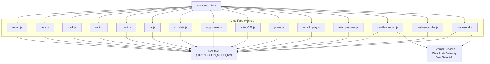
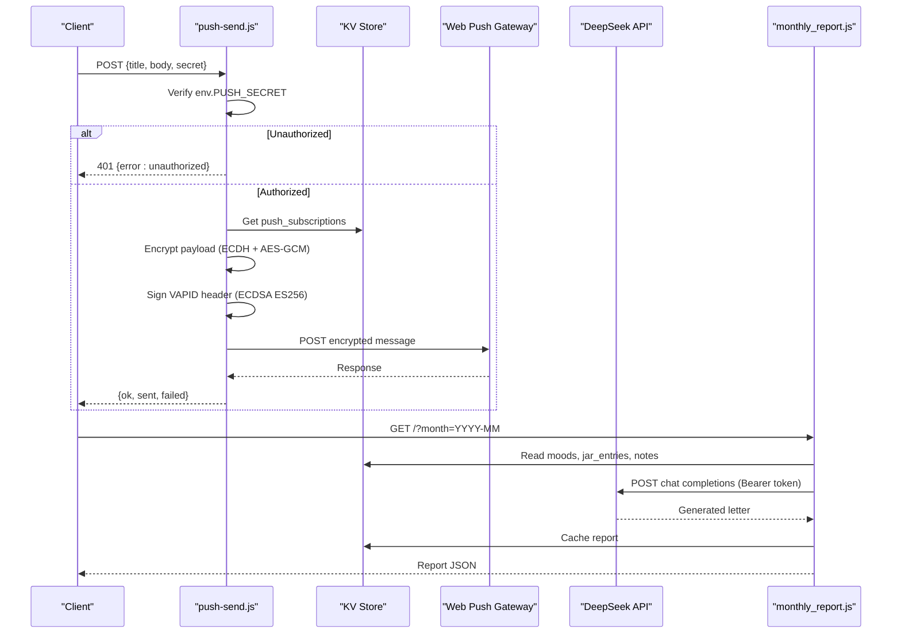
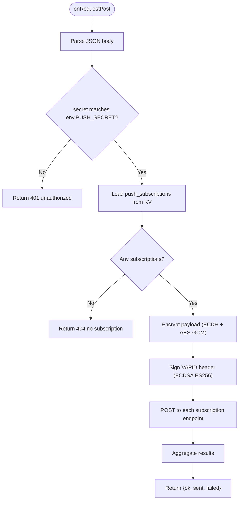
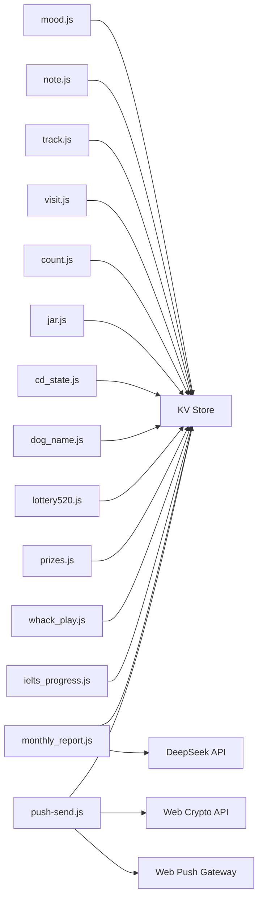

# Security Considerations

<cite>
**Referenced Files in This Document**
- [push-send.js](file://functions/api/push-send.js)
- [push-subscribe.js](file://functions/api/push-subscribe.js)
- [mood.js](file://functions/api/mood.js)
- [track.js](file://functions/api/track.js)
- [note.js](file://functions/api/note.js)
- [count.js](file://functions/api/count.js)
- [visit.js](file://functions/api/visit.js)
- [cd_state.js](file://functions/api/cd_state.js)
- [jar.js](file://functions/api/jar.js)
- [monthly_report.js](file://functions/api/monthly_report.js)
- [dog_name.js](file://functions/api/dog_name.js)
- [lottery520.js](file://functions/api/lottery520.js)
- [prizes.js](file://functions/api/prizes.js)
- [whack_play.js](file://functions/api/whack_play.js)
- [ielts_progress.js](file://functions/api/ielts_progress.js)
</cite>

## Table of Contents
1. Introduction
2. Project Structure
3. Core Components
4. Architecture Overview
5. Detailed Component Analysis
6. Dependency Analysis
7. Performance Considerations
8. Troubleshooting Guide
9. Conclusion
10. Appendices

## Introduction
This document provides a security-focused analysis of the Cloudflare Workers API surface for mood tracking and related features. It covers authentication mechanisms, data protection, CORS configuration, input validation and sanitization, encryption for push notifications, rate limiting strategies, request validation, error handling patterns, secrets management, and privacy considerations for personal data.

## Project Structure
The application exposes multiple Cloudflare Worker endpoints under functions/api/. Each endpoint typically:
- Defines CORS headers to allow cross-origin requests from any origin.
- Exposes onRequestOptions for preflight handling.
- Implements GET/POST handlers that read/write to a KV store named LIUYINGCHUN_MOOD_KV.
- Uses environment variables (env.*) for secrets and keys.

**Diagram sources**
- [mood.js:1-44](file://functions/api/mood.js#L1-L44)
- [note.js:1-30](file://functions/api/note.js#L1-L30)
- [track.js:1-44](file://functions/api/track.js#L1-L44)
- [visit.js:1-49](file://functions/api/visit.js#L1-L49)
- [count.js:1-33](file://functions/api/count.js#L1-L33)
- [jar.js:1-31](file://functions/api/jar.js#L1-L31)
- [cd_state.js:1-28](file://functions/api/cd_state.js#L1-L28)
- [dog_name.js:1-25](file://functions/api/dog_name.js#L1-L25)
- [lottery520.js:1-43](file://functions/api/lottery520.js#L1-L43)
- [prizes.js:1-60](file://functions/api/prizes.js#L1-L60)
- [whack_play.js:1-44](file://functions/api/whack_play.js#L1-L44)
- [ielts_progress.js:1-231](file://functions/api/ielts_progress.js#L1-L231)
- [monthly_report.js:1-171](file://functions/api/monthly_report.js#L1-L171)
- [push-subscribe.js:1-23](file://functions/api/push-subscribe.js#L1-L23)
- [push-send.js:1-155](file://functions/api/push-send.js#L1-L155)

**Section sources**
- [mood.js:1-44](file://functions/api/mood.js#L1-L44)
- [push-send.js:1-155](file://functions/api/push-send.js#L1-L155)
- [monthly_report.js:1-171](file://functions/api/monthly_report.js#L1-L171)

## Core Components
- Authentication and Authorization
  - Push send endpoint enforces a shared secret via an environment variable and rejects unauthorized requests with 401.
  - Other endpoints currently do not implement authentication; they are open to any caller.
- Data Protection and Encryption
  - Push payloads are encrypted per RFC 8291 using ECDH key exchange and AES-GCM content encryption.
  - VAPID authorization is signed using ECDSA (ES256) per RFC 8292.
  - Sensitive credentials (e.g., push secret, VAPID keys, external API keys) must be stored in environment variables.
- CORS Configuration
  - All endpoints set Access-Control-Allow-Origin to wildcard (*), allowing cross-origin access from any domain.
  - Preflight responses are handled by onRequestOptions returning allowed methods and headers.
- Input Validation and Sanitization
  - Some endpoints validate required fields and enum values (e.g., IELTS status).
  - Many endpoints accept arbitrary JSON without strict schema validation or sanitization.
- Rate Limiting and Throttling
  - No built-in per-endpoint rate limiting is implemented in the code.
  - External protections (e.g., Cloudflare Rate Limiting rules) should be applied at the network edge.
- Error Handling Patterns
  - Endpoints return structured JSON errors with appropriate HTTP status codes where applicable.
  - Some endpoints catch exceptions and return generic success/failure responses.

**Section sources**
- [push-send.js:108-155](file://functions/api/push-send.js#L108-L155)
- [ielts_progress.js:191-231](file://functions/api/ielts_progress.js#L191-L231)
- [monthly_report.js:30-69](file://functions/api/monthly_report.js#L30-L69)
- [mood.js:1-44](file://functions/api/mood.js#L1-L44)
- [track.js:1-44](file://functions/api/track.js#L1-L44)
- [note.js:1-30](file://functions/api/note.js#L1-L30)
- [visit.js:1-49](file://functions/api/visit.js#L1-L49)
- [count.js:1-33](file://functions/api/count.js#L1-L33)
- [jar.js:1-31](file://functions/api/jar.js#L1-L31)
- [cd_state.js:1-28](file://functions/api/cd_state.js#L1-L28)
- [dog_name.js:1-25](file://functions/api/dog_name.js#L1-L25)
- [lottery520.js:1-43](file://functions/api/lottery520.js#L1-L43)
- [prizes.js:1-60](file://functions/api/prizes.js#L1-L60)
- [whack_play.js:1-44](file://functions/api/whack_play.js#L1-L44)
- [push-subscribe.js:1-23](file://functions/api/push-subscribe.js#L1-L23)

## Architecture Overview
The system consists of client-facing endpoints that interact with a KV store and, in some cases, external services. The most security-sensitive flow is push notification sending, which encrypts payloads and signs VAPID headers before forwarding to the Web Push gateway.

**Diagram sources**
- [push-send.js:108-155](file://functions/api/push-send.js#L108-L155)
- [monthly_report.js:30-171](file://functions/api/monthly_report.js#L30-L171)

## Detailed Component Analysis

### Push Notification Security (push-send.js)
- Authentication: Requires a shared secret provided in the request body and validated against an environment variable. Unauthorized requests receive a 401 response.
- Encryption: Implements RFC 8291 message encryption using ECDH key exchange and AES-GCM content encryption. Generates ephemeral sender keys, derives keys via HKDF, and constructs the protocol-compliant header and ciphertext.
- VAPID Signing: Signs VAPID headers using ECDSA (ES256) with a private key loaded from environment variables.
- CORS: Allows all origins for both preflight and responses.
- Error Handling: Returns structured JSON errors for missing subscriptions and network failures.

**Diagram sources**
- [push-send.js:108-155](file://functions/api/push-send.js#L108-L155)

**Section sources**
- [push-send.js:1-155](file://functions/api/push-send.js#L1-L155)

### Subscription Management (push-subscribe.js)
- Stores device push subscriptions keyed by endpoint to avoid duplicates.
- Validates presence of endpoint field; returns 400 if invalid.
- CORS allows all origins.

**Section sources**
- [push-subscribe.js:1-23](file://functions/api/push-subscribe.js#L1-L23)

### Mood Tracking (mood.js)
- Accepts mood and emoji fields; stores entries with date/time.
- Truncates history to recent entries.
- No explicit input validation beyond JSON parsing; accepts arbitrary strings.
- CORS allows all origins.

**Section sources**
- [mood.js:1-44](file://functions/api/mood.js#L1-L44)

### Analytics and Tracking (track.js, visit.js)
- track.js records events with device type and location metadata from Cloudflare request context.
- visit.js parses User-Agent to infer device type and stores visit logs.
- Both endpoints lack strict input validation and sanitization.
- CORS allows all origins.

**Section sources**
- [track.js:1-44](file://functions/api/track.js#L1-L44)
- [visit.js:1-49](file://functions/api/visit.js#L1-L49)

### Notes and Counters (note.js, count.js)
- note.js persists daily notes with optional mood and timestamp.
- count.js increments a daily counter and returns current value.
- Minimal input validation; relies on KV storage semantics.
- CORS allows all origins.

**Section sources**
- [note.js:1-30](file://functions/api/note.js#L1-L30)
- [count.js:1-33](file://functions/api/count.js#L1-L33)

### Game-like Features (jar.js, cd_state.js, dog_name.js, lottery520.js, prizes.js, whack_play.js)
- These endpoints manage small game states and user-generated text entries.
- Most endpoints accept arbitrary JSON without schema enforcement.
- Some endpoints include basic checks (e.g., missing fields in prizes.js).
- CORS allows all origins.

**Section sources**
- [jar.js:1-31](file://functions/api/jar.js#L1-L31)
- [cd_state.js:1-28](file://functions/api/cd_state.js#L1-L28)
- [dog_name.js:1-25](file://functions/api/dog_name.js#L1-L25)
- [lottery520.js:1-43](file://functions/api/lottery520.js#L1-L43)
- [prizes.js:1-60](file://functions/api/prizes.js#L1-L60)
- [whack_play.js:1-44](file://functions/api/whack_play.js#L1-L44)

### IELTS Progress (ielts_progress.js)
- Validates required fields and restricts status to a known set.
- Normalizes and merges state, computes streaks, and updates check-ins.
- CORS allows all origins.

**Section sources**
- [ielts_progress.js:1-231](file://functions/api/ielts_progress.js#L1-L231)

### Monthly Report Generation (monthly_report.js)
- Validates month parameter format and supports preview mode.
- Reads mood data, jar entries, and notes from KV.
- Calls external AI service with a bearer token stored in environment variables.
- Caches generated reports in KV.
- CORS allows all origins.

**Section sources**
- [monthly_report.js:1-171](file://functions/api/monthly_report.js#L1-L171)

## Dependency Analysis
- Internal Dependencies
  - All endpoints depend on the KV store (LIUYINGCHUN_MOOD_KV) for persistence.
  - push-send.js depends on cryptographic primitives via the Web Crypto API.
  - monthly_report.js depends on an external AI API requiring a bearer token.
- External Dependencies
  - Web Push Gateway for delivering encrypted push messages.
  - DeepSeek API for generating monthly letters.

**Diagram sources**
- [mood.js:1-44](file://functions/api/mood.js#L1-L44)
- [note.js:1-30](file://functions/api/note.js#L1-L30)
- [track.js:1-44](file://functions/api/track.js#L1-L44)
- [visit.js:1-49](file://functions/api/visit.js#L1-L49)
- [count.js:1-33](file://functions/api/count.js#L1-L33)
- [jar.js:1-31](file://functions/api/jar.js#L1-L31)
- [cd_state.js:1-28](file://functions/api/cd_state.js#L1-L28)
- [dog_name.js:1-25](file://functions/api/dog_name.js#L1-L25)
- [lottery520.js:1-43](file://functions/api/lottery520.js#L1-L43)
- [prizes.js:1-60](file://functions/api/prizes.js#L1-L60)
- [whack_play.js:1-44](file://functions/api/whack_play.js#L1-L44)
- [ielts_progress.js:1-231](file://functions/api/ielts_progress.js#L1-L231)
- [monthly_report.js:1-171](file://functions/api/monthly_report.js#L1-L171)
- [push-send.js:1-155](file://functions/api/push-send.js#L1-L155)

**Section sources**
- [push-send.js:1-155](file://functions/api/push-send.js#L1-L155)
- [monthly_report.js:1-171](file://functions/api/monthly_report.js#L1-L171)

## Performance Considerations
- KV operations are synchronous within the worker lifecycle; batch writes and truncation help limit storage growth (e.g., keeping recent moods and tracks).
- Push sending uses parallel requests to multiple subscriptions; ensure timeouts and retries are considered at the platform level.
- Monthly report generation caches outputs to reduce repeated AI calls.

[No sources needed since this section provides general guidance]

## Troubleshooting Guide
- Unauthorized Push Requests
  - Symptom: 401 unauthorized when sending push notifications.
  - Cause: Missing or incorrect secret in request body compared to environment variable.
  - Action: Ensure the correct PUSH_SECRET is configured and passed in requests.
- No Subscriptions Found
  - Symptom: 404 no subscription when sending push notifications.
  - Cause: Empty or missing push_subscriptions in KV.
  - Action: Confirm clients call the subscribe endpoint and that subscriptions are persisted.
- Invalid Month Parameter
  - Symptom: 400 invalid month when requesting monthly reports.
  - Cause: Month parameter does not match expected format.
  - Action: Pass month in YYYY-MM format.
- Generic Errors
  - Some endpoints return generic success/failure responses; inspect client-side logs and KV state to diagnose issues.

**Section sources**
- [push-send.js:108-155](file://functions/api/push-send.js#L108-L155)
- [monthly_report.js:30-69](file://functions/api/monthly_report.js#L30-L69)
- [track.js:35-44](file://functions/api/track.js#L35-L44)

## Conclusion
The codebase implements strong encryption for push notifications and minimal authentication for sensitive operations. However, broad CORS settings and limited input validation across endpoints increase exposure to cross-origin and injection risks. To harden the system:
- Restrict CORS to trusted origins.
- Add robust input validation and sanitization to all write endpoints.
- Implement rate limiting at the edge (e.g., Cloudflare Rules).
- Enforce authentication on all mutable endpoints.
- Secure secrets via environment variables and rotate regularly.
- Minimize collection and retention of personal data; apply privacy-by-design principles.

[No sources needed since this section summarizes without analyzing specific files]

## Appendices

### Best Practices for Securing Cloudflare Workers
- Secrets and Credentials
  - Store all secrets (PUSH_SECRET, VAPID keys, API tokens) in environment variables.
  - Rotate secrets regularly and audit access.
- CORS Hardening
  - Replace wildcard origins with specific domains.
  - Whitelist allowed methods and headers per endpoint.
- Input Validation and Sanitization
  - Validate types, lengths, and enums; reject malformed payloads early.
  - Sanitize user-provided text to prevent injection into downstream systems.
- Rate Limiting and Abuse Prevention
  - Use Cloudflare Rate Limiting rules to throttle per-IP or per-key requests.
  - Implement idempotency for critical mutations (e.g., single-use actions like lottery).
- Privacy and Data Minimization
  - Avoid storing unnecessary personal identifiers.
  - Anonymize or aggregate analytics where possible.
  - Provide mechanisms to delete or export personal data.
- Error Handling
  - Return consistent error structures with appropriate HTTP status codes.
  - Avoid leaking stack traces or internal details in production responses.

[No sources needed since this section provides general guidance]