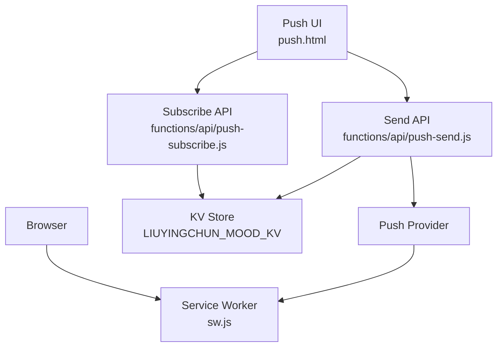
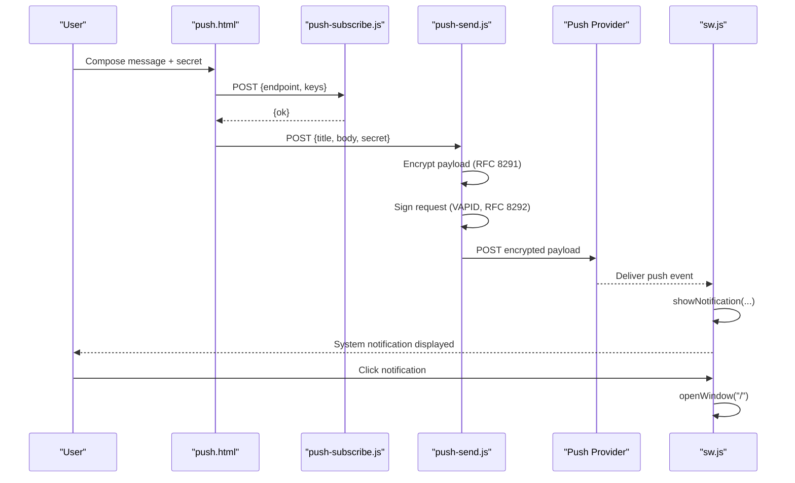
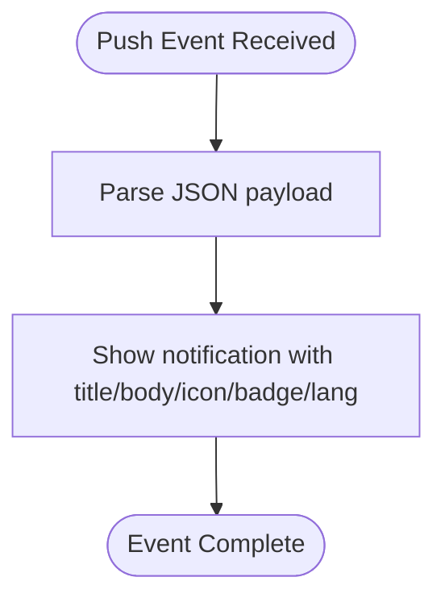
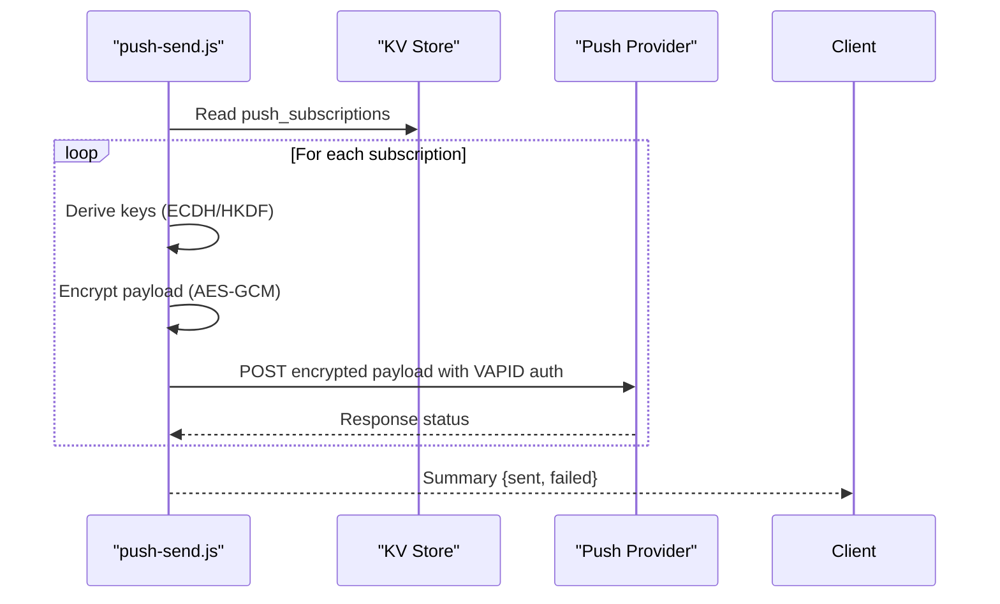
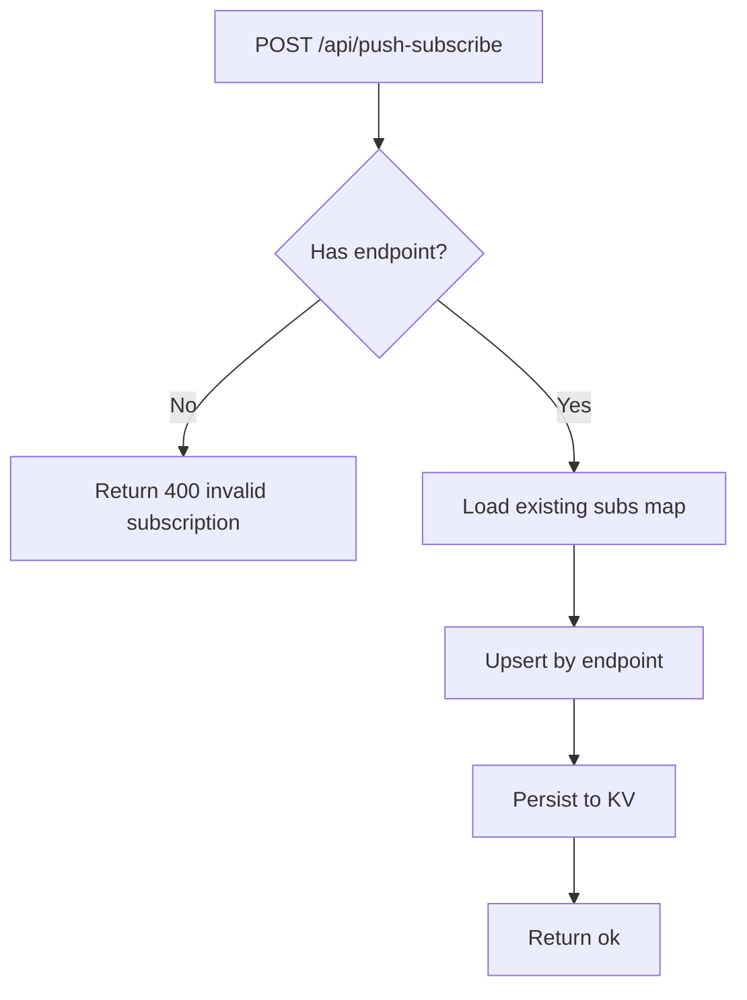
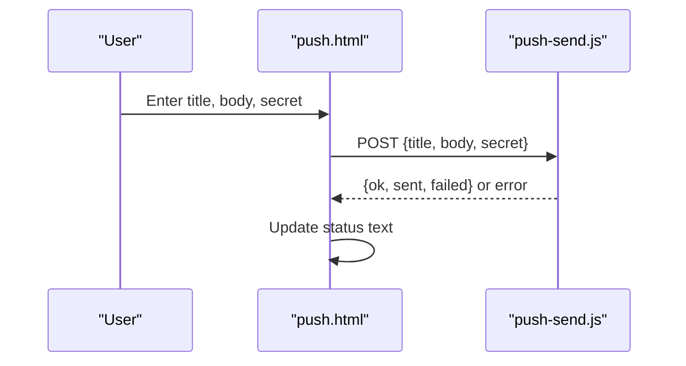
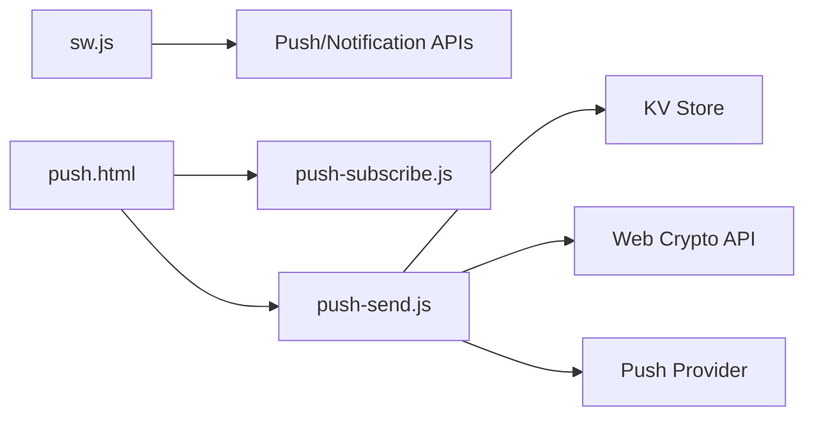

# Service Worker Implementation

<cite>
**Referenced Files in This Document**
- [sw.js](file://sw.js)
- [push-send.js](file://functions/api/push-send.js)
- [push-subscribe.js](file://functions/api/push-subscribe.js)
- [push.html](file://push.html)
</cite>

## Table of Contents
1. [Introduction](#introduction)
2. [Project Structure](#project-structure)
3. [Core Components](#core-components)
4. [Architecture Overview](#architecture-overview)
5. [Detailed Component Analysis](#detailed-component-analysis)
6. [Dependency Analysis](#dependency-analysis)
7. [Performance Considerations](#performance-considerations)
8. [Troubleshooting Guide](#troubleshooting-guide)
9. [Conclusion](#conclusion)
10. [Appendices](#appendices)

## Introduction
This document explains the push notification and offline support implementation centered around a minimal Service Worker and serverless Web Push endpoints. It covers the Service Worker lifecycle (installation, activation, message handling), Web Push API integration with VAPID authentication, subscription management, encrypted payload delivery, push event handling, notification display logic, and user interaction responses. It also includes debugging techniques, caching strategies for offline functionality, performance considerations, browser compatibility requirements, and fallback mechanisms.

## Project Structure
The project contains:
- A Service Worker file that handles push events and notification clicks.
- Two serverless functions to manage subscriptions and send encrypted push messages.
- A simple HTML page to compose and send push notifications.

**Diagram sources**
- [sw.js:1-17](file://sw.js#L1-L17)
- [push-subscribe.js:1-23](file://functions/api/push-subscribe.js#L1-L23)
- [push-send.js:1-155](file://functions/api/push-send.js#L1-L155)
- [push.html:137-205](file://push.html#L137-L205)

**Section sources**
- [sw.js:1-17](file://sw.js#L1-L17)
- [push-subscribe.js:1-23](file://functions/api/push-subscribe.js#L1-L23)
- [push-send.js:1-155](file://functions/api/push-send.js#L1-L155)
- [push.html:137-205](file://push.html#L137-L205)

## Core Components
- Service Worker: listens for push events and displays notifications; handles notification click to open the app.
- Subscription API: stores client push subscriptions keyed by endpoint in a key-value store.
- Send API: authenticates requests via a secret, encrypts payloads per RFC 8291, signs requests with VAPID per RFC 8292, and delivers to each subscription endpoint.
- Push UI: collects title, body, and secret; posts to the send API; shows status feedback.

Key responsibilities:
- sw.js: push event handling and notification click behavior.
- push-subscribe.js: persisting subscriptions safely and idempotently by endpoint.
- push-send.js: encryption, VAPID signing, and fan-out delivery to all stored subscriptions.
- push.html: user-facing flow to trigger pushes.

**Section sources**
- [sw.js:1-17](file://sw.js#L1-L17)
- [push-subscribe.js:1-23](file://functions/api/push-subscribe.js#L1-L23)
- [push-send.js:1-155](file://functions/api/push-send.js#L1-L155)
- [push.html:137-205](file://push.html#L137-L205)

## Architecture Overview
The end-to-end flow involves the browser registering a push subscription, storing it on the server, and later sending an encrypted push message that the Service Worker receives and renders as a system notification.

**Diagram sources**
- [push.html:166-201](file://push.html#L166-L201)
- [push-subscribe.js:11-22](file://functions/api/push-subscribe.js#L11-L22)
- [push-send.js:112-154](file://functions/api/push-send.js#L112-L154)
- [sw.js:1-16](file://sw.js#L1-L16)

## Detailed Component Analysis

### Service Worker Lifecycle and Behavior
- Installation and Activation: The current Service Worker does not define install or activate handlers. In practice, this means no assets are pre-cached at install time and no stale-while-revalidate strategy is applied during activation.
- Message Handling: There is no message event handler; background sync or messaging from the main thread is not implemented here.
- Push Event Handling: On receiving a push event, the Service Worker parses JSON data and displays a notification using showNotification with title, body, icon, badge, and language settings.
- Notification Interaction: On notificationclick, the notification is closed and the root window is opened.

**Diagram sources**
- [sw.js:1-11](file://sw.js#L1-L11)

**Section sources**
- [sw.js:1-17](file://sw.js#L1-L17)

### Web Push Integration: VAPID and Encryption
- VAPID Setup: The send function constructs a JWT header and payload, signs it with ECDSA P-256 using a private key, and attaches the Authorization header with the public key for verification by the push provider.
- Payload Encryption: For each subscription, the sender derives shared secrets via ECDH, computes content encryption key and nonce using HKDF, and encrypts the JSON payload with AES-GCM following RFC 8291.
- Delivery: The encrypted payload is sent to each subscription endpoint with appropriate headers including Content-Encoding and TTL.

**Diagram sources**
- [push-send.js:55-104](file://functions/api/push-send.js#L55-L104)
- [push-send.js:112-154](file://functions/api/push-send.js#L112-L154)

**Section sources**
- [push-send.js:1-155](file://functions/api/push-send.js#L1-L155)

### Subscription Management
- Storage: Subscriptions are stored in a key-value store under a single key, mapping endpoint to full subscription object. Using endpoint as key ensures idempotent updates and avoids duplicates.
- Validation: Requests without an endpoint are rejected.
- CORS: OPTIONS and POST responses include CORS headers to allow cross-origin calls from the frontend.

**Diagram sources**
- [push-subscribe.js:11-22](file://functions/api/push-subscribe.js#L11-L22)

**Section sources**
- [push-subscribe.js:1-23](file://functions/api/push-subscribe.js#L1-L23)

### Push UI Flow
- Inputs: Title, body, and secret fields.
- Actions: Sends a POST to the send API with JSON payload; displays success or error messages based on response.
- Error Handling: Shows specific messages for unauthorized, no subscription, or network errors.

**Diagram sources**
- [push.html:166-201](file://push.html#L166-L201)
- [push-send.js:112-154](file://functions/api/push-send.js#L112-L154)

**Section sources**
- [push.html:137-205](file://push.html#L137-L205)

## Dependency Analysis
- sw.js depends on the browser’s Push API and Notification APIs. It does not import external modules.
- push-send.js depends on Web Crypto API for HMAC, HKDF, ECDH, AES-GCM, and ECDSA signing. It reads/writes to a KV store via environment bindings and fetches push provider endpoints.
- push-subscribe.js depends on the KV store and returns CORS-enabled responses.
- push.html depends on fetch API and communicates with both APIs.

**Diagram sources**
- [sw.js:1-17](file://sw.js#L1-L17)
- [push-send.js:1-155](file://functions/api/push-send.js#L1-L155)
- [push-subscribe.js:1-23](file://functions/api/push-subscribe.js#L1-L23)
- [push.html:137-205](file://push.html#L137-L205)

**Section sources**
- [sw.js:1-17](file://sw.js#L1-L17)
- [push-send.js:1-155](file://functions/api/push-send.js#L1-L155)
- [push-subscribe.js:1-23](file://functions/api/push-subscribe.js#L1-L23)
- [push.html:137-205](file://push.html#L137-L205)

## Performance Considerations
- Fan-out Delivery: The send function iterates over all stored subscriptions and sends in parallel using Promise.all. Ensure rate limiting and backoff if the number of subscriptions grows large.
- Encryption Overhead: Per-subscription encryption is CPU-intensive. Consider batching or throttling on the server side if needed.
- Network Retries: The current implementation does not retry failed deliveries. Adding retries with exponential backoff can improve reliability.
- Caching Strategy: No cache strategy is implemented in the Service Worker. For offline support, consider adding install and activate handlers to precache critical assets and use CacheStorage with stale-while-revalidate patterns.
- Notification Payload Size: Keep payloads small to reduce bandwidth and processing time.

[No sources needed since this section provides general guidance]

## Troubleshooting Guide
- Service Worker Not Activating:
  - Verify the Service Worker is registered in the main context and that there are no syntax errors in sw.js.
  - Check for missing install/activate handlers if you rely on caching or migration logic.
- Push Events Not Triggered:
  - Confirm the browser supports the Push API and that the user has granted permission.
  - Ensure the subscription was successfully stored by the subscribe API and exists in the KV store.
- Unauthorized Errors:
  - The send API validates a secret against an environment variable. Ensure the correct secret is used when sending.
- No Subscription Found:
  - If the KV store has no entries, the send API returns a “no subscription” error. Ensure the client subscribes first.
- Notification Click Does Nothing:
  - The Service Worker closes the notification and opens the root window. Verify the origin allows opening windows and that the route exists.
- Debugging Tips:
  - Use browser DevTools > Application > Service Workers to inspect registration, state, and logs.
  - Use Network tab to verify fetch calls to subscribe and send APIs.
  - Add console logging in the Service Worker push and notificationclick handlers to trace execution.

**Section sources**
- [sw.js:1-17](file://sw.js#L1-L17)
- [push-send.js:112-154](file://functions/api/push-send.js#L112-L154)
- [push-subscribe.js:11-22](file://functions/api/push-subscribe.js#L11-L22)
- [push.html:166-201](file://push.html#L166-L201)

## Conclusion
The implementation provides a minimal but functional Web Push pipeline: clients subscribe, the server stores subscriptions, and encrypted push messages are delivered to the Service Worker, which displays notifications and handles user interactions. To enhance offline support and robustness, add install/activate handlers for caching, implement message handling for background tasks, and introduce retry logic and monitoring for push delivery.

[No sources needed since this section summarizes without analyzing specific files]

## Appendices

### Browser Compatibility and Fallbacks
- Requirements:
  - Modern browsers supporting Push API, Notification API, and Web Crypto API.
  - HTTPS or localhost for Service Worker registration and push permissions.
- Fallbacks:
  - If Push API is unavailable, inform the user and offer alternative communication channels (e.g., email).
  - If Notification API is blocked, prompt the user to enable notifications in browser settings.
  - For older browsers lacking Web Crypto, provide a server-side fallback or polyfill where feasible.

[No sources needed since this section provides general guidance]

### Offline Support Recommendations
- Add install handler to precache essential assets (HTML, CSS, JS, icons).
- Implement activate handler to clean up old caches and migrate storage if needed.
- Use fetch event interception to serve cached resources when offline and update cache on success.
- Consider background sync for queued actions when online.

[No sources needed since this section provides general guidance]