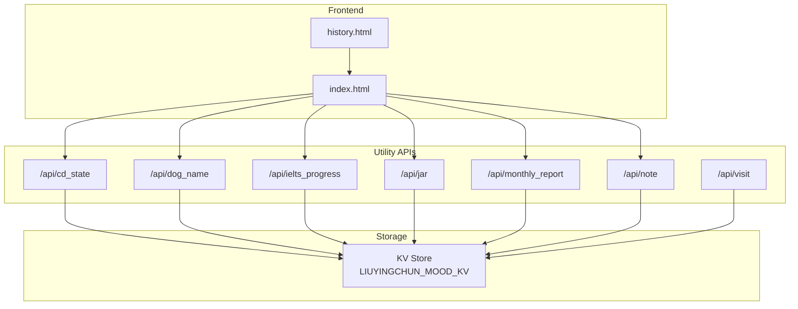
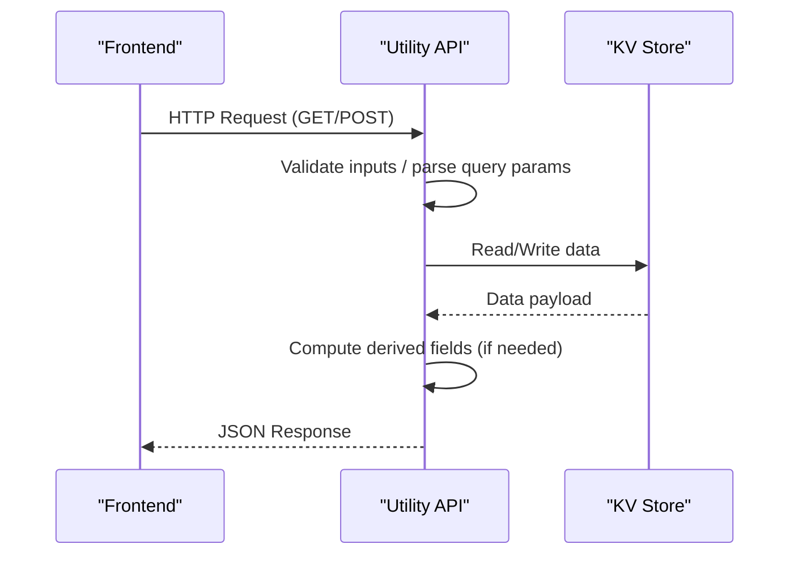
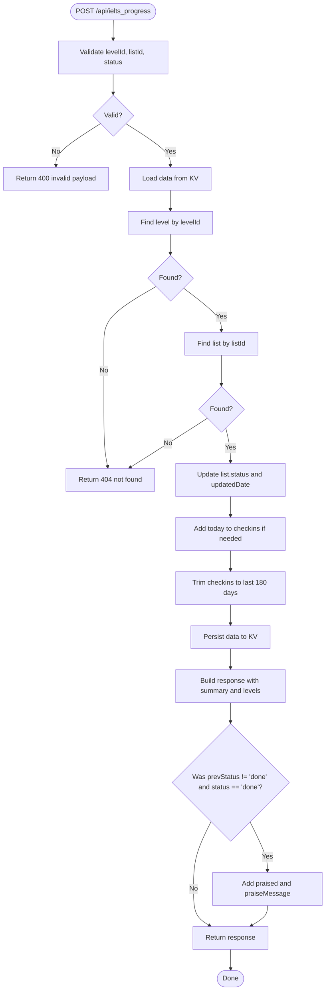
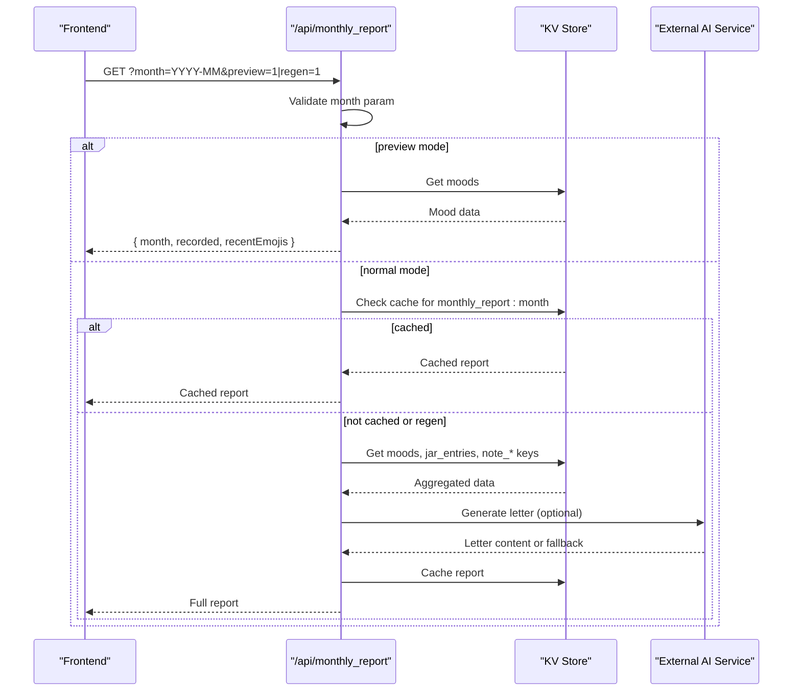
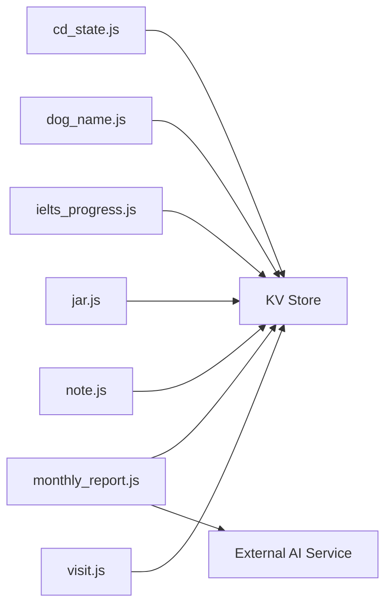

# Utility Functions

<cite>
**Referenced Files in This Document**
- [cd_state.js](file://functions/api/cd_state.js)
- [dog_name.js](file://functions/api/dog_name.js)
- [ielts_progress.js](file://functions/api/ielts_progress.js)
- [jar.js](file://functions/api/jar.js)
- [monthly_report.js](file://functions/api/monthly_report.js)
- [note.js](file://functions/api/note.js)
- [visit.js](file://functions/api/visit.js)
- [index.html](file://index.html)
- [history.html](file://history.html)
</cite>

## Table of Contents
1. [Introduction](#introduction)
2. [Project Structure](#project-structure)
3. [Core Components](#core-components)
4. [Architecture Overview](#architecture-overview)
5. [Detailed Component Analysis](#detailed-component-analysis)
6. [Dependency Analysis](#dependency-analysis)
7. [Performance Considerations](#performance-considerations)
8. [Troubleshooting Guide](#troubleshooting-guide)
9. [Conclusion](#conclusion)

## Introduction
This document describes the utility API endpoints that provide supporting functionality for the application. These endpoints manage cooldown state, generate dog names, track IELTS study progress, store jar entries for goal tracking, generate monthly reports with AI assistance, handle personal notes, and record visit analytics. Each endpoint is implemented as a serverless function using Cloudflare Workers-style handlers and persists data to a key-value store.

The utilities are designed to be simple, stateless at the request level, and consistent in their CORS configuration and JSON responses. They expose GET and/or POST methods depending on whether they need to read or write data.

## Project Structure
The utility endpoints live under functions/api and are invoked by frontend pages such as index.html and history.html. The frontend uses fetch calls to these endpoints to load or update user-specific data.

**Diagram sources**
- [index.html:132-173](file://index.html#L132-L173)
- [history.html:132-173](file://history.html#L132-L173)
- [cd_state.js:13-27](file://functions/api/cd_state.js#L13-L27)
- [dog_name.js:11-24](file://functions/api/dog_name.js#L11-L24)
- [ielts_progress.js:184-230](file://functions/api/ielts_progress.js#L184-L230)
- [jar.js:21-30](file://functions/api/jar.js#L21-L30)
- [monthly_report.js:30-69](file://functions/api/monthly_report.js#L30-L69)
- [note.js:21-29](file://functions/api/note.js#L21-L29)
- [visit.js:33-48](file://functions/api/visit.js#L33-L48)

**Section sources**
- [index.html:132-173](file://index.html#L132-L173)
- [history.html:132-173](file://history.html#L132-L173)

## Core Components
This section summarizes each utility endpoint’s purpose, HTTP methods, input parameters, response format, and common use cases.

- /api/cd_state
  - Purpose: Manage cooldown state used across features (e.g., tokens, daily date).
  - Methods: GET, POST, OPTIONS
  - Input (POST): JSON object with fields like dogs, tokens_earned, tokens_used, daily_date, flip_tokens.
  - Response (GET): JSON object with current cd_state values.
  - Response (POST): { ok: true }
  - Use case: Persist and retrieve global cooldown-related counters and dates.

- /api/dog_name
  - Purpose: Provide a random or stored dog name for UI personalization.
  - Methods: GET, POST, OPTIONS
  - Input (POST): { name }
  - Response (GET): { name } (defaults to a fallback if none stored).
  - Response (POST): { ok: true }
  - Use case: Save and display a personalized pet name.

- /api/ielts_progress
  - Purpose: Track IELTS vocabulary learning progress across levels and lists; compute streaks and summaries.
  - Methods: GET, POST, OPTIONS
  - Input (POST): { levelId, listId, status } where status is one of todo, doing, done.
  - Response (GET): Summary including todayStudy, summary (totalLists, completedLists, streakDays, currentItem), and levels with lists.
  - Response (POST): Same structure as GET, optionally with praised flag and praiseMessage when marking a list done.
  - Use case: Update list statuses, compute streaks, and show current study item.

- /api/jar
  - Purpose: Record short text entries (goals, quotes, reflections) with Beijing time.
  - Methods: POST, OPTIONS
  - Input (POST): { text }
  - Response: { ok: true }
  - Use case: Append new jar entries with timestamp metadata.

- /api/monthly_report
  - Purpose: Generate a monthly reflective letter using mood data, jar entries, and notes, optionally via an external AI service.
  - Methods: GET, OPTIONS
  - Query Parameters: month (YYYY-MM), regen=1 (force regeneration), preview=1 (return raw mood data without AI generation).
  - Response (preview): { month, recorded, recentEmojis }
  - Response (normal): { month, generatedAt, moodData, jarEntries, notes, moodCounts, dominantMood, letter }
  - Use case: Produce a monthly narrative based on collected data.

- /api/note
  - Purpose: Save daily reflection notes with mood and time.
  - Methods: POST, OPTIONS
  - Input (POST): { text, mood }
  - Response: { ok: true }
  - Use case: Store per-day notes keyed by Beijing date.

- /api/visit
  - Purpose: Record visit analytics including time, city, and device type.
  - Methods: POST, OPTIONS
  - Input: No body required; reads headers and Cloudflare context.
  - Response: { ok: true }
  - Use case: Track daily visits with geolocation and device info.

**Section sources**
- [cd_state.js:1-27](file://functions/api/cd_state.js#L1-L27)
- [dog_name.js:1-24](file://functions/api/dog_name.js#L1-L24)
- [ielts_progress.js:1-230](file://functions/api/ielts_progress.js#L1-L230)
- [jar.js:1-30](file://functions/api/jar.js#L1-L30)
- [monthly_report.js:1-170](file://functions/api/monthly_report.js#L1-L170)
- [note.js:1-29](file://functions/api/note.js#L1-L29)
- [visit.js:1-48](file://functions/api/visit.js#L1-L48)

## Architecture Overview
All utility endpoints follow a consistent pattern:
- Define CORS headers to allow cross-origin requests from the frontend.
- Implement onRequestOptions for preflight handling.
- Read/write data through a KV store named LIUYINGCHUN_MOOD_KV.
- Return JSON responses with appropriate Content-Type headers.

**Diagram sources**
- [cd_state.js:13-27](file://functions/api/cd_state.js#L13-L27)
- [ielts_progress.js:184-230](file://functions/api/ielts_progress.js#L184-L230)
- [monthly_report.js:30-69](file://functions/api/monthly_report.js#L30-L69)

## Detailed Component Analysis

### /api/cd_state
Purpose:
- Maintain a shared cooldown state including counters and daily date.

Key behaviors:
- GET returns the current state or default values if none exist.
- POST accepts a full state object and persists it.
- Uses KV key cd_state.

Input parameters (POST):
- dogs: number
- tokens_earned: number
- tokens_used: number
- daily_date: string
- flip_tokens: number

Response formats:
- GET: JSON object with the above fields.
- POST: { ok: true }

Use cases:
- Enforce cooldowns between actions.
- Track token usage and earnings.

Integration example:
- Frontend GETs cd_state on load to initialize UI counters.
- After performing an action, frontend POSTs updated state.

Common patterns:
- Always return JSON with CORS headers.
- Default state provided when no persisted value exists.

**Section sources**
- [cd_state.js:1-27](file://functions/api/cd_state.js#L1-L27)

### /api/dog_name
Purpose:
- Provide a stored or default dog name for UI personalization.

Key behaviors:
- GET retrieves the saved name or returns a default.
- POST saves a new name.
- Uses KV key dog_name.

Input parameters (POST):
- name: string

Response formats:
- GET: { name }
- POST: { ok: true }

Use cases:
- Personalize greetings or messages with a pet name.

Integration example:
- On app start, GET dog_name to set the displayed name.
- When user changes the name, POST the new value.

Common patterns:
- Fallback default ensures UI always shows a name.

**Section sources**
- [dog_name.js:1-24](file://functions/api/dog_name.js#L1-L24)

### /api/ielts_progress
Purpose:
- Track IELTS vocabulary learning progress across multiple levels and lists.
- Compute streaks, current items, and summaries.

Key behaviors:
- GET returns normalized and computed progress data.
- POST updates a specific list’s status and recalculates metrics.
- Uses KV key ielts_progress_v1.

Input parameters (POST):
- levelId: string
- listId: string
- status: string (todo | doing | done)

Response formats:
- GET: Object containing updatedAt, todayStudy, summary (totalLists, completedLists, streakDays, currentItem), and levels array with lists.
- POST: Same structure as GET, plus optional praised and praiseMessage when marking a list done.

Algorithm highlights:
- Normalizes data to ensure consistent schema.
- Collects study dates from checkins and list updatedDates.
- Computes streak by walking backwards from today.
- Trims checkins to last 180 days.

Use cases:
- Mark vocabulary lists as todo, doing, or done.
- Show current study item and streak.

Integration example:
- Frontend GETs progress to render levels and lists.
- On user action, POST updated status and refreshes UI with returned summary.

**Diagram sources**
- [ielts_progress.js:191-230](file://functions/api/ielts_progress.js#L191-L230)

**Section sources**
- [ielts_progress.js:1-230](file://functions/api/ielts_progress.js#L1-L230)

### /api/jar
Purpose:
- Record short text entries with Beijing date and time.

Key behaviors:
- POST appends a new entry to jar_entries array.
- Uses KV key jar_entries.

Input parameters (POST):
- text: string

Response formats:
- POST: { ok: true }

Use cases:
- Capture goals, quotes, or reflections over time.

Integration example:
- User submits a jar entry; frontend POSTs text and receives confirmation.

Common patterns:
- Entries include date and time in Beijing timezone.

**Section sources**
- [jar.js:1-30](file://functions/api/jar.js#L1-L30)

### /api/monthly_report
Purpose:
- Generate a monthly reflective letter using mood data, jar entries, and notes. Optionally uses an external AI service.

Key behaviors:
- GET supports preview mode and caching.
- If not preview and not regenerated, checks cache first.
- Aggregates moods, jar entries, and notes for the given month.
- Calls external AI to generate a letter; falls back to default text on error.

Query parameters:
- month: YYYY-MM (required)
- regen: 1 (optional, force regeneration)
- preview: 1 (optional, return raw data without AI generation)

Response formats:
- Preview: { month, recorded, recentEmojis }
- Normal: { month, generatedAt, moodData, jarEntries, notes, moodCounts, dominantMood, letter }

Use cases:
- Monthly review and reflection.
- Analytics dashboard showing mood distribution and dominant mood.

Integration example:
- Frontend calls GET with month parameter to get report.
- For quick checks, uses preview=1 to avoid AI latency.

**Diagram sources**
- [monthly_report.js:30-69](file://functions/api/monthly_report.js#L30-L69)
- [monthly_report.js:71-170](file://functions/api/monthly_report.js#L71-L170)

**Section sources**
- [monthly_report.js:1-170](file://functions/api/monthly_report.js#L1-L170)

### /api/note
Purpose:
- Save daily reflection notes with mood and time.

Key behaviors:
- POST stores a note keyed by Beijing date.
- Uses KV key note_${date}.

Input parameters (POST):
- text: string
- mood: string

Response formats:
- POST: { ok: true }

Use cases:
- Daily journaling and mood tracking.

Integration example:
- User writes a note; frontend POSTs text and mood.

Common patterns:
- Notes are stored with Beijing date and time metadata.

**Section sources**
- [note.js:1-29](file://functions/api/note.js#L1-L29)

### /api/visit
Purpose:
- Record visit analytics including time, city, and device type.

Key behaviors:
- POST records a visit entry with time, city, and parsed UA.
- Uses KV key visit_${date}.

Input parameters:
- None required; reads headers and Cloudflare context.

Response formats:
- POST: { ok: true }

Use cases:
- Track daily visits and device distribution.

Integration example:
- Frontend POSTs on page load to log visits.

Common patterns:
- Device parsing extracts iPhone, iPad, Android, Mac, Windows, or Unknown.

**Section sources**
- [visit.js:1-48](file://functions/api/visit.js#L1-L48)

## Dependency Analysis
The utility endpoints share common dependencies:
- CORS configuration for cross-origin access.
- KV store interface for persistence.
- Beijing timezone helpers for consistent timestamps.

**Diagram sources**
- [cd_state.js:13-27](file://functions/api/cd_state.js#L13-L27)
- [dog_name.js:11-24](file://functions/api/dog_name.js#L11-L24)
- [ielts_progress.js:184-230](file://functions/api/ielts_progress.js#L184-L230)
- [jar.js:21-30](file://functions/api/jar.js#L21-L30)
- [monthly_report.js:30-69](file://functions/api/monthly_report.js#L30-L69)
- [note.js:21-29](file://functions/api/note.js#L21-L29)
- [visit.js:33-48](file://functions/api/visit.js#L33-L48)

**Section sources**
- [monthly_report.js:136-158](file://functions/api/monthly_report.js#L136-L158)

## Performance Considerations
- Prefer GET endpoints for reading data to leverage browser caching where applicable.
- Use preview mode in monthly_report to avoid AI latency during development or frequent checks.
- Batch operations on the client side to reduce network calls.
- Keep payloads minimal; only send necessary fields in POST requests.
- Leverage KV store efficiency by using stable keys and avoiding large objects.

[No sources needed since this section provides general guidance]

## Troubleshooting Guide
Common issues and resolutions:
- Invalid payload errors: Ensure required fields are present and valid (e.g., levelId, listId, status for IELTS progress).
- Not found errors: Verify that the referenced level and list exist before updating.
- Month validation: Ensure month parameter matches YYYY-MM format.
- Network errors: Handle failures gracefully and fall back to defaults or cached data.
- CORS errors: Confirm that the frontend origin is allowed and headers are correctly set.

**Section sources**
- [ielts_progress.js:191-208](file://functions/api/ielts_progress.js#L191-L208)
- [monthly_report.js:35-39](file://functions/api/monthly_report.js#L35-L39)

## Conclusion
These utility endpoints provide essential supporting functionality for the application, including state management, progress tracking, analytics, and content generation. They follow consistent patterns for CORS, JSON responses, and KV storage, making them easy to extend and maintain. By understanding their inputs, outputs, and integration points, developers can confidently modify or add new features while preserving reliability and performance.

[No sources needed since this section summarizes without analyzing specific files]